# Editing Moves
> Author(s): [MrHam88](https://github.com/DevHam88).  
> Implementation & Research: Aero, [BlueRose](https://github.com/BluRosie), [DarmaniDan](https://github.com/DarmaniDan), [Drayano](https://pastebin.com/u/DrayHackTutorials), [Fexty](https://github.com/Fexty12573), [Lhea](https://gist.github.com/lhearachel), Lmaokai, MapleDonut, [Mixone](https://github.com/Mixone-FinallyHere), Paille92, [RefinedPlat](https://github.com/refinedplat), Solace, [TurtleIsaac](https://github.com/turtleisaac), [Yako?](https://github.com/YakoSWG).

This page is a full guide on making changes to moves and their related data in Generation IV Pokémon games (moves, move effects, animations, learnsets, TMs, move tutors). This guide focusses on editing, re-organising and replacing existing data. There are methods to *add* new moves (without replacing any existing moves) to Generation IV Pokémon games, but these are significantly involved, and require moving data/tables.  

The contents of the guide are proven for Platinum Version, HeartGold Version & SoulSilver Version. Many of the sections are directly applicable to Diamond Version and Pearl Version as well, but there may be differences in specific offsets when hex editing for these versions. **If not stated otherwise, any hex editing offsets or files given in this page are for known good US versions of the relevant ROMs**.  

> This guide is a collation of a number of tutorials and guides shared via other means previously (within the Kingdom of DS Hacking discord server, pastebin, GitHub etc.), with some additional content and context added. Attribution should be given to the researchers and original tutorial writers, these are noted at the beginning of the relevant sections (and collectively at the top of this section).  

The contents of this guide are organised by the area of move editing, with an initial overview of data structure & some prompts/guidance on design considerations when planning move edits. The final section includes a number of case study examples to illustrate how the changes may be implemented.  

The navigation bar at the top of the page, or right-hand side on PC, and the "Return to top of page" button can be used to navigate through the page in detail, below is a high-level overview of the page sections:

1. [Move (& Associated) Data Structure](#move--associated-data-structure)
2. [Design Thoughts & External Resources](#design-thoughts--external-resources)
3. [Basic Move Data (DSPRE)](#basic-move-data-dspre)
4. [Move Effect Scripts](#move-effect-scripts)
5. [Move Animations](#move-animations)
6. [Move Categories (Battle Engine & AI)](#move-categories-battle-engine--ai)
7. [Move Compatibility (Distribution)](#move-compatibility-distribution)
8. [Example Case Studies](#example-case-studies)

A number of the sections in this guide rely upon a basic understanding of hex editing generally, and context on unpacking NARCs. An initial grounding in these subjects can be formed by reading and following these guides:
- [Hex Editing Primer](/docs/universal/guides/hex_editing/)
- [Unpacking NARCs](/docs/universal/guides/unpacking_narcs/)

--- 

## Move (& Associated) Data Structure
Every unique move *(identified by move index/ID)* in the game has:
- One set of **move data**
- One **move script**
    - Which may direct to exactly one **move effect script**
      - Which may contain zero or more **effect sub-scripts**
- One **move animation**
    - Which is made up of one or more **animation components**

The exact mapping of how a move is executed can be found [here](https://github.com/pret/pokeplatinum/blob/2bf38f5952b791524b5f767c583e4fe0830a82c5/src/battle/battle_lib.c#L7507) in the Platinum Decompilation project. The specific file locations for each of these elements in HGSS can be found [here](/docs/generation-iv/resources/hgss-file_structure/), and an overview is below include HGSS & Platinum file names:

| - | HGSS File | Platinum File |
| --- | --- | --- |
| Move Data | `/a/0/1/1` | `/poketool/waza/waza_tbl.narc` |
| Move Scripts | `/a/0/0/0` | `/battle/skill/waza_seq.narc` |
| Move Animation | `/a/0/1/0` | `/data/wazaeffect/we.narc` |
| Continuous Animations | `/a/0/6/1` | `/data/wazaeffect/we_sub.narc` |
| Move Effect Scripts | `/a/0/3/0` | `/battle/skill/be_seq.narc` |
| Move Effect Sub-Scripts | `/a/0/0/1` | `/battle/skill/sub_seq.narc` |  

- **Move scripts** are strictly per move and may not be shared. They may simply be an instruction to use the **effect script**, or may have more complexity.  
- Move **effect scripts** may be shared by multiple moves.  
- Each **animation component** may be used across many move animations, but each move has it's own animation definition. *There are three main types of animation components/instructions (sprite translations, "particles" & backgrounds).*  
- Each effect **sub-script** may be used across multiple move **effect scripts**, but a move effect script may use zero effect sub-scripts.  
    - The **move data** NARC contains basic data on the move, which can be edited in DSPRE. This includes, for example, reference to the move **effect script**.
    - Move **animations** can be edited using a hex editor such as HxD, or by using a tool called WazaEditor.
    - Move **move scripts**, **effect scripts** & **effect sub-scripts** can be edited using a hex editor such as HxD.

--- 

## Design Thoughts & External Resources
When considering replacing some moves in Generation IV Pokémon games, it may be useful to consider the following factors:
1. [Trainer Move Selection AI](#trainer-move-selection-ai)
2. [Move Variations](#move-variations)
3. [Vanilla Move Compatibility](#vanilla-move-compatibility)
4. [Move Animation Options](#move-animation-options)

### Trainer Move Selection AI
The trainer selection AI in Generation IV Pokémon games uses a number of sources to determine which moves the opposing trainers should use. A solid understanding of how this works, related to the moves intended to change, is important to ensure changes result in the expected behaviour from opposing trainers. At least a minimal awareness is advised to ensure opponent and ally trainers use the edited moves as expected.

A thorough breakdown of the Generation IV trainer move selection AI can be found [here](https://gist.github.com/lhearachel/ff61af1f58c84c96592b0b8184dba096).

### Move Variations
A number of Pokémon moves have consistent similarities that can be used to categorise them into groups. When making decisions on replacing moves, either by "backporting" later generation moves, or creating entirely custom ones. It may be useful to consider these move variation groups to either maintain consistency/immersion, or to actively disregard it.  

The groups referred to here are not mechanical groups/categorisations (such as Sound-based moves, or Punching moves), but design & thematic ones.

There are a number of online resources which document these groupings, for example this [Bulbapedia page](https://bulbapedia.bulbagarden.net/wiki/Move_variations). Some examples of move "groups" are in the table below.


|  | Icy Wind, Mud Shot, Electroweb, Snarl | Low Kick & Grass Knot | Octazooka, Mud Bomb, Mirror Shot |
| --- | --- | --- | --- |
| **Power** | 55 | Variable (damage based on the target's weight) | 65 |
| **Accuracy** | 95% | 100% | 85% |
| **PP** | 15 | 20 | 10 |
| **Category** | Special | Special | Special |
| **Range** | Both | Single | Single |
| **Secondary Effect** | 100% chance to reduce a stat of the opponent by one stage (Speed or Special Attack) | No secondary effect | 30% chance to reduce the Accuracy of the opponent by one stage |

### Vanilla Move Compatibility
When deciding which moves to add to the game by replacing existing ones, one of the most important decisions is which move(s) to remove. There are a number of factors that could be considered when determining moves to be replaced.  
Some examples are:
- Signature moves for Pokémon that will not appear in the ROM hack. These could be for legendary Pokémon, for example Darkrai and the move `Dark Void`.
- Low-distribution moves, for example `Barrage`, which is learned by level up, only by Exeggcute and Exeggutor.
- Functional clones, for example `Mind Reader` & `Lock-On` have exactly the same effect (but different names, animations and learnsets).
- How the move to be replaced is treated by the move selection AI (for example, without further changes, a move that replaces `Roar` will be treated by the AI Basic flag as being a Sound-based move, and not used when the opponent is known to have the ability Soundproof).

When looking to replace moves in Generation IV Pokémon games, DSPRE and some simple Excel formulae (`COUNTIF`) can be used to provide an understanding of the overall distribution of moves. This can be useful for identifying candidates for replacement that are narrowly distributed (only a few Pokémon learn them).

In DSPRE, the "Generate CSV" option from the Tools menu can be selected to export a number of `.csv` files from the currently loaded ROM. In version 1.13.1 this includes evolution, learnset, move, TM/HM, Pokémon personal data.

By taking the move data and learnset data it is possible to list the number of times each move appears in the learnset data by using a `COUNTIF` formula from the move data to the learnset data. Some cleanup of the learnset data may be required to remove `[` and `]` characters. A similar approach can be taken with TM learnsets.

An example of a basic level-up learnset count from HGSS is below. Bear in mind that this list does not account for TM/HM learnsets, egg moves or tutorable moves.

<details>
<summary>HGSS: Vanilla Move Level-Up Learnset Distribution (Reverse Ordered by Count)</summary>
| Move ID | Move Name | Level Up Learnset |
| --- | --- | --- |
| 15 | Cut | 0 |
| 57 | Surf | 0 |
| 70 | Strength | 0 |
| 165 | Struggle | 0 |
| 249 | Rock Smash | 0 |
| 285 | Skill Swap | 0 |
| 290 | Secret Power | 0 |
| 307 | Blast Burn | 0 |
| 308 | Hydro Cannon | 0 |
| 315 | Overheat | 0 |
| 338 | Frenzy Plant | 0 |
| 344 | Volt Tackle | 0 |
| 409 | Drain Punch | 0 |
| 411 | Focus Blast | 0 |
| 431 | Rock Climb | 0 |
| 432 | Defog | 0 |
| 434 | Draco Meteor | 0 |
| 446 | Stealth Rock | 0 |
| 447 | Grass Knot | 0 |
| 6 | Pay Day | 1 |
| 25 | Mega Kick | 1 |
| 41 | Twineedle | 1 |
| 148 | Flash | 1 |
| 159 | Sharpen | 1 |
| 167 | Triple Kick | 1 |
| 177 | Aeroblast | 1 |
| 190 | Octazooka | 1 |
| 208 | Milk Drink | 1 |
| 211 | Steel Wing | 1 |
| 216 | Return | 1 |
| 217 | Present | 1 |
| 218 | Frustration | 1 |
| 220 | Pain Split | 1 |
| 221 | Sacred Fire | 1 |
| 263 | Facade | 1 |
| 264 | Focus Punch | 1 |
| 295 | Luster Purge | 1 |
| 296 | Mist Ball | 1 |
| 298 | Teeter Dance | 1 |
| 333 | Icicle Spear | 1 |
| 342 | Poison Tail | 1 |
| 353 | Doom Desire | 1 |
| 391 | Heart Swap | 1 |
| 433 | Trick Room | 1 |
| 439 | Rock Wrecker | 1 |
| 448 | Chatter | 1 |
| 449 | Judgment | 1 |
| 454 | Attack Order | 1 |
| 455 | Defend Order | 1 |
| 456 | Heal Order | 1 |
| 459 | Roar of Time | 1 |
| 460 | Spacial Rend | 1 |
| 461 | Lunar Dance | 1 |
| 462 | Crush Grip | 1 |
| 463 | Magma Storm | 1 |
| 464 | Dark Void | 1 |
| 19 | Fly | 2 |
| 27 | Rolling Kick | 2 |
| 127 | Waterfall | 2 |
| 128 | Clamp | 2 |
| 134 | Kinesis | 2 |
| 135 | Softboiled | 2 |
| 140 | Barrage | 2 |
| 142 | Lovely Kiss | 2 |
| 144 | Transform | 2 |
| 155 | Bonemerang | 2 |
| 168 | Thief | 2 |
| 169 | Spider Web | 2 |
| 234 | Morning Sun | 2 |
| 265 | SmellingSalt | 2 |
| 293 | Camouflage | 2 |
| 294 | Tail Glow | 2 |
| 299 | Blaze Kick | 2 |
| 302 | Needle Arm | 2 |
| 410 | Vacuum Wave | 2 |
| 419 | Avalanche | 2 |
| 465 | Seed Flare | 2 |
| 467 | Shadow Force | 2 |
| 5 | Mega Punch | 3 |
| 26 | Jump Kick | 3 |
| 121 | Egg Bomb | 3 |
| 125 | Bone Club | 3 |
| 131 | Spike Cannon | 3 |
| 136 | Hi Jump Kick | 3 |
| 147 | Spore | 3 |
| 160 | Conversion | 3 |
| 176 | Conversion 2 | 3 |
| 198 | Bone Rush | 3 |
| 251 | Beat Up | 3 |
| 259 | Torment | 3 |
| 274 | Assist | 3 |
| 280 | Brick Break | 3 |
| 292 | Arm Thrust | 3 |
| 301 | Ice Ball | 3 |
| 309 | Meteor Mash | 3 |
| 323 | Water Spout | 3 |
| 339 | Bulk Up | 3 |
| 376 | Trump Card | 3 |
| 415 | Switcheroo | 3 |
| 430 | Flash Cannon | 3 |
| 457 | Head Smash | 3 |
| 130 | Skull Bash | 4 |
| 137 | Glare | 4 |
| 152 | Crabhammer | 4 |
| 158 | Hyper Fang | 4 |
| 214 | Sleep Talk | 4 |
| 215 | Heal Bell | 4 |
| 272 | Role Play | 4 |
| 289 | Snatch | 4 |
| 297 | FeatherDance | 4 |
| 306 | Crush Claw | 4 |
| 311 | Weather Ball | 4 |
| 325 | Shadow Punch | 4 |
| 327 | Sky Uppercut | 4 |
| 354 | Psycho Boost | 4 |
| 367 | Acupressure | 4 |
| 418 | Bullet Punch | 4 |
| 440 | Cross Poison | 4 |
| 2 | Karate Chop | 5 |
| 4 | Comet Punch | 5 |
| 66 | Submission | 5 |
| 81 | String Shot | 5 |
| 85 | Thunderbolt | 5 |
| 146 | Dizzy Punch | 5 |
| 151 | Acid Armor | 5 |
| 162 | Super Fang | 5 |
| 171 | Nightmare | 5 |
| 200 | Outrage | 5 |
| 223 | DynamicPunch | 5 |
| 231 | Iron Tail | 5 |
| 238 | Cross Chop | 5 |
| 257 | Heat Wave | 5 |
| 266 | Follow Me | 5 |
| 267 | Nature Power | 5 |
| 278 | Recycle | 5 |
| 288 | Grudge | 5 |
| 314 | Air Cutter | 5 |
| 357 | Miracle Eye | 5 |
| 365 | Pluck | 5 |
| 379 | Power Trick | 5 |
| 402 | Seed Bomb | 5 |
| 413 | Brave Bird | 5 |
| 421 | Shadow Claw | 5 |
| 429 | Mirror Shot | 5 |
| 438 | Power Whip | 5 |
| 443 | Magnet Bomb | 5 |
| 451 | Charge Beam | 5 |
| 452 | Wood Hammer | 5 |
| 13 | Razor Wind | 6 |
| 102 | Mimic | 6 |
| 143 | Sky Attack | 6 |
| 161 | Tri Attack | 6 |
| 183 | Mach Punch | 6 |
| 233 | Vital Throw | 6 |
| 245 | ExtremeSpeed | 6 |
| 261 | Will-O-Wisp | 6 |
| 277 | Magic Coat | 6 |
| 284 | Eruption | 6 |
| 320 | GrassWhistle | 6 |
| 348 | Leaf Blade | 6 |
| 356 | Gravity | 6 |
| 368 | Metal Burst | 6 |
| 384 | Power Swap | 6 |
| 385 | Guard Swap | 6 |
| 412 | Energy Ball | 6 |
| 416 | Giga Impact | 6 |
| 427 | Psycho Cut | 6 |
| 8 | Ice Punch | 7 |
| 12 | Guillotine | 7 |
| 32 | Horn Drill | 7 |
| 92 | Toxic | 7 |
| 118 | Metronome | 7 |
| 124 | Sludge | 7 |
| 187 | Belly Drum | 7 |
| 260 | Flatter | 7 |
| 303 | Slack Off | 7 |
| 317 | Rock Tomb | 7 |
| 395 | Force Palm | 7 |
| 407 | Dragon Rush | 7 |
| 441 | Gunk Shot | 7 |
| 11 | ViceGrip | 8 |
| 65 | Drill Peck | 8 |
| 80 | Petal Dance | 8 |
| 96 | Meditate | 8 |
| 112 | Barrier | 8 |
| 178 | Cotton Spore | 8 |
| 188 | Sludge Bomb | 8 |
| 191 | Spikes | 8 |
| 224 | Megahorn | 8 |
| 236 | Moonlight | 8 |
| 273 | Wish | 8 |
| 312 | Aromatherapy | 8 |
| 321 | Tickle | 8 |
| 330 | Muddy Water | 8 |
| 331 | Bullet Seed | 8 |
| 366 | Tailwind | 8 |
| 386 | Punishment | 8 |
| 394 | Flare Blitz | 8 |
| 396 | Aura Sphere | 8 |
| 20 | Bind | 9 |
| 69 | Seismic Toss | 9 |
| 119 | Mirror Move | 9 |
| 164 | Substitute | 9 |
| 170 | Mind Reader | 9 |
| 172 | Flame Wheel | 9 |
| 291 | Dive | 9 |
| 313 | Fake Tears | 9 |
| 335 | Block | 9 |
| 343 | Covet | 9 |
| 351 | Shock Wave | 9 |
| 369 | U-turn | 9 |
| 377 | Heal Block | 9 |
| 380 | Gastro Acid | 9 |
| 397 | Rock Polish | 9 |
| 406 | Dragon Pulse | 9 |
| 458 | Double Hit | 9 |
| 22 | Vine Whip | 10 |
| 24 | Double Kick | 10 |
| 30 | Horn Attack | 10 |
| 42 | Pin Missile | 10 |
| 58 | Ice Beam | 10 |
| 90 | Fissure | 10 |
| 91 | Dig | 10 |
| 107 | Minimize | 10 |
| 126 | Fire Blast | 10 |
| 138 | Dream Eater | 10 |
| 149 | Psywave | 10 |
| 166 | Sketch | 10 |
| 173 | Snore | 10 |
| 179 | Reversal | 10 |
| 206 | False Swipe | 10 |
| 243 | Mirror Coat | 10 |
| 247 | Shadow Ball | 10 |
| 258 | Hail | 10 |
| 304 | Hyper Voice | 10 |
| 305 | Poison Fang | 10 |
| 318 | Silver Wind | 10 |
| 322 | Cosmic Power | 10 |
| 329 | Sheer Cold | 10 |
| 332 | Aerial Ace | 10 |
| 349 | Dragon Dance | 10 |
| 453 | Aqua Jet | 10 |
| 9 | ThunderPunch | 11 |
| 82 | Dragon Rage | 11 |
| 195 | Perish Song | 11 |
| 222 | Magnitude | 11 |
| 237 | Hidden Power | 11 |
| 276 | Superpower | 11 |
| 286 | Imprison | 11 |
| 359 | Hammer Arm | 11 |
| 373 | Embargo | 11 |
| 375 | Psycho Shift | 11 |
| 382 | Me First | 11 |
| 399 | Dark Pulse | 11 |
| 442 | Iron Head | 11 |
| 7 | Fire Punch | 12 |
| 49 | SonicBoom | 12 |
| 51 | Acid | 12 |
| 67 | Low Kick | 12 |
| 68 | Counter | 12 |
| 120 | Selfdestruct | 12 |
| 139 | Poison Gas | 12 |
| 157 | Rock Slide | 12 |
| 180 | Spite | 12 |
| 186 | Sweet Kiss | 12 |
| 199 | Lock-On | 12 |
| 262 | Memento | 12 |
| 271 | Trick | 12 |
| 337 | Dragon Claw | 12 |
| 361 | Healing Wish | 12 |
| 393 | Magnet Rise | 12 |
| 420 | Ice Shard | 12 |
| 62 | Aurora Beam | 13 |
| 123 | Smog | 13 |
| 192 | Zap Cannon | 13 |
| 213 | Attract | 13 |
| 275 | Ingrain | 13 |
| 279 | Revenge | 13 |
| 287 | Refresh | 13 |
| 341 | Mud Shot | 13 |
| 350 | Rock Blast | 13 |
| 358 | Wake-Up Slap | 13 |
| 390 | Toxic Spikes | 13 |
| 404 | X-Scissor | 13 |
| 405 | Bug Buzz | 13 |
| 425 | Shadow Sneak | 13 |
| 76 | SolarBeam | 14 |
| 87 | Thunder | 14 |
| 115 | Reflect | 14 |
| 194 | Destiny Bond | 14 |
| 225 | DragonBreath | 14 |
| 239 | Twister | 14 |
| 241 | Sunny Day | 14 |
| 244 | Psych Up | 14 |
| 252 | Fake Out | 14 |
| 255 | Spit Up | 14 |
| 256 | Swallow | 14 |
| 328 | Sand Tomb | 14 |
| 336 | Howl | 14 |
| 347 | Calm Mind | 14 |
| 370 | Close Combat | 14 |
| 381 | Lucky Chant | 14 |
| 383 | Copycat | 14 |
| 437 | Leaf Storm | 14 |
| 3 | DoubleSlap | 15 |
| 88 | Rock Throw | 15 |
| 114 | Haze | 15 |
| 117 | Bide | 15 |
| 141 | Leech Life | 15 |
| 150 | Splash | 15 |
| 196 | Icy Wind | 15 |
| 210 | Fury Cutter | 15 |
| 212 | Mean Look | 15 |
| 229 | Rapid Spin | 15 |
| 254 | Stockpile | 15 |
| 319 | Metal Sound | 15 |
| 326 | Extrasensory | 15 |
| 355 | Roost | 15 |
| 388 | Worry Seed | 15 |
| 436 | Lava Plume | 15 |
| 444 | Stone Edge | 15 |
| 14 | Swords Dance | 16 |
| 18 | Whirlwind | 16 |
| 59 | Blizzard | 16 |
| 100 | Teleport | 16 |
| 110 | Withdraw | 16 |
| 122 | Lick | 16 |
| 197 | Detect | 16 |
| 202 | Giga Drain | 16 |
| 250 | Whirlpool | 16 |
| 324 | Signal Beam | 16 |
| 340 | Bounce | 16 |
| 374 | Fling | 16 |
| 398 | Poison Jab | 16 |
| 408 | Power Gem | 16 |
| 466 | Ominous Wind | 16 |
| 37 | Thrash | 17 |
| 47 | Sing | 17 |
| 79 | Sleep Powder | 17 |
| 132 | Constrict | 17 |
| 209 | Spark | 17 |
| 181 | Powder Snow | 18 |
| 360 | Gyro Ball | 18 |
| 378 | Wring Out | 18 |
| 83 | Fire Spin | 19 |
| 101 | Night Shade | 19 |
| 283 | Endeavor | 19 |
| 316 | Odor Sleuth | 19 |
| 362 | Brine | 19 |
| 387 | Last Resort | 19 |
| 450 | Bug Bite | 19 |
| 203 | Endure | 20 |
| 232 | Metal Claw | 20 |
| 235 | Synthesis | 20 |
| 345 | Magical Leaf | 20 |
| 392 | Aqua Ring | 20 |
| 35 | Wrap | 21 |
| 414 | Earth Power | 21 |
| 422 | Thunder Fang | 21 |
| 426 | Mud Bomb | 21 |
| 53 | Flamethrower | 22 |
| 113 | Light Screen | 22 |
| 153 | Explosion | 22 |
| 201 | Sandstorm | 22 |
| 268 | Charge | 22 |
| 372 | Assurance | 22 |
| 401 | Aqua Tail | 22 |
| 16 | Gust | 23 |
| 46 | Roar | 23 |
| 54 | Mist | 23 |
| 400 | Night Slash | 23 |
| 23 | Stomp | 24 |
| 34 | Body Slam | 24 |
| 99 | Rage | 24 |
| 108 | SmokeScreen | 24 |
| 174 | Curse | 24 |
| 269 | Taunt | 24 |
| 334 | Iron Defense | 24 |
| 346 | Water Sport | 24 |
| 403 | Air Slash | 24 |
| 417 | Nasty Plot | 24 |
| 424 | Fire Fang | 24 |
| 445 | Captivate | 24 |
| 17 | Wing Attack | 25 |
| 50 | Disable | 25 |
| 72 | Mega Drain | 25 |
| 73 | Leech Seed | 25 |
| 75 | Razor Leaf | 25 |
| 78 | Stun Spore | 25 |
| 105 | Recover | 25 |
| 226 | Baton Pass | 25 |
| 227 | Encore | 25 |
| 281 | Yawn | 25 |
| 282 | Knock Off | 25 |
| 363 | Natural Gift | 25 |
| 371 | Payback | 25 |
| 423 | Ice Fang | 25 |
| 21 | Slam | 26 |
| 193 | Foresight | 26 |
| 253 | Uproar | 26 |
| 270 | Helping Hand | 26 |
| 364 | Feint | 26 |
| 63 | Hyper Beam | 27 |
| 77 | PoisonPowder | 27 |
| 84 | ThunderShock | 27 |
| 175 | Flail | 27 |
| 204 | Charm | 27 |
| 240 | Rain Dance | 27 |
| 31 | Fury Attack | 28 |
| 74 | Growth | 28 |
| 89 | Earthquake | 28 |
| 189 | Mud-Slap | 28 |
| 230 | Sweet Scent | 28 |
| 1 | Pound | 29 |
| 40 | Poison Sting | 29 |
| 71 | Absorb | 29 |
| 95 | Hypnosis | 29 |
| 145 | Bubble | 29 |
| 205 | Rollout | 29 |
| 248 | Future Sight | 29 |
| 389 | Sucker Punch | 29 |
| 64 | Peck | 30 |
| 129 | Swift | 30 |
| 207 | Swagger | 30 |
| 300 | Mud Sport | 30 |
| 60 | Psybeam | 31 |
| 86 | Thunder Wave | 32 |
| 435 | Discharge | 32 |
| 61 | BubbleBeam | 33 |
| 104 | Double Team | 34 |
| 156 | Rest | 34 |
| 111 | Defense Curl | 35 |
| 352 | Water Pulse | 35 |
| 133 | Amnesia | 36 |
| 154 | Fury Swipes | 36 |
| 29 | Headbutt | 37 |
| 219 | Safeguard | 38 |
| 428 | Zen Headbutt | 38 |
| 182 | Protect | 39 |
| 228 | Pursuit | 40 |
| 94 | Psychic | 42 |
| 48 | Supersonic | 44 |
| 56 | Hydro Pump | 44 |
| 109 | Confuse Ray | 44 |
| 185 | Faint Attack | 44 |
| 38 | Double-Edge | 45 |
| 52 | Ember | 46 |
| 246 | AncientPower | 47 |
| 163 | Slash | 51 |
| 106 | Harden | 52 |
| 116 | Focus Energy | 52 |
| 310 | Astonish | 52 |
| 184 | Scary Face | 53 |
| 242 | Crunch | 53 |
| 10 | Scratch | 54 |
| 28 | Sand-Attack | 58 |
| 39 | Tail Whip | 60 |
| 93 | Confusion | 61 |
| 36 | Take Down | 67 |
| 55 | Water Gun | 67 |
| 103 | Screech | 68 |
| 97 | Agility | 69 |
| 44 | Bite | 75 |
| 98 | Quick Attack | 82 |
| 45 | Growl | 107 |
| 43 | Leer | 113 |
| 33 | Tackle | 146 |
</details>

### Move Animation Options
There are a large number of animation components in the game, that are often used in conjunction with each other to create the overall move animations. There are some resources available to view/inspect the vanilla animations to get ideas for how to take elements of them and build custom animations. A [later section (Move Animations)](#move-animations) of the page will deal with editing animations specifically, but these resources can help with viewing vanilla animations in action without having to test individually in-game.
- **External Resource:** [TwilightPrincess's YouTube video of all Animations](https://www.youtube.com/watch?v=gukPRu2iZ_w) - See time-index in the comments, ordered by Move ID.
- **Wiki Resource:** [Generation IV Move Animations list](/docs/generation-iv/resources/move_animations/) - Sourced/linked from Bulbapedia, filterable & sortable table.

------------------------------

## Basic Move Data (DSPRE)

The majority of the basic move data can be edited using DSPRE's "Move Data Editor", while the remainder is edited via Text Archives.
1. Move Name / Index (changed via Text Archives)
2. Type, Category, Power, Accuracy, PP (changed via Move Data Editor)
3. Move Effect Selection (changed via Move Data Editor)
4. Range (changed via Move Data Editor)
5. Other Flags (changed via Move Data Editor)

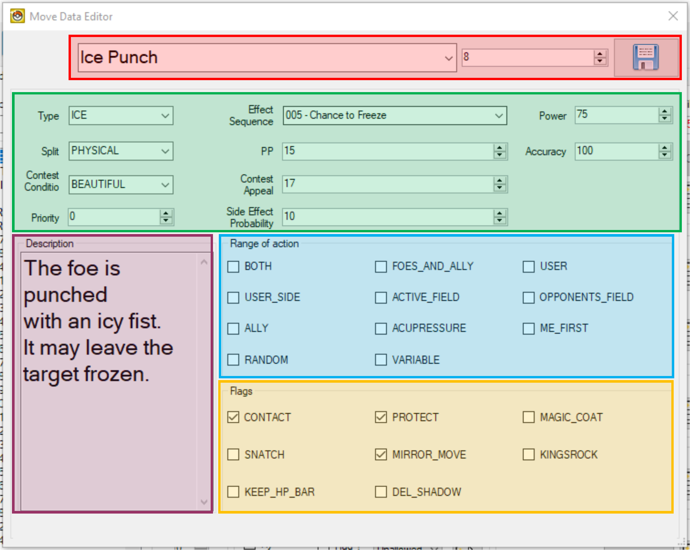  

### Move Name, Description & Battle Texts
Move names and descriptions are present in a number of Text Archives accessible via the Text Editor in DSPRE:
- Move Names, as they appear in:
   - Move selection in battle
   - Pokémon summary screen
   - Scripted word/phrase selection (e.g. the Primo phrase selection script in HGSS)
   - Battle texts (e.g. "x" used "y" move)
- Move Descriptions, as they appear in:
   - Pokémon summary screen
   - TM item description (as approporiate)

The following are the relevant Text Archives for US versions of the Generation IV Pokémon games. The search function in DSPRE can be used to easily locate the right messages (and archives in other versions of the games).

|  | HeartGold/SoulSilver | Platinum | Diamond/Pearl |
| :--- | :---: | :---: | :---: |
| Move Names (Move Selection & Pokémon Summary) | `750` | `647` | `588` |
| Move Names (Battle Texts) | `003` | `000` | `000` |
| Move Names (Scripted Word Selection) | `751` | `648` | `589` |
| Move Descriptions (Pokémon Summary) | `749` | `646` | `587` |
| Move Descriptions (TM Item Description) | `221` | `391` | `343` |
| Supplementary Battle Texts | `197` | `368` | `324` |

### Type, Category, Power, Accuracy, PP
The majority of attributes of moves are adjusted in this section of the Move Data Editor in DSPRE. Many are self explanatory: Type, Power, Accuracy, PP. Below is a summary of some of the less intuitive attributes:

| Attribute | Possible Values | Description |
| :--- | :--- | :--- |
| Type | `NORMAL` `FIRE` `GRASS` ... etc. | The type of a move: the 18 types in Generation IV includes `???` but not `Fairy` |
| Split | `PHYSICAL` `SPECIAL` `STATUS` | The difference between physical damaging moves, special damaging moves & status moves that do not inflicy direct damage |
| Contest Condition | `COOL` `BEAUTIFUL` `CUTE` `SMART` `TOUGH` | The five categories of competitions, moves and condition in "Super Contests" in Diamond, Pearl or Platinum. |
| Priority | `-32` to `+32` | The priority stage of a move, where a higher number indicates a move to be executed earlier. Vanilla Generation IV moves range from `-7` to `+5`. |
| Effect Sequence | `000 - ...` to `470 - ...` | A numeric value that determines the more complex effects of the move beyond basic data (such as secondary effects, damage modifiers, more details in the [Move Effect Scripts](#move-effect-scripts) section below). |
| PP | `0` to `100` | The base number of Power Points, i.e. the amount of times the move can be executed before PP is restored. |
| Contest Appeal | `0` to `255` | A numeric value the determines the behaviour of the move in a "Super Contest" in Diamond, Pearl or Platinum. Index to Effect mapping in the table below. |
| Side Effect Probability | `0` to `255` | The probability in % of a secondary effect triggering, for example a stat boost or fall as a secondary effect to a damage-dealing move. |
| Power | `0` to `255` | The base power of a damage-dealing move. |
| Accuracy | `0` to `100` | The accuracy in % of a move. A value of `0` is infinite accuracy, i.e. the move never misses. |

<details>
<summary>DPPt: Super Contests Appeal Effects</summary>
| Index | Effect | Appeal Hearts |
| :---: | :--- | :---: |
| 1 | Enables the user to perform first in the next turn. | 2 |
| 2 | Enables the user to perform last in the next turn. | 2 |
| 4 | Earn +2 if the Judge's Voltage goes up. | 2 |
| 5 | A basic performance using a move known by the Pokémon. | 3 |
| 6 | Earn +3 if no other Pokémon has chosen the same Judge. | 1 |
| 7 | Allows performance of the same move twice in a row. | 2 |
| 8 | Increased Voltage is added to the performance score. | 0 |
| 9 | Earn +15 if all the Pokémon choose the same Judge. | 0 |
| 10 | Lowers the Voltage of all Judges by 1. | 2 |
| 11 | Earn double the score in the next turn. | 0 |
| 12 | Steals the Voltage of the Pokémon that just went. | 0 |
| 13 | Prevents the Voltage from going up in the same turn. | 2 |
| 14 | Makes the order of contestants random in the next turn. | 2 |
| 15 | Earns double the score on the final performance. | 2 |
| 16 | Raises the score if the Voltage is low. | 0 |
| 17 | Earn +2 if the Pokémon performs first in the turn. | 2 |
| 18 | Earn +2 if the Pokémon performs last in the turn. | 2 |
| 19 | Prevents the Voltage from going down in the same turn. | 2 |
| 20 | Earn +3 if two Pokémon raise the Voltage in a row. | 1 |
| 21 | Earn a higher score the later the Pokémon performs. | 0 |
| 22 | Earn +3 if the Pokémon that just went hit max Voltage. | 2 |
| 23 | Earn +3 if the Pokémon gets the lowest score. | 1 |
</details>

### Range
One or less range flags should be set per move. Most moves have no flag, or "normal" range: where the move may affect any target adjacent to the user. Some moves do not target an opponent, self or ally, such as weather-setting moves which target one or both sides of the "field".  

The below table explains the use of each range flag.  

<table>
  <tr>
    <th>Range Flag</th>
    <th>Meaning</th>
    <th>Example Moves</th>
  </tr>
  <tr>
    <td>`-`</td>
    <td>*Opponent or Ally*: May target one adjacent opponent or ally.</td>
    <td>Tackle, Magical Leaf, Psych Up</td>
  </tr>
  <tr>
    <td>`BOTH`</td>
    <td>*All Opponents*: Affects all adjacent opponents, but not allies.</td>
    <td>Tail Whip, Razor Leaf, Bubble</td>
  </tr>
  <tr>
    <td>`FOES_AND_ALLY`</td>
    <td>*All Others*: Affects all adjacent opponents and allies.</td>
    <td>Surf, Earthquake, Teeter Dance</td>
  </tr>
  <tr>
    <td>`USER`</td>
    <td>*User*: Affects the user.</td>
    <td>Swords Dance, Bide, Howl</td>
  </tr>
  <tr>
    <td>`USER_SIDE`</td>
    <td>*User Side*: Affects the user's side of the field.</td>
    <td>Mist, Light Screen, Tailwind</td>
  </tr>
  <tr>
    <td>`ACTIVE_FIELD`</td>
    <td>*All Sides*: Affects the user's and opponent's sides of the field.</td>
    <td>Haze, Sandstorm, Gravity</td>
  </tr>
  <tr>
    <td>`OPPONENTS_FIELD`</td>
    <td>*Opponent Side*: Affects the opponent's side of the field.</td>
    <td>Spikes, Toxic Spikes, Stealth Rock</td>
  </tr>
  <tr>
    <td>`ALLY`</td>
    <td>*One Ally*: May target one adjacent ally.</td>
    <td>Helping Hand</td>
  </tr>
  <tr>
    <td>`ACUPRESSURE`</td>
    <td>*User or Ally*: May target the user or one adjacent ally.</td>
    <td>Acupressure</td>
  </tr>
  <tr>
    <td>`ME_FIRST`</td>
    <td>*One Opponent*: May target any one adjacent opponent, but not allies.</td>
    <td>Me First</td>
  </tr>
  <tr>
    <td>`RANDOM`</td>
    <td>*One Random Opponent*: Affects a random opponent.</td>
    <td>Thrash, Petal Dance, Uproar</td>
  </tr>
  <tr>
    <td>`VARIABLE`</td>
    <td>*Varies:* Variable based on move effect.</td>
    <td>Magic Coat, Counter, Sleep Talk</td>
  </tr>
</table>

### Other Flags
None or many flags may be set in this section, which help determine specific interactions & behaviours.

The below table explains the use of each flag.

<table>
  <tr>
    <th>Flag</th>
    <th>Meaning</th>
    <th>Example Moves</th>
  </tr>
  <tr>
    <td>`CONTACT`</td>
    <td>The move makes contact with the opponent, so may trigger contact-based abilities such as Static.</td>
    <td>Fire Punch, Steel Wing</td>
  </tr>
  <tr>
    <td>`PROTECT`</td>
    <td>The move can be blocked if the target has used a Protecting move, such as Protect or Detect.</td>
    <td>Pursuit, X-Scissor</td>
  </tr>
  <tr>
    <td>`MAGIC_COAT`</td>
    <td>The detrimental status move is eligible for being "reflected" by an opponent using the move Magic Coat on the same turn.</td>
    <td>Leech Seed, Spikes</td>
  </tr>
  <tr>
    <td>`SNATCH`</td>
    <td>The beneficial status move is eligible for being "stolen" by an ally or opponent using the move Snatch on the same turn.</td>
    <td>Dragon Dance, Mist</td>
  </tr>
  <tr>
    <td>`MIRROR_MOVE`</td>
    <td>The damage-dealing move is eligible to be copied by Mirror Move.</td>
    <td>Frenzy Plant, Mud-Slap</td>
  </tr>
  <tr>
    <td>`KINGSROCK`</td>
    <td>If the user of the damage-dealing move is holding a King's Rock, and the move does not already have a chance to flinch secondary effect, the move gains a secondary effect of a 10% chance to flinch the target. This special-case chance to flinch is not increased by the user having the Serene Grace ability in vanilla Generation IV.</td>
    <td>Aura Sphere, Gunk Shot</td>
  </tr>
  <tr>
    <td>`KEEP_HP_BAR`</td>
    <td>A move animation flag, where the HP remains rendered on-screen during the move animation if the flag is set.</td>
    <td>Double Kick, Icicle Spear</td>
  </tr>
  <tr>
    <td>`DEL_SHADOW`</td>
    <td>A move animation flag, where the Pokémon's shadow is removed during the move animation if the flag is set.</td>
    <td>Wish, Doom Desire</td>
  </tr>
</table>

------------------------------

## Move Effect Scripts
> Source(s): [Drayano](https://pastebin.com/u/DrayHackTutorials), [Lhea](https://gist.github.com/lhearachel) & [Yako?](https://github.com/YakoSWG)  

The most basic move effect script (sometimes referred to as "effect sequences", e.g. in DSPRE's Move Editor), is script `000` (used, for example by the move Tackle), which simply applies the most basic damaging logic:
1. Determine whether the move is a Critical Hit.
2. Calculate the damage the move will inflict.

In hex, this simple damage-dealing script in HGSS looks like this: `26 00 00 00 0F 00 00 00 E0 00 00 00`
- `26 00 00 00` - Critical hit determination,
- `0F 00 00 00` - Damage calculation,
- `E0 00 00 00` - Ends the script. *Note this command is different in Platinum (`DE 00 00 00`) & Diamond/Pearl (`DA 00 00 00`).*  

More complex damaging moves include this basic functionality at the end of their **move effect script**, but also include more logic, possibly including reference to one or more **move effect sub-scripts**, for example to apply guaranteed or chances of stat changes to the user or target.

Status moves which increase or decrease a single stat by one or two stages, usually call a specific **move effect sub-script** with and a parameter for the stat/no. of stages, including which of the [list of possible side effects effects](https://github.com/pret/pokeplatinum/blob/main/include/data/move_side_effect_subscripts.h) to apply.

In hex a common status-only stat-stage asjusting move effect script in HGSS looks like this:  
> `32 00 00 00 07 00 00 00 AA AA AA AA ## ## ## ## E0 00 00 00`  

Where:
- `## ## ## ##` is a value that corresponds to the table of side effects linked above.
- `AA AA AA AA` is `02 00 00 00`, indicating that this is a "primary" effect.  
- `E0 00 00 00` - Ends the script *(see above version note)*.  

In hex a common damaging move with a chance (which might be 100%) to adjust stat-stages in HGSS looks like this:  
> `26 00 00 00 0F 00 00 00 32 00 00 00 07 00 00 00 AA AA AA AA ## ## ## ## E0 00 00 00`

Where:
- `## ## ## ##` is a value that corresponds to the table of side effects linked above.
- `AA AA AA AA` is `03 00 00 00`, indicating that this is a "secondary" effect. 
- `E0 00 00 00` - Ends the script *(see above version note)*.  

> Primary effects will occur 100% of the time. Secondary effects occur after Primary effects, and are subject to the "Side Effect Probability" percentage value. Although they are not mixed in the Vanilla Generation IV games. It is possible to create a move effect script which includes a primary and secondary stat-stage adjustment.

> Status moves which change multiple stats (e.g. Calm Mind) use different effect sub-scripts.

### "Broken" Move Effect Scripts
> Source(s): [Yako?](https://github.com/YakoSWG)  

Because they are not used in the vanilla Generation IV Pokémon games, there are a number of move effect scripts which do not actually call/use the common "side effects" **effect sub-script** and the reference to the right parameters. These move effect scripts are named in DSPRE as the intended use, but if they are to be used, they require hex edits.

The process to fix these move effect scripts is relatively straightforward, involving copying the move effect script of a similar fuinctional move and substituting in the correct parameters (table entries). For example, move effect script `012` is intended to increase the user's Speed stat by one stage, a side effect that does not occur in the vanilla Generation IV games (in isolation).

- As with the others, move effect script `012` currently contains only the basic move effects (to determine critical hits and calculate damage). In hex this appears as: `26 00 00 00 0F 00 00 00 E0 00 00 00`
- Replacing it with the below will set the effect script to raise the user's Speed stat by one stage (in line with the DSPRE description): `32 00 00 00 07 00 00 00 02 00 00 00 11 00 00 40 E0 00 00 00`  
- The `11 00 00 40` parameter section can be determined by looking into a similar sub script. For example, the increase Speed by one stage entry in the table is row 24, row 23 increase defence by one stage. This is a vanilla-used side effect (for example the move Harden). The move effect script `011` can be found and viewed in a hex editor, which is: `32 00 00 00 07 00 00 00 02 00 00 00 10 00 00 40 E0 00 00 00`
- From which the parameter value can be incremented by one from `10 00 00 40` to `11 00 00 40`.

The element that is replaced is formed of two parts, the first two bytes are the effect, the last two bytes are the target (`00 40` for the user, `00 80` for the target). The effects of the first two bytes are listed in the table below:

The content of the final byte (denoted by `##` in the table) is different for the user or the target:  
<table>
  <tr>
    <th>User</th>
    <th>Target</th>
  </tr>
  <tr>
    <td>`00 40`</td>
    <td>`00 80`</td>
  </tr>
</table>


<details>
<summary>Hex Elements Identifying Stat Changes</summary>
<table>
  <tr>
    <th>Stat</th>
    <th>Hex (+1)</th>
    <th>Hex (+2)</th>
    <th>Hex (-1)</th>
    <th>Hex (-2)</th>
  </tr>
  <tr>
    <td>**Attack**</td>
    <td>`0F 00 00 ##`</td>
    <td>`27 00 00 ##`</td>
    <td>`16 00 00 ##`</td>
    <td>`2E 00 00 ##`</td>
  </tr>
  <tr>
    <td>**Defense**</td>
    <td>`10 00 00 ##`</td>
    <td>`28 00 00 ##`</td>
    <td>`17 00 00 ##`</td>
    <td>`2F 00 00 ##`</td>
  </tr>
  <tr>
    <td>**Speed**</td>
    <td>`11 00 00 ##`</td>
    <td>`29 00 00 ##`</td>
    <td>`18 00 00 ##`</td>
    <td>`30 00 00 ##`</td>
  </tr>
  <tr>
    <td>**Special Attack**</td>
    <td>`12 00 00 ##`</td>
    <td>`2A 00 00 ##`</td>
    <td>`19 00 00 ##`</td>
    <td>`31 00 00 ##`</td>
  </tr>
  <tr>
    <td>**Special Defense**</td>
    <td>`13 00 00 ##`</td>
    <td>`2B 00 00 ##`</td>
    <td>`1A 00 00 ##`</td>
    <td>`32 00 00 ##`</td>
  </tr>
  <tr>
    <td>**Accuracy**</td>
    <td>`14 00 00 ##`</td>
    <td>`2C 00 00 ##`</td>
    <td>`1B 00 00 ##`</td>
    <td>`33 00 00 ##`</td>
  </tr>
  <tr>
    <td>**Evasion**</td>
    <td>`15 00 00 ##`</td>
    <td>`2D 00 00 ##`</td>
    <td>`1C 00 00 ##`</td>
    <td>`34 00 00 ##`</td>
  </tr>
</table>
</details>

The below table lists the non-implemented move effect scripts, which can be fixed by replacing their contents with the given hex. The content of the final four bytes (denoted by `## ## ## ##` in the table) is different in:
<table>
  <tr>
    <th>HeartGold/SoulSilver</th>
    <th>Platinum</th>
    <th>Diamond/Pearl</th>
  </tr>
  <tr>
    <td>`E0 00 00 00`</td>
    <td>`DE 00 00 00`</td>
    <td>`DA 00 00 00`</td>
  </tr>
</table>

<details>
<summary>Corrections for "non-implemented" but named in DSPRE move effect scripts</summary>
<table>
  <tr>
    <th>Effect Script ID</th>
    <th>Effect</th>
    <th>Required Hex</th>
  </tr>
  <tr>
    <td>`12`</td>
    <td>Increase user's Speed stat by one stage</td>
    <td>`32 00 00 00 07 00 00 00 02 00 00 00 11 00 00 40 ## ## ## ##`</td>
  </tr>
  <tr>
    <td>`14`</td>
    <td>Increase user's Special Defence stat by one stage (non-damaging).</td>
    <td>`32 00 00 00 07 00 00 00 02 00 00 00 13 00 00 40 ## ## ## ##`</td>
  </tr>
  <tr>
    <td>`15`</td>
    <td>Increase user's Accuracy stat by one stage (non-damaging).</td>
    <td>`32 00 00 00 07 00 00 00 02 00 00 00 14 00 00 40 ## ## ## ##`</td>
  </tr>
  <tr>
    <td>`21`</td>
    <td>Reduce the target's Special Attack stat by one stage (non-damaging).</td>
    <td>`32 00 00 00 07 00 00 00 02 00 00 00 19 00 00 80 ## ## ## ##`</td>
  </tr>
  <tr>
    <td>`22`</td>
    <td>Reduce the target's Special Defence stat by one stage (non-damaging).</td>
    <td>`32 00 00 00 07 00 00 00 02 00 00 00 1A 00 00 80 ## ## ## ##`</td>
  </tr>
  <tr>
    <td>`55`</td>
    <td>Increase user's Accuracy stat by two stages (non-damaging).</td>
    <td>`32 00 00 00 07 00 00 00 02 00 00 00 2C 00 00 40 ## ## ## ##`</td>
  </tr>
  <tr>
    <td>`56`</td>
    <td>Increase user's Evasion stat by two stages (non-damaging).</td>
    <td>`32 00 00 00 07 00 00 00 02 00 00 00 2D 00 00 40 ## ## ## ##`</td>
  </tr>
  <tr>
    <td>`61`</td>
    <td>Reduce the target's Special Attack stat by two stages (non-damaging).</td>
    <td>`32 00 00 00 07 00 00 00 02 00 00 00 31 00 00 80 ## ## ## ##`</td>
  </tr>
  <tr>
    <td>`63`</td>
    <td>Reduce the target's Accuracy stat by two stages (non-damaging).</td>
    <td>`32 00 00 00 07 00 00 00 02 00 00 00 33 00 00 80 ## ## ## ##`</td>
  </tr>
  <tr>
    <td>`64`</td>
    <td>Reduce the target's Evasion stat by two stages (non-damaging).</td>
    <td>`32 00 00 00 07 00 00 00 02 00 00 00 34 00 00 80 ## ## ## ##`</td>
  </tr>
  <tr>
    <td>`74`</td>
    <td>Reduce the target's Evasion stat by one stage (damaging side-effect).</td>
    <td>`26 00 00 00 0F 00 00 00 32 00 00 00 07 00 00 00 03 00 00 00 1C 00 00 80 ## ## ## ##`</td>
  </tr>
</table>
</details>

To replace the values for any one or more move effect scripts:
1. Unpack the move effect NARC (using the [DSPRE "Unpack NARC to Folder" function](/docs/universal/guides/unpacking_narcs/#dspre)).
    - HGSS: `/a/0/3/0`
    - Platinum: `be_seq.narc`
2. Open the relevant move effect using a hex editor (such as HxD).
3. Replace the entire contents of the file with the new hex string (see above table for some examples).
4. Save the file.
5. Move the backup file created by the hex editor to another location (this may be named `###.bak` for example). This is very important, if not done there will be issues with all move effect scripts *after* the modified one.
6. Re-pack the move effect NARC (using the DSPRE ["Build NARC from folder"](/docs/universal/guides/unpacking_narcs/#dspre) function).
    - For HGSS, the NARC will be created with the `.narc` suffix, that should be removed.
7. Open the ROM in DSPRE (from the extracted contents folder, not the ROM), and save the ROM.
  
### Unused Move Effect Scripts
There are a number of move effect scripts that appear to have no intended use, and are not named in DSPRE. There *are* a number of unused move effect sub-scripts (for example a damaging side-effect reduction of the target's Special Attack), which may have at one point been intended to fill these gaps.

It is also possible to use these unused move effect scripts to implement unused combinations such as these. The below are the list of undocumented (unused) move effect scripts which only contain the standard damaging critical hit determination and damage calculation (or don't exist).  

- `96`
- `110`
- `131`
- `133`
- `134`
- `141`
- `157`
- `163`
- `277` - `470`

Move Effect Script `264` is identified as "Undocumented" in DSPRE, but has unique code.  
The safest scripts to use are the latter range of `277`-`470`. These data aren't just the standard critical hit and damage calculation (and could be used for some unknown or unclear purpose), they just do not exist.  

### Backporting Stat-Changing Moves
> Source(s): [Drayano](https://pastebin.com/u/DrayHackTutorials)  

A [tutorial](https://pastebin.com/a5bGatsc) written by Drayano, details how to utilise the move effect sub-scripts already in the game, and abuse the potential of using primary and secondary effects in a single move effect script, to detail how stat-changing status moves that do not exist in-game (such as Coil) can be created.  

Because this method uses only the existing sub-scripts, the appearance is not as clean (for example, a Coil approximation would raise Attack & Defense as a primary effect, and Accuracy as a secondary effect, resulting in two stat-increase animations).  

It is possible to add new sub-scripts to accomodate more complex stat changes (or change existing sub-scripts to this end), as there is space in the sub-scripts file for this, however, it also requires addition to the specific "side-effects" mapping table. This is in `overlay_0012` (four bytes for each subscript at offsets: `0x3550C` to `0x3574c` listing which sub-script is given which ID to be called/used in effect scripts), and there is no space for additional entries here, so would require re-pointing the table if desired.

Creating sub-scripts which handle different combinations of two or more 1- or 2-stage stat changes, is achievable by using sub-scripts for moves such as Calm Mind, Dragon Dance and Curse (non-Ghost) as a base, by reviewing the unpacked NARC, decompilation projects and reverse engineering tools (such as Ghidra). This more complicated method is beyond the scope of this guide, but an example of what can be achieved is included in the [Case Studies](#example-case-studies) section (Quiver Dance).

------------------------------

## Move Animations  
Source(s): Acent, [DavveDP](https://github.com/DavveDP), [Fexty](https://github.com/Fexty12573)  


Move animations can be edited in a number of ways (not including using decompilation projects or HG-Engine), primarily:
1. Direct hex editing of the relevant data,
2. A tool called WazaEffectEditor (often shortened to WazaEditor) that has a UI.

For the purposes of this guide it is assumed that WazaEffectEditor will be used to edit animations. WazaEffectEditor was initially designed for Pokémon Platinum Version by Acent, and a modified variation is available for HGSS (modified by DavveDP) as well (not, it is unclear if this variation is functionally complete as it appears to be in a work in progress state on the developer's GitHub repository). The different versions can be found here: 
- [WazaEffectEditor (Platinum)](https://drive.google.com/drive/folders/1YcRGuzTaGfNXJpO1rhb4t6GLyE2UVfaA)
    - [Original Release](https://discord.com/channels/446824489045721090/482242795982159872/799743818797940797)
- [WazaEffectEditor (HGSS)](https://discord.com/channels/446824489045721090/534415767454875678/1250447089067102300)
    - [GitHub Repo](https://github.com/DavveDP/Waza-Editor)

There are a number of other resources which may be useful in move animation editing:
- [Vanilla Move Animations](/docs/generation-iv/resources/move_animations/)
- [Fexty's definitions for the commands used](https://github.com/Fexty12573/pokeplatinum/blob/ef0faaf5835f820d95754f6a3e434dcfdecb5348/src/battle_anim/battle_anim_system.c#L790)

### Running WazaEffectEditor
The first time that WazaEffectEditor is opened a message about downloading libraries/moves from Bulbapedia may be presented, this should be accepted. This may then result in a hanging state after a few minutes. If this is the case, closing and re-opening the application should resolve and allow use of the tool.

WazaEffectEditor works on the same premise as tools like DSPRE, i.e. the user selects a ROM (`.nds` file), and the tool unpacks this (using the ROM's move names and animations). When saving, the ROM is re-packed and saved (with the option to override the existing ROM file, or rename). It is important to be aware of this if edits are being done across multiple tools, as WazaEffectEditor (HGSS) doesn't interact (for example), with the unpacked contents folder that DSPRE creates.

### Review & Interpret Vanilla Animations


Animations can be viewed in hex by unpacking the relevant NARC (see [here](#move--associated-data-structure) for NARC details), or by viewing in WazaEffectEditor. Once opened, having the [translation of the animation commands](https://github.com/Fexty12573/pokeplatinum/blob/ef0faaf5835f820d95754f6a3e434dcfdecb5348/src/battle_anim/battle_anim_system.c#L790) can be invaluable in interpreting what is happening. Only some commands are named in WazaEffectEditor, whereas almost all have been named by Fexty.

Lots of animations have common components, and some similar animations have similar patterns (such as charging or recharge moves having different animations on the first and second turn).

There are three main types of animation components/instructions:
1. **Sprite translations** - where the user or target Pokemon sprite is rotated, scaled or translated (moved).
2. **"Particles"** - where new visual elements are added "on top" of the view in battle.
    - "Particles" translations.
3. **Backgrounds** - where the current background is replaced with a unique colour/design background.
4. **Sound Effects** - where custom or situational sounds are played.

A simple animation (Pound) is shown below in three different formats, to illustrate how interpreting an animation can be done. Line-breaks have been inserted into the hex representation to illustrate the mapping between the different formats:

<details>
<summary>Pound (Hex)</summary>
```
38 00 00 00
39 00 00 00 00 00 00 00
39 00 00 00 01 00 00 00
39 00 00 00 02 00 00 00
39 00 00 00 03 00 00 00
3A 00 00 00 04 00 00 00 00 00 00 00 00 00 00 00 00 00 00 00
3A 00 00 00 05 00 00 00 00 00 00 00 01 00 00 00 01 00 00 00
3A 00 00 00 06 00 00 00 00 00 00 00 02 00 00 00 02 00 00 00
3A 00 00 00 07 00 00 00 00 00 00 00 03 00 00 00 03 00 00 00
2D 00 00 00 4E 00 00 00 01 00 00 00 00 00 00 00
33 00 00 00 00 00 00 00 20 00 00 00 01 00 00 00
3B 00 00 00
3C 00 00 00 00 00 00 00
3C 00 00 00 01 00 00 00
3C 00 00 00 02 00 00 00
3C 00 00 00 03 00 00 00
2E 00 00 00 00 00 00 00 01 00 00 00 04 00 00 00
2E 00 00 00 00 00 00 00 00 00 00 00 04 00 00 00
2D 00 00 00 24 00 00 00 05 00 00 00 01 00 00 00 00 00 00 00 01 00 00 00 02 00 00 00 08 01 00 00
16 00 00 00 23 07 00 00 75 00 00 00
32 00 00 00
35 00 00 00 00 00 00 00
04 00 00 00
```
</details>

<details>
<summary>Pound (WazaEffectEditor)</summary>
```
Init
Cmd_39 0x0
Cmd_39 0x1
Cmd_39 0x2
Cmd_39 0x3
Cmd_3a 0x4 0x0 0x0 0x0
Cmd_3a 0x5 0x0 0x1 0x1
Cmd_3a 0x6 0x0 0x2 0x2
Cmd_3a 0x7 0x0 0x3 0x3
ApplyCmd 0x4e 0x1 0x0
SetPlayAnim 0x0 0x20 0x1
Cmd_3b
Cmd_3c 0x0
Cmd_3c 0x1
Cmd_3c 0x2
Cmd_3c 0x3
LoadAnim 0x0 0x1 0x4
LoadAnim 0x0 0x0 0x4
ApplyCmd 0x24 0x5 0x1 0x0 0x1 0x2 0x108
PlaySound 0x723 0x75
WaitAnim
Cmd_35 0x0
End
```
</details>

<details>
<summary>Pound (WazaEffectEditor with Fexty Command Names)</summary>
```
BattleAnimScriptCmd_InitPokemonSpriteManager
BattleAnimScriptCmd_LoadPokemonSpriteDummyResources 0x0
BattleAnimScriptCmd_LoadPokemonSpriteDummyResources 0x1
BattleAnimScriptCmd_LoadPokemonSpriteDummyResources 0x2
BattleAnimScriptCmd_LoadPokemonSpriteDummyResources 0x3
BattleAnimScriptCmd_AddPokemonSprite 0x4 0x0 0x0 0x0
BattleAnimScriptCmd_AddPokemonSprite 0x5 0x0 0x1 0x1
BattleAnimScriptCmd_AddPokemonSprite 0x6 0x0 0x2 0x2
BattleAnimScriptCmd_AddPokemonSprite 0x7 0x0 0x3 0x3
BattleAnimScriptCmd_CallFunc 0x4e 0x1 0x0
BattleAnimScriptCmd_LoadParticleSystem 0x0 0x20 0x1
BattleAnimScriptCmd_FreePokemonSpriteManager
BattleAnimScriptCmd_RemovePokemonSprite 0x0
BattleAnimScriptCmd_RemovePokemonSprite 0x1
BattleAnimScriptCmd_RemovePokemonSprite 0x2
BattleAnimScriptCmd_RemovePokemonSprite 0x3
BattleAnimScriptCmd_CreateEmitter 0x0 0x1 0x4
BattleAnimScriptCmd_CreateEmitter 0x0 0x0 0x4
BattleAnimScriptCmd_CallFunc 0x24 0x5 0x1 0x0 0x1 0x2 0x108
BattleAnimScriptCmd_PlayPannedSoundEffect 0x723 0x75
BattleAnimScriptCmd_WaitForAllEmitters
BattleAnimScriptCmd_UnloadParticleSystem 0x0
BattleAnimScriptCmd_End
```
</details>

With nothing more than these resources, and a basic understanding of what happens (and can happen) in a Pokemon battle generally, and with the specific move, we can infer a few things from Pound (many are applicable to other moves).

The move animation goes through some decipherable steps (with some obscured detail):
1. Initialise the animation system,
2. Load resources and specific sprites,
4. Call some specific functions
5. Load the animation system
6. Remove sprites
7. Load the specific "emitter" animations required (in this case concurrently)
8. Call some specific functions
9. Play a sound effect
10. Wait for the animations to end
11. Unload the animation system
12. End

Various other things can be inferred:
- The animation system must be loaded and unloaded before and after the animations play.
- When animations/particle emitters are initiated, there will be a wait function to ensure the animation finishes.
- Each unique "Particle System" (second parameter of the `SetPlayAnim` or `LoadParticleSystem` command), has a number of actual particle animations within it, played using the `LoadAnim` or `CreateEmitter` command.

To learn more, more complex move animations can be reviewed:
- Such as two-turn moves like Solarbeam, where an initialisation and two sets of animations can be seen, managed with the command:
    - `ov12_02220F30` (`CheckTurn`).
- A move that includes a background being generated as well as "particle" animations, e.g. Hydro Pump, which uses the commands:
    - `BattleAnimScriptCmd_SwitchBg` (`ChangeBackG`),
    - `BattleAnimScriptCmd_WaitForBgSwitch` (`WaitBack2`) &
    - `BattleAnimScriptCmd_RestoreBg` (`BackBackG`).

### Replace one Animation for another
A wholesale replacement of one animation with another is straightforward. Either a hex editor or WazaEffectEditor could be used to copy the entire animation and paste it into the animation file for another move.  
Since WazaEffectEditor directly interacts with the ROM (`.nds` file), changes can be made in its user interface and saved, and be applied to the ROM.  
If editing the Move Animations NARC in a hex editor such as HxD:
1. The [NARC must be unpacked](/docs/universal/guides/unpacking_narcs/),
2. The file(s) [edited in the hex editor](/docs/universal/guides/hex_editing/),
3. Backup (e.g. `.bak`) files moved out of the folder,
4. The [NARC must be packed](/docs/universal/guides/unpacking_narcs/),
5. The ROM re-built using the NARC (e.g. using DSPRE), &
6. The ROM saved as a `.nds` file.

Some elements of the animation are dependant upon the move effects. For example, if a single-turn move is given the vanilla animation of a two-turn move, only the first turn's animation will play, without further edits.

### Edit Animation Elements
Editing individual elements of a move animation is straightforward with the above understanding, but may require some trial and testing to get the desired result. Often the basis for these changes is to identify the elements to change, and identify any existing moves that use the same patterns.  

Changes such as the below are all relatively simple:
- Add/remove/change particle animations from existing options
- Add/remove/change background animations from existing options
- Add/remove/change sound effects from existing options
- Change a one-turn animation into a two-turn animation
- Change a two-turn animation into a one-turn animation

------------------------------

## Move Categories (Battle Engine & AI)
There are a number of mechanical categories of moves in the Pokémon games, these categories have some kind of interaction with certain Abilities and/or items, and are typically offensive or defensive. Some of these categories were introduced afterGeneration IV. This section provides an overview of the mechanical move categories already present in Generation IV, and how to edit the specific moves considered to be within these categories, while also ensuring that the Trainer AI comprehends the changes.  

The table below is a list of mechanical categories which interact with Abilities or Items, including which generation they were introduced in. The following sections further detail the categories natively available in Generation IV.

<table>
  <tr>
    <th>Move Category</th>
    <th>Related Abilities</th>
    <th>Related Items</th>
    <th>Generation Introduced</th>
  </tr>
  <tr>
    <td>Explosive</td>
    <td>Damp</td>
    <td></td>
    <td>*Generation III*</td>
  </tr>
  <tr>
    <td>[Sound-based](#sound-based-moves)</td>
    <td>Soundproof</td>
    <td>Throat Spray</td>
    <td>*Generation IV*  
    (Throat Spray added in Generation VIII)</td>
  </tr>
  <tr>
    <td>[Punching](#punching-moves)</td>
    <td>Iron Fist</td>
    <td>Punching Glove</td>
    <td>*Generation IV*  
    (Punching Glove added in Generation IX)</td>
  </tr>
  <tr>
    <td>Bomb & Ball</td>
    <td>Bulletproof</td>
    <td></td>
    <td>Generation VI</td>
  </tr>
  <tr>
    <td>Aura & Pulse</td>
    <td>Mega Launcher</td>
    <td></td>
    <td>Generation VI</td>
  </tr>
  <tr>
    <td>Biting</td>
    <td>Strong Jaw</td>
    <td></td>
    <td>Generation VI</td>
  </tr>
  <tr>
    <td>Dancing</td>
    <td>Dancer</td>
    <td></td>
    <td>Generation VI</td>
  </tr>
  <tr>
    <td>Powder & Spore</td>
    <td>Overcoat</td>
    <td>Safety Goggles</td>
    <td>Generation VI</td>
  </tr>
  <tr>
    <td>Slicing</td>
    <td>Sharpness</td>
    <td></td>
    <td>Generation IX</td>
  </tr>
  <tr>
    <td>Wind</td>
    <td>Wind Rider, Wind Power</td>
    <td></td>
    <td>Generation IX</td>
  </tr>
  <tr>
    <td>[Trapping (Binding) Moves](#trapping-binding-moves)</td>
    <td></td>
    <td>Grip Claw, Binding Band</td>
    <td>*Generation I*  
    (Binding Band added in Generation V)</td>
  </tr>
  <tr>
    <td>Multi-strike Moves (Variable)</td>
    <td>Skill Link</td>
    <td></td>
    <td>*Generation I*  
    (Skill Link added in *Generation IV*)</td>
  </tr>
  <tr>
    <td>One-Hit Knock Out (OHKO)</td>
    <td>No Guard</td>
    <td></td>
    <td>*Generation I*  
    (No Guard added in *Generation IV*)</td>
  </tr>
</table>

### Sound-based Moves

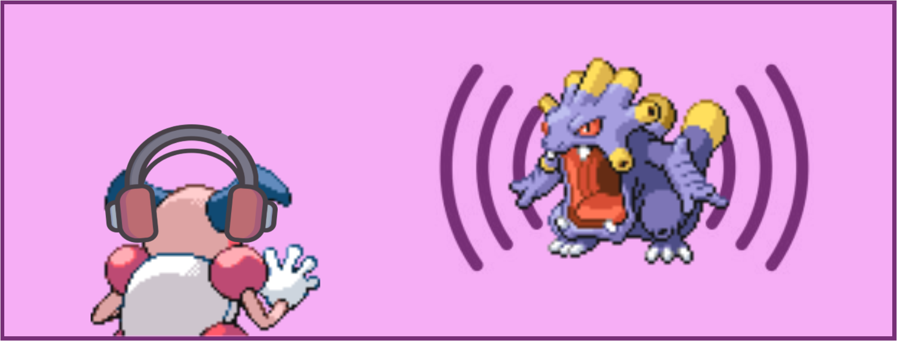

Since this mechanic is one that the trainer AI is aware of, any changes must be completed in two places:
1. Enabling the Ability-based effect,
2. Ensuring the trainer AI is aware of the change.

Twelve moves are classed as sound-based in the Generation IV Pokémon games, listed in the table below.

<details>
<summary>Sound-based Moves</summary>
<table>
  <tr>
    <th>Move ID (Decimal)</th>
    <th>Move ID (Hex)</th>
    <th>Move Name</th>
  </tr>
  <tr>
    <td>45</td>
    <td>`2D 00`</td>
    <td>Growl</td>
  </tr>
  <tr>
    <td>46</td>
    <td>`2E 00`</td>
    <td>Roar</td>
  </tr>
  <tr>
    <td>47</td>
    <td>`2F 00`</td>
    <td>Sing</td>
  </tr>
  <tr>
    <td>48</td>
    <td>`30 00`</td>
    <td>Supersonic</td>
  </tr>
  <tr>
    <td>103</td>
    <td>`67 00`</td>
    <td>Screech</td>
  </tr>
  <tr>
    <td>173</td>
    <td>`AD 00`</td>
    <td>Snore</td>
  </tr>
  <tr>
    <td>253</td>
    <td>`FD 00`</td>
    <td>Uproar</td>
  </tr>
  <tr>
    <td>304</td>
    <td>`30 01`</td>
    <td>Hyper Voice</td>
  </tr>
  <tr>
    <td>319</td>
    <td>`3F 01`</td>
    <td>Metal Sound</td>
  </tr>
  <tr>
    <td>320</td>
    <td>`40 01`</td>
    <td>Grass Whistle</td>
  </tr>
  <tr>
    <td>405</td>
    <td>`95 01`</td>
    <td>Bug Buzz</td>
  </tr>
  <tr>
    <td>448</td>
    <td>`C0 01`</td>
    <td>Chatter</td>
  </tr>
</table>
</details>

#### Sound-based Battle Effect (Ability Inclusion)
> Source(s): [Yako? (2025)](https://discord.com/channels/446824489045721090/920372513488404542/1408170611620053116)  

In order to change the moves that are impacted by the Soundproof ability mechanically the table of sound-based moves can be edited.  
- If the changes are replacements (e.g. remove move ID `405` Bug Buzz from the list, and add move ID `49` Sonic Boom), then simply changing the existing move ID is sufficient.
- If the change involves only removing entries from this list, the bytes can be deleted, the same number of zero bytes added to the end of the list, *and* the expected length of the table updated.
- If up to **4** (*HGSS*) / **14** (*Platinum*) / **2** (*Diamond/Pearl*) additional moves are to be added to the group, the empty bytes at the end of the list can be edited to include the new entries, *and* the expected length of the table updated.
- If more than **4** (*HGSS*) / **14** (*Platinum*) / **2** (*Diamond/Pearl*) additional moves are to be added to the group, the table must be re-pointed, *and* the expected length of the table updated. This is considered beyond the scope of this guide, but the details here could be used to achieve this.

The changes must be made in a decompressed overlay.

<table>
  <tr>
    <th>Game Version</th>
    <th>Overlay</th>
    <th>Offset (Move Table)</th>
    <th>Offset (Table Length)</th>
    <th>Offset (Table Pointer)</th>
  </tr>
  <tr>
    <td>HeartGold/SoulSilver</td>
    <td>`Overlay_0012`</td>
    <td>`0x37360`</td>
    <td>`0x1B718`</td>
    <td>`0x1B7A4`</td>
  </tr>
  <tr>
    <td>Platinum</td>
    <td>`Overlay_0016`</td>
    <td>`0x35A4C`</td>
    <td>`0x1B118`</td>
    <td>`0x1B1A4`</td>
  </tr>
  <tr>
    <td>Diamond/Pearl</td>
    <td>`Overlay_0011`</td>
    <td>`0x329C4`</td>
    <td>`0x19F68`</td>
    <td>`0x19FF4`</td>
  </tr>
</table>

The length and contents of the move table in the vanilla Generation IV Pokémon games varies between versions. In each there is some space for additional entries, each possible space represented by a set of `00 00`.

> - HGSS: `2D 00 2E 00 2F 00 30 00 67 00 AD 00 FD 00 3F 01 40 01 30 01 95 01 C0 01 00 00 00 00 00 00 00 00`
> - Platinum: `2D 00 2E 00 2F 00 30 00 67 00 AD 00 FD 00 3F 01 40 01 30 01 95 01 C0 01 00 00 00 00 00 00 00 00 00 00 00 00 00 00 00 00 00 00 00 00 00 00 00 00 00 00 00 00`
> - Diamond/Pearl: `2D 00 2E 00 2F 00 30 00 67 00 AD 00 FD 00 3F 01 40 01 30 01 95 01 C0 01 00 00 00 00`

And the expected length of the table is `0C` (12). This could be updated to a smaller or larger number depending on the desired number of sound-based moves (e.g. a value of `10` could be used for a total number of moves of 16, that is four additional ones).

#### Trainer Move Selection AI Soundproof Inclusion (BASIC Flag)
> Source(s): [Lhea & Yako? (2025)](https://discord.com/channels/446824489045721090/920372513488404542/1408160098068729876)  

This section of the guide ensures that any NPC trainers in the game which have the BASIC AI flag enabled (see [this link](https://gist.github.com/lhearachel/ff61af1f58c84c96592b0b8184dba096) for a breakdown of the Generation IV trainer move selection AI). Without this change, the AI could know that the target has the Soundproof ability and still select a move that has no effect on the target.

> The AI only *gains* "knowledge" of the target's ability (in terms of immunity abilities like this) after either:
> 1. It is triggered once in battle, or
> 2. If the species can only have that ability.

The changes must be made in a decompressed overlay.

<table>
  <tr>
    <th>Game Version</th>
    <th>Overlay</th>
    <th>Offset</th>
  </tr>
  <tr>
    <td>HeartGold/SoulSilver</td>
    <td>`Overlay_0010`</td>
    <td>`0x4EA8`</td>
  </tr>
  <tr>
    <td>Platinum</td>
    <td>`Overlay_0014`</td>
    <td>`0x4EA0`</td>
  </tr>
  <tr>
    <td>Diamond/Pearl</td>
    <td>`Overlay_0016`</td>
    <td>`0x1DB70`</td>
  </tr>
</table>

This table is identical in all five Generation IV Pokémon games.  
- If only editing the moves in the table is required (no change to the overall quantity), the contents of this table can be searched for the relevant Move IDs to replace as needed.
- If the total number of moves in the table will change (increase or decrease), the below change should be implemented by replacing the existing hex block with the new hex block.

##### Soundproof AI Awareness Table (Vanilla)
```  
21 00 00 00 17 00 00 00 2D 00 00 00 4F 09 00 00 17 00 00 00 2E 00 00 00 4C 09 00 00 17 00 00 00 2F 00 00 00 49 09 00 00 17 00 00 00 30 00 00 00 46 09 00 00 17 00 00 00 67 00 00 00 43 09 00 00 17 00 00 00 AD 00 00 00 40 09 00 00 17 00 00 00 FD 00 00 00 3D 09 00 00 17 00 00 00 3F 01 00 00 3A 09 00 00 17 00 00 00 40 01 00 00 37 09 00 00 17 00 00 00 95 01 00 00 34 09 00 00 17 00 00 00 C0 01 00 00 31 09 00 00
```  

##### Soundproof AI Awareness Table (Custom)
```  
21 00 00 00 27 00 00 00 19 00 00 00 02 00 00 00 4E 09 00 00 4C 00 00 00 1B 00 00 00 2D 00 00 00 2E 00 00 00 2F 00 00 00 30 00 00 00 67 00 00 00 AD 00 00 00 FD 00 00 00 3F 01 00 00 40 01 00 00 95 01 00 00 C0 01 00 00 CA FE 00 00 CA FE 00 00 CA FE 00 00 CA FE 00 00 CA FE 00 00 CA FE 00 00 CA FE 00 00 CA FE 00 00 CA FE 00 00 CA FE 00 00 CA FE 00 00 CA FE 00 00 CA FE 00 00 CA FE 00 00 CA FE 00 00 FF FF FF FF
```  

The custom format of the table has all sound-based moves present in the format of `2D 00 00 00` (for example for Roar), where one move is immediately after the last. `CA FE 00 00` values can be replaced with additional moves (starting at the first one). This implementation allows for up to **15 moves** to be added (regardless of game version). Assuming that the battel [effect move table](#sound-based-battle-effect-ability-inclusion) was not re-pointed, this is enough to handle the number of additional moves that can be added in each version.

### Punching Moves
> Source(s): [Yako? (2025)](https://discord.com/channels/446824489045721090/920372513488404542/1424818933101498549)  

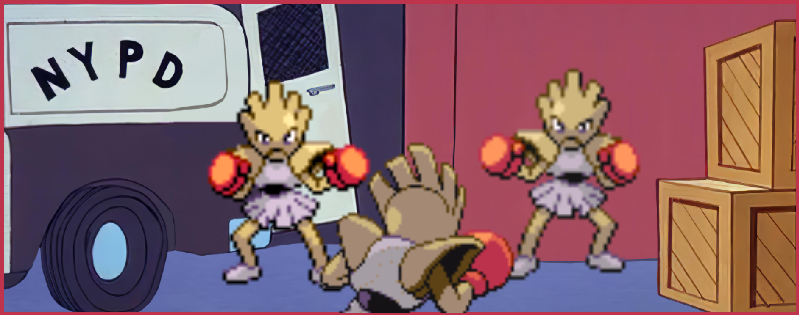

Since this mechanic is **not** one that the trainer AI is *explicitly* aware of (the `EVALUATE ATTACK` flag will include the Iron Fist power boost in its damage calculations in Generation IV Pokémon games), any changes must be only be completed in one place:
1. Enabling the Ability-based effect.

Fifteen moves are classed as punching moves in the Generation IV Pokémon games, listed in the table below.

<details>
<summary>Punching Moves</summary>
<table>
  <tr>
    <th>Move ID (Decimal)</th>
    <th>Move ID (Hex)</th>
    <th>Move Name</th>
  </tr>
  <tr>
    <td>4</td>
    <td>`04 00`</td>
    <td>Comet Punch</td>
  </tr>
  <tr>
    <td>5</td>
    <td>`05 00`</td>
    <td>Mega Punch</td>
  </tr>
  <tr>
    <td>7</td>
    <td>`07 00`</td>
    <td>Fire Punch</td>
  </tr>
  <tr>
    <td>8</td>
    <td>`08 00`</td>
    <td>Ice Punch</td>
  </tr>
  <tr>
    <td>9</td>
    <td>`09 00`</td>
    <td>Thunder Punch</td>
  </tr>
  <tr>
    <td>146</td>
    <td>`92 00`</td>
    <td>Dizzy Punch</td>
  </tr>
  <tr>
    <td>183</td>
    <td>`B7 00`</td>
    <td>Mach punch</td>
  </tr>
  <tr>
    <td>223</td>
    <td>`DF 00`</td>
    <td>Dynamic Punch</td>
  </tr>
  <tr>
    <td>264</td>
    <td>`08 01`</td>
    <td>Focus Punch</td>
  </tr>
  <tr>
    <td>309</td>
    <td>`35 01`</td>
    <td>Meteor Mash</td>
  </tr>
  <tr>
    <td>325</td>
    <td>`45 01`</td>
    <td>Shadow Punch</td>
  </tr>
  <tr>
    <td>327</td>
    <td>`47 01`</td>
    <td>Sky Uppercut</td>
  </tr>
  <tr>
    <td>359</td>
    <td>`67 01`</td>
    <td>Hammer Arm</td>
  </tr>
  <tr>
    <td>409</td>
    <td>`99 01`</td>
    <td>Drain Punch</td>
  </tr>
  <tr>
    <td>418</td>
    <td>`A2 01`</td>
    <td>Bullet Punch</td>
  </tr>
</table>
</details>

#### Punching Battle Effect (Ability Inclusion)
In order to change the moves that are impacted by the Iron Fist ability mechanically the table of punching moves can be edited.  
- If the changes are replacements (e.g. remove move ID `146` Dizzy Punch from the list, and add move ID `249` Rock Smash), then simply changing the existing move ID is sufficient.
- If the change involves only removing entries from this list, the bytes can be deleted, the same number of zero bytes added to the end of the list, *and* the expected length of the table updated.
- If any additional moves are to be added to the group, the table must be re-pointed, *and* the expected length of the table updated. This is considered beyond the scope of this guide, but the details here could be used to achieve this.

The changes must be made in a decompressed overlay.

<table>
  <tr>
    <th>Game Version</th>
    <th>Overlay</th>
    <th>Offset (Move Table)</th>
    <th>Offset (Table Length)</th>
    <th>Offset (Table Pointer)</th>
  </tr>
  <tr>
    <td>HeartGold/SoulSilver</td>
    <td>`Overlay_0012`</td>
    <td>`0x352FE`</td>
    <td>`0x1FF58`</td>
    <td>`0x20224`</td>
  </tr>
  <tr>
    <td>Platinum</td>
    <td>`Overlay_0016`</td>
    <td>`0x33AD6`</td>
    <td>`0x1F960`</td>
    <td>`0x1FC2C`</td>
  </tr>
  <tr>
    <td>Diamond/Pearl</td>
    <td>`Overlay_0011`</td>
    <td>`0x30CFA`</td>
    <td>`0x1E534`</td>
    <td>`0x1E81C`</td>
  </tr>
</table>

The length and contents of the move table in the vanilla Generation IV Pokémon games is consistent between versions.

> - Move Table: `08 00 07 00 09 00 B7 00 08 01 92 00 DF 00 67 01 05 00 04 00 35 01 45 01 99 01 A2 01 47 01`

And the expected length of the table is `0F` (15). This could be updated to a smaller or larger number depending on the desired number of punching moves (e.g. a value of `13` could be used for a total number of moves of 19, that is four additional ones).

#### Trainer Move Selection AI Iron Fist Inclusion (EVALUATE ATTACK Flag)
The `EVALUATE ATTACK` trainer AI flag assesses the damage output of moves to choose the best move; accounting for abilities such as Iron Fist; Reckless; Technician; Adaptability & Normalise. This means there is no need to make further changes for the AI to be aware of punching moves. 

#### Editing the Iron Fist Damage Multiplier
The increase in damage dealt by a punching move when used by a Pokémon that has the Iron Fist ability is an ability effect, rather than a move effect, but is included here because it is known. The damage in these cases in the vanilla games is 120% of the normal damage. This is achieved by multiplying the damage by **twelve** (multiplier) and dividing by **ten** (divisor).

The information is located in different overlays for different game versions. For games where the overlays are compressed (HeartGold & SoulSilver), decompression of the overlays must be done before hex editing the overlay. A unique hex string of `0C 20 60 43 0A 21` can be searched to find the area to be edited, the specific values to change are the `0C` (12 in decimal) and `0A` (10 in decimal).

These values could be changed to other values, for example changing the multiplier to `0F` (15) for an overall damage of 150% (matching similar damage-boosting Abilities in later generations of Pokémon games, such as Mega Launcher or Sharpness).

<table>
  <tr>
    <th>Game Version</th>
    <th>Overlay</th>
    <th>Offset (Multiplier)</th>
    <th>Offset (Divisor)</th>
  </tr>
  <tr>
    <td>HeartGold/SoulSilver</td>
    <td>`Overlay_0012`</td>
    <td>`0x1FF44`</td>
    <td>`0x1FF48`</td>
  </tr>
  <tr>
    <td>Platinum</td>
    <td>`Overlay_0016`</td>
    <td>`0x1F94C`</td>
    <td>`0x1F950`</td>
  </tr>
  <tr>
    <td>Diamond/Pearl</td>
    <td>`Overlay_0011`</td>
    <td>`0x1E520`</td>
    <td>`0x1E524`</td>
  </tr>
</table>

### Trapping (Binding) Moves  

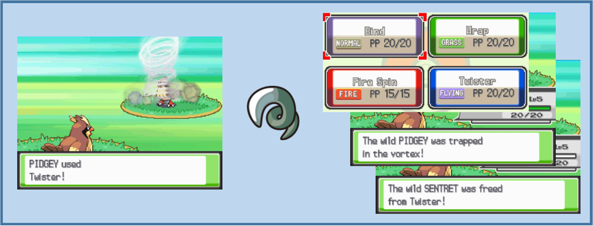

A number of moves in Pokémon are "trapping/continuous damage", or "trapping" moves. These moves deal an initial amount of physical or special damage, and then have a persistent effect to continually deal a fraction of the target's maximum HP for a number of turns thereafter. While the continuous effect is present, the opponent cannot be switched out by conventional means.  

In Generation IV, the 'End of Turn' damage fraction is 1/16 (or 0.0625) of the target's maximum HP; the continuous effect lasts for 2-5 turns; and the moves are typically relatively low accuracy and damage. In later generations, newer trapping moves were added (for example Infestation). Editing a move to become a trapping move requires some additional changes, beyond the move effect script.

The steps required to turn a move into a trapping move are:
1. Editing of the move data, including setting the effect script to a trapping effect (e.g. `042` - Binding move effect)
2. Configuring the intial trapping text which appears when the 'End of Turn' effect takes hold.
3. Configuring the 'End of Turn' trapping animation to play each turn that the trapping effect is present.

#### Editing Move Data
This can be accomplished in DSPRE, and is covered earlier in this guide, under the section titled [Basic Move Data (DSPRE)](#basic-move-data-dspre).

#### Initial Trapping Text
> Source(s): [Aero (2025)](https://discord.com/channels/446824489045721090/920372513488404542/1417851311000387605)  

The texts that are displayed at the beginning, during and end of the trapping effect are located in Text Archives, which can be viewed and edited in DSPRE, and are in different text archives in different game versions, as below.

<table>
  <tr>
    <th>HGSS</th>
    <th>Platinum</th>
    <th>Diamond/Pearl</th>
  </tr>
  <tr>
    <td>`197`</td>
    <td>`368`</td>
    <td>`324`</td>
  </tr>
</table>

- The texts that are displayed during the effect and when it ends are common to all the trapping moves, and are determined/defined directly from the relevant effect sub-scripts (`0059` and `0060`).
- The text that is displayed when the trapping effect first applies, are varied, and can be unique per move. These are determined indirectly in the relevant sub-script (`0058`), which reuires their definition in the relevant move sccript (move script number equal to the move index/ID).
- There is some further variation as some trapping moves initial text refer to the target only, and others refer to the target and the user. For example:
    - **Bind** initial trapping text: `Target` was squeezed by `User`  
    - **Fire Spin** initial trapping text: `Target` was trapped in the vortex!  

Where only the target is referenced, only **three** possible messages are required in the text archive. Where the target and user are referenced, **seven** possible messages are required.
The move script for a move will define whether one or both are needed, and the first message in the set. The format of the hex required in the move script therefore varies by whether the target only, or the target and user are referenced.

<table>
  <tr>
    <th>Type</th>
    <th>Hex</th>
  </tr>
  <tr>
    <td>Target only</td>
    <td>`15 00 00 00 ## ## 00 00 02 00 00 00 02 00 00 00 24 00 00 00`</td>
  </tr>
  <tr>
    <td>Target & User</td>
    <td>`15 00 00 00 ## ## 00 00 09 00 00 00 02 00 00 00 01 00 00 00 24 00 00 00`</td>
  </tr>
</table>

Where `## ##` should be replaced by the hex of the first message index of the set. For example, for Bind, a value of `EB 00` (235) is used; for Fire Spin, a value of `F2 00` (242). A new trapping move could use the same texts as another existing trapping move, or new texts could be added at the end of the relevant file.

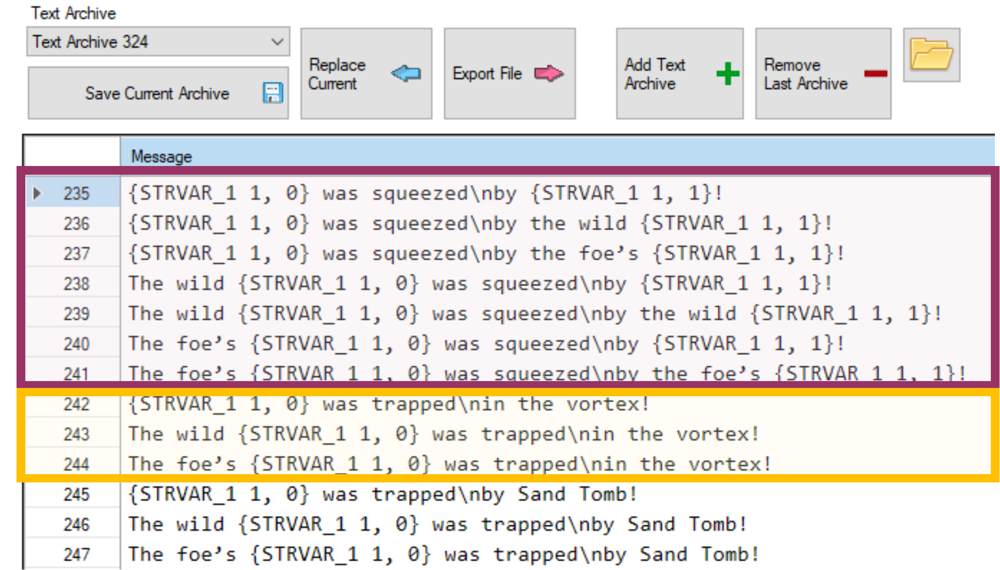 

#### End of Turn Trapping Animation
Using the correct trapping effect script (`042` - Binding move effect), will enable the mechanical aspects of the trapping effect, however, the animation will default to showing the Bind animation with the 'End of Turn' damage is applied at the end of each turn. In order to set the trapping animation to match the chosen move, two things must be done:
1. The animation must be added to the NARC that contains these types of 'End of Turn' animations (trapping moves, leech seed, ingrain...etc.).
2. The trapping effect sub-script must be updated to add logic to check for the newly added animation.

The second of these steps is fairly involved, and will require some edits to existing data as well as addition of new.

##### Adding the 'End of Turn' Animation
> Source(s): [Yako? (2025)](https://discord.com/channels/446824489045721090/920372513488404542/1417639517179084994)  

These steps assume that the exact animation of the move will be duplicated as the End of Turn animation, which is the case in the vanilla Generation IV games, though it is worth noting that this does not have to be the case, and a different animation could be designed.  

1. Unpack the "Move Animations" NARC using (using the [DSPRE "Unpack NARC to Folder" function](/docs/universal/guides/unpacking_narcs/#dspre)).
    - HGSS: `/a/0/1/0`
    - Platinum: `/data/wazaeffect/we.narc`
2. Locate the animation for the move to being a trapping move, this can be done by identifying the move's index/ID, which will be the same number as the unpacked file name.
3. Copy the whole animation file.
4. Unpack the "Continuous Animations" NARC (using the [DSPRE "Unpack NARC to Folder" function](/docs/universal/guides/unpacking_narcs/#dspre)).
    - HGSS: `/a/0/6/1`
    - Platinum: `/data/wazaeffect/we_sub.narc`
5. Once unpacked, this should contain 50 files (0-49).
6. Add a new file at the end, this will contain the new trapping animation.
7. Paste in the content copied in step 3.
8. Pack the "Continuous Animation" NARC back up (using the DSPRE ["Build NARC from folder"](/docs/universal/guides/unpacking_narcs/#dspre) function), making sure to remove any backup (e.g. `.bak` files before doing so).
9. Replace the NARC in the ROM's extracted contents folder.

##### Trapping Effect Sub-script Mapping
> Source(s): [Lhea, Paille92. & Yako? (2025)](https://discord.com/channels/446824489045721090/920372513488404542/1417589117210071072)  

In order for the new trapping animation to play when the appropriate trapping move is used, the trapping/binding effect sub-script must be update to compare the move used, and play the correct battle animation.  
This is not necessarily complicated, but somewhat involved, because the comparison and the execution are in two different places, and there is some accounting for the Magic Guard ability in the file as well.  

Viewing the sub-script hex and [Decompilation](https://github.com/pret/pokeheartgold/blob/master/files/battledata/script/subscript/subscript_0059_Bind.s) together may help understand what is happening easier.  

The relevant vanilla effect sub-script from HGSS (`059`), looks like this in a hex editor such as HxD.

 

> When working in a hex editor for this file, it may be helpful to set the `Bytes per row` to `20`.

This is not necessarily intuitive, therefore the above collapsible sections step through the edit steps one by one showing the changes at each step. This assumes that a single trapping move is added. It is possible to add multiple, but consider that multiple entries need adding in steps 1 and 2 for this, and the changes to jumps in step 3 will need to account for the number of trapping moves added. These sections assume a single trapping move is added (for simplicity).

In simple terms three tasks (steps 3-5) need to be completed for each new trapping move:
1. Unpack the "Effect sub-scipts" NARC using (using the [DSPRE "Unpack NARC to Folder" function](/docs/universal/guides/unpacking_narcs/#dspre)).
    - HGSS: `/a/0/0/1`
    - Platinum: `/battle/skill/sub_seq.narc`
2. Open sub-script `059` in a hex editor such as HxD.

<details>
<summary>3. Add a new check on the move that was used (compare function).</summary>
- Each trapping move except Bind has five sets of four byts for the comparison.
    - Bind doesn't have one as it is the "fallback", this is why the Bind animation is used if this sub-script is not updated.
- A new set of twenty bytes must be added after the last check (Sand Tomb in vanilla), replacing the 13th and 14th bytes with the relevant move ID (Little Endian).
    - Here is Sand Tomb's compare function from HGSS:  
`20 00 00 00 00 00 00 00 23 00 00 00 48 01 00 00 1E 00 00 00`
    - Here is a new function for a different move (Twister in this case):  
`20 00 00 00 00 00 00 00 23 00 00 00 EF 00 00 00 1E 00 00 00`
- Paste the new byte-string after Sand Tomb's.

As an example, if the new trapping move is Twister (uses move ID `239`, or `EF 00` in hex), the modified effect sub-script looks like this with these changes.

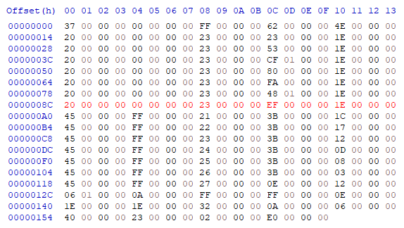  
</details>

<details>
<summary>4. Add a new execution to play the correct animation.</summary>
- Each trapping move (including Bind) has five sets of four bytes for the execution.
    - Bind is first because this is a fallback that is executed if none of the compare functions are met.
- A new set of twenty bytes must be added after the last execution (Sand Tomb in vanilla), replacing the ninth and tenth bytes with the relevant 'end of turn' move animation.
    - Here is Whirlpool's execution function from HGSS:
`45 00 00 00 FF 00 00 00 26 00 00 00 3B 00 00 00 03 00 00 00`
    - Here is Sand Tomb's execution function from HGSS:
`45 00 00 00 FF 00 00 00 27 00 00 00 0E 00 00 00`
    - Note that this last entry is four bytes smaller, because it doesn't have the jump element that the others do.
    - To add a new entry for a different move, the copied hex will include the jump command from the previous row (Whirlpool) and the up to the end of the 'end of turn' animation bytes for Sand Tomb. I.e. the following bytes should be copied and pasted immediately after the copied selection:
`3B 00 00 00 03 00 00 00 45 00 00 00 FF 00 00 00 27 00 00 00`
- The `27 00 00 00` set of bytes needs to be edited to reference the new 'end of turn' animation (in hex). `27 00` refers to file `39` in decimal, if the new file added [here](#adding-the-end-of-turn-animation) was file `50`, `27 00 00 00` should be replaced with `32 00 00 00` for example.

As an example, if the new trapping move is Twister (uses move ID `239`, or `EF 00` in hex), and the new 'end of turn' animation was added as file `50` (`32 00` in hex), the modified effect sub-script now looks like this with these changes.

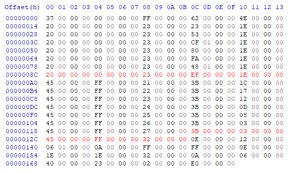  
</details>

<details>
<summary>5. Update all the "jumps" in the whole sub-script to account for the new data.</summary>
- The jumps between lines/functions now need correcting. If the file is viewed with `Bytes per row` set to `20`, the four bytes at the end of each row relate to the Jumps that need changing.
- These jumps are defined as a number of groups of four bytes. For example, to jump 20 bytes, the value will be five.
- The first jump is following a check on the target having the Magic Guard ability, and this jump moves to the end of the sub-script. Therefore this jump must be increased by the total number of groups of four bytes added to the sub-script in both steps 1 and 2.
    - If one trapping move was added, this will mean replacing `4E 00` (`78` in decimal) to `58 00` (`88` in decimal).
- The next rows (seven rows if a single trapping move was added) all jump the same number of bytes, jumping to the relevant execution steps (which is why it is important that the order is consistent between the two sections).
    - Since an extra five sets (of four bytes) have been added in the comparing functions, each of these jumps must be increased by this amount from `1E 00` (`30` in decimal) to `23 00` (`35` in decimal).
- The final set of jumps are variable, ranging from `1C 00` (28) to `03 00` (3). This is because these jumps are all moving to a specific point after the animation is executed (the point immediately after the execution function added above).
    - The last jump must remain `03 00` and each preceding jump is increased by 5. This essentially results in the values "moving down", and a new highest value being added at the top of `21 00` (33).

As an example, if the new trapping move is Twister (uses move ID `239`, or `EF 00` in hex), and the new 'end of turn' animation was added as file `50` (`32 00` in hex), the modified effect sub-script now looks like this with these changes.

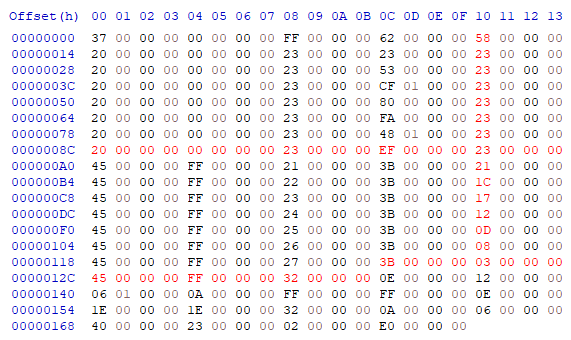 
</details>
5. Pack the "Effect sub-scipts" NARC back up (using the DSPRE ["Build NARC from folder"](/docs/universal/guides/unpacking_narcs/#dspre) function), making sure to remove any backup (e.g. `.bak` files before doing so).

#### Continuous Trapping Effects (Common)
Though it relates to modifying the overall battle system, and not individual moves, since it is known and relevant, this section details how to alter:
1. The amount of continuous damage dealt by trapping moves, and
2. The number of turns that the effect applies.

##### Editing the Amount of Continuous Damage Dealt
> Source(s): [Lhea (2023)](https://discord.com/channels/446824489045721090/920372513488404542/1176266662677319710), [Lmaokai (2025)](https://discord.com/channels/446824489045721090/920372513488404542/1420209370318372944), Paille92 (2025).  

The amount of damage dealt at the end of each turn that a trapping effect is present is determined by a 'divisor'. This value is what the maximum HP of the affected Pokémon is divided by to determine how much HP is lost.  

The information is located in different overlays for different game versions. For games where the overlays are compressed (HeartGold & SoulSilver), decompression of the overlays must be done before hex editing the overlay. A unique hex string of `48 43 10 21 09 F0` (HGSS/Plat) or `10 21 08 F0 E9` (Diamond/Pearl) can be searched to find the area to be edited, the specific value to change is the `10` (16 in decimal, hence 1/16 max HP damage per turn).

This value could be changed to another value, for example to `08` for 1/8 damage per turn (as in later generations of Pokémon games), or something totally different, for example `20` for 1/32 damage per turn. As this is a divisor, the higher the number the lower the damage dealt.

<table>
  <tr>
    <th>Game Version</th>
    <th>Overlay</th>
    <th>Offset</th>
  </tr>
  <tr>
    <td>HeartGold/SoulSilver</td>
    <td>`Overlay_0012`</td>
    <td>`0x12852`</td>
  </tr>
  <tr>
    <td>Platinum</td>
    <td>`Overlay_0016`</td>
    <td>`0x1228A`</td>
  </tr>
  <tr>
    <td>Diamond/Pearl</td>
    <td>`Overlay_0011`</td>
    <td>`0x11528`</td>
  </tr>
</table>

##### Editing the Duration of Trapping Moves
> Source(s): [Yako? & DarmaniDan](https://discord.com/channels/446824489045721090/920372513488404542/1419978755329363969)  

The number of turns that trapping moves last is determined in the `effect sub-script` which applies whenever a binding move begins (move effect sub-script `0058`). There are two important values. The normal range of number of turns (2-5 in vanilla, or 3-6 including the turn the move is initially used on); and the guaranteed number of turns that is set if the `Grip Claw` item is held by the Pokémon who used the move at the time it is first used. 

The effect sub-scripts locations in different game versions are listed [here](#move--associated-data-structure).

The sub-script contains the following hex: `38 00 00 00 03 00 00 00 03 00 00 00` which deals with the standard randomised duration, and can be broken down as:
- `38 00 00 00` - get a random number from zero to...
- `03 00 00 00` - maximum outcome
- `03 00 00 00` - add three to the outcome

Resulting in **3**, **4**, **5** & **6** as possible outcomes (which translates to **2**, **3**, **4** or **5** turns).

Later in the sub-script, further information determines the outcome if the required held item is present: `32 00 00 00 07 00 00 00 09 00 00 00 06 00 00 00`, which can be broken down as:
- `32 00 00 00` (or `39 00 00 00` in Platinum) - update the following variable...
- `07 00 00 00` - ...by setting it to a given value
- `09 00 00 00` - the variable to update
- `06 00 00 00` - the new value to write

Resulting in an outcome of **6** every time (which translates to **5** turns).

To change the standard randomised duration, the maximum outcome and number to be added can be adjusted. Two examples are below:

***Example 1:*** fix the number of turns to always be **3** turns: `38 00 00 00 00 00 00 00 04 00 00 00`
- The random number is returned between `0` and `0` (always `0`).
- The number to be added is `4`
- The outcome is always `4`, which translates to **3** turns.

***Example 2:*** set the number of turns to ranndomly vary between **4** and **5** turns: `38 00 00 00 01 00 00 00 05 00 00 00`
- The random number is returned between `0` and `1`.
- The number to be added is `5`
- The outcome is either always `5` or `6`, which translates to either **4** or **5** turns respectively.

A similar approach can be taken with the logic to override the outcome if the `Grip Claw` is held, but in this case, it is simply a matter of replacing the "new value to write" with the specific outcome desired. For example, to set this at **4** turns: `32 00 00 00 07 00 00 00 09 00 00 00 05 00 00 00`.
- The outcome (if the required held item is present) is always `5`, which translates to **4** turns.

------------------------------

## Move Compatibility (Distribution)
### Level-Up Learnset
#### General Level-Up Edits
DSPRE's **Pokémon Editor** can be used for a variety of purposes, including changes to the level up learnsets of any Pokémon in-game. This editor can be accessed from the **Other Editors** menu option, and is a tabbed view. The **Learnset Editor** is the second tab.

Each entry in the list for each Pokémon can be edited or deleted, and new entries can be added, the relative positions of moves learned at the same level can also be amended. An entry cannot be added that exactly matches and existing entry (move and level); edits must be saved for each Pokémon before they are applied.

<table>
  <tr>
    <th>Adding a new Entry</th>
    <th>Editing an Existing Entry</th>
  </tr>
  <tr>
    <td>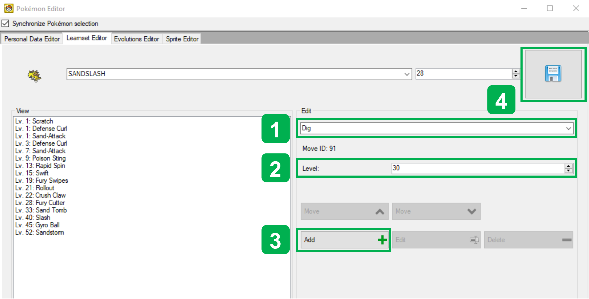</td>
    <td>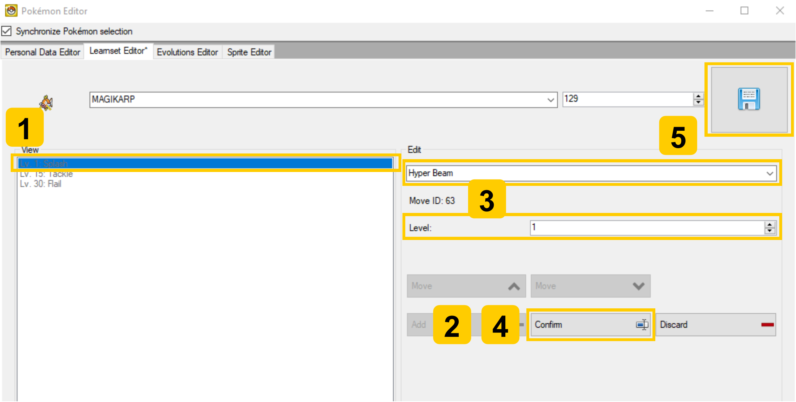</td>
  </tr>
  <tr>
    <td><ol><li>Select/enter the move to be learned.</li><li>Select/enter the level to be learned.</li><li>Click the `Add` button.</li><li>Click the `Save` button.</li></ol>*Moves are listed in Move ID/index order, a move can be found by typing its name, or beginning to type its name.*</td>
    <td><ol><li>Select a move from the existing list (on the left).</li><li>Click the `Edit` button.</li><li>Change the selected move, level learned, or both.</li><li>Click the `Confirm` button.</li><li>Click the `Save` button.</li></ol></td>
  </tr>
  <tr>
    <th>Deleting an Existing Entry</th>
    <th>Re-ordering Entries Learned at the same Level</th>
  </tr>
  <tr>
    <td>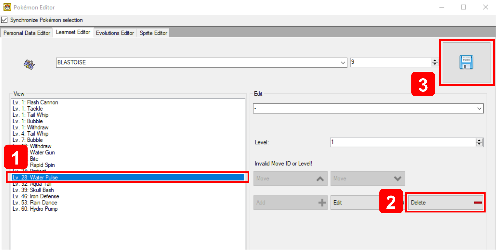</td>
    <td>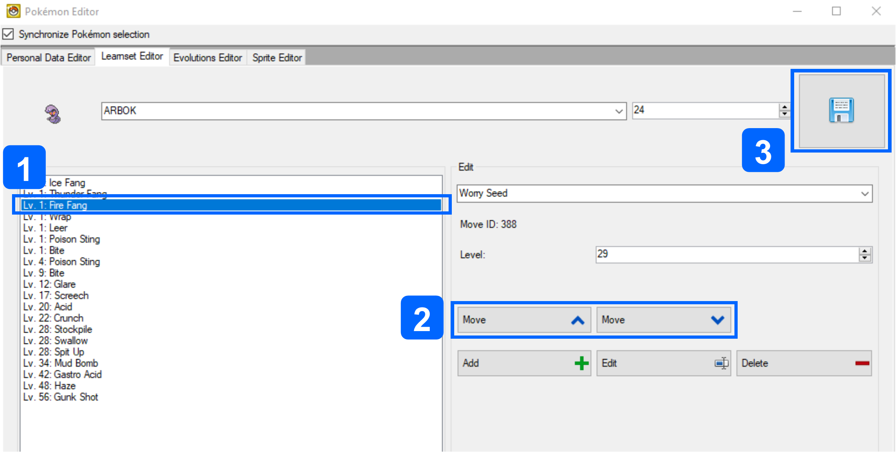</td>
  </tr>
  <tr>
    <td><ol><li>Select a move from the existing list (on the left).</li><li>Click the `Delete` button.</li><li>Click the `Save` button.</li></ol></td>
    <td><ol><li>Select a move that is learned at the same level as another move in the learnset.</li><li>Click the `Move Up` or `Move Down` buttons as appropriate.</li><li>Click the `Save` button.</li></ol></td>
  </tr>
</table>

#### Maximum Move Threshold
> Source(s): [BagBoy](https://discord.com/channels/446824489045721090/468060243688161300/1299063871524438087), [Chritchy](https://discord.com/channels/446824489045721090/446824489993502721/1171093953823645837) & [Mikelan98](https://pastebin.com/P80GiKey)  

In the Generation IV Pokémon games, level-up learnsets usually have a maximum of 20 entries. DSPRE can enable further entries to be added, but this causes issues, including when using the in-game move relearner for the affected Pokémon, either:
- Game crashes and/or
- Incomplete relearner lists to be populated

This upper limit can be edited with [hex editing](/docs/universal/guides/hex_editing/) based on the research above for **HGSS** (Mikelan98), **Platinum** (BagBoy) & **Diamond/Pearl** (Chritchy & MrHam88), preventing the issues described above in the respective games.  

The below table shows the required offsets for each game version, the standard (or "vanilla") values at these offsets, an example of what they would be changed to to increase the limit from 20 to 30 moves, and a calculation that can be used to find any required custom value. The upper limit on these values is not known.

<table>
  <tr>
    <th>Game Version</th>
    <th>File</th>
    <th>Offset(s)</th>
    <th>Standard Value  
    (*move limit* = 20)</th>
    <th>Example Value  
    (*move limit* = 30)</th>
    <th>Calculation</th>
  </tr>
  <tr>
    <th rowspan="3">HeartGold/SoulSilver</th>
    <td rowspan="3">`arm9.bin`</td>
    <td>`0x712E0`  
    `0x7153E`  
    `0x71908`</td>
    <td>`2C` (44 in decimal)</td>
    <td>`40` (64 in decimal)</td>
    <td>(*move limit* **+2**) **×2**</td>
  </tr>
  <tr>
    <td>`0x917C4`  
    `0x917CE`</td>
    <td>`2A` (42 in decimal)</td>
    <td>`3E` (62 in decimal)</td>
    <td>(*move limit* **+1**) **×2**</td>
  </tr>
  <tr>
    <td>`0x91858`</td>
    <td>`15` (21 in decimal)</td>
    <td>`1F` (31 in decimal)</td>
    <td>*move limit* **+1**</td>
  </tr>
  <tr>
    <th rowspan="2">Platinum</th>
    <td rowspan="2">`arm9.bin`</td>
    <td>`0x77028`  
    `0x77286`  
    `0x77668`  
    `0x99830`  
    `0x9983A`</td>
    <td>`2C` (44 in decimal)</td>
    <td>`40` (64 in decimal)</td>
    <td>(*move limit* **+2**) **×2**</td>
  </tr>
  <tr>
    <td>`0x998C4`</td>
    <td>`16` (22 in decimal)</td>
    <td>`20` (32 in decimal)</td>
    <td>*move limit* **+2**</td>
  </tr>
  <tr>
    <th rowspan="2">Diamond/Pearl</th>
    <td rowspan="2">`arm9.bin`</td>
    <td>`0x695FC`  
    `0x69822`  
    `0x69C04`  
    `0x88E56`  
    `0x88E5A`</td>
    <td>`2C` (44 in decimal)</td>
    <td>`40` (64 in decimal)</td>
    <td>(*move limit* **+2**) **×2**</td>
  </tr>
  <tr>
    <td>`0x88EE4`</td>
    <td>`16` (22 in decimal)</td>
    <td>`20` (32 in decimal)</td>
    <td>*move limit* **+2**</td>
  </tr>
</table>


### Technical & Hidden Machines (TMs & HMs)

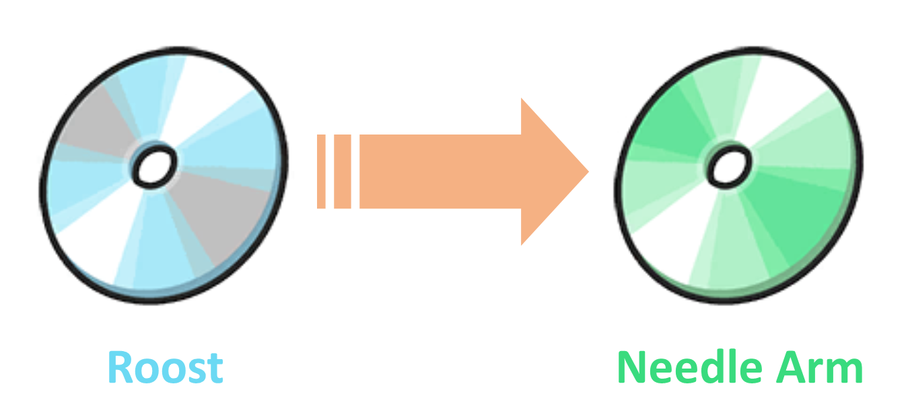

The following sections detail how to change the move that a TM teaches, and ensure that the learnsets of Pokémon are updated accordingly.  

> A case study example that uses all of these edits is outlined [here](#changing-tm51-from-roost-to-needle-arm)

#### Editing the Move within a TM
> Source(s): [Mixone (2023)](https://discord.com/channels/446824489045721090/477197363954581542/1176874701226782820) & [Drayano (2021)](https://discord.com/channels/446824489045721090/446865033310240769/897638507508539434)  

In order to change the move that a TM or HM teaches, two to four areas need editing in Generation IV Pokémon games, which can be grouped by the method of editing:
1. ARM9 Edits (hex edits):
    - The move index number associated to the TM,
    - The TM icon palette being used by the TM item (the colour of the 'disc') - necessary only when the type of the move is changed,
2. Text Edits (DSPRE):
    - The move description associated to the TM item (distinct from the *move* description), and
    - Any NPC text or other text called by Scripts that reference the move - necessary only when the TM is given to the player with context (e.g. by a Gym Leader after their defeat).

**Part 1: Hex Edits**  
1. Uncompress ARM9 (if not already uncompressed)
2. Open ARM9 in a [Hex editor](/docs/universal/guides/hex_editing/)
3. **Edit the move index number associated to the TM:**
      - Go to offset `0x1000CC` (HGSS), `0xF0BFC` (Platinum) or `0xF84EC` (Diamond/Pearl), which is the offset for TM01.
        - Each TM uses two bytes in a list from this point onwards.
        - This is Focus Punch (move index 264) in vanilla HGSS.
        - The decimal number `264` is `0x108` in hexadecimal, which is two bytes: `01` and `08`.
        - The values are represented in Little-Endian, meaning that the bytes are reversed, so this appears as `08` `01`.
      - Identify the TM you wish to edit, simply by counting through to reach the right offset.
      - Replace the two bytes representing the vanilla move index, with the two bytes representing the move index you wish to replace it with.
        - A simple method to identify the move index is to check the Bulbapedia page for [moves by index](https://bulbapedia.bulbagarden.net/wiki/List_of_moves).
4. **Edit the TM icon palette used**
    - Open ARM9 in a [Hex editor](/docs/universal/guides/hex_editing/)
    - Go to offset `0x100BD6` (HGSS), `0xF1706` (Platinum) or `0xF8FF6` (Diamond/Pearl), which is the offset for TM01.
      - Each TM palette uses eight bytes in a list from this point onwards.
      - The bytes for TM01 (Focus Punch) are: `8D 01 8E 01 21 01 33 01` (in HGSS/Plat)
      - The third & fourth bytes refer to the palette (colour) of the TM disc as numbers from `8E 01` (`398`) to `9D 01` (`413`) plus `62 02` (`610`) (bizarrely; for the Bug Type).
    - Identify the TM you wish to edit.
    - Replace the two bytes representing the vanilla type palette, with the two bytes representing the type palette you wish to replace it with.

5. Save ARM9

<details>
<summary>TM Item: Type Palettes</summary>
| Type | Palette |
| ---- | ---- |
| Fighting | `8E 01` |
| Dragon | `8F 01` |
| Water | `90 01` |
| Psychic | `91 01` |
| Normal | `92 01` |
| Poison | `93 01` |
| Ice | `94 01` |
| Grass | `95 01` |
| Fire | `96 01` |
| Dark | `97 01` |
| Steel | `98 01` |
| Electric | `99 01` |
| Ground | `9A 01` |
| Ghost | `9B 01` |
| Rock | `9C 01` |
| Flying | `9D 01` |
| Bug | `62 02` |
</details>


**Part 2: Text Edits (DSPRE):**
1. Open the ROM in DSPRE ***from the extracted folder*** (to preserve the above ARM9 changes, opening the `.nds` file will re-extract the data from the ROM, and wipe the previous ARM9 edits unless they have previously been saved back to the `.nds` file).
2. **Edit the TM item description**
    - Navigate to the Text Editor and select Text Archive `749` (HGSS), `646` (Platinum) or `587` (Diamond/Pearl); which contains the descriptions for all *moves*.
    - Identify the move description you wish to change (the Message number relates directly to the move index) the TM *to* and copy the Message
        - A simple method to identify the move index is to check the Bulbapedia page for [moves by index](https://bulbapedia.bulbagarden.net/wiki/List_of_moves).
    - Navigate to the Text Editor and select Text Archive `221` (HGSS), `391` (Platinum) or `343` (Diamond/Pearl); which contains the descriptions for all *items*.
    - Identify the TM you wish to edit by navigating to the message ID that matches the item index. TMs & HMs are indexes `328`-`427`. A simple method to identify the index is to check the Bulbapedia page for [Generation IV items by index](https://bulbapedia.bulbagarden.net/wiki/List_of_items_by_index_number_in_Generation_IV).
    - Edit the Message to read the desired move description (previously copied).
    - Save the Text Archive
3. **Edit NPC contextual texts**
    - Research/identify where the TM is acquired in the game (or where it is intended to be acquired in the ROM hack):
      - Where it is acquired by collection as an overworld item, or from a PokéMart seller, it is likely no further edits are required.
      - Where it is acquired as a gift from an NPC, there may be NPC texts that need adjustment.
    - Use the search function of the Header Editor to open the relevant Header.
    - Open the Text Archive associated to the Header
    - Search the Text Archive for messages that refer to the TM contents and adjust as necessary.
    - Save the Text Archive
4. Save the ROM to `.nds` file using DSPRE.

> Where the TM is acquired as a gift from an NPC, there may be NPC texts that need adjustment. For example, a Gym Leader rewards the player with a TM after their defeat. In their scripted text, they will refer to the name of the move and give some description of, or advice on, it's use.

#### Editing a Pokémon's Machine Learnset
Whether simply to change the availability of a vanilla TM, or to adjust compatibility/distribution based on a change to the move contained within a TM, editing which Pokémon can learn the move contained in the TM is a simple change in DSPRE.
1. Open the ROM in DSPRE
2. Navigate to the Pokémon Editor (via the "Other Editors" dropdown as of version 1.13.1 of the tool).
3. On the "Personal Editor" tab, select the Pokémon to have it's TM learnset edited.
4. Move a TM from the "Disabled" list to the "Enabled" list to allow the Pokémon to be taught the move in the TM, or visa versa to prevent the Pokémon from being taught the move from the TM.
5. Save the changes to the Pokémon.
6. Repeat steps 3-5 for all required Pokémon.
7. Save the ROM to `.nds` file using DSPRE.

> It may be useful to review public websites such as Bulbapedia or Serebii to easily identify which Pokémon can learn a move via TM and other means from the move's summary page.

### Move Tutors
> Source(s): Fantafaust, MapleDonut, [Mixone](https://github.com/Mixone-FinallyHere), Solace, [TurtleIsaac](https://github.com/turtleisaac).

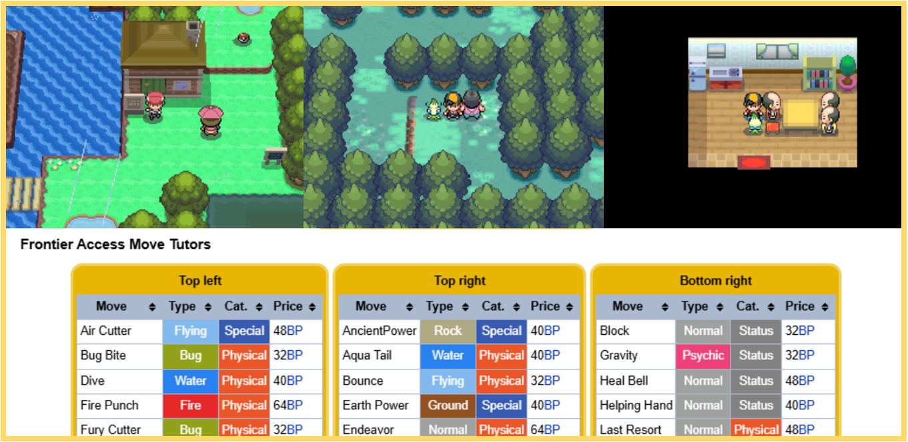 

Move tutors are implemented in a number of different ways in the Generation IV Pokémon games, with some variation between games. There are two main varieties of move tutors, with some sub-types. The below table outlines the types as they are used in the vanilla games.
1. Move Tutor by Pokémon Attributes
2. Move Tutor by Compatibility & Special Currency

<table>
  <tr>
    <th>ID</th>
    <th>Method</th>
    <th>Availability</th>
    <th>Example</th>
    <th>Description/Overview</th>
  </tr>
  <tr>
    <td>1A</td>
    <td>Pokémon Attributes (*Type & Happiness*)</td>
    <td>Diamond, Pearl, Platinum, HeartGold, SoulSilver</td>
    <td>Draco Meteor tutor (*DPPt: Route 210; HGSS: Blackthorn City*)</td>
    <td>This move tutor is fully implemented via scripting, that can be recreated/edited or adapted in DSPRE.  
    The script uses known commands to check that the selection Pokémon has Type `16` (Dragon) as either it's primary or secondary Type, whether the Pokémon has maximum happiness, and whether the Pokémon does not already know the move Draco Meteor.  
    If all checks are true, the move can be taught at no cost.</td>
  </tr>
  <tr>
    <td>1B</td>
    <td>Pokémon Attributes (*Pokémon ID & Happiness*)</td>
    <td>Diamond, Pearl, Platinum, HeartGold, SoulSilver</td>
    <td>Elemental Beams tutor (*DPPt: Route 228; HGSS: Blackthorn City*)</td>
    <td>This move tutor is fully implemented via scripting, that can be recreated/edited or adapted in DSPRE.  
    The script uses known commands to check that the selection Pokémon has ID of one of a small number of values (for the fully evolved starter Pokémon), whether the Pokémon has maximum happiness, and whether the Pokémon does not already know the Type-specific Hyper Beam variant.  
    If all checks are true, the move can be taught at no cost.  
    *Nb, incidentally, this script could probably be re-written to include the type check used in 1A to slightly streamline it.*</td>
  </tr>
  <tr>
    <td>2A</td>
    <td>Compatibility & Special Currency (*Shards*)</td>
    <td>Platinum</td>
    <td>Three Shard Tutors (*Route 212, Snowpoint City, Survival Area*)</td>
    <td>This move tutor uses scripting, but also two tables of data stored in `overlay_0005.bin`, which define the available pool of moves that can be tutored, compatibiltiy with each Pokémon, the prices and assigned tutors for each.</td>
  </tr>
  <tr>
    <td>2B</td>
    <td>Compatibility & Special Currency (*Battle Points*)</td>
    <td>HeartGold, SoulSilver</td>
    <td>Three BP Tutors (*Frontier Access*)</td>
    <td>This move tutor uses scripting, but also two tables of data stored in `overlay_0001.bin` and `waza_oshie.bin`, which define the available pool of moves that can be tutored, compatibiltiy with each Pokémon, the prices and assigned tutors for each.</td>
  </tr>
  <tr>
    <td>2C</td>
    <td>Compatibility & Special Currency (*Free*)</td>
    <td>HeartGold, SoulSilver</td>
    <td>Headbutt Tutor (*Ilex Forest*)</td>
    <td>This move tutor uses scripting, and a Headbutt-specific command, but also two tables of data stored in `overlay_0001.bin` and `waza_oshie.bin`.</td>
  </tr>
</table>

#### Editing or Creating "Pokémon Attributes" Move Tutors
As described in the table above, move tutors which are driven by scripting to determine if a Pokémon meets certain criteria such as type, ID, happiness are available in all main series Generation IV Pokémon games, and require only scripting in DSPRE.

This means that creating new tutors is very straightforward using the vanilla scripts as a base, and it would even be possible to add checks for other Pokémon data attributes this way.

#### Editing "Compatibility & Special Currency" Move Tutors
While more complex, and involving hex edits, it is very possible to edit the more complex move tutors as well without significant re-pointing. In fact, in HGSS, there is even space to add up to 12 more moves that can be tutored (not the case in Platinum).

Since these tables only exist in Platinum, Heartgold & Soulsilver versions, these tutor methods are not available in Diamond & Pearl (without more significant work, possibly code injection).

There are some variations between versions, below will outline where edits are needed and how to define the desired results. All of these will require at least rudimentary hex editing skill. See [this documentation](/docs/universal/guides/hex_editing/) to learn enough to proceed.

The below download link is for a Microsoft Excel file which can be used to easily produce the required hex strings to change the **Tutorable Moves (incl. Costs & Tutor IDs)** & the **Tutorable Moves (Pokémon Compatibility)** data in both Platinum & HGSS. The following sections describe where these changes should be done and any other context.

[Download the GenIV Move Tutor Hex Creator Spreadsheet](https://github.com/DevHam88/pt-hgss-move-tutor-hex-creator/releases)

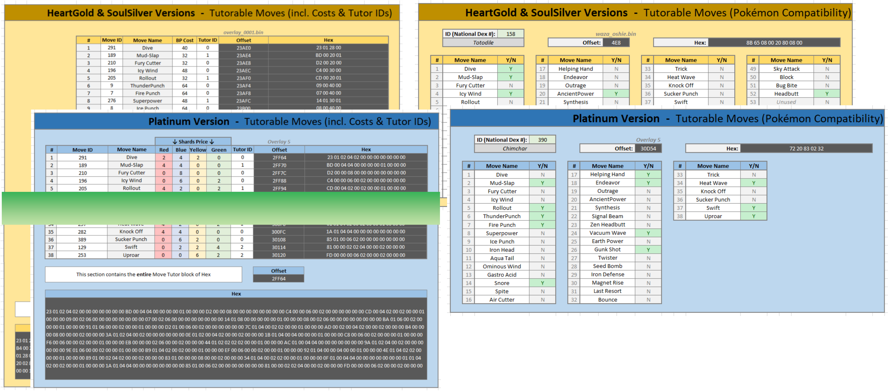 

##### Type 2A (Platinum): Compatibility & Special Currency (*Shards*)

> Source(s): [MapleDonut, TurtleIsaac & Solace (2021)](https://pastebin.com/eaYtGpTw)

All of the data exists in `Overlay_0005.bin`, and edits can be made from an extracted file (as produced by DSPRE during unpacking, or via a program such as Tinke).

**Move pool definition**  
The available pool of moves that can be tutored can be found at offest `0x2FF64` (and up to and including offset `0x3012B`).  
In platinum there are 38 used moves, each takes 12 bytes of space (plus two unused sets of bytes). A list of the moves available in the pool can be found in online sources such as [Bulbapedia](https://bulbapedia.bulbagarden.net/wiki/Move_Tutor#Generation_IV).

The format of the bytes is as follows:
`XX XX RR BB GG YY 00 00 LL 00 00 00`  
Where:
- `XX XX` : Move ID in hex (little endian, ie Move 1C3 would be `C3 01`)
- `RR` : Number of red shards required to tutor this move (red shards are used for Physical moves)
- `BB` : Number of blue shards required to tutor this move (blue shards are used for Special moves)
- `YY` : Number of yellow shards required to tutor this move (yellow shards are used for damaging or non-damaging moves with Status effects)
- `GG` : Number of green shards required to tutor this move (green shards have no specific correlation with move attributes)
- `LL` : Tutor ID. `00` is the tutor on Route 212, `01` is the tutor in the Survival Area, and `02` is the tutor in Snowpoint City.

As an example, the first tutorable move is:  
`23 01 02 04 02 00 00 00 00 00 00 00`
Meaning this is move ID `291` (Dive), costs 2 Red Shards, 4 Blue Shards, 2 Green Shards & 0 Yellow Shards, and is available at the tutor on Route 212.

To check understanding, look at the last tutorable move, and identify the required information:  
`FD 00 00 00 06 02 00 00 02 00 00 00`

<details>
  <summary>Interpretation of the hex above</summary>
  <p>This is move ID `253` (Uproar), costs 0 Red Shards, 0 Blue Shards, 6 Green Shards & 2 Yellow Shards, and is available at the tutor in Snowpoint City.</p>
</details>

This knowledge can be used to change any of the moves that the tutors can (collectively) teach, the costs for the move in shards, and the specific tutor who can teach it.

Note that the Tutor ID simply relates to an input to the `CheckLearnableTutorMoves` script command. This means that the moves aren't tied to specific NPCs, locations etc., and it means that new Tutors could be defined by editing the Tutor ID parts of the available pool of moves. It is also worth noting that the pool could theoretically have multiple of the same move present, for example if you wanted Tutor ID `00` and a new Tutor ID `03` to both teach Ominous Wind, you could replace an unwanted move in the table with a second for Omnious Wind with a different or same cost, and a different Tutor ID.

**Pokémon compatibility**

The compatibility table can be found at offest `0x3012C`. In Platinum each Pokémon ID uses 5 bytes.  

The format of the bytes is as follows:
`AA BB CC DD EE`
Where:
- `AA` : Binary true/false definition for tutorable moves 01-08
- `BB` : Binary true/false definition for tutorable moves 09-16
- `CC` : Binary true/false definition for tutorable moves 17-24
- `DD` : Binary true/false definition for tutorable moves 25-32
- `EE` : Binary true/false definition for tutorable moves 33-40 (only 33-38 are used)

The individual bytes must be interpreted seperately for accuracy.

As an example, if a Pokémon should be able to learn the 2nd & 3rd moves in the tutorable table `AA` must be `06`, and not `60` as the "positions" are read right to left in binary. An example below, shows this in action:

- **Compatible Moves:** Mud-Slap (ID `2`), Fury Cutter (ID `3`)  
- **Binary:** `0000 0110`  
- **Hex:** `06`  
- A binary to hex converter could be used to work this out, or the `BIN2HEX` function in Microsoft Excel.  

To find the offset of any given Pokémon to edit, paste the following formula into cell `B1` of an Excel document (`=(DEC2HEX(((A1-1)*8)+196908))`), and put the National Dex ID of the Pokémon in cell `A1`.  

<details>
  <summary>Pokémon IDs (Special Forms)</summary>
| Pokémon ID | Name/Form |
| --- | --- |
| `1`-`493` | National Dex ID for normal form |
| `494` | Deoxys (ATK) |
| `495` | Deoxys (DEF) |
| `496` | Deoxys (SPD) |
| `497` | Wormadam (SAND)  |
| `498` | Wormadam (TRASH) |
| `499` | Giratina (ORIGIN) |
| `500` | Shaymin (SKY) |
| `501` | Rotom (HEAT) |
| `502` | Rotom (WASH) |
| `503` | Rotom (FROST) |
| `504` | Rotom (FAN) |
| `505` | Rotom (MOW) |
</details>

##### Type 2B (HGSS): Compatibility & Special Currency (*Battle Points*)

**Move pool definition**  
> Thanks to Fantafaust for related research which identifies the location of the move pool definition table in HGSS (`overlay_0001`).

The available pool of moves that can be tutored can be found at offest `0x23AE0` (and up to and including offset `0x23BC7`) in an **decompressed** `overlay_0001` (DSPRE can be used to decompress this overlay).  
In HGSS there are 52 used moves, each takes four bytes of space. There is space in `overlay_0001` for six more moves to be defined (which are just present as `00 10 00 00` in the vanilla game) A list of the moves available in the pool can be found in online sources such as [Bulbapedia](https://bulbapedia.bulbagarden.net/wiki/Move_Tutor#Generation_IV).

The format of the bytes is as follows:
`XX XX BB TT`
Where:
- `XX XX` : Move ID in hex (little endian, ie Move 1C3 would be `C3 01`)
- `BB` : Price in Battle Points
- `TT` : Tutor ID. `00` is the top-left tutor, `01` is the top-right tutor and `02` is the bottom-right tutor, all in the house in the Frontier Access, `03` refers to the Headbutt tutor in Ilex Forest.

As an example, the first tutorable move is:  
`23 01 28 00`
Meaning this is move ID `291` (Dive), costs 40 Battle Points, and is available at the top-left tutor.

To check understanding, look at the second-to-last (used) tutorable move, and identify the required information:  
`C2 01 20 00`

<details>
  <summary>Interpretation of the Hex above</summary>
  <p>This is move ID `450` (Bug Bite), costs 32 Battle Points, and is also available at the top-left tutor.</p>
</details>

This knowledge can be used to change any of the moves that the tutors can (collectively) teach, the costs for the move in BP, and the specific tutor who can teach it.

Note that the Tutor ID simply relates to an input to the `CheckLearnableTutorMoves` script command. This means that the moves aren't tied to specific NPCs, locations etc., and it means that new Tutors could be defined by editing the Tutor ID parts of the available pool of moves. It is also worth noting that the pool could theoretically have multiple of the same move present, for example if you wanted Tutor ID `00` and a new Tutor ID `04` to both teach Ominous Wind, you could replace an unwanted move in the table with a second for Omnious Wind with a different or same cost, and a different Tutor ID.

When considering adding new Tutor IDs in HGSS, bear in mind that tutor ID `03` is used (the Headbutt tutor).

**Pokémon compatibility**
> Source(s): [Mixone (2024)](https://discord.com/channels/446824489045721090/468060243688161300/1268200787251564584)

The compatibility table can be found in `waza_oshie.bin` at offest `0x0` (this is the entire file). In HGSS each Pokémon ID uses 8 bytes.

The format of the bytes is as follows: `AA BB CC DD EE FF GG HH`, where:
- `AA` : Binary true/false definition for tutorable moves 01-08
- `BB` : Binary true/false definition for tutorable moves 09-16
- `CC` : Binary true/false definition for tutorable moves 17-24
- `DD` : Binary true/false definition for tutorable moves 25-32
- `EE` : Binary true/false definition for tutorable moves 33-40
- `FF` : Binary true/false definition for tutorable moves 41-48
- `GG` : Binary true/false definition for tutorable moves 49-56 (only 49-52 are used, 53-56 are present, but unused)
- `HH` : Binary true/false definition for tutorable moves 57-64 (only 57-58 are present, but unused)

The individual bytes must be interpreted seperately for accuracy.

As an example, if a Pokémon should be able to learn the 2nd & 3rd moves in the tutorable table `AA` must be `06`, and not `60` as the "positions" are read right to left in binary. The example below, taken from Mixone's reseach shows this in action:

- **Compatible Moves:** Mud-Slap (ID `2`), Fury Cutter (ID `3`)  
- **Binary:** `0000 0110`  
- **Hex:** `06`  
- A binary to hex converter could be used to work this out, or the `BIN2HEX` function in Microsoft Excel.  

To find the offset of any given Pokémon to edit, paste the following formula into cell `B1` of an Excel document (`=(DEC2HEX((A1-1)*8))`), and put the National Dex ID of the Pokémon in cell `A1`.  

<details>
  <summary>Pokémon IDs (Special Forms)</summary>
| Pokémon ID | Name/Form |
| --- | --- |
| `1`-`493` | National Dex ID for normal form |
| `494` | Deoxys (ATK) |
| `495` | Deoxys (DEF) |
| `496` | Deoxys (SPD) |
| `497` | Wormadam (SAND)  |
| `498` | Wormadam (TRASH) |
| `499` | Giratina (ORIGIN) |
| `500` | Shaymin (SKY) |
| `501` | Rotom (HEAT) |
| `502` | Rotom (WASH) |
| `503` | Rotom (FROST) |
| `504` | Rotom (FAN) |
| `505` | Rotom (MOW) |
</details>

##### Type 2C: Compatibility & Special Currency (*Free*)

This type of move tutor is a variation on Type 2 where the tutor can only teach a single move, and that move is one that has a Tutor ID of `3` (in the case of the vanilla HGSS game: `52` Headbutt). It checks the compatibility table discussed in the previous section on [Type 2B](#type-2b-compatibility--special-currency-battle-points) to confirm if the selected Pokémon can learn the more or not.

This is achieved through a very specific command `CheckHeadbuttCompatibility` which inherently checks for tutorable moves with tutor ID = `03`. It is possible to use the same command along with the `AdrsValueSet` command to create other one move tutors, or even different uses. An example of this implementation is [Fantafaust's HM Integration](https://pastebin.com/Ym5xKt8b), which is used to perform compatibility checks for a HM-replacement system.

#### Creating New Move Tutors

With the information documented above, it is possible to create new move tutors, by utilising unused Tutor IDs (for both Platinum & HGSS). In HGSS it is easily possible to define six more moves that can be tutored, using the available space in the existing table in `overlay_0001`. Existing commonscripts can be copied/replicated to create new tutors that use the same purchasing mechanisms (shards or BP). It is also easily possible to use the same move tutor data to develop tutors that have more unique/complex logic controlling availability/purchase of the tutorable moves with custom scripting.

In **HGSS**, the Event and Script data of the move tutors in the Frontier Access can be reviewed to find that a small series of commonscripts are used to drive their dialogue & options. Adding a new tutor that uses (for example Tutor ID `04`), can be acheived by following these steps:
1. Update the Tutorable Moves data (`overlay_0001`) to include moves that are aligned to Tutor ID `04` *(Details [here](#type-2b-hgss-compatibility--special-currency-battle-points); hex creator tool [here](#editing-compatibility--special-currency-move-tutors))*.
2. Update the Pokémon Compatibility data (`waza_oshie.bin`) to set the compatibility for the newly added moves *(Details [here](#type-2b-hgss-compatibility--special-currency-battle-points); hex creator tool [here](#editing-compatibility--special-currency-move-tutors))*.
3. Locate the last move tutor commonscript (file 2, Script 3). Copy the script and paste it as Script 4, editing the `SetVar` commands for variables `32768` & `32775` to change the value the variable is set to (`2`) to `4`, for example:  

```
Script 4:  
 	SetVar 32768 4  
 	SetVar 16399 24  
	SetVar 32775 4  
Jump Function#1
```

4. Copy the script used by one of the move tutors from the house in the Frontier Access, alter the commonscript called to be the correct (Script 4 in file 2 is `10443`).

```
Script 999:
	PlayFanfare SEQ_SE_CONFIRM
	LockAll
	FacePlayer
	CommonScript 10443
	ReleaseAll
End
```

In **Platinum**, this is slightly more involved, as commonscripts aren't utilised, the functions are within the Script files of the tutors themselves. In these cases, copying the relevant scripts & functions of the tutor, and directly changing the Tutor ID parameters of the `CheckLearnableTutorMoves` and `ShowTutorMovesList` commands (command names are as of DSPRE Organisation SCRCMD, DSPRE v1.14.0).

1. Update the Tutorable Moves data to include moves that are aligned to Tutor ID `04` *(Details [here](#type-2a-platinum-compatibility--special-currency-shards); hex creator tool [here](#editing-compatibility--special-currency-move-tutors))*.
2. Update the Pokémon Compatibility data to set the compatibility for the newly added moves *(Details [here](#type-2a-platinum-compatibility--special-currency-shards); hex creator tool [here](#editing-compatibility--special-currency-move-tutors))*.
3. Locate one of the vanilla move tutor scripts & functions. Copy the script and all functions to the required script file, editing the Tutor ID parameters of the `CheckLearnableTutorMoves` and `ShowTutorMovesList` commands to `4`.

> Nb, if multiple tutors are being created in Platinum, setting up some commonscripts to function as per HGSS may be a sensible approach to make the process of calling them when required easier.

### Egg Moves
> Source(s): [BluRose, Lhea, RefinedPlat (2023)](https://discord.com/channels/446824489045721090/920372513488404542/1104484275165868213)

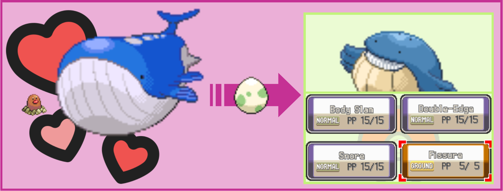

Egg moves are moves that can be learned by a Pokémon via breeding which are not moves that the hatched Pokémon would normally learn at level 1, moves that the hatched Pokémon could learn by level up, compatible moves that the male parent Pokémon learned from a TM.  

When breeding for moves, Egg Moves are the last priority to be override existing moves, so if a hatched Pokémon could learn an Egg Move, it will definitely be learned. When determining the moves of a child Pokémon, the following sequence is followed, where at each stage if there are no empty move slots, the move to be learned overrides the slot after the last move chosen in this way.

1. **Level 1** moves.
2. Moves that the child learns by **level up**, if both parents have them.
3. Any compatible **TM or HM moves** known by the father.
4. Any **Egg Moves** known by the father.

#### Definition  
These moves are specifically defined for every Pokémon species that can legally hatch from an egg. This point specifically, is important to note for any ROM hacks where species that cannot normally be hatched from an egg, have been changed to allow this.  

To illustrate this, here are a few examples:
- The game holds Egg Move data for Bulbasaur, but **does not** hold Egg Move data for Ivysaur or Venusaur.
- The game holds Egg Move data for Mantine, and **does** hold (*different*) Egg Move data for Mantyke.
- The game holds Egg Move data for Pichu, but **does not** hold Egg Move data for Pikachu or Raichu.
- The game holds no Egg Move data for Beldum, Metang or Metagross.

The data is continuous (when one species data ends the next begins, regardless of the quantity of Egg Moves) and arranged in the following way:  

    `## ## AA AA BB BB` ... `PP PP`  

Where:  
- `## ##` - is the Pokémon's index (National Pokedex ID) + 20,000 (e.g. Bulbasaur is 20,001 or `21 4E` in Little Endian hex).  
- `AA AA` - is the first Egg Move's move index (e.g. Light Screen is 113 or `71 00` in Little Endian hex).  
- `BB BB` - is the second Egg Move's move index.  
...  
- `PP PP` - is the last (up to sixteenth) Egg Move's move index.  

> **Some additional notes:**
> - Pokémon species who are hatched only when parents breed holding an Incense item (e.g. Mantyke) have different Egg Move data to the species that would hatch of the Incense was not used (e.g. Mantine).
> - There is a single "special" Egg move that is not defined in this data either: Pichu learning Volt Tackle if one of the parent Pikachu are holding a Light Ball.
> - The Egg Moves are not defined in any meaningful or consistent relative order for different species (e.g. Magical Leaf is defined earlier in the list than Ingrain for Bulbasaur, but later in the list for Bellsprout).
> - Each Pokémon species can have a maximum of 16 Egg Moves defined.

#### Location  

<table>
  <tr>
    <th>Game Version</th>
    <th>Location</th>
    <th>Offset(s)</th>
  </tr>
  <tr>
    <td>HeartGold/SoulSilver</td>
    <td>`/a/2/2/9`</td>
    <td>`0x0`</td>
  </tr>
  <tr>
    <td>Platinum</td>
    <td>`overlay_0005`</td>
    <td>`0x29222`</td>
  </tr>
  <tr>
    <td>Diamond/Pearl</td>
    <td>`overlay_0005`</td>
    <td>`0x20668`</td>
  </tr>
</table>

Because the data is held in its own NARC for HGSS, it is easily editable and expandable, however for Diamond, Pearl & Platinum versions this data is held within an overlay with no space for expansion in-situ.  

It is relatively straightforward to update/change existing entries, for example changing an Egg Move from 'x' move to 'y' move for a species. It is also simple to add new entries in HGSS, but the table would need re-pointing to add more (total) entries (without replacing existing data) in Diamond, Pearl or Platinum versions. Without re-pointing the table, entries could be added in these versions as long as the length of the total egg move data remained the same (i.e. removing other entries).

------------------------------

## Example Case Studies

This section contains a number of specific step-by-step instructions to achieve specific outcomes. This can be used exactly as-is to produce working results, but is intended to provide working examples of the various techniques and tutorials detailed above. Specifically how editing a move can involve many techniques to "seamlessly" complete.  

The majority of these tutorials are written using Pokémon Heartgold Version as the base ROM. The detailed sections above include all the information needed to adjust these for other Gerneration IV Pokémon games.

<details>
<summary>Two-turn > One-turn Move (**Razor Wind**)</summary>

In this case study, the move Razor Wind will be changed from a **two-turn move** to a **single-turn stat recoil** move: a mechanical clone of Leaf Storm.  

This will be completed in a Pokémon HeartGold Version ROM, and will comprise of three steps:
1. Edit the move effect and attributes/data
2. Edit the move description texts
3. Edit the move animation (so that the entire animation is seen on a single turn)

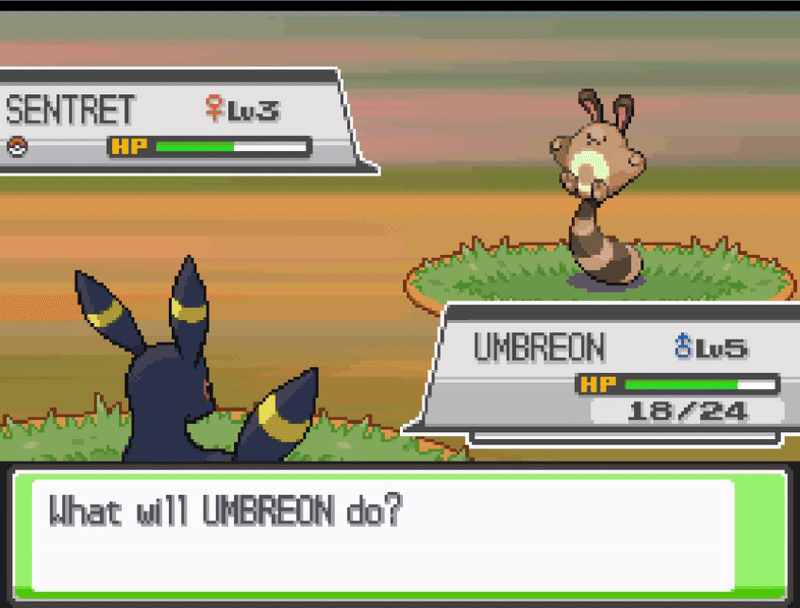

#### Step 1: Move Effect & Attributes
1. Open DSPRE & load the ROM
2. Open the `Move Data Editor` from the `Other Editors` toolbar option
3. Select the move `Leaf Storm` and make a note of the configuration:
    - Effect Sequence: `204`
    - Power: `120`
    - Accuracy: `100`
    - PP: `5`
    - Side Effect Probability: `100`
4. Select the move `Razor Wind` and update the configuration to include the above (and anything else desirable, in this example the type is also changed to Flying).
5. Click the `Save` button

#### Step 2: Move Description
1. Open the `Text Editor` from the main toolbar
2. Use the search function to find the move description, taking a small part of the text (as displayed in the Move Data Editor), e.g. "Blades of wind"
3. Update the message to include a more accurate description (while retaining appropriate line breaks), for example changing the vanilla: 
    - `A two-turn attack.\nBlades of wind hit the\nfoe on the second\nturn. It has a high\ncritical-hit ratio.` to something like:  
    - `Blades of wind hit\nthe foe. The attack’s\nrecoil sharply\nreduces the user’s\nSp. Atk stat.`  
4. Click the `Save Current Archive` button
5. Click the `Save ROM` button from the main toolbar to apply the changes to a `.nds` ROM file.

#### Step 3: Move Animation
1. Open WazaEffectEditor (for HGSS in this case)
2. Select the move Razor Wind.
3. Remove the initial `CheckTurn` command and `End` lines.
4. Remove the duplicated elements of the remaining two sections (each representing the animation on one turn)
    - Everything from `Init` to `Cmd_3c` and from `WaitAnim` to `End` are common across both elements, so the second set of these can be removed.
5. Merge the remaining elements as they should be animated:
    - Each `LoadAnim` commands should be retained in the order that exist in. In this case, the desired outcome is for the first animation to finish before the next starts, so teh `Wait` commands should be kept after each.
    - Insert the `PlaySound` from the first turn element just before the `WaitSound` and `Wait` from the second turn element.
    - Insert the `ApplyCmd` commands,
    - Discard the excess `Wait`
6. Click the `Save Current` button to save the Animation script.
7. Save the ROM from the File option on the toolbar.

The changes are now complete, and can be tested in-game. Below are examples of the changes in DSPRE & WazaEffectEditor.  

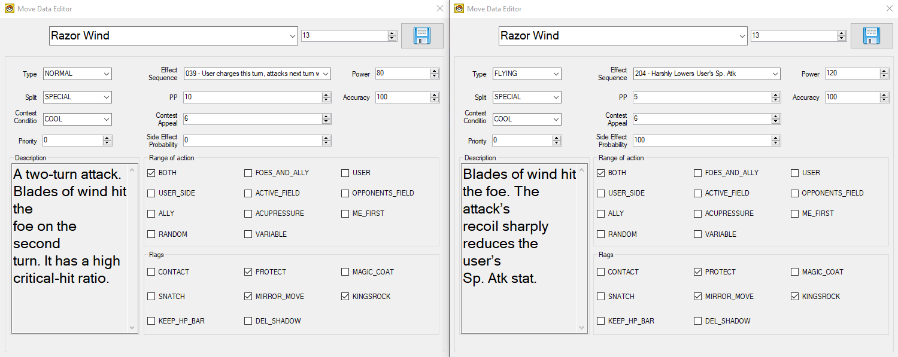

<details>
<summary>Razor Wind (WazaEffectEditor vanilla)</summary>
```
CheckTurn 0x3 0x3f
End
Init
Cmd_39 0x0
Cmd_39 0x1
Cmd_39 0x2
Cmd_39 0x3
Cmd_3a 0x4 0x0 0x0 0x0
Cmd_3a 0x5 0x0 0x1 0x1
Cmd_3a 0x6 0x0 0x2 0x2
Cmd_3a 0x7 0x0 0x3 0x3
ApplyCmd 0x4e 0x1 0x0
SetPlayAnim 0x0 0x2c 0x1
Cmd_3b
Cmd_3c 0x0
Cmd_3c 0x1
Cmd_3c 0x2
Cmd_3c 0x3
LoadAnim 0x0 0x1 0x3
Wait 0xa
PlaySound 0x72d 0xffffff8b
Wait 0xa
WaitAnim
Cmd_35 0x0
End
Init
Cmd_39 0x0
Cmd_39 0x1
Cmd_39 0x2
Cmd_39 0x3
Cmd_3a 0x4 0x0 0x0 0x0
Cmd_3a 0x5 0x0 0x1 0x1
Cmd_3a 0x6 0x0 0x2 0x2
Cmd_3a 0x7 0x0 0x3 0x3
ApplyCmd 0x4e 0x1 0x0
SetPlayAnim 0x0 0x2c 0x1
Cmd_3b
Cmd_3c 0x0
Cmd_3c 0x1
Cmd_3c 0x2
Cmd_3c 0x3
LoadAnim 0x0 0x0 0x14
WaitSound 0x73b 0x75 0x5
Wait 0xa
ApplyCmd 0x24 0x5 0x3 0x0 0x1 0x2 0x108
ApplyCmd 0x24 0x5 0x3 0x0 0x1 0x2 0x110
WaitAnim
Cmd_35 0x0
End
```  

</details>

<details>
<summary>Razor Wind (WazaEffectEditor custom one-turn)</summary>
```  
Init
Cmd_39 0x0
Cmd_39 0x1
Cmd_39 0x2
Cmd_39 0x3
Cmd_3a 0x4 0x0 0x0 0x0
Cmd_3a 0x5 0x0 0x1 0x1
Cmd_3a 0x6 0x0 0x2 0x2
Cmd_3a 0x7 0x0 0x3 0x3
ApplyCmd 0x4e 0x1 0x0
SetPlayAnim 0x0 0x2c 0x1
Cmd_3b
Cmd_3c 0x0
Cmd_3c 0x1
Cmd_3c 0x2
Cmd_3c 0x3
LoadAnim 0x0 0x1 0x3
Wait 0xa
LoadAnim 0x0 0x0 0x14
Wait 0xa
PlaySound 0x72d 0xffffff8b
WaitSound 0x73b 0x75 0x5
Wait 0xa
ApplyCmd 0x24 0x5 0x3 0x0 0x1 0x2 0x108
ApplyCmd 0x24 0x5 0x3 0x0 0x1 0x2 0x110
WaitAnim
Cmd_35 0x0
End
```
</details>

</details>

<details>
<summary>One-turn > Two-turn Move (**Solar Blade**)</summary>

In this case study, the move Leaf Blade will be changed from a **one-turn move** with high critical hit chance to a **two-turn sun-powered** move: a mechanical (but Physical) clone of Solar Beam. In this case the power, accuracy & PP of the move will be as-per Solar Beam, alternatively, the later generation values for these could be used.  

This will be completed in a Pokémon HeartGold Version ROM, and will comprise of four steps:
1. Edit the move effect and attributes/data
2. Edit the move description texts
3. Edit the move animation (so that the charging animation from Solar Beam is seen on turn one, and the Leaf Blade animation on turn two)
4. Edit the required Pokémon learnsets


#### Step 1: Move Effect & Attributes
1. Open DSPRE & load the ROM
2. Open the `Move Data Editor` from the `Other Editors` toolbar option
3. Select the move `Solar Beam` and make a note of the configuration:
    - Effect Sequence: `151`
    - Power: `120`
    - Accuracy: `100`
    - PP: `10`
    - Side Effect Probability: `0`
4. Select the move `Leaf Blade` and update the configuration to include the above (and anything else desirable).
5. Click the `Save` button

#### Step 2: Move Description
1. Open the `Text Editor` from the main toolbar
2. Use the search function to find the move description, taking a small part of the text (as displayed in the Move Data Editor), e.g. "a sharp leaf"
3. Update the message (`349`) to include a more accurate description (while retaining appropriate line breaks), for example changing the vanilla: 
    - `The foe is slashed\nwith a sharp leaf.\nIt has a high\ncritical-hit ratio.\n` to something like:  
    - `A two-turn attack.\nThe user gathers\nlight, then slashes\nthe foe on the\nsecond turn.`  
4. Click the `Save Current Archive` button
5. Click the `Save ROM` button from the main toolbar to apply the changes to a `.nds` ROM file.

#### Step 3: Move Animation
1. Open WazaEffectEditor (for HGSS in this case)
2. Select the move Solar Beam, and copy the initial and first-turn elements of the animation script (from `Init` to the **second** `End`).
3. Select the move Solar Blade (previously Leaf Blade), paste the copied script at the beginning of the existing Leaf Blade script.
4. Click the `Save Current` button to save the Animation script.
5. Save the ROM from the File option on the toolbar.

#### Step 4: Adjust Learnsets
In this example, the Pokémon which learn the move will remain as-per Leaf Blade, including any that may learn via methods such as Egg Moves. However, the levels that these Pokémon learn the move will be altered to reflect the new power level of the updated move.
1. Consult a [source material](https://bulbapedia.bulbagarden.net/wiki/Leaf_Blade_(move)#Learnset) to identify all Pokémon in the game which learn Leaf Blade by level up.
2. Open DSPRE & load the ROM (from the `.nds` file to ensure animation changes are included)
3. Decide which learnsets to adjust, in this example Grovyle & Sceptile's level up learnsets will be adjusted (and Victreelbel, Bellossom, Leafeon & Gallade will remain as-is).
4. Open the `Pokémon Editor` from the `Other Editors` toolbar option, switch to the `Learnset Editor` tab.
5. Select Grovyle and the move `Solar Blade` at level `29`, click **Edit**.
6. Enter a new level to be learned (e.g. `39`), click **Confirm**.
7. Click the **Save** button.
8. Repeat steps 5-7 for Sceptile.
9. Click the `Save ROM` button from the main toolbar to apply the changes to a `.nds` ROM file.

The changes are now complete, and can be tested in-game. Below are examples of the changes in DSPRE & WazaEffectEditor.  


<details>
<summary>Leaf Blade (WazaEffectEditor vanilla)</summary>
```
Init
Cmd_39 0x0
Cmd_39 0x1
Cmd_39 0x2
Cmd_39 0x3
Cmd_3a 0x4 0x0 0x0 0x0
Cmd_3a 0x5 0x0 0x1 0x1
Cmd_3a 0x6 0x0 0x2 0x2
Cmd_3a 0x7 0x0 0x3 0x3
ApplyCmd 0x4e 0x1 0x0
SetPlayAnim 0x0 0x16e 0x1
Cmd_3b
Cmd_3c 0x0
Cmd_3c 0x1
Cmd_3c 0x2
Cmd_3c 0x3
LoadAnim 0x0 0x2 0x4
LoadAnim 0x0 0x3 0x4
LoadAnim 0x0 0x4 0x4
LoadAnim 0x0 0x1 0x4
LoadAnim 0x0 0x0 0x4
RepeatSound 0x779 0x75 0x2 0x7
Wait 0x1e
ApplyCmd 0x24 0x5 0x2 0x0 0x1 0x2 0x108
Wait_Func
WaitAnim
Cmd_35 0x0
End
```  
</details>

<details>
<summary>Solar Beam (WazaEffectEditor vanilla)</summary>
```
Init
Cmd_39 0x0
Cmd_39 0x1
Cmd_39 0x2
Cmd_39 0x3
Cmd_3a 0x4 0x0 0x0 0x0
Cmd_3a 0x5 0x0 0x1 0x1
Cmd_3a 0x6 0x0 0x2 0x2
Cmd_3a 0x7 0x0 0x3 0x3
ApplyCmd 0x4e 0x1 0x0
SetPlayAnim 0x0 0x6b 0x1
Cmd_3b
Cmd_3c 0x0
Cmd_3c 0x1
Cmd_3c 0x2
Cmd_3c 0x3
CheckTurn 0x3 0x2d
End
ApplyCmd 0x21 0x5 0x0 0x1 0x0 0xc 0x0
Wait_Func
LoadAnim 0x0 0x13 0x3
Wait 0xa
PlaySound 0x841 0xffffff8b
Wait 0x14
ApplyCmd 0x22 0x6 0x2 0x0 0x2 0x33ff 0xa 0x0
WaitAnim
Cmd_35 0x0
Wait_Func
ApplyCmd 0x21 0x5 0x0 0x1 0xc 0x0 0x0
Wait_Func
End
ApplyCmd 0x21 0x5 0x0 0x1 0x0 0xc 0x0
Wait_Func
LoadAnim 0x0 0x0 0x3
LoadAnim 0x0 0x8 0x3
LoadAnim 0x0 0x9 0x3
Wait 0x5
SomethingSound 0x7a6 0xffffff8b 0x75 0x4 0x2
Wait 0xf
LoadAnim 0x0 0xa 0x4
LoadAnim 0x0 0xb 0x4
LoadAnim 0x0 0x1 0x4
Wait 0x5
ApplyCmd 0x22 0x6 0x8 0x0 0x2 0x33ff 0xe 0x0
ApplyCmd 0x24 0x5 0x4 0x0 0x1 0xc 0x108
WaitAnim
Cmd_35 0x0
ApplyCmd 0x21 0x5 0x0 0x1 0xc 0x0 0x0
Wait_Func
End
```  
</details>

<details>
<summary>Solar Blade (WazaEffectEditor custom two-turn)</summary>
```  
Init
Cmd_39 0x0
Cmd_39 0x1
Cmd_39 0x2
Cmd_39 0x3
Cmd_3a 0x4 0x0 0x0 0x0
Cmd_3a 0x5 0x0 0x1 0x1
Cmd_3a 0x6 0x0 0x2 0x2
Cmd_3a 0x7 0x0 0x3 0x3
ApplyCmd 0x4e 0x1 0x0
SetPlayAnim 0x0 0x6b 0x1
Cmd_3b
Cmd_3c 0x0
Cmd_3c 0x1
Cmd_3c 0x2
Cmd_3c 0x3
CheckTurn 0x3 0x2d
End
ApplyCmd 0x21 0x5 0x0 0x1 0x0 0xc 0x0
Wait_Func
LoadAnim 0x0 0x13 0x3
Wait 0xa
PlaySound 0x841 0xffffff8b
Wait 0x14
ApplyCmd 0x22 0x6 0x2 0x0 0x2 0x33ff 0xa 0x0
WaitAnim
Cmd_35 0x0
Wait_Func
ApplyCmd 0x21 0x5 0x0 0x1 0xc 0x0 0x0
Wait_Func
End
Init
Cmd_39 0x0
Cmd_39 0x1
Cmd_39 0x2
Cmd_39 0x3
Cmd_3a 0x4 0x0 0x0 0x0
Cmd_3a 0x5 0x0 0x1 0x1
Cmd_3a 0x6 0x0 0x2 0x2
Cmd_3a 0x7 0x0 0x3 0x3
ApplyCmd 0x4e 0x1 0x0
SetPlayAnim 0x0 0x16e 0x1
Cmd_3b
Cmd_3c 0x0
Cmd_3c 0x1
Cmd_3c 0x2
Cmd_3c 0x3
LoadAnim 0x0 0x2 0x4
LoadAnim 0x0 0x3 0x4
LoadAnim 0x0 0x4 0x4
LoadAnim 0x0 0x1 0x4
LoadAnim 0x0 0x0 0x4
RepeatSound 0x779 0x75 0x2 0x7
Wait 0x1e
ApplyCmd 0x24 0x5 0x2 0x0 0x1 0x2 0x108
Wait_Func
WaitAnim
Cmd_35 0x0
End
```
</details>

</details>

<details>
<summary>+2 Accuracy Status Move (**Sharp Eyes**)</summary>

In this case study, the move Mind Reader will be changed from a **guaranteed next turn hits** status move to a **increase accuracy by two stages** status move. Much of the move attributes and data will be aligned to similar status moves like Calm Mind, Agility etc. 

This will be completed in a Pokémon HeartGold Version ROM, and will comprise of five steps:
1. Fix unused stat change effect scripts
2. Edit the move effect and attributes/data
3. Edit the move description texts
4. Edit the move animation (copying the Glare animation)
5. Edit the required Pokémon learnsets

  

#### Step 1: Fix Unused Stat Stage Effects
1. Follow the steps [here](#broken-move-effect-scripts) to correct the "non-implemented" move effect scripts.

#### Step 2: Move Effect & Attributes
1. Open DSPRE & load the ROM
2. Open the `Move Data Editor` from the `Other Editors` toolbar option
3. Select the move `Mind Reader` and make the following configuration changes:
    - Effect Sequence: `055`
    - Type: `Dark`
    - Range: `USER`
    - PP: `30`
    - Contest Appeal: `11`
    - Flags: `SNATCH` `KEEP_HP_BAR`
5. Click the `Save` button

#### Step 3: Move Description
1. Open the `Text Editor` from the main toolbar
2. Use the search function to find the move description, taking a small part of the text (as displayed in the Move Data Editor), e.g. "foe's movements"
3. Update the message (`170`) to include a more accurate description (while retaining appropriate line breaks), for example changing the vanilla: 
    - `The user senses the\nfoe’s movements\nwith its mind to\nensure its next\nattack does not miss.` to something like:  
    - `The user’s predatory\neyesight focuses\non it’s targets.\nIt sharply boosts\nthe Accuracy stat.`  
4. Click the `Save Current Archive` button
5. Click the `Save ROM` button from the main toolbar to apply the changes to a `.nds` ROM file.

#### Step 4: Move Animation
1. Open WazaEffectEditor (for HGSS in this case)
2. Select the move Glare, and copy entire animation script.
3. Select the move Sharp Eyes (previously Mind Reader)
    - Delete everything after the final `Cmd_3c`.
    - Paste the copied script in place of the deleted elements.
4. Click the `Save Current` button to save the Animation script.
5. Save the ROM from the File option on the toolbar.

#### Step 5: Adjust Learnsets
In this example, the Pokémon which learn the move will be changed to limit the new move to some specific Pokémon, and Egg Move learnsets will also be adjusted.
1. Consult a [source material](https://bulbapedia.bulbagarden.net/wiki/Mind_Reader_(move)#Learnset) to identify all Pokémon in the game which learn Mind Reader by level up.

**Level-Up Learnset Changes**

2. Open DSPRE & load the ROM (from the `.nds` file to ensure animation changes are included)
3. Decide which new Pokémon will learn this move, and at what level, in this example we will add the move to the learnsets of some "predatory" Pokémon such as Sneasel, Spinarak, Kabuto, Hoothoot and their evolutions.
4. Open the `Pokémon Editor` from the `Other Editors` toolbar option, switch to the `Learnset Editor` tab.
5. Select Sneasel, choose the move `Sharp Eyes`, and enter the level it will be learned at.
6. Click **Add** and click the **Save** button.
7. Repeat steps 5-6 for any other Pokémon that will learn the new move.
8. Decide which Pokémon that did learn `Mind Reader`, which will no longer learn `Sharp Eyes`. In this example the move will be replaced with the effective `Mind Reader` clone: `Miracle Eye` (though they could also be removed from the learnset), we will perform this substitution for Meditite and Medicham.
9. Select Meditite and the move `Sharp Eyes` at level `18`, click **Edit**.
10. Enter a new move to be learned (e.g. `Miracle Eye`), click **Confirm**.
11. Click the **Save** button.
11. Repeat steps 9-11 for any other Pokémon that will learn `Miracle Eye` instead of `Sharp Eyes` the new move.
12. Click the `Save ROM` button from the main toolbar to apply the changes to a `.nds` ROM file.

**Egg Move Learnset Changes**

13. Decide which new Pokémon will learn `Sharp Eyes` as an Egg Move, and which that did learn `Mind Reader` will no longer. In this example Surskit will no longer learn `Sharp Eyes` via breeding (Egg Move), but `Eevee` will. This one-to-one swap could be accomplished on any Generation IV version.
14. Using DSPRE, unpack the egg move NARC `/a/2/2/9`, resulting in a single hex file (if following this example in Platinum or Diamond/Pearl, refer to [this section](#egg-moves) for the relevant Overlay & Offset to edit instead).
15. Using a hex editor such as HxD, open the file and find Surskit's data:
    - Surskit's National Dex ID + 20000 = `20283`, or `0x4F3B` in hex. This means that the hex string `3B 4F` is the marker for Surskit's data.
16. Find the bytes that relate to it being able to learn `Sharp Eyes`, which are very soon after Surskit's marker, and before the next Pokémon's marker (i.e. another very large hex number). The move ID is `170`, or `0xAA` in hex, this means that the hex string `AA 00` is the notation for this move compatibility.
17. Delete those bytes.
18. Now find Eevee's data:
    - Eevee's National Dex ID + 20000 = `20133`, or `0x4EA5` in hex. This means that the hex string `A5 4E` is the marker for Eevee's data.
19. Add the bytes required (`AA 00`) for move ID `170` anywhere after Eevee's marker, and before the next Pokémon's marker (i.e. another very large hex number). This could be immediately after the `A5 4E` bytes, as order does not matter in this list.
20. Save the file.
21. Move any backup files created by the hex editor out of the folder.
21. Using DSPRE, pack the egg move NARC from the edited folder, remove the `.narc` file extension and override the original NARC file with this updated one.
22. Open DSPRE & load the ROM from the contents folder.
23. Click the `Save ROM` button from the main toolbar to apply the changes to a `.nds` ROM file.

The changes are now complete, and can be tested in-game. Below are examples of the changes in DSPRE & WazaEffectEditor.  

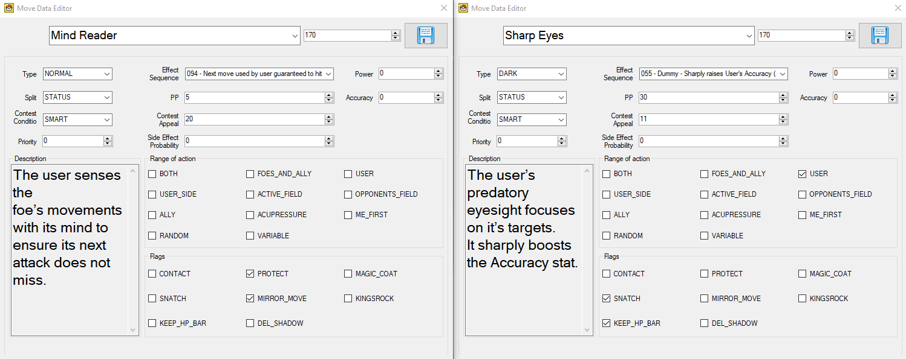

<details>
<summary>Glare (WazaEffectEditor vanilla)</summary>
```
ApplyCmd 0x21 0x5 0x0 0x1 0x0 0xc 0x0
Wait_Func
Cmd_49 0x0 0x1 0x1 0x1 0x1 0x1 0x0 0x0
Cmd_4a 0x0 0x6
Cmd_4b 0x0 0x6 0x1
Cmd_4c 0x0 0x6
Cmd_4d 0x0 0x6
Cmd_4e 0x0 0x7 0x6 0x6 0x6 0x6 0x0 0x0 0x0
Wait 0x8
PlaySound 0x78d 0x0
Wait_Func
Cmd_50 0x0
ApplyCmd 0x21 0x5 0x0 0x1 0xc 0x0 0x0
Wait_Func
End
```  
</details>

<details>
<summary>Sharp Eyes (WazaEffectEditor custom)</summary>
```
Init
Cmd_39 0x0
Cmd_39 0x1
Cmd_39 0x2
Cmd_39 0x3
Cmd_3a 0x4 0x0 0x0 0x0
Cmd_3a 0x5 0x0 0x1 0x1
Cmd_3a 0x6 0x0 0x2 0x2
Cmd_3a 0x7 0x0 0x3 0x3
ApplyCmd 0x4e 0x1 0x0
SetPlayAnim 0x0 0xbf 0x1
Cmd_3b
Cmd_3c 0x0
Cmd_3c 0x1
Cmd_3c 0x2
Cmd_3c 0x3
ApplyCmd 0x21 0x5 0x0 0x1 0x0 0xc 0x0
Wait_Func
Cmd_49 0x0 0x1 0x1 0x1 0x1 0x1 0x0 0x0
Cmd_4a 0x0 0x6
Cmd_4b 0x0 0x6 0x1
Cmd_4c 0x0 0x6
Cmd_4d 0x0 0x6
Cmd_4e 0x0 0x7 0x6 0x6 0x6 0x6 0x0 0x0 0x0
Wait 0x8
PlaySound 0x78a 0xffffff8b
WaitSound 0x78a 0xffffff8b 0x1e
WaitAnim
Cmd_35 0x0
ApplyCmd 0x21 0x5 0x0 0x1 0xc 0x0 0x0
Wait_Func
End
```  
</details>

</details>

<details>
<summary>Move with -1 Evasion Side Effect (**Constrict**)</summary>

In this case study, the move Constrict will be changed to have a guaranteed one stage drop to evasion, and an increase to base power to become a mechanical clone of Mud-Slap.

This will be completed in a Pokémon HeartGold Version ROM, and will comprise of three steps:
1. Fix unused stat change effect scripts
2. Edit the move effect and attributes/data
3. Edit the move description texts

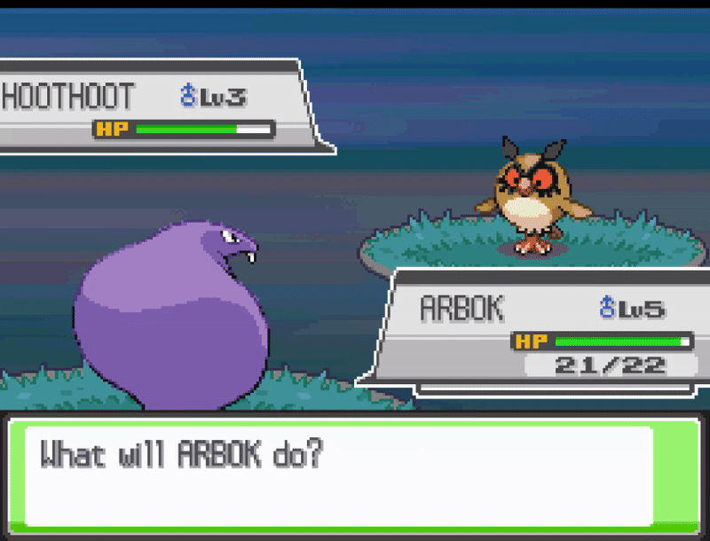  

#### Step 1: Fix Unused Stat Stage Effects
1. Follow the steps [here](#broken-move-effect-scripts) to correct the "non-implemented" move effect scripts.

#### Step 2: Move Effect & Attributes
1. Open DSPRE & load the ROM
2. Open the `Move Data Editor` from the `Other Editors` toolbar option
3. Select the move `Mind Reader` and make the following configuration changes:
    - Effect Sequence: `055`
    - Type: `Dark`
    - Range: `USER`
    - PP: `30`
    - Contest Appeal: `11`
    - Flags: `SNATCH` `KEEP_HP_BAR`
5. Click the `Save` button

#### Step 3: Move Description
1. Open the `Text Editor` from the main toolbar
2. Use the search function to find the move description, taking a small part of the text (as displayed in the Move Data Editor), e.g. "foe's movements"
3. Update the message (`132`) to include a more accurate description (while retaining appropriate line breaks), for example changing the vanilla: 
    - `The foe is attacked\nwith long, creeping\ntentacles or vines.\nIt may also lower the\ntarget’s Speed.` to something like:  
    - `The foe is attacked\nwith long tentacles,\nvines or threads\nwhich lower the\ntarget’s Evasion.`  
4. Click the `Save Current Archive` button
5. Click the `Save ROM` button from the main toolbar to apply the changes to a `.nds` ROM file.

The changes are now complete, and can be tested in-game. Below are examples of the changes in DSPRE.  

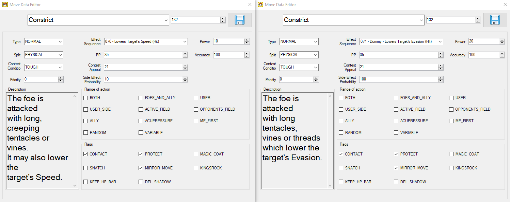

</details>

<details>
<summary>+1 Sp.Atk, Sp.Def & Spd Status Move (**Quiver Dance**)</summary>

In this case study, the move Dragon Dance will be replaced with Quiver Dance. The move attributes will be aligned to the later generation implementation. The same approach can be taken to replicate other moves which adjust three different stats (Coil, Hone Claws), and an extension of this can be used for moves which affect even more (such as Shell Smash).

This will be completed in a Pokémon HeartGold Version ROM, and will comprise of five steps:
1. Re-write the Dragon Dance sub-script
2. Edit the move effect and attributes/data
3. Edit the move description texts
4. Edit the move animation
5. Edit the required Pokémon learnsets

> Note: the alternate method to achieve this is described in Drayano's tutorial, [linked above](#backporting-stat-changing-moves).

  

#### Step 1: Re-write the Dragon Dance Sub-Script
1. Using DSPRE, unpack the move effect sub-scripts NARC `/a/0/0/1`.
2. Open file `152` in a hex editor such as HxD.
3. Delete the contents of the file and replace it with the below.

```
21 00 00 00 01 00 00 00 07 00 00 00 16 00 00 00 0C 00 00 00 0C 00 00 00 21 00 00 00 01 00 00 00 07 00 00 00 17 00 00 00 0C 00 00 00 06 00 00 00 21 00 00 00 00 00 00 00 07 00 00 00 15 00 00 00 0C 00 00 00 29 00 00 00 3C 00 00 00 4C 00 00 00 32 00 00 00 0A 00 00 00 06 00 00 00 00 00 20 00 32 00 00 00 0A 00 00 00 06 00 00 00 01 40 00 00 32 00 00 00 0A 00 00 00 3C 00 00 00 80 00 00 00 32 00 00 00 07 00 00 00 22 00 00 00 12 00 00 00 3C 00 00 00 0C 00 00 00 32 00 00 00 07 00 00 00 22 00 00 00 13 00 00 00 3C 00 00 00 0C 00 00 00 32 00 00 00 07 00 00 00 22 00 00 00 11 00 00 00 3C 00 00 00 0C 00 00 00 32 00 00 00 0B 00 00 00 3C 00 00 00 02 00 00 00 32 00 00 00 0B 00 00 00 3C 00 00 00 80 00 00 00 E0 00 00 00 11 00 00 00 0E 00 00 00 1E 00 00 00 1E 00 00 00 12 00 00 00 00 03 00 00 02 00 00 00 07 00 00 00 0E 00 00 00 1E 00 00 00 1E 00 00 00 32 00 00 00 0A 00 00 00 0A 00 00 00 00 00 00 80 E0 00 00 00
```

4. Save the file.
5. Move any backup files created by the hex editor out of the folder.
6. Using DSPRE, pack the move effect sub-scripts NARC from the edited folder, remove the `.narc` file extension and override the original NARC file with this updated one.
7. Open DSPRE & load the ROM from the contents folder.
8. Click the `Save ROM` button from the main toolbar to apply the changes to a `.nds` ROM file.

#### Step 2: Move Effect & Attributes
1. Open DSPRE & load the ROM
2. Open the `Move Data Editor` from the `Other Editors` toolbar option
3. Select the move `Dragon Dance` and make the following configuration changes:
    - Effect Sequence: `055`
    - Type: `Bug`
    - Contest Condition: `Beautiful`
    - Contest Appeal: `6`
5. Click the `Save` button

#### Step 3: Move Description
1. Open the `Text Editor` from the main toolbar
2. Use the search function to find the move description, taking a small part of the text (as displayed in the Move Data Editor), e.g. "foe's movements"
3. Update the message (`349`) to include a more accurate description (while retaining appropriate line breaks), for example changing the vanilla: 
    - `The user vigorously\nperforms a mystic,\npowerful dance that\nboosts its Attack and\nSpeed stats.` to something like:  
    - `The user lightly\nperforms a mystic,\nbeautiful dance that\nboosts its Sp. Atk,\nSp. Def, & Speed stats.`  
4. Click the `Save Current Archive` button
5. Click the `Save ROM` button from the main toolbar to apply the changes to a `.nds` ROM file.

#### Step 4: Move Animation
For the move animation, elements of Lunar Dance, Petal Dance & Thrash will be combined.
1. Open WazaEffectEditor (for HGSS in this case)
2. Select the move Lunar Dance, and copy the animation script from the first `Init` (after the `CheckTurn`) all the way to the next `End` (lines 4-75).
3. Select the move Quiver Dance (previously Dragon Dance), and replace the entire animation script with the script elements copied in the previous step.
4. Delete the elements that set the background:
    - Delete the `ChangeBackG 0x2a 0x20001` and `WaitBack2` elements (setting the special background).
    - Delete the `BackBackG 0x2a 0x40001` and `WaitBack2` elements (restoring the normal background).
5. Click the `Save Current` button to save the Animation script.
6. Select the move Petal Dance, and copy the second `PlaySound` line (`PlaySound 0x7aa 0x75`), which is responsible for the sound played when Petal Dance hits the opponent. This will be the sound played when Quiver Dance is used.
7. Select the move Quiver Dance (previously Dragon Dance), and locate the `PlaySound` line (`PlaySound 0x836 0xffffff8b`). Replace this with the copied element.
8. Click the `Save Current` button to save the Animation script.
9. Select the move Thrash, and copy the elements that relate to the user's sprite movement (lines starting `ApplyCmd 0x3c...` and `ApplyCmd 0x24...`).
10. Select the move Quiver Dance (previously Dragon Dance), add a new line between `Cmd_3a 0x2 0x0 0x1 0x1` and `Wait 0x1`, then:
    - Paste the two copied lines.
    - Add a new line with `Wait 0x3`.
    - Add a new line with `Wait_Func`.
    - Paste the two copied lines.
11. Click the `Save Current` button to save the Animation script.
12. Save the ROM from the File option on the toolbar.

#### Step 5: Adjust Learnsets
In this example, the Pokémon which learn the move will be changed completely, and some new Pokémon will be able to learn this move by breeding.
1. Consult a [source material](https://bulbapedia.bulbagarden.net/wiki/Dragon_Dance_(move)#Learnset) to identify all Pokémon in the game which learn Dragon Dance.

**Level-Up Learnset Changes**

2. Open DSPRE & load the ROM (from the `.nds` file to ensure animation changes are included)
3. Decide which new Pokémon will learn this move, and at what level, in this example we will add the move to the learnsets of some Bug & Grass type Pokémon such as Butterfree and Bellossom. The targets *could* be chosen by reviewing Generation V learnsets and aligning.
4. Open the `Pokémon Editor` from the `Other Editors` toolbar option, switch to the `Learnset Editor` tab.
5. Select Butterfree, choose the move `Quiver Dance`, and enter the level it will be learned at.
6. Click **Add** and click the **Save** button.
7. Repeat steps 5-6 for any other Pokémon that will learn the new move.
8. Decide which Pokémon that did learn `Dragon Dance`, which will no longer learn `Quiver Dance`. In this example the move will be deleted entirely from their learnset, this will be done for Horsea, Dratini and their evolutions, Altaria, Tropius, Latios and Rayquaza.
9. Select Horsea and the move `Quiver Dance` at level `45`, click **Delete**.
10. Click the **Save** button.
11. Repeat steps 9-10 for any other Pokémon that will no longer learn `Quiver Dance`.
12. Click the `Save ROM` button from the main toolbar to apply the changes to a `.nds` ROM file.

**Egg Move Learnset Changes**

13. Decide which new Pokémon will learn `Quiver Dance` as an Egg Move. In this example Smoochum, Zigzagoon, Lotad, Luvdisc and Cherubi will be made compatible with Quiver Dance as an Egg Move. This is an addition of a move, only possible in HGSS. To accomplish this with DDPt, another Egg Move would need removing from anywhere else in the Egg Move data to ensure the data remained at exact same size overall.
14. Using DSPRE, unpack the egg move NARC `/a/2/2/9`, resulting in a single hex file (if following this example in Platinum or Diamond/Pearl, refer to [this section](#egg-moves) for the relevant Overlay & Offset to edit instead).
15. Using a hex editor such as HxD, open the file and find Smoochum's data:
    - Smoochum's National Dex ID + 20000 = `20239`, or `0x4F0F` in hex. This means that the hex string `0F 4F` is the marker for Smoochum's data.
16. Add the bytes required (`84 00`) for move ID `132` (or `0x84` in hex) anywhere after Smoochum's marker, and before the next Pokémon's marker (i.e. another very large hex number). This could be immediately after the `0F 4F` bytes, as order does not matter in this list.
17. Repeat steps 15 and 16 for any other Pokémon that will learn Quiver Dance by breeding (Egg Move).
18. Save the file.
19. Move any backup files created by the hex editor out of the folder.
20. Using DSPRE, pack the egg move NARC from the edited folder, remove the `.narc` file extension and override the original NARC file with this updated one.
21. Open DSPRE & load the ROM from the contents folder.
22. Click the `Save ROM` button from the main toolbar to apply the changes to a `.nds` ROM file.

The changes are now complete, and can be tested in-game. Below are examples of the changes in DSPRE & WazaEffectEditor.  

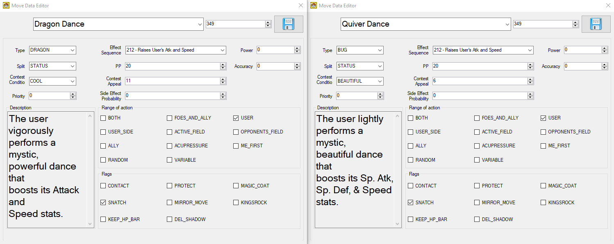  

<details>
<summary>Lunar Dance (WazaEffectEditor vanilla)</summary>
```
CheckTurn 0x3 0xed
End
Init
Cmd_39 0x0
Cmd_39 0x1
Cmd_39 0x2
Cmd_39 0x3
Cmd_3a 0x4 0x0 0x0 0x0
Cmd_3a 0x5 0x0 0x1 0x1
Cmd_3a 0x6 0x0 0x2 0x2
Cmd_3a 0x7 0x0 0x3 0x3
ApplyCmd 0x4e 0x1 0x0
SetPlayAnim 0x0 0x1df 0x1
Cmd_3b
Cmd_3c 0x0
Cmd_3c 0x1
Cmd_3c 0x2
Cmd_3c 0x3
Init
Cmd_39 0x0
Cmd_39 0x1
Cmd_39 0x2
Cmd_39 0x3
Cmd_3a 0x4 0x0 0x0 0x0
Cmd_3a 0x5 0x0 0x1 0x1
Cmd_3a 0x6 0x0 0x2 0x2
Cmd_3a 0x7 0x0 0x3 0x3
ApplyCmd 0x4e 0x1 0x0
SetPlayAnim 0x1 0x1df 0x1
Cmd_3b
Cmd_3c 0x0
Cmd_3c 0x1
Cmd_3c 0x2
Cmd_3c 0x3
Cmd_c 0x4 0x0
Cmd_c 0x0 0x0
Cmd_c 0x1 0x1
ChangeBackG 0x2a 0x20001
WaitBack2
Init
Cmd_39 0x0
Cmd_39 0x1
Cmd_3a 0x0 0x0 0x0 0x0
Cmd_3a 0x2 0x0 0x1 0x1
Wait 0x1
ApplyCmd 0x4b 0x5 0x0 0x51 0x3 0x0 0x0
ApplyCmd 0x4b 0x5 0x1 0x50 0x3 0x0 0x2
Wait 0x1
PlaySound 0x836 0xffffff8b
LoadAnim 0x0 0x3 0x3
LoadAnim 0x0 0x0 0x3
LoadAnim 0x1 0x1 0x11
Cmd_37 0x6 0x0 0x1 0x5 0x0 0x0 0x0
Cmd_37 0x4 0x1 0x0 0xfffff948 0x0
LoadAnim 0x1 0x2 0x11
Cmd_37 0x6 0x0 0x1 0x5 0x0 0x0 0x0
Cmd_37 0x4 0x1 0x0 0xfffff948 0x0
ApplyCmd 0x3f 0x6 0x2 0x0 0x1 0x0 0xa 0x33ff
Wait 0x14
ApplyCmd 0x3f 0x6 0x2 0x0 0x1 0xa 0x0 0x33ff
WaitAnim
Cmd_35 0x0
Cmd_35 0x1
Wait_Func
Cmd_3c 0x0
Cmd_3c 0x1
Cmd_3b
Cmd_c 0x4 0x0
Cmd_c 0x0 0x0
Cmd_c 0x1 0x1
Cmd_c 0x4 0x1
BackBackG 0x2a 0x40001
WaitBack2
End
Cmd_c 0x4 0x0
Cmd_c 0x0 0x0
Cmd_c 0x1 0x1
ChangeBackG 0x2a 0x20001
WaitBack2
Init
Cmd_39 0x0
Cmd_39 0x1
Cmd_39 0x2
Cmd_39 0x3
Cmd_3a 0x4 0x0 0x0 0x0
Cmd_3a 0x5 0x0 0x1 0x1
Cmd_3a 0x6 0x0 0x2 0x2
Cmd_3a 0x7 0x0 0x3 0x3
ApplyCmd 0x4e 0x1 0x0
SetPlayAnim 0x0 0x1df 0x1
Cmd_3b
Cmd_3c 0x0
Cmd_3c 0x1
Cmd_3c 0x2
Cmd_3c 0x3
Init
Cmd_39 0x0
Cmd_39 0x1
Cmd_39 0x2
Cmd_39 0x3
Cmd_3a 0x4 0x0 0x0 0x0
Cmd_3a 0x5 0x0 0x1 0x1
Cmd_3a 0x6 0x0 0x2 0x2
Cmd_3a 0x7 0x0 0x3 0x3
ApplyCmd 0x4e 0x1 0x0
SetPlayAnim 0x1 0x1df 0x1
Cmd_3b
Cmd_3c 0x0
Cmd_3c 0x1
Cmd_3c 0x2
Cmd_3c 0x3
PlaySound 0x836 0xffffff8b
LoadAnim 0x0 0x3 0x3
LoadAnim 0x0 0x0 0x3
Wait 0x14
ApplyCmd 0x22 0x6 0x2 0x0 0x1 0x7fff 0xa 0x0
Wait_Func
WaitAnim
Cmd_35 0x0
Cmd_35 0x1
Cmd_c 0x4 0x0
Cmd_c 0x0 0x0
Cmd_c 0x1 0x1
Cmd_c 0x4 0x1
BackBackG 0x2a 0x40001
WaitBack2
End
```
</details>

<details>
<summary>Quiver Dance (WazaEffectEditor custom)</summary>
```
Init
Cmd_39 0x0
Cmd_39 0x1
Cmd_39 0x2
Cmd_39 0x3
Cmd_3a 0x4 0x0 0x0 0x0
Cmd_3a 0x5 0x0 0x1 0x1
Cmd_3a 0x6 0x0 0x2 0x2
Cmd_3a 0x7 0x0 0x3 0x3
ApplyCmd 0x4e 0x1 0x0
SetPlayAnim 0x0 0x1df 0x1
Cmd_3b
Cmd_3c 0x0
Cmd_3c 0x1
Cmd_3c 0x2
Cmd_3c 0x3
Init
Cmd_39 0x0
Cmd_39 0x1
Cmd_39 0x2
Cmd_39 0x3
Cmd_3a 0x4 0x0 0x0 0x0
Cmd_3a 0x5 0x0 0x1 0x1
Cmd_3a 0x6 0x0 0x2 0x2
Cmd_3a 0x7 0x0 0x3 0x3
ApplyCmd 0x4e 0x1 0x0
SetPlayAnim 0x1 0x1df 0x1
Cmd_3b
Cmd_3c 0x0
Cmd_3c 0x1
Cmd_3c 0x2
Cmd_3c 0x3
Cmd_c 0x4 0x0
Cmd_c 0x0 0x0
Cmd_c 0x1 0x1
Init
Cmd_39 0x0
Cmd_39 0x1
Cmd_3a 0x0 0x0 0x0 0x0
Cmd_3a 0x2 0x0 0x1 0x1
ApplyCmd 0x3c 0x3 0x2 0x1 0xc
ApplyCmd 0x24 0x5 0x4 0x0 0x1 0x4 0x108
Wait 0x3
Wait_Func
ApplyCmd 0x3c 0x3 0x2 0x1 0xc
ApplyCmd 0x24 0x5 0x4 0x0 0x1 0x4 0x108
Wait 0x1
ApplyCmd 0x4b 0x5 0x0 0x51 0x3 0x0 0x0
ApplyCmd 0x4b 0x5 0x1 0x50 0x3 0x0 0x2
Wait 0x1
PlaySound 0x7aa 0x75
LoadAnim 0x0 0x3 0x3
LoadAnim 0x0 0x0 0x3
LoadAnim 0x1 0x1 0x11
Cmd_37 0x6 0x0 0x1 0x5 0x0 0x0 0x0
Cmd_37 0x4 0x1 0x0 0xfffff948 0x0
LoadAnim 0x1 0x2 0x11
Cmd_37 0x6 0x0 0x1 0x5 0x0 0x0 0x0
Cmd_37 0x4 0x1 0x0 0xfffff948 0x0
ApplyCmd 0x3f 0x6 0x2 0x0 0x1 0x0 0xa 0x33ff
Wait 0x14
ApplyCmd 0x3f 0x6 0x2 0x0 0x1 0xa 0x0 0x33ff
WaitAnim
Cmd_35 0x0
Cmd_35 0x1
Wait_Func
Cmd_3c 0x0
Cmd_3c 0x1
Cmd_3b
Cmd_c 0x4 0x0
Cmd_c 0x0 0x0
Cmd_c 0x1 0x1
Cmd_c 0x4 0x1
End
```
</details>

</details>

<details>
<summary>Sound-based Move (**Snarl**)</summary>

In this case study, the move Barrage will be replaced with the sound-based move from Generation V Pokémon games: Snarl. The attributes of the move will be as they are in Generation V, the animation will be a custom animation using components of other animations (Giga Impact & Howl).  

This will be completed in a Pokémon HeartGold Version ROM, and will comprise of four steps:
1. Edit the move effect and attributes/data
2. Edit the move description texts
3. Edit the move animation (so that the charging animation from Solar Beam is seen on turn one, and the Leaf Blade animation on turn two)
4. Edit the required Pokémon learnsets

 

#### Step 1: Move Effect & Attributes
1. Open DSPRE & load the ROM
2. Open the `Move Data Editor` from the `Other Editors` toolbar option
3. Select the move `Barrage` and update the configuration to:
    - Type: `DARK`
    - Split: `SPECIAL`
    - Effect Sequence: `71`
    - PP: `15`
    - Power: `55`
    - Accuracy: `95`
    - Range: `BOTH`
5. Click the `Save` button

#### Step 2: Move Description
1. Open the `Text Editor` from the main toolbar
2. Use the search function to find the move description, taking a small part of the text (as displayed in the Move Data Editor), e.g. "Round objects"
3. Update the message (`140`) to include a more accurate description (while retaining appropriate line breaks), for example changing the vanilla: 
    - `Round objects are\nhurled at the foe to\nstrike two to five\ntimes in a row.\n` to something like:  
    - `The user attacks\nwith an aggressive\ngrowl, lowering the\nSp. Atk of the foes.`  
4. Click the `Save Current Archive` button
5. Click the `Save ROM` button from the main toolbar to apply the changes to a `.nds` ROM file.

#### Step 3: Move Animation
1. Open WazaEffectEditor (for HGSS in this case)
2. Select the move Howl, and copy the animation script.
3. Select the move Snarl (previously Barrage), delete the entire script and paste the copied script in it's place.
4. Click the `Save Current` button to save the Animation script.
5. Select the move Giga Impact, and copy the elements of the animation script that relate to the background animation:

```
Cmd_43
Cmd_c 0x7 0x1
ChangeBackG 0x5 0x800001
```

```
Cmd_43
Cmd_c 0x7 0x1
BackBackG 0x5 0x1000001
WaitBack2
```

6. Select the move Snarl (previously Barrage), and paste the background animation into the script in the same relative position as they were in the Giga Impact animation script:
    - First element: immediately after `Cmd_3c 0x3`
    - Second element: immediately before `End`
7. Click the `Save Current` button to save the Animation script.
8. Save the ROM from the File option on the toolbar.

#### Step 4: Adjust Learnsets
In this example, the Pokémon which learn the move will be changed completely, and some new Pokémon will be able to learn this move by breeding.
1. Consult a [source material](https://bulbapedia.bulbagarden.net/wiki/Barrage_(move)#Learnset) to identify all Pokémon in the game which learn Barrage.

**Level-Up Learnset Changes**

2. Open DSPRE & load the ROM (from the `.nds` file to ensure animation changes are included)
3. Decide which new Pokémon will learn this move, and at what level, in this example we will add the move to the learnsets of some "canine" Pokémon such as Houndour, Vulpix, Poochyena and their evolutions. The targets *could* be chosen by reviewing Generation V learnsets.
4. Open the `Pokémon Editor` from the `Other Editors` toolbar option, switch to the `Learnset Editor` tab.
5. Select Houndour, choose the move `Snarl`, and enter the level it will be learned at.
6. Click **Add** and click the **Save** button.
7. Repeat steps 5-6 for any other Pokémon that will learn the new move.
8. Decide which Pokémon that did learn `Barrage`, which will no longer learn `Snarl`. In this example the move will be deleted entirely from their learnset, this will be done for Exeggcute and Exeggutor.
9. Select Exeggcute and the move `Snarl` at level `1`, click **Delete**.
10. Click the **Save** button.
11. Repeat steps 9-10 for any other Pokémon that will no longer learn `Snarl` (Exeggutor).
12. Click the `Save ROM` button from the main toolbar to apply the changes to a `.nds` ROM file.

**Egg Move Learnset Changes**

13. Decide which new Pokémon will learn `Snarl` as an Egg Move. In this example Growlithe will be made compatible with Snarl as an Egg Move. This is an addition of a move, only possible in HGSS. To accomplish this with DDPt, another Egg Move would need removing from anywhere else in the Egg Move data to ensure the data remained at exact same size overall.
14. Using DSPRE, unpack the egg move NARC `/a/2/2/9`, resulting in a single hex file (if following this example in Platinum or Diamond/Pearl, refer to [this section](#egg-moves) for the relevant Overlay & Offset to edit instead).
15. Using a hex editor such as HxD, open the file and find Growlithe's data:
    - Growlithe's National Dex ID + 20000 = `20058`, or `0x4E5A` in hex. This means that the hex string `5A 4E` is the marker for Growlithe's data.
16. Add the bytes required (`8C 00`) for move ID `140` (or `0x8C` in hex) anywhere after Growlithe's marker, and before the next Pokémon's marker (i.e. another very large hex number). This could be immediately after the `5A 4E` bytes, as order does not matter in this list.
17. Save the file.
18. Move any backup files created by the hex editor out of the folder.
19. Using DSPRE, pack the egg move NARC from the edited folder, remove the `.narc` file extension and override the original NARC file with this updated one.
20. Open DSPRE & load the ROM from the contents folder.
21. Click the `Save ROM` button from the main toolbar to apply the changes to a `.nds` ROM file.

The changes are now complete, and can be tested in-game. Below are examples of the changes in DSPRE & WazaEffectEditor.  

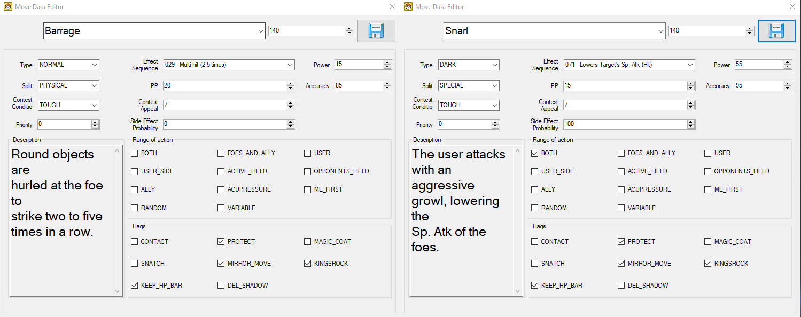

<details>
<summary>Howl (WazaEffectEditor vanilla)</summary>
```
Init
Cmd_39 0x0
Cmd_39 0x1
Cmd_39 0x2
Cmd_39 0x3
Cmd_3a 0x4 0x0 0x0 0x0
Cmd_3a 0x5 0x0 0x1 0x1
Cmd_3a 0x6 0x0 0x2 0x2
Cmd_3a 0x7 0x0 0x3 0x3
ApplyCmd 0x4e 0x1 0x0
SetPlayAnim 0x0 0x162 0x1
Cmd_3b
Cmd_3c 0x0
Cmd_3c 0x1
Cmd_3c 0x2
Cmd_3c 0x3
PlayCry 0x3 0xffffff8b 0x7f
ApplyCmd 0x2a 0x8 0x102 0x64 0x50 0x64 0x96 0x64 0x140001 0x60006
LoadAnim 0x0 0x1 0x11
Cmd_37 0x6 0x0 0x2 0x6 0x1 0x0 0x0
Wait 0x5
LoadAnim 0x0 0x0 0x11
Cmd_37 0x6 0x0 0x2 0x1 0x0 0x0 0x0
StopCry 0x0
Wait 0x2
Wait_Func
WaitAnim
Cmd_35 0x0
End
```  
</details>

<details>
<summary>Giga Impact (WazaEffectEditor vanilla)</summary>
```
Init
Cmd_39 0x0
Cmd_39 0x1
Cmd_39 0x2
Cmd_39 0x3
Cmd_3a 0x4 0x0 0x0 0x0
Cmd_3a 0x5 0x0 0x1 0x1
Cmd_3a 0x6 0x0 0x2 0x2
Cmd_3a 0x7 0x0 0x3 0x3
ApplyCmd 0x4e 0x1 0x0
SetPlayAnim 0x0 0x1b2 0x1
Cmd_3b
Cmd_3c 0x0
Cmd_3c 0x1
Cmd_3c 0x2
Cmd_3c 0x3
PlaySound 0x736 0xffffff8b
ApplyCmd 0x39 0x4 0x4 0xfffffff0 0x8 0x102
Wait_Func
Wait 0xf
Cmd_43
Cmd_c 0x7 0x1
ChangeBackG 0x5 0x800001
PlaySound 0x737 0xffffff8b
ApplyCmd 0x39 0x4 0x4 0x20 0xfffffff0 0x102
Wait_Func
LoadAnim 0x0 0x4 0x11
Cmd_37 0x6 0x0 0x2 0x2 0x0 0x0 0x0
LoadAnim 0x0 0x2 0x11
Cmd_37 0x6 0x0 0x2 0x2 0x0 0x0 0x0
LoadAnim 0x0 0x3 0x11
Cmd_37 0x6 0x0 0x2 0x2 0x0 0x0 0x0
LoadAnim 0x0 0x0 0x11
Cmd_37 0x6 0x0 0x2 0x2 0x0 0x0 0x0
LoadAnim 0x0 0x1 0x11
Cmd_37 0x6 0x0 0x2 0x2 0x0 0x0 0x0
ApplyCmd 0x39 0x4 0x4 0xfffffff0 0x8 0x102
Wait 0xa
PlaySound 0x743 0x75
ApplyCmd 0x24 0x5 0x4 0x0 0x1 0x2 0x108
ApplyCmd 0x44 0x5 0x0 0x5 0x0 0x5 0x0
Wait_Func
WaitAnim
Cmd_35 0x0
Cmd_43
Cmd_c 0x7 0x1
BackBackG 0x5 0x1000001
WaitBack2
End
```  
</details>

<details>
<summary>Snarl (WazaEffectEditor custom)</summary>
```
Init
Cmd_39 0x0
Cmd_39 0x1
Cmd_39 0x2
Cmd_39 0x3
Cmd_3a 0x4 0x0 0x0 0x0
Cmd_3a 0x5 0x0 0x1 0x1
Cmd_3a 0x6 0x0 0x2 0x2
Cmd_3a 0x7 0x0 0x3 0x3
ApplyCmd 0x4e 0x1 0x0
SetPlayAnim 0x0 0x162 0x1
Cmd_3b
Cmd_3c 0x0
Cmd_3c 0x1
Cmd_3c 0x2
Cmd_3c 0x3
Cmd_43
Cmd_c 0x7 0x1
ChangeBackG 0x5 0x800001
PlayCry 0x3 0xffffff8b 0x7f
ApplyCmd 0x2a 0x8 0x102 0x64 0x50 0x64 0x96 0x64 0x140001 0x60006
LoadAnim 0x0 0x1 0x11
Cmd_37 0x6 0x0 0x2 0x6 0x1 0x0 0x0
Wait 0x5
LoadAnim 0x0 0x0 0x11
StopCry 0x0
Wait 0x2
Wait_Func
WaitAnim
Cmd_35 0x0
Cmd_43
Cmd_c 0x7 0x1
BackBackG 0x5 0x1000001
WaitBack2
End
```  
</details>

</details>

<details>
<summary>Punching Move (**Rock Smash**)</summary>

In this example, **Rock Smash** will become a punching move in HeartGold Version, and thus recieve the Iron Fist damage boost when used.  

To accomodate this without re-pointing the relevant table, the move **Comet Punch** will be removed from the punching move category, and removed from the learnsets of all Pokémon (this is a low-distribution move which is only learned by level up, and not TM, Tutor or Egg Move in Generation IV).

1. Open DSPRE & load the ROM.
2. Open the `Overlay Editor` from the `Other Editors` toolbar option.
3. [Decompress and mark as decompressed](/docs/universal/guides/hex_editing/#hgss-specifically) `Overlay_0012`.
4. Using a hex editor such as HxD, open the decompressed `overlay_0012` file and go to Offset `0x352FE`.
5. Identify the bytes that represent **Comet Punch** (Move ID: `4`): `04 00`, which are within the list of fifteen moves (30 bytes).
6. Replace these with the bytes that represent **Rock Smash** (Move ID: `249`): `F9 00`.
7. Save the overlay and move any backup (e.g. `.bak`) files out of the folder.
8. Open DSPRE & load the ROM from the contents folder.
9. Click the `Save ROM` button from the main toolbar to apply the changes to a `.nds` ROM file.
</details>

<details>
<summary>Trapping Move (**Twister**)</summary>

In this case study, the move Twister will be changed from a damage-dealing move (with it's own special effects, such as chance to flinch and dealing double-damage to targets in the semi-invulnerable turns of Fly & Bounce), to a Dragon-type variant of Fire Spin in Pokémon HeartGold Version. The standard animation of Twister will be used, and applied both as the move is used, and as the end of turn damage is applied. No learnset changes will be made in this case study.  

This will be completed in a Pokémon HeartGold Version ROM, and will comprise of four steps:
1. Edit the move effect and attributes/data
2. Edit the move description texts
3. Set up the end of turn trapping animation
4. Set up the initial trapping texts

  

#### Step 1: Move Effect & Attributes
1. Open DSPRE & load the ROM
2. Open the `Move Data Editor` from the `Other Editors` toolbar option
3. Select the move `Twister` and update the configuration to:
    - Effect Sequence: `042`
    - Side Effect Probability: `0`
    - Range: no checkboxes selected (normal range)
    - Other elements such as power, accuracy, contest data & priority are not edited in this example (but could be).
4. Click the `Save` button

#### Step 2: Move Description
1. Open the `Text Editor` from the main toolbar
2. Use the search function to find the move description, taking a small part of the text (as displayed in the Move Data Editor), e.g. "Round objects"
3. Update the message (`239`) to include a more accurate description (while retaining appropriate line breaks), for example changing the vanilla: 
    - `The user whips up a\nvicious tornado to\ntear at the foe.\nIt may also make the\nfoe flinch.` to something like:  
    - `The user traps the\nfoe inside a vicious\ntornado for two to\nfive turns.`  
4. Click the `Save Current Archive` button
5. Click the `Save ROM` button from the main toolbar to apply the changes to a `.nds` ROM file.

#### Step 3: End of Turn Trapping Animation
1. Unpack the `/a/0/1/0` NARC (using the [DSPRE "Unpack NARC to Folder" function](/docs/universal/guides/unpacking_narcs/#dspre)).
2. Locate the animation for Twister (file `239`) and copy the whole animation file contents.
3. Unpack the `/a/0/6/1` NARC (using the DSPRE "Unpack NARC to Folder" function).
4. Add a new file at the end (file `50`), this will contain the new trapping animation.
5. Paste in the content copied in step 2, save the file.
6. Move any backup (e.g. `.bak`) files out of the folder.
7. Pack the modified `/a/0/6/1` NARC back up (using the DSPRE ["Build NARC from folder"](/docs/universal/guides/unpacking_narcs/#dspre) function).
8. Replace the NARC in the ROM's extracted contents folder.
9. Unpack the `/a/0/0/1` NARC (using the DSPRE "Unpack NARC to Folder" function).
10. Replace the contents of file `059` with the below, and save the file.
11. Move any backup (e.g. `.bak`) files out of the folder.
12. Pack the modified `/a/0/0/1` NARC back up (using the DSPRE "Build NARC from folder").

```
37 00 00 00 00 00 00 00 FF 00 00 00 62 00 00 00 58 00 00 00 20 00 00 00 00 00 00 00 23 00 00 00 23 00 00 00 23 00 00 00 20 00 00 00 00 00 00 00 23 00 00 00 53 00 00 00 23 00 00 00 20 00 00 00 00 00 00 00 23 00 00 00 CF 01 00 00 23 00 00 00 20 00 00 00 00 00 00 00 23 00 00 00 80 00 00 00 23 00 00 00 20 00 00 00 00 00 00 00 23 00 00 00 FA 00 00 00 23 00 00 00 20 00 00 00 00 00 00 00 23 00 00 00 48 01 00 00 23 00 00 00 20 00 00 00 00 00 00 00 23 00 00 00 EF 00 00 00 23 00 00 00 45 00 00 00 FF 00 00 00 21 00 00 00 3B 00 00 00 21 00 00 00 45 00 00 00 FF 00 00 00 22 00 00 00 3B 00 00 00 1C 00 00 00 45 00 00 00 FF 00 00 00 23 00 00 00 3B 00 00 00 17 00 00 00 45 00 00 00 FF 00 00 00 24 00 00 00 3B 00 00 00 12 00 00 00 45 00 00 00 FF 00 00 00 25 00 00 00 3B 00 00 00 0D 00 00 00 45 00 00 00 FF 00 00 00 26 00 00 00 3B 00 00 00 08 00 00 00 45 00 00 00 FF 00 00 00 27 00 00 00 3B 00 00 00 03 00 00 00 45 00 00 00 FF 00 00 00 32 00 00 00 0E 00 00 00 12 00 00 00 06 01 00 00 0A 00 00 00 FF 00 00 00 FF 00 00 00 0E 00 00 00 1E 00 00 00 1E 00 00 00 32 00 00 00 0A 00 00 00 06 00 00 00 40 00 00 00 23 00 00 00 02 00 00 00 E0 00 00 00
```

#### Step 4: Initial Trapping Texts
In this case study, the initial trapping text used by Fire Spin will be used for Twister.  
1. Unpack the move scripts NARC (using the ["DSPRE Unpack NARC to Folder function"](/docs/universal/guides/unpacking_narcs/#dspre)) (`/a/0/0/0` in US Heartgold Version).
2. Open the index for Fire Spin (`83`) and copy the contents.
3. Open the index for Twister (`239`) and override the existing contents with the hex copied from Fire Spin.
4. Move any backup (e.g. `.bak`) files out of the folder.
5. Pack the NARC (using the ["DSPRE Build NARC from Folder" function](/docs/universal/guides/unpacking_narcs/#dspre)).
6. Replace the NARC in the original location with the new version. 
7. Open DSPRE & load the ROM from the contents folder.
8. Click the `Save ROM` button from the main toolbar to apply the changes to a `.nds` ROM file.

</details>

<details>
<summary>Roost to Needle Arm (**TM51**)</summary>

In this example TM51 will be changed from Roost to Needle Arm in Pokémon HeartGold Version. 
- The move data and animations for both moves remains as-per the vanilla HGSS game.
- The TM is acquired in the same location, but the TM will teach Needle Arm instead of Roost.

This is a change of move, type, description & requires some NPC adjustments (the TM is still recieved as a Gym Leader reward from Faulkner in Violet City Gym).

The steps outlined in the [TMs & HMs section](#technical--hidden-machines-tms--hms) are followed, with the below specific edits:

- For the hex edits (ARM9):
  - Open the uncompressed ARM9 in a hex editor
  - Go to offset `0x100130` and replace `63 01` with `2E 01` to change the move index from `355` to `302`.
  - Go to offset `0x100D66` and replace the third and fourth bytes of `9D 01` (413 - Flying) with `95 01` (405 - Grass).
  - Save the ARM9 file  
 
- For the text edits (DSPRE):
  - Open DSPRE (from the *extracted folder* of the ROM), and use the Text Editor to:
  - Change the content of message `378` in Text Archive `221` (TM51's description) to be a copy of message `302` from Text Archive `749` (Needle Arm's move summary description).
  - Change the content of message `4` in Text Archive `558` to replace references to "Roost" with "Needle Arm", and to ensure Faulker's conversation accurately describes the new move.
  - Save the ROM to `.nds` file using DSPRE.

- For adjusting the TM learnsets:
  - Review [Roost's summary page](https://bulbapedia.bulbagarden.net/wiki/Roost_(move)#By_TM/Move_Tutor) in Bulbapedia to note Pokémon to remove TM51 availability for.
  - Use the Pokémon editor in DSPRE to disable TM51 for all of these Pokémon.
  - Review [Needle Arm's summary page](https://bulbapedia.bulbagarden.net/wiki/Needle_Arm_(move)#Learnset) in Bulbapedia to note Pokémon which can learn Needle Arm in the vanilla game.
  - Decide which other Pokémon will now be able to learn Needle Arm from TM51 (based on personal ROM hack goals/strategy), e.g. Snover & Abomasnow.
  - Use the Pokémon editor in DSPRE to enable TM51 for all of these Pokémon.

</details>
