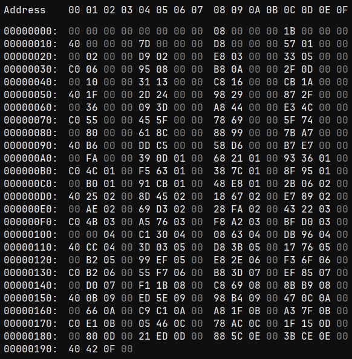

# Modifying Growth Rate Experience
> Authors: [Kristofferr](https://discord.com/channels/446824489045721090/477197363954581542/1508070161876516934), Lmaokai (reformatting). <br/>
> Credits and Research: PokePlatinum, Kristofferr, Lmaokai, [Lhea](https://discord.com/channels/446824489045721090/920372513488404542/1237510159048118413)

:::info
This is a guide on how to modify the amount of experience needed at each level for each growth rate category. 

These edits rely upon a basic understanding of hex editing and unpacking NARCs. An initial grounding in these subjects can be found in the following:
- [Hex Editing Primer](/docs/universal/guides/hex_editing/hex_editing.md)
- [Unpacking NARCs](/docs/universal/guides/unpacking_narcs/unpacking_narcs.md)
:::

## Table of Contents
- [Technical Information and References](#technical-information-and-references)
- [File Locations](#file-locations)
- [Editing the Data](#editing-the-data)
- [Considerations](#considerations)

---

## Technical Information and References
A Pokémon's level is determined by the total amount of experience it has with regards to its assigned growth rate category. Although specific equations are used to calculate the total amount of experience needed for each level, the Generation IV Pokémon games utilize a table with explicitly defined values (based on said equations) to determine a Pokémon's level based on its total accumulated experience. This is done to prevent possible glitches for level 1 Pokémon, particularly regarding the equation for the "Medium Slow" growth rate category that results in negative experience at level 1 (see [Bulbapedia](https://bulbapedia.bulbagarden.net/wiki/Experience)).

A generated table of the **total cumulative experience** needed at each level for each growth rate category can be found in the following links:
- [PokePlatinum](https://github.com/pret/pokeplatinum/blob/1319612a74a4f2ffd6c7259c0c7b6890d746738b/res/pokemon/.shared/exp_tables.csv)
- [PokeHeartGold](https://github.com/pret/pokeheartgold/blob/ad7a3afa0cfc144fe6837c410cb95b2727217f54/files/poketool/personal/growtbl.csv)
- [Bulbapedia](https://bulbapedia.bulbagarden.net/wiki/Experience#Experience_at_each_level)

**DSPRE's Pokémon Data Editor** can change a Pokémon's assigned growth rate category, but modifying the values of growth rate experience currently requires hex editing, detailed next.

## File Locations
The growth rate experience tables can be found in the following locations:
| HeartGold/SoulSilver | Platinum                            | Diamond/Pearl                    |
|:--------------------:|:-----------------------------------:|:--------------------------------:|
| `/a/0/0/3`           | `poketool/personal/pl_growtbl.narc` | `poketool/personal/growtbl.narc` |

Unpack the growth rate experience NARC with **DSPRE's Unpack NARC** tool (*Tools > NARC Utility > Unpack to Folder*). There will be eight files corresponding to each growth rate category in the following order (see [PokePlatinum](https://github.com/pret/pokeplatinum/blob/1319612a74a4f2ffd6c7259c0c7b6890d746738b/generated/exp_rates.txt)): 

```
1. 0000 - Medium Fast
2. 0001 - Erratic
3. 0002 - Fluctuating
4. 0003 - Medium Slow
5. 0004 - Fast
6. 0005 - Slow
7. 0006 - Unused Growth Rate 1 (identical to Medium Fast)
8. 0007 - Unused Growth Rate 2 (identical to Medium Fast)
```

## Data Structure
When opened in a hex editor, the size of each file should be `404` bytes (or `0x194` in hex). 

Every `4` bytes, in little-endian hex, represents the **total cumulative experience** needed to be at each level, and starts at level 0.

<details>
<summary>**Example**: File `0000`, which corresponds to the "Medium Fast" growth rate category.</summary>



The first `8` bytes, `00 00 00 00 00 00 00 00`, indicates that zero total experience is needed at levels 0 and 1 (this should also be the same for all files).

If we go to offset `0xC8`, which corresponds with level 50 (50 levels x 4 bytes per level = 200 bytes, or `0xC8` in hex), we see the value `48 E8 01 00`. This is in little-endian hex format, so the order of the bytes need reversed, resulting in `0x0001E848`, or `125,000` total experience needed at level 50.

If we go to offset `0x190`, which corresponds with level 100, the value `40 42 0F 00` translates to `1,000,000` total experience needed at level 100.
</details>

## Editing the Data
To edit this data, simply overwrite the values at the desired offsets. **However, because each entry represents the total cumulative experience needed to be at each level, modifications to the value at any given offset must also be made to every subsequent value.** For example, increasing the value at level 10 by `50` (or `0x32` in hex) for any growth rate requires increasing the value for every level afterwards by the same amount (i.e. you must also increase the values for levels 11 - 100 by `50`/`0x32` as well). 

You may find it beneficial to utilize spreadsheet tools or programming languages to assist with modifying this data. 

For instance, spreadsheet tools can be used for the following:
- List experience values in a column alongside levels (e.g. `| Level | Vanilla EXP (Decimal) | Vanilla EXP (Hex) | Modified EXP (Decimal) | Modified EXP (Hex) |`).
- Convert values between decimal and hex as needed, in addition to formatting hex values in little-endian, depending on the spreadsheet's available formulas (look through the spreadsheet's formula documentation or ask a clanker).
- Apply equations to modify the values of specific levels or level ranges.

Programming languages, such as Python, can also be used to format hex values in little-endian (see [Kristofferr's original tutorial](https://discord.com/channels/446824489045721090/477197363954581542/1508070161876516934)).

To save your changes, save the file in the hex editor, repack the NARC using **DSPRE's Build NARC from Folder** tool (*Tools > NARC Utility > Build from Folder*), and save the project.

## Considerations
If testing the changes with an existing save file, consider the following:
- All Pokémon will reference the modified tables upon loading a save. **However**, impacted Pokémon will not have their level (or stats) updated automatically. Instead, their level will update the next time the Pokémon were to level up or when placed in the Pokémon Storage System.
- When an impacted Pokémon gains experience in battle, the EXP bar may appear to fill completely, regardless of the actual amount of experience received, then appear to reset in the next battle. This is purely visual and has no effect on the received experience or already accumulated experience.
- For both new and existing saves, Egg Pokémon may be cooked.