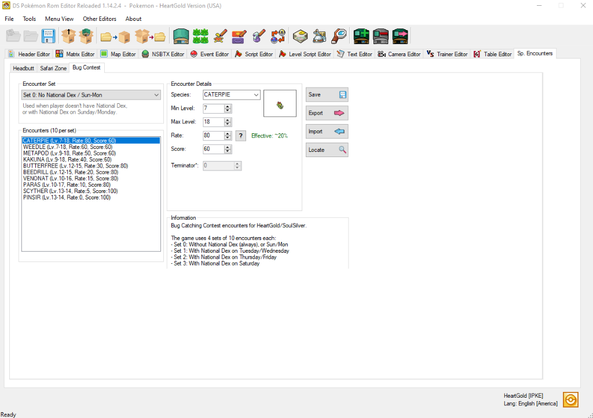
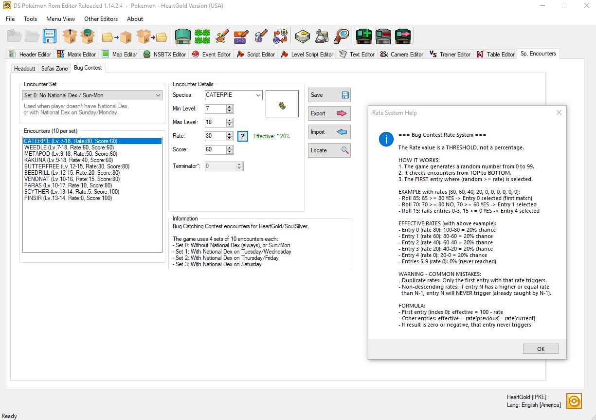
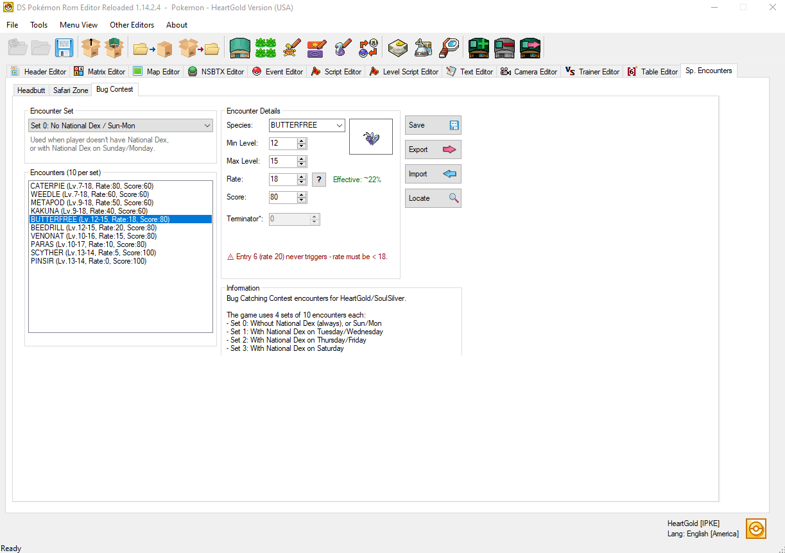

# Bug Catching Contests
> Author(s): [MrHam88](https://github.com/DevHam88).  
> Research: [pret/pokeheartgold](https://github.com/pret/pokeheartgold/blob/d11b7ef7917d435334d3372edad0792a3bbbb7a3/src/overlay_bug_contest.c).

This page is a guide to the **Bug Catching Contest** in Pokémon HeartGold and SoulSilver, specifically covering the encounter set data: which Pokémon can appear, when they appear, and how their effective encounter rates are determined. It also covers how to edit this data using DSPRE's Bug Contest editor, and via direct hex editing for reference.

:::info
This guide focuses on the encounter set data for the contest. Information on the contest's scripting, NPC opponents, and judging logic may be added to this page in the future.
:::

The Bug Catching Contest takes place at the National Park on Tuesdays, Thursdays, and Saturdays, and is initiated by an NPC in either connecting gate building. The encounter set described in this page applies for any visit to the National Park where the contest has been initialised. For any visit to the National Park where the contest has not been initialised, the area's normal encounter set is used.

---

## Encounter Sets

The game defines **4 separate encounter sets** of 10 Pokémon each, stored sequentially in the binary file `data/mushi/mushi_encount.bin`. Which set is active depends on two factors: whether the player has obtained the **National Pokédex**, and the **day of the week**.

| Set ID | Condition | Day(s) |
|:---:|---|---|
| **0** | No National Pokédex (always), **or** National Pokédex on Sunday/Monday | Any |
| **1** | National Pokédex obtained | Tuesday / Wednesday |
| **2** | National Pokédex obtained | Thursday / Friday |
| **3** | National Pokédex obtained | Saturday |

> Set 0 acts as the default fallback. On any day where the National Pokédex is not obtained, Set 0 is always used.

:::note
The **day of the week** used to determine the active encounter set is the **actual day on the hardware or emulator clock**, not the day parameter passed to the `BugContestControl` script command. That script parameter may affect other aspects of the contest initialisation, but the encounter set selection is entirely driven by the hardware clock.
:::

This logic is implemented in `BugContest_InitEncounters` in the game's source. Once the National Pokédex flag is set, the weekday index is divided by 2 (using integer division) to derive the set index. The full mapping across all days is:

| Day | Weekday Index | Index / 2 (integer) | Set Used |
|---|:---:|:---:|:---:|
| Sunday | 0 | 0 | **Set 0** |
| Monday | 1 | 0 | **Set 0** |
| **Tuesday** | 2 | **1** | **Set 1** |
| Wednesday | 3 | 1 | **Set 1** |
| **Thursday** | 4 | **2** | **Set 2** |
| Friday | 5 | 2 | **Set 2** |
| **Saturday** | 6 | **3** | **Set 3** |

Sunday and Monday both map to Set 0 via division, consistent with the fallback behaviour.

---

## Encounter Data Structure (Plain Language)

Each encounter set contains exactly **10 Pokémon entries**. Each entry defines:

- **Species**: Which Pokémon can appear.
- **Min Level / Max Level**: The level range the Pokémon can be (a random level within the range is chosen when triggered).
- **Rate**: A threshold value used to determine how likely this Pokémon is to appear (see [The Rate System](#the-rate-system) below).
- **Score (Rarity Factor)**: A component used in calculating the Pokémon's score when judged at the end of the contest (higher for rarer Pokémon).

### Default Encounter Set (Set 0 - Pre-National Dex)

| Slot | Species | Min Lv | Max Lv | Rate (Raw) | Effective Rate | Score (Rarity Factor) |
|:---:|---|:---:|:---:|:---:|:---:|:---:|
| 0 | Caterpie | 7 | 18 | 80 | 20% | 60 |
| 1 | Weedle | 7 | 18 | 60 | 20% | 60 |
| 2 | Metapod | 9 | 18 | 50 | 10% | 60 |
| 3 | Kakuna | 9 | 18 | 40 | 10% | 60 |
| 4 | Butterfree | 12 | 15 | 30 | 10% | 80 |
| 5 | Beedrill | 12 | 15 | 20 | 10% | 80 |
| 6 | Venonat | 10 | 16 | 15 | 5% | 80 |
| 7 | Paras | 10 | 17 | 10 | 5% | 80 |
| 8 | Scyther | 13 | 14 | 5 | 5% | 100 |
| 9 | Pinsir | 13 | 14 | 0 | 5% | 100 |

---

## The Rate System

### In Simple Terms

When a Bug Catching Contest encounter is triggered, the game picks a **random number between 0 and 99**. It then goes through the 10 Pokémon slots **in order from top to bottom** and checks whether the random number is **greater than or equal to** that slot's Rate value. The first slot where this is true determines the Pokémon that appears.

Because the Rate values are stored in **descending order** (high to low), only a specific range of numbers will "land" on each slot:

> **Example (Set 0):**
> - Roll = **85** → 85 ≥ 80 (Caterpie) ✓ → **Caterpie** appears
> - Roll = **63** → 63 ≥ 80? No. 63 ≥ 60 (Weedle)? Yes ✓ → **Weedle** appears
> - Roll = **7** → Fails all checks until Pinsir (Rate 0) → **Pinsir** appears

The actual effective probability for a slot is calculated as:
- **First slot (index 0):** `100 - Rate` (since the roll space is 0-99, the ceiling is 100)
- **All other slots:** `Rate of previous slot - Rate of this slot` (only valid when Rate values are in strictly descending order; see [Key Rules](#key-rules) below)

This means a Rate value **is not a percentage** -- it is a **threshold**. The probabilities only emerge from the *gap* between consecutive Rate values.

### Key Rules

:::caution
**Rate 0 does not mean 0% chance.** A rate of 0 means the slot's check (`roll >= 0`) is **always** true, so it acts as the final fallback. Any rolls not caught by an earlier slot will result in this Pokémon appearing. For the vanilla data this means a Rate 0 slot always has a 5% effective rate.
:::

:::caution
**Order matters. Do not break the descending order of Rate values.**  If a later slot has a Rate value that is *equal to or higher* than the previous slot's Rate, the roll will always be caught by the earlier slot first, and the later slot will **never** be triggered (0% effective rate). This is covered in the DSPRE warning system described below.
:::

:::note
**All four encounter sets use the same Rate values** (80, 60, 50, 40, 30, 20, 15, 10, 5, 0), so all sets share the same probability distribution (20%, 20%, 10%, 10%, 10%, 10%, 5%, 5%, 5%, 5%). Only the species assigned to each slot differ between sets.
:::

### Rate Value Reference

The table below shows how any valid descending sequence of Rate values translates to effective encounter probabilities:

| Slot | Rate (Raw) | Formula | Effective Rate |
|:---:|:---:|---|:---:|
| 0 | 80 | 100 − 80 | **20%** |
| 1 | 60 | 80 − 60 | **20%** |
| 2 | 50 | 60 − 50 | **10%** |
| 3 | 40 | 50 − 40 | **10%** |
| 4 | 30 | 40 − 30 | **10%** |
| 5 | 20 | 30 − 20 | **10%** |
| 6 | 15 | 20 − 15 | **5%** |
| 7 | 10 | 15 − 10 | **5%** |
| 8 | 5 | 10 − 5 | **5%** |
| 9 | 0 | 5 − 0 | **5%** |

The effective rates across all 10 slots must always sum to **100%**.

---

## Editing with DSPRE

The Bug Catching Contest encounter data can be edited using **DS Pokémon Rom Editor (DSPRE)**, available as part of the [Canary release](https://github.com/DS-Pokemon-Rom-Editor/DSPRE) (and should be included in the next stable release after v1.14.2.4). The Bug Contest editor is located under **Sp. Encounters** in the main toolbar, then the **Bug Contest** tab.



### Interface Overview

- **Encounter Set dropdown**: Selects which of the 4 sets to view and edit. The description below the dropdown explains the conditions under which that set is active.
- **Encounters list (10 per set)**: Lists all 10 slots, in order, in the active set. Each entry shows the species, level range, Rate, and Score values at a glance.
- **Encounter Details panel**: Edit the selected slot's Species, Min Level, Max Level, Rate, and Score.
  - The **`?` button** next to the Rate field opens the Rate System Help dialog, which explains the threshold system and common mistakes (see image below).
  - The **`Effective: ~X%`** label next to the Rate field displays the computed effective rate for the selected slot in real time, based on the raw Rate values in the current set.
- **Save**: Writes changes to the ROM's unpacked `project_DSPRE_contents` folder. The main DSPRE "Save ROM" button must be used to pack everything into an `.nds` file (along with any other changes).
- **Export / Import**: Work with the encounter set data as an external file.
- **Locate**: Opens the file explorer at the location of the underlying data file (`data/mushi/mushi_encount.bin`) within the unpacked project folder.



### Step-by-Step: Changing an Encounter

1. Open your ROM in DSPRE.
2. Navigate to **Sp. Encounters** in the top toolbar, then click the **Bug Contest** tab.
3. Use the **Encounter Set** dropdown to select the set you want to edit (see the [Encounter Sets](#encounter-sets) table above for which set corresponds to which in-game condition).
4. Click the slot in the **Encounters** list you want to modify.
5. In the **Encounter Details** panel:
   - Change **Species** to the desired Pokémon.
   - Set the **Min Level** and **Max Level**. A random level between (and including) these values will be assigned when that encounter triggers.
   - Set the **Rate**. Check the `Effective: ~X%` label to confirm the resulting probability. All 10 Rate values must remain in strictly descending order (each lower than the one above it) to avoid unreachable slots. A warning message will display below the encounter list if this rule is violated.
   - Set the **Score** -- this is the rarity factor component added to the judge's score calculation for this Pokémon (see [Scoring](#scoring) below).


6. Click **Save** to write changes to the ROM's unpacked `project_DSPRE_contents` folder. Use the main DSPRE "Save ROM" button when ready to pack into an `.nds` file.

:::note
Changes made to one set do not affect any other set. You must repeat the process for each set you want to modify.
:::

### Designing a Valid Rate Sequence

When customising encounter rates, keep these rules in mind:

- Rates must be **strictly descending** across the 10 slots (each slot's Rate must be *lower* than the slot above it in the list).
- The **last slot (slot 9) must always have Rate = 0** to ensure all possible roll values (0-99) are accounted for, giving 100% total probability. Any other value here creates a chance of no encounter being selected, which will likely cause an in-game bug or crash.
- The effective probability of any slot is `Rate[slot-1] - Rate[slot]` (or `100 - Rate[0]` for the first slot).
- It is not required to have 10 distinct Rate values. For example, if you want to reduce encounter diversity and have fewer than 10 species, you can assign duplicate Rate values to some slots -- but note that only the first of any two (or more) adjacent slots with equal Rate values will ever trigger (anything after the first will have a 0% effective rate and never appear).

### Scoring

The **Score** field (labelled "Score" in DSPRE) is one component of the contest judging calculation. In the vanilla game it ranges from 60 (common Pokémon) to 100 (rare Pokémon). The full judge score formula is:

```
Total Score = Score_Rarity_Factor
            + (Level / Max_Level) x 100
            + (Sum of all 6 IVs / 186) x 100
            + (Current HP / Max HP) x 100
```

Higher Score (Rarity Factor) values give rarer Pokémon a baseline advantage in the judging results.

---

## Hex Editing

<details>
<summary>Editing mushi_encount.bin directly (hex editor method)</summary>

The encounter data is stored in the file at:

```
data/mushi/mushi_encount.bin
```

This file is not inside a NARC. It is a flat binary file that can be opened directly from within the project folder after unpacking the ROM using DSPRE, or by unpacking the ROM file system using other tools.

### File Layout

The file contains **4 encounter sets** stored sequentially. Each set is **10 entries × 8 bytes = 80 bytes**. The full file is therefore **320 bytes** (4 × 80) for the vanilla data.

| Offset Range | Content |
|---|---|
| `0x000` to `0x04F` | Set 0 (10 entries) |
| `0x050` to `0x09F` | Set 1 (10 entries) |
| `0x0A0` to `0x0EF` | Set 2 (10 entries) |
| `0x0F0` to `0x13F` | Set 3 (10 entries) |

### Entry Structure

Each 8-byte entry follows this format:

```
AA AA BB CC DD EE FF FF
```

### Field Definitions

| Bytes | Name | Type | Description |
|---|---|---|---|
| `AA AA` | Species ID | `uint16` (little-endian) | The Pokémon species index. |
| `BB` | Min Level | `uint8` | Minimum encounter level (inclusive). |
| `CC` | Max Level | `uint8` | Maximum encounter level (inclusive). |
| `DD` | Rate (Raw) | `uint8` | The threshold value used in the encounter roll (see [The Rate System](#the-rate-system)). |
| `EE` | Score (Rarity Factor) | `uint8` | The rarity/score factor component used in the judge's score calculation. |
| `FF FF` | Padding | `uint16` | Always `00 00`. Not used by the game. |

All multi-byte values are **little-endian**.

### Example Entry

Set 0, Slot 0 - Caterpie (Species ID `0x000A`), Levels 7-18, Rate 80, Score 60:

```
0A 00 07 12 50 3C 00 00
```

Breakdown:

| Value | Meaning |
|---|---|
| `0A 00` | Species `10` (Caterpie) |
| `07` | Min Level `7` |
| `12` | Max Level `18` (decimal 18 = hex `0x12`) |
| `50` | Rate `80` (decimal 80 = hex `0x50`) |
| `3C` | Score Factor `60` (decimal 60 = hex `0x3C`) |
| `00 00` | Padding |

### Offset Formula

To locate a specific slot in the file:

```
offset = (set_id × 10 + slot_index) × 8
```

For example, Set 2 (`set_id = 2`), Slot 4 (`slot_index = 4`):

```
offset = (2 × 10 + 4) × 8 = 24 × 8 = 192 = 0xC0
```

</details>

---

## See Also

- [pokeheartgold decomp - overlay_bug_contest.c](https://github.com/pret/pokeheartgold/blob/d11b7ef7917d435334d3372edad0792a3bbbb7a3/src/overlay_bug_contest.c) - Game source code for the Bug Catching Contest system.
