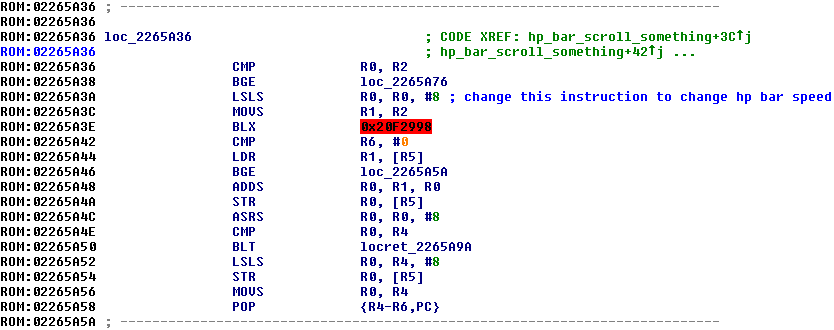

# Code Injection
> Author(s): [BluRose](https://github.com/BluRosie).
> Research: [BluRose](https://github.com/BluRosie), Touched, and [Skeli](https://github.com/Skeli789/) for the original GBA scripts.

This is an overall code injection guide and explanation behind the code injection framework for HeartGold and SoulSilver.  The template repository can be easily adapted to the rest of the Gen 4 games as long as there is a synthetic overlay definition.

Assembly will not be covered here.  It is recommended you understand assembly code and just basic coding in general before reading this.  There are plenty of tutorials out there for this.  One focused on the NDS that somewhat assumes any programming knowledge (which you'd need to know to inject code you've written to begin with) is Mikelan's overview which can be downloaded [here](resources/asm1.pdf).

---
## Table of Contents
- [Code Injection](#code-injection)
  - [Table of Contents](#table-of-contents)
  - [Manual Process](#manual-process)
  - [Shortcomings of the Manual Process](#shortcomings-of-the-manual-process)
  - [Implementation Details](#implementation-details)
  - [Code Injection Template](#code-injection-template)

## Manual Process
The Nintendo DS has 4 MB of EWRAM.  Unlike the GBA, the ROM is not directly mapped and readable in memory.  Files must be dumped into that 4 MB of memory in order to be accessed.  This includes all code that is run--the processor CPU's don't have direct access to the ROM in code execution space.

The way that was strongarmed by Nintendo onto developers is an overlay system.  This supports swapping out code as it is needed, but statically:  the overlays are not relocatable.  Special care must be taken to define game states, what code is all needed, and when it is needed.

The idea behind code injection is that the normal code execution is highjacked and brought to our code.  The ARM9 binary is constantly loaded in to the memory as something that is constant, and largely includes code that is common between every situation possible.

The way you'd typically go about this is by manually assembling instructions using an assembler like `as` of the GNU `arm-none-eabi` toolset.  This then gives us an output binary that we can paste somewhere using something like [Mikelan's synthetic overlay implementation](https://pokehacking.com/tutorials/ramexpansion/), which gives a file that can be used to load in code that serves as an extension of the existing code memory regions.

An example of this in action is in the code edits by [AdAstraGL](https://twitter.com/AdAstra_GL) to [speed up the HP bar in HeartGold and Platinum](https://pastebin.com/eCvYDcyw):

```
1) Paste this at 0x14FF0 of your synthetic overlay file:
       00 01 02 03 04 05 06 07 08 09 0A 0B 0C 0D 0E 0F

0000   2D 2D 48 50 20 42 41 52 20 53 50 45 45 44 2D 2D   --HP BAR SPEED--
0010   80 21 49 00 48 43 11 1C 70 47 C0 46 FF FF FF FF   €!I.HC..pGÀFÿÿÿÿ

2) Paste this at offset 0x2E17A of an uncompressed overlay12.
77 F1 D1 FA 
```

From the synthetic overlay, the code is dumped to 0x023C8000 in the EWRAM (as implemented by Mikelan).  This places the data we just wrote at `0x023C8000 + 0x14FF0 = 0x023DCFF0` in the EWRAM.

Overlay 12 is loaded in at 0x022378C0 in EWRAM.  The code at 0x2E17A of overlay 12 is at `0x022378C0 + 0x2E17A = 0x02265A3A`.

Dumping Overlay 12 into IDA Pro and making an IDB (or using the one from the IDB's that I maintain [here](https://mega.nz/folder/nuhlULbZ#6nbkKtNLXAkTndcRAVtltA) ) will give this as the code dump near that area:



The code at `0x02265A3A` is the code that is already run (because it's in the game's code already), so we start from there.  The instruction there is changed to this:


This jumps directly to the code that we just inserted at `0x023DCFF0`--the second line at `0x023DD000`, to be exact.

From there, the code at `0x023DD000` (as dumped by REBot in KoDSH):

```arm
movs r1, #0x80   ; +0 = 80 21 
lsls r1, r1, #1  ; +2 = 49 00 
muls r0, r1, r0  ; +4 = 48 43 
adds r1, r2, #0  ; +6 = 11 1c 
bx   lr          ; +8 = 70 47 
mov  r8, r8      ; +10 = c0 46 
```

As AdAstra explains in the tutorial, this allows for a coarser control that isn't just a multiplier on the original speed of the HP bar (when it's depleting).  As it introduces more instructions in place of the older set, there is a need for space elsewhere to insert this bit of code.

The first line inserted--literally `--HP BAR SPEED--` in ASCII--is just a marker that they insert to help you keep track of what in your synthetic overlay is already managed.

## Shortcomings of the Manual Process
**Note that this is not a diss or anything on AdAstra and/or his tutorial.**  This is just a presentation to describe the process that we are looking to automate for code injection.

Manual insertion of this is tedious.
The manual insertion process also mandates that you keep track of things in your synthetic overlay as it fills up--which is where that marker comes in as a reminder when the user is scrolling through their code binaries and forgets what each bit of otherwise-meaningless hexadecimal is.
Sharing this with other people places this smack-dab in the middle of their synthetic overlays and cuts down on continuous free space that they may want to use for other things.  It will require reverse engineering to move this elsewhere, if they even remember the change in the game code that redirected execution out to this point.

The idea with code injection frameworks is to cut down on the manual hex editing and allow code to be shared for insertion at any point in code expansion areas--wherever there is free memory at any given point.

## Implementation Details
When assembling and compiling code, an object file is produced.  This can then be linked to specific addresses to create a linked object of a number of direct compiled objects that are all together.  We can view these addresses, parse the symbol output with Python, and correlate it with our own custom format (also parsed by Python) that will fully automate the overlay process for us--all we have to edit is the code.

This does not eliminate the reverse engineering step required to *find* exactly where to branch out of the game code to our code.  There is no tutorial for that--you just have to get into the weeds of the assembly directly and figure out what each piece of code is doing.  This is where the GDB Debugger in Desmume coupled with IDA Pro or Ghidra is useful--you can see exactly what is executing and when, trace it to identify what you need to do.

The method chosen to decide how to highjack the game's execution is by writing hooks in the binary automatically based on a text file we create and parse.  The hook code is designed to be generic:

```arm
ldr rN, =functionOffset
bx rN
.pool
```

We can insert C code to replace entire functions this way.  In this example, we'll use `PocketCompaction` from hg-engine's [`src/bag.c`](https://github.com/BluRosie/hg-engine/blob/main/src/bag.c).  We know this is an equivalent implementation due to the [pokeheartgold decompiled code](https://github.com/pret/pokeheartgold/blob/master/src/bag.c#L280).:

```c
void PocketCompaction(ITEM_SLOT *slots, u32 count) {
    u32 i, j;
    for (i = 0; i < count - 1; i++) {
        for (j = i + 1; j < count; j++) {
            if (slots[i].quantity == 0) {
                SwapItemSlots(&slots[i], &slots[j]);
            }
        }
    }
}
```

This gives an 8-byte snippet of assembly (or 10 bytes if not 4-byte word aligned, which is automatically accounted for) that allows us to jump from any point in EWRAM to any other point in EWRAM.

The hook format as implemented is as follows:

```
# overlayId symbolName memAddress regId
# i.e.

arm9 PocketCompaction 080785A0 2
0001 FUN_ReadEntryDataArc 021FB164 3
```

If the `memAddress` starts with `08`, the hook is inserted at the direct file offset of the uncompressed binary, i.e. directly at `memAddress & 0xFFFFFF`.  If the `memAddress` starts with `02`, it is understood as an address in EWRAM, and the NDS overlay table is read to determine where `overlayId` is loaded in so that the code binary can be written to.

Here, the arm9 `memAddress` entry for `PocketCompaction` starts with `08` so the arm9 binary is opened and the hook is directly inserted at file offset `0x785A0`.  Then overlay 1 is opened and `memAddress` starts with `02` so the script knows that this is a memory offset.  It parses the overlay table (in y9.bin), sees that overlay 1 starts at `0x021E5900`, and inserts a hook at the file offset `0x021FB164 - 0x021E5900 = 0x15864` of overlay 1.

After compiling a C file or assembling an assembly file, a compiled object is output.  A compiled object can be passed through a linker (here the standard `ld`) to produce a linked object.

The direct output of `nm linked_object.o` gives the addresses of all the functions and data inside of `linked_object.o`:

```
023d88cf T PocketCompaction
023d873d T Pocket_GetItemSlotForAdd
023dcbf0 T Pocket_GetItemSlotForAdd_hook
023dcc08 t Pocket_GetItemSlotForAdd_return_address
023d87c9 T Pocket_GetItemSlotForRemove
023dcc60 T Pocket_GetItemSlotForRemove_hook
023dcc78 t Pocket_GetItemSlotForRemove_return_address
023d88ab T Pocket_GetQuantity
023d891d T Pocket_TakeItem
023dccb4 T Pocket_TakeItem_hook
023dcccc t Pocket_TakeItem_return_address
```

We use Python to parse this output from `nm` and create a "symbol table" of sorts that shows where code we put in the ROM will eventually be loaded into the EWRAM.  We can finally use all of this to write the hooks directly.

In this example, the `PocketCompaction` function is seen at `023D88CF` in the EWRAM, so the code below is written to `0x785A0` of the arm9 binary (as specified by `080785A0` in the hook entry):

```arm
ldr r2, =0x023D88CF // PocketCompaction's offset in memory
bx r2
.pool // gets expanded to CF 88 3D 02 as it stores the ldr value above
```

Which automatically puts `00 4A 10 47 CF 88 3D 02` at `0x785A0` of the arm9 binary.  This highjacks the code execution directly to our version of `PocketCompaction`, effectively *replacing the function entirely with whatever code we write*.

You do not need to replace an entire function at its start.  You can branch out of the middle of a function, write purely assembly code to tweak a register's value, or write a custom hook as a landing pad from the code binary to tweak certain registers and restore values before passing everything back to the game to run proper.

* Note for functions that have more than 3 arguments:  The C standard for ARM stipulates that arguments 0-3 are passed as `r0`-`r3` in the resulting assembly.  Further arguments are passed via the stack.  To deal with this, we write a custom hook including some `bytereplacement` elements that maintains all of the registers and stack pointer going into the function from the ROM.  See the [`CantEscape` example](https://github.com/search?q=repo%3ABluRosie%2Fhg-engine%20CantEscape&type=code) for implementation details.

Further convenience is afforded in these files that Python parses with `bytereplacement`, `routinepointers`, and `repoints`.

`bytereplacement` writes a stream of bytes to an offset specified in the code binary of the ROM (with the same `08`/`02` file offset/memory offset handling):
```
# pokewalker species limiters
0112 021ED63C FF 7F 00 00
0112 021ED668 FF 7F 00 00
0112 021EFB10 FF 7F 00 00
0112 021F126C FF 7F 00 00
0112 021F323C FF 7F 00 00

#Binding moves 1/8th
0012 08012852 08
```
Here, overlay 112 has a number of memory offsets overwritten with `FF 7F 00 00`.  All of these files take lines that start with `#` as comments that can be discarded (outside of `#ifdef` conditional inclusion).
Overlay 12 has `08` directly written to file offset `0x12852`.

`routinepointers` will place a pointer to a function at an offset specified in the code binary of the ROM (with the same `08`/`02` file offset/memory offset handling).  This automatically accounts for thumb if it is compiled as such--the offset written will have 1 added to it if necessary.

```
0012 BGCallback_Waza_Extend 08037084
```

This places a pointer to the code symbol `BGCallback_Waza_Extend` at file offset `0x37084` of overlay 12.

And `repoints` will place a pointer to any data you specify in the code in the code binary of the ROM (with the same `08`/`02` file offset/memory offset handling):

```
# repoint the type effectiveness table
0012 TypeEffectivenessTable+1 02251D20
0012 TypeEffectivenessTable+2 02251D24
0012 TypeEffectivenessTable 0225204C
0012 TypeEffectivenessTable 02252174
0012 TypeEffectivenessTable+1 022521C0
0012 TypeEffectivenessTable+2 022521C4
0012 TypeEffectivenessTable 02252640
0012 TypeEffectivenessTable+1 02252644
0012 TypeEffectivenessTable+2 02252648
0012 TypeEffectivenessTable 02252694
```

`repoints` is unique in that it lets you specify an offset to be added to the pointer before writing it to the code binaries.  This is done to mimic how the compiler handles optimizations at times by inserting a reference to a table that is offset by the position of the entry it needs.

In this example, `TypeEffectivenessTable` is a list of `u8` arrays with declaration `u8 TypeEffectivenessTable[][3];`.  Each 3 bytes is in the order of attacking type, defending type, and effectiveness multiplier.  Code that only references the effectiveness multiplier may be optimized by the compiler to directly build that offset into the reference it generates (and does), so we allow the option to compensate for that here.

It is also possible to use functions and data from the ROM itself.  The code injection framework achieves this by defining symbol offsets in [`rom.ld`](https://github.com/BluRosie/hg-transparent-textbox/blob/main/rom.ld).  Here we can add a function from the ROM, say `DaycareMon_GetBoxMon` which according to the [`xmap`](https://raw.githubusercontent.com/pret/pokeheartgold/xmap/heartgoldus.xMAP) is located at `020292E4` in the arm9.  To use this, we add an entry to [`rom.ld`](https://github.com/BluRosie/hg-transparent-textbox/blob/main/rom.ld):

```
DaycareMon_GetBoxMon = 0x020292E4 | 1;
```

The `0x020292E4` is the base offset of the function.  The `| 1` is due to the function being in thumb mode (as most functions from the ROM are), a reduced instruction set of ARM that permits much smaller code generation.

To then call this in our code, we have to add a declaration of the function (its structures, `BoxPokemon` and `DaycareMon` will have to be copied as well):

```c
BoxPokemon *DaycareMon_GetBoxMon(DaycareMon *dcmon);
```

When we do this alone, the linker assumes the function is ARM and resolves the address of the function to be `0x020292E4`, jumping to it with a `blx` instruction to swap the instruction set to ARM which will likely cause a crash.  To fix this, we introduce the `long_call` compilation attribute:

```c
BoxPokemon * __attribute__((long_call)) DaycareMon_GetBoxMon(DaycareMon *dcmon);
```

This tricks the compiler to elicit code that will not cull the thumb bit from the function address and properly jump to it.  You can define this as a macro, i.e. `LONG_CALL`, which would allow this declaration to look like this:

```c
BoxPokemon * LONG_CALL DaycareMon_GetBoxMon(DaycareMon *dcmon);
```

`DaycareMon_GetBoxMon` can then be used in the code that you write as any other function.  The linker will resolve its address properly and the code will function as it is in the original ROM.  This is useful for copying existing functions from the ROM without needing to copy copious amounts of code from the decompilations or manually reimplement in assembly.

## Code Injection Template
For those who don't want to fully overhaul the battle system of their hacks, the [repository for transparent textboxes](https://github.com/BluRosie/hg-transparent-textbox) serves as a template for code injection.  It still uses [Mikelan and Nomura's synthetic overlay approach](https://pokehacking.com/tutorials/ramexpansion/) to code expansion, where an unused file in the file system is repurposed as a code storage container instead of directly using another overlay as is necessary for larger code injection projects with sizes that surpass the RAM size limitations afforded by this approach.  It is still completely valid for entire projects--0x18000 bytes is quite a lot, and anything but entire engine overhauls is supported by this.

Its `Makefile` has an example of a NARC being edited with files that are present in the repository.  [These](https://github.com/BluRosie/hg-transparent-textbox/blob/main/Makefile#L87) [lines](https://github.com/BluRosie/hg-transparent-textbox/blob/main/Makefile#L97-L106) (there are two links there, lines 87 and 97-106) can be deleted in the event that you don't want to use the transparent textboxes that are implemented by the repository.  This will then also involve deleting the code that is present to handle the transparent textboxes--clearing out the `src` directory and the `asm/other_hooks.s`, `repoints`, `bytereplacement`, and `hooks` files will leave the repository blank for your populating.

From there, adding new files in `src` will automatically compile them and link everything for insertion.  Same goes for assembly source files in `asm`.  [`asm/thumb_help.s`](https://github.com/BluRosie/hg-transparent-textbox/blob/main/asm/thumb_help.s) is a file that implements some functions that the C compiler sometimes assumes exists and uses as functions.
