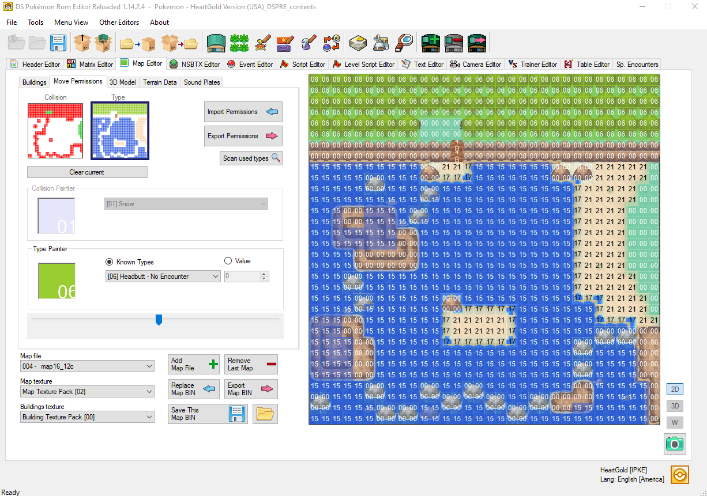
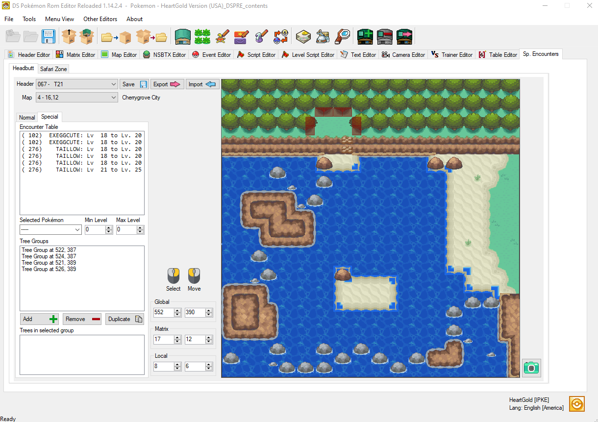
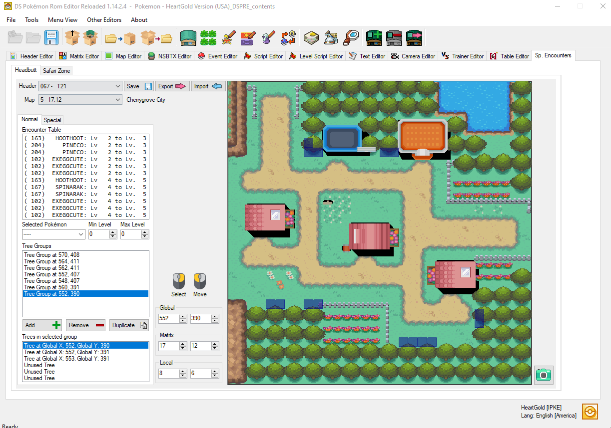

# Headbutt Trees
> Author(s): [MrHam88](https://github.com/DevHam88).  
> Research: [pret/pokeheartgold](https://github.com/pret/pokeheartgold/blob/master/src/field/headbutt.c).

This page is a guide to **Headbutt Trees** in Pokémon HeartGold and SoulSilver. It covers how the game determines which Pokémon appear, how encounter sets are selected for different trees, and how to edit this data using DSPRE or direct hex editing.

:::info
In HGSS, Headbutt encounters are map-dependent. HGSS uses pre-authored data files for each map header that list specific encounter-capable trees and their associated Pokémon.
:::

---

## Glossary

To clear up any confusion regarding the terminology used in DSPRE and technical documentation, refer to this quick glossary:

- **Encounter Set**: One of the three tables of 6 Pokémon (Common, Rare, or Special) available for a map header.
- **Tree Group**: A logical grouping of coordinates (up to 6) that all represent the same "physical" tree on the map.
- **Tree (Coordinates)**: The specific X/Y coordinates on a map that can be headbutted to trigger an encounter.

---

## Technical Prerequisites: Map Permissions

Before a tree can be headbutted, the map itself must allow the interaction. This is driven by **Map Permission Data**:

- **Permission Type**: Must be `0x06`.
- **Permission Collision**: Must be `0x80` (Blocked).

If a tile has these properties, the field move interaction is available. When it is initialised, the game then checks the facing coordinates against the map's Headbutt tree groups to determine if an encounter should occur.



---

## Encounter Set Logic

Every map that supports Headbutt has three distinct encounter tables (called **Groups** in community documentation, such as Bulbapedia). Which **Encounter Set** is used depends on the **Tree Group** being headbutted and the player's Trainer ID.

:::info  
While community documentation often implies that **encounters** are shared across multiple locations (e.g., "all mountain areas share Group A"), this is a stylistic choice by the original developers and not a technical constraint. In the game's data, each Map Header has its own unique set of encounters.  
:::

| | Encounter Set Name | Usage |
|:---:|---|---|
| **A** | Common | The most frequent encounter set for most trees. |
| **B** | Rare | A secondary, rarer encounter set for some trees. |
| **C** | Special | Exclusive to Special **Tree Group**s, often containing unique species. |

### How the game chooses an Encounter Set

For **Normal Tree Group**s (the majority of trees on a map), the game determines whether to use **Group A**, **Group B**, or no encounter at all based on a combination of:
1. The last digit of the player's **Trainer ID** (`ID % 10`).
2. The specific (multiple) **Tree Group Index** (its position in the map's coordinate list).

This logic ensures that a **Tree Group** that is "rare" for one player might be "common" or "empty" for another, introducing randomisation.

For **Special Tree Group**s, the game bypasses this logic entirely. If a **Tree Group** is defined in the map's Special list, it will **always** trigger an encounter from **Group C**. These are typically used for "signature" trees blocked by terrain (like Rock Climb or Waterfall).

---

## The Slot Weighting System

Each of the three encounter sets (A, B, and C) contains exactly **6 Pokémon slots**. When a Headbutt encounter is triggered, the game selects a slot based on a fixed probability distribution hardcoded into the game.

| Slot | Probability |
|:---:|:---:|
| **0** | **50%** |
| **1** | **15%** |
| **2** | **15%** |
| **3** | **10%** |
| **4** | **5%** |
| **5** | **5%** |

---

## Coordinate Groups & System

In HGSS a single "logical" tree on the map can be headbutted from multiple sides. To account for this, the game allows each **Tree Group** to contain up to **6 coordinate pairs**. If the player headbutts a tile that matches any of the coordinates in a group, that group's encounter logic is triggered from any given visible "tree".

- **Normal Tree Group**s: Subject to the Trainer ID logic (Encounter Set A/Encounter Set B/None).
- **Special Tree Group**s: Always use the Special (C) Encounter Set.

If a tree's coordinates are not present in either list for the current map, that tree is empty and will never yield an encounter.

---

## Editing with DSPRE

Headbutt encounters can be edited using **DS Pokémon Rom Editor (DSPRE)**. The editor is located under **Sp. Encounters** in the main toolbar, then the **Headbutt** tab.



### Interface Overview

- **Map Header**: Select the map you wish to edit (to find a specific location, use the Header Editor location search, and make a note of the header ID).
- **Map Selection**: Used to select the map file (Map ID and matrix coordinates are part of the combo box for selection, and location name is a read-only piece of text).
- **Map Preview**: Displays the rendered map file associated with the selected header (visible in the preview to the right). It shows **Tree Coordinates** as blue squares (**Normal Tree Groups**) and red squares (**Special Tree Groups**).
- **Encounter Slots**: 18 slots total, accessible through sub-tabs:
  - **Normal sub-tab**: Lists 6 **Common** encounters followed by 6 **Rare** encounters (Encounter Sets A and B), both in index order.
  - **Special sub-tab**: Lists all 6 **Special** encounters (Encounter Set C) in index order.
- **Encounter Details**: Edit the species and levels for the selected slot. These fields become usable once a slot is selected.
- **Tree Groups**: Lists the encounter-capable **Tree Group**s. Each entry displays the coordinates of the **first** tree coordinates defined within that **Tree Group**.
  - The list reflects either **Normal** or **Special** **Tree Group**s depending on which sub-tab is selected.
  - Select a **Tree Group** to view and edit all 6 of its individual tiles in the **Trees in Group** panel.
  - Coordinates can be set using global or **Local Coordinates** (DSPRE automatically translates these to Global for the user).
  - Unused coordinate slots are shown as `65535 x 65535` (global coordinates).

:::warning  
If the **dynamic headers patch** is applied to a HGSS ROM in DSPRE, new headers will not have a new NARC file created for Headbutt data automatically. Manual creation of the new NARC file (within `data/a/2/5/2`) would be needed to add Headbutt Tree encounters to headers beyond the games' original count.  
:::

### Step-by-Step: Editing an Encounter

1. Open your ROM in DSPRE and navigate to **Sp. Encounters** -> **Headbutt**.
2. Select the **Map Header** you want to modify.
3. Choose the appropriate sub-tab (**Normal** or **Special**).
4. Select the slot you wish to modify from the **Encounter Slots** list.
   - All 18 slots are always present; editing an encounter simply means updating a slot that was previously zeroed out.
   - If encounters are being used, every slot must be valid to avoid in-game issues if an empty/invalid slot is rolled.
5. In the **Encounter Details** panel, select the desired **Species** and set the **Min/Max Levels**.
6. Click Save to write changes to the project folder.



### Step-by-Step: Editing Tree Locations

1. Open your ROM in DSPRE and navigate to **Sp. Encounters** -> **Headbutt**.
2. Select the **Map Header** you want to modify.
3. Choose the appropriate sub-tab (**Normal** or **Special**).
4. Select a **Tree Group** from the list. The coordinates shown here represent the primary tile for that logical tree.
5. Once selected, the **Trees in Group** panel will populate with up to 6 coordinate pairs.
6. Update any of the coordinate slots with the desired tile positions.
   - You can enter global or **Local Coordinates** (relative to the individual map) - DSPRE will automatically translate these to **Global Coordinates** upon saving.
   - To remove a tile from the group, set its coordinates to `65535 x 65535` (global coordinates).
7. Click Save to write changes to the project folder.

### Step-by-Step: Adding a New Tree Group

1. Open your ROM in DSPRE and navigate to **Sp. Encounters** -> **Headbutt**.
2. Select the **Map Header** you want to modify.
3. Choose the appropriate sub-tab (**Normal** or **Special**).
4. Use the **Add (+)** button in the **Tree Groups** list to create a new tree group.
5. A new entry will appear with empty coordinates (`65535 x 65535` global coordinates).
6. Select the new tree group and follow the "Editing Tree Locations" steps above to define the encounter-capable tiles.
7. Click Save to write changes to the project folder.

### Step-by-Step: Removing a Tree Group

1. Open your ROM in DSPRE and navigate to **Sp. Encounters** -> **Headbutt**.
2. Select the **Map Header** you want to modify.
3. Choose the appropriate sub-tab (**Normal** or **Special**).
4. Select the **Tree Group** you wish to delete from the list.
5. Use the **Remove (-)** button in the **Tree Groups** list.
6. Click Save to write changes to the project folder.

---

## Player-facing Behaviour

- **Guaranteed Encounters**: If a tree is encounter-capable (listed in a map's **Tree Group** data), it will **always** yield an encounter when headbutted. There are no "misses" for valid trees.
- **Repel Proof**: Headbutt encounters are **not blocked by Repel**.
- **Empty Trees**: If a tree's front tile coordinates are missing from the map's **Tree Group** data, no encounters are generated when it is headbutted, even if the map permissions are correct.

---

## Hex Editing

<details>
<summary>Editing Headbutt data directly (hex editor method)</summary>

Headbutt encounter data is stored in the universal archive, which is identical for both **HeartGold** and **SoulSilver**:
```
data/a/2/5/2 (NARC Index 254)
```

Each member file in this NARC corresponds to a **Map Header ID**. If a map has no Headbutt support, its file is a **4-byte stub** (`00 00 00 00`).

### File Layout

A valid Headbutt data file follows this structure:

| Offset | Content | Size |
|---|---|---|
| `0x00` | Normal Tree Groups Count | 1 byte |
| `0x01` | Padding (`0x00`) | 1 byte |
| `0x02` | Special Tree Groups Count | 1 byte |
| `0x03` | Padding (`0x00`) | 1 byte |
| `0x04` | Encounter Data (3 sets of 6 slots) | 72 bytes |
| offset for the first normal tree | Normal Tree Group Coordinates | 24 bytes per group |
| `...` | Special Tree Group Coordinates | 24 bytes per group |

### Slot Structure (4 bytes)

Each encounter slot consists of 4 bytes:
`AA AA BB CC`
- `AA AA`: Species ID (`uint16`, little-endian)
- `BB`: Min Level (`uint8`)
- `CC`: Max Level (`uint8`)

### Tree Group Structure (24 bytes)

Each tree group contains 6 coordinate pairs (4 bytes each):
`XX XX YY YY`
- `XX XX`: Global X coordinate (`uint16`, little-endian)
- `YY YY`: Global Y coordinate (`uint16`, little-endian)
- Unused slots are filled with `FF FF FF FF`.

### Size Formula
Total file size = `76 + (24 * numNormalGroups) + (24 * numSpecialGroups)` bytes.

</details>

---

## See Also

- [Bulbapedia: Headbutt tree](https://bulbapedia.bulbagarden.net/wiki/Headbutt_tree) - General overview of the mechanic.
- [Serebii: HGSS Headbutt Trees](https://www.serebii.net/heartgoldsoulsilver/headbutt.shtml) - Detailed location-based encounter list.
- [Wiki: HGSS File Structure](../resources/hgss-file_structure) - Technical reference for HGSS binaries.
- [pret/pokeheartgold - headbutt.c](https://github.com/pret/pokeheartgold/blob/master/src/field/headbutt.c) - Technical implementation details.
