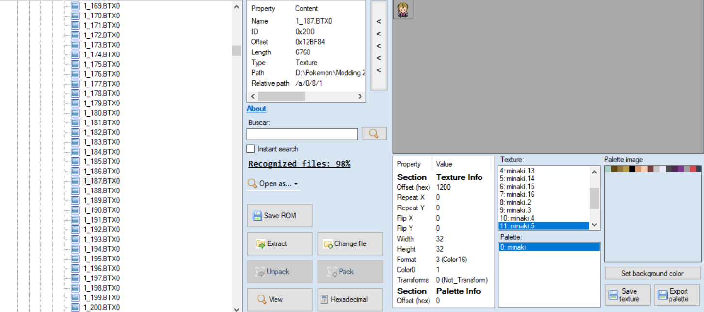
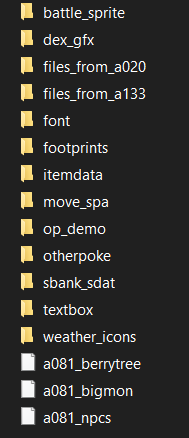
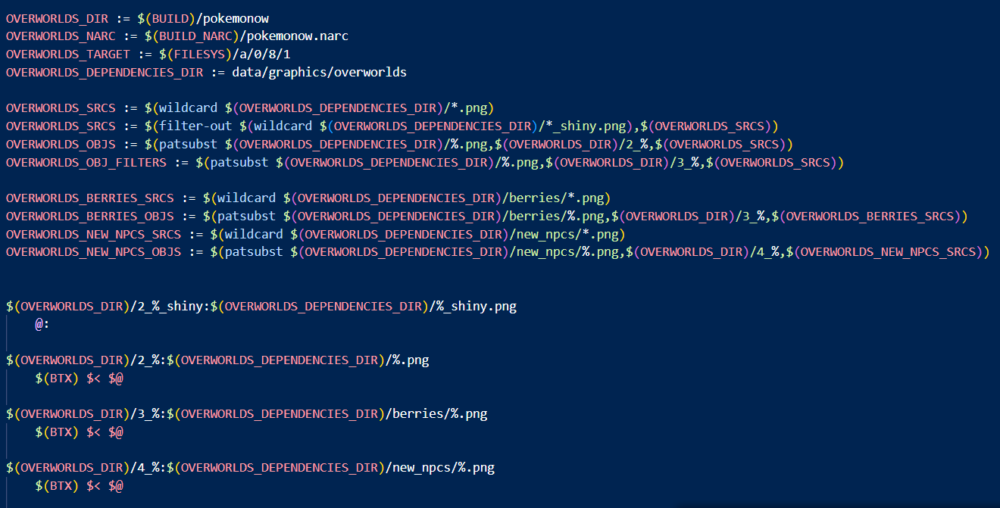

# Adding New Overworlds in HeartGold Engine
> Author: Senate

This guide will help you to add new overworlds in HeartGold Engine (HGE).

WARNING: HGE will continue to add more overworlds and more overworld graphics -- if you merge these into your project, make sure to update the GFX number that your overworlds start with (more on that later in the guide).

---

## Table of Contents
  - [Table of Contents](#table-of-contents)
  - [Acknowledgements](#acknowledgements)
  - [Prerequisites](#prerequisites)
  - [Part 1 - .BTX0 Files And How to Extract Them](#part-1---btx0-files-and-how-to-extract-them)
  - [Part 2 - Editing The Sprite In A .BTX0 File](#part-2---editing-the-sprite-in-a-btx0-file)
  - [Part 3 - Editing pngtobtx0.cs To Work With Your New Sprite](#part-3---editing-pngtobtx0cs-to-work-with-your-new-sprite)
  - [Part 4 - Expanding The Overworld Table](#part-4---expanding-the-overworld-table)
  - [Part 5 - Compiling](#part-5---compiling)

---

## Acknowledgements
BluRose: All the help in teaching me this and making this possible in HGE.

---

## Prerequisites
- Cloned HGE repository -- refer to the setup guide found here: (https://github.com/BluRosie/hg-engine)
- BTXEditor2 (https://projectpokemon.org/home/forums/topic/8962-btx-editor-20/)
- Sprite editing software, e.g. Aseprite
- DSPRE (https://github.com/AdAstra-LD/DS-Pokemon-Rom-Editor)

---

## Part 1 - .BTX0 Files And How to Extract Them

``.BTX0`` files contain the various frames of overworlds. An example of one, as displayed in Tinke 0.9.2, is shown below:



We will need to extract a ``.BTX0`` file of an existing overworld (for the purposes of this guide, we will use the ``.BTX0`` for Eusine) because the program ``pngtobtx0`` will read the contents of a vanilla ``.BTX0`` file, then add your PNG over top of it without replacing the original sprite in the game.

To extract a ``.BTX0`` file, use Tinke 0.9.2 and navigate to ``a/0/8/1``. Tinke will show you a preview of the sprite in the ``.BTX0`` if you click the file, then press View or hit spacebar on your keyboard. Once you have found one that matches your intentions, press Extract and save it where you would like.

---

## Part 2 - Editing The Sprite In A .BTX0 File

Once you have your ``.BTX0``, open it in BTXEditor2 ([Prerequisites](#prerequisites)).


Click Export and save the ``.png`` where you would like.

You are now free to edit it in your sprite editing software of choice.

---

## Part 3 - Editing pngtobtx0.cs To Work With Your New Sprite

The next step is to move your ``.BTX0`` to the ``../rawdata`` folder. Rename it to something like ``a081_npcs`` for clarity as so:



It's important to remove the ``.BTX0`` file extension -- don't worry, no data will be lost.

After you have done so, create a folder called ``new npcs`` in ``../data/graphics/overworlds``. Place your ``.png`` in there and rename it to ``0000.png``. If you add more sprites, name them ``0001.png``, ``0002.png``, and so on.

Now, we must edit ``pngtobtx0.cs``, which is in ``../tools/source`` to tell it to properly convert your ``.png`` to a ``.BTX0``. Copy the following code into ``pngtobtx0.cs`` after the section of code that begins with ``if (bitmap.Width > 32) // if a big mon``:

```c#
else if (bitmap.Height == 384) // npcs -- their dimensions are 32x384
			{
			    if (pngFile.Contains("new_npcs/"))
			    {
			    	pngFile = pngFile.Substring("new_npcs/".Length, pngFile.Length - "new_npcs/".Length);
			    }

				try
				{
					this.BTXFile = File.ReadAllBytes("rawdata/a081_npcs");
				}
				catch (Exception e)
				{
					Console.WriteLine(e.Message);

					return;
				}

				this.bm = BTX0.Read(this.BTXFile);
			}
```
Next, we need to update this line in ``pngtobtx0.cs``:
```c#
if (Program.PaletteSize == 64U && Program.PaletteCount == 2U) // handle shiny palette if one exists first
```
to also include your ``new npcs`` folder. Simply add ``&& !args[0].Contains("new_npcs")`` to that line within the parentheses.

All this code will look for ``.png`` files in your new folder ``new_npcs`` and begin applying the ``.png`` over the ``.BTX0`` called ``a081_npcs`` (functionally a ``.BTX0`` file even without the file extension) in ``../rawdata`` once you build your ROM with HGE.

Now, we need to expand the table for overworlds to have a new entry for yours.

---

## Part 4 - Expanding The Overworld Table

At the top of ``../src/field/overworld_table.c`` with the definitions for shadows, include the following code:

```c
#define NEW_NPC_START 7000
#define NEW_NPC_GFX_START 1458
#define NEW_NPC_ENTRY(num) {.tag = NEW_NPC_START + num, .gfx = NEW_NPC_GFX_START + num, .callback_params = 0}
```

You can choose what ``NEW_NPC_START`` is defined as, but choose an arbitrarily large number that HGE will likely not reach. This ensures that your overworld entry will not be shifted later in your project, which would make for an extremely tedious process of updating your overworlds in DSPRE.

As mentioned at the beginning of this guide, you will have to change ``NEW_NPC_GFX_START`` as HGE adds more overworld sprites. At the time of writing this guide, 1457 is the last used GFX, which belongs to the three segment form of Dudunsparce. Make sure you pay attention to what the last number used by HGE is as you merge!

After the Pokémon overworlds, include the following:

```c
NEW_NPC_ENTRY(0), // the name of your sprite for easy reference
```

So that it will look like:

```c
(...)
{ .tag = 1789, .gfx =  297, .callback_params = OVERWORLD_SIZE_SMALL}, // SPECIES_IRON_BOULDER
{ .tag = 1790, .gfx =  297, .callback_params = OVERWORLD_SIZE_SMALL}, // SPECIES_IRON_CROWN
{ .tag = 1791, .gfx =  297, .callback_params = OVERWORLD_SIZE_SMALL}, // SPECIES_TERAPAGOS
{ .tag = 1792, .gfx =  297, .callback_params = OVERWORLD_SIZE_SMALL}, // SPECIES_PECHARUNT

NEW_NPC_ENTRY(0), // the name of your sprite for easy reference
```

You have now expanded the overworld table to fit yours!

---

## Part 5 - Compiling

If you were to compile now, you would successfully have a new entry in the overworld table in DSPRE, but your sprite would not show up. This is due to HGE not rebuilding ``a/0/8/1`` without being told to do so.

To fix this, we can add a Make option in ``narcs.mk`` to update ``a/0/8/1`` during the build process. Add this in ``narcs.mk``:

```makefile
# add make option for rebuilding overworlds
reset_overworlds:
    rm -rf build/a081
    rm build/narc/pokemonow.narc
```
Additionally, you will need to add the following in ``narcs.mk`` near ``OVERWORLDS_DIR := $(BUILD)/pokemonow``:

```makefile
OVERWORLDS_NEW_NPCS_SRCS := $(wildcard $(OVERWORLDS_DEPENDENCIES_DIR)/new_npcs/*.png)
OVERWORLDS_NEW_NPCS_OBJS := $(patsubst $(OVERWORLDS_DEPENDENCIES_DIR)/new_npcs/%.png,$(OVERWORLDS_DIR)/4_%,$(OVERWORLDS_NEW_NPCS_SRCS))
$(OVERWORLDS_DIR)/4_%:$(OVERWORLDS_DEPENDENCIES_DIR)/new_npcs/%.png
	$(BTX) $< $@
```
It should end up looking like this:



Finally, add ``$(OVERWORLDS_NEW_NPCS_OBJS)`` to the ``$(OVERWORLDS_NARC): | overworld_extract $(OVERWORLDS_OBJS) $(OVERWORLDS_NEW_BERRIES_OBJS)`` line near ``remove binaries:`; i.e.:

```makefile
remove_binaries:
	for n in $$(seq 297 $$(expr $$(ls $(OVERWORLDS_DIR) | wc -l) - 1)); do rm -f $(OVERWORLDS_DIR)/1_$$(printf "%04d" $$n); done

$(OVERWORLDS_NARC): | overworld_extract $(OVERWORLDS_OBJS) $(OVERWORLDS_BERRIES_OBJS) $(OVERWORLDS_NEW_NPCS_OBJS) remove_binaries
```

Now, all that's left to do is run ``make reset_overworlds`` before you compile your ROM with ``make``.

You're done!

---

You can also apply this to porting overworlds from DPPt if you'd like.
