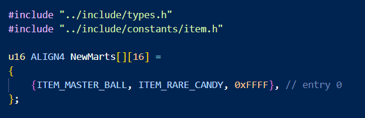

# Creating New Script Commands in HeartGold Engine
> Author: Senate

This guide will help you to create new script commands in HeartGold Engine (HGE). Because there are many, many script commands, it is infeasible to repoint the table
and pointers for all the original commands. However, we can essentially hijack a dummy, unused command and edit its pointer to point to our new code. The dummy command
we will edit in this guide is called DummyTextTrap (0xD0) in DSPRE. It has two parameters: a u8 (integers between 0 and 255) and a Flex (u16 (integers between 0 and 65535) or a variable value, depending on the value that is passed into it).

---

## Table of Contents
  - [Creating New Script Commands in HeartGold Engine](#creating-new-script-commands-in-heartgold-engine)
  - [Table of Contents](#table-of-contents)
  - [Acknowledgements](#acknowledgements)
  - [Prerequisites](#prerequisites)
  - [Part 1 - Repointing DummyTextTrap](#part-1---repointing-dummytexttrap)
  - [Part 2 - Making Your New Script Commands](#part-2---making-your-new-script-commands)
  - [Part 3 - An Example Script Command (in English HG)](#part-3---an-example-script-command-in-english-hg)

## Acknowledgements
BluRose: All the help in teaching me this!
AdAstra: Providing the locations of the HGSS script command table!

## Prerequisites
- Comfortability with C code
- Knowledge of the hexadecimal system

## Part 1 - Repointing DummyTextTrap
The table for HG script commands' pointers is located at the following offsets in a decompressed arm9:

**JAP**: 0xFA4B0

**ITA**: 0xFAC78

**DEU**: 0xFACB4

**FRA**: 0xFACE4

**SPA**: 0xFACE8

**ENG**: 0xFAD00

To find the location of the pointer to DummyTextTrap in your game, use the following equation: (0xD0 * 4) + BASE_ADDRESS.

Once you have found your location, which for the purposes of this guide will be with the English version, aka 0xFB040, it's time to tell HGE to repoint DummyTextTrap's pointer to your own.

Open up ``routinepointers``, which is at the base of your HGE folder, and add the following:

```
# New Script Commands, ID 0xD0
arm9 ScrCmd_master_new_script_command 080FB040
```

If you are using a game of another language, take your location and add 0x08000000 to it -- notice how the number I am using is just my location with 080 at the front This ``08`` at the front of the address means it's the absolute address within the arm9.

This instruction tells the compiler to enter the arm9 and change DummyTextTrap's pointer at 0xFB040 to point to whatever address ``ScrCmd_master_new_script_command`` is at in the final compiled rom.

## Part 2 - Making Your New Script Commands
Now that you have repointed DummyTextTrap to point to ``ScrCmd_master_new_script_command``, you can start making your commands.

Create a ``.c`` file in "../src" called "scripts.c".

In this, you should add the following at the top:
```c
#include "../include/types.h"
#include "../include/script.h"
```

This will cause the two files, types.h and script.h, to be included in your file upon compiling, and are necessary for many common functions that you will use in your script commands.

After those include statements, include the following:

```c
// script command 0xD0, DummyTextTrap/scrcmd_208
u32 ScrCmd_master_new_script_command(SCRIPTCONTEXT *ctx)
{
    u32 sw = ScriptReadByte(ctx);
    u32 arg0 = ScriptReadHalfword(ctx);

    switch(sw)
    {
    case 0:
    };
};
```
This has now established the ``ScrCmd_master_new_script_command`` function. Because DummyTextTrap's parameters are a u8 and a Flex as discussed before, we tell the compiler to recognize the first parameter as a byte (hence ScriptReadByte) and a halfword (aka 2 bytes; hence ScriptReadHalfword).

With this, there is a switch statement to give you as many cases as you need. The way this works is that if you type ``DummyTextTrap 0 0`` in DSPRE, it will now point to ``ScrCmd_master_new_script_command`` where it will parse the first 0 as telling it to start the code within ``case 0``, and the second parameter can be made into whatever you want as ``arg0``. In the above code, we have not defined anything for case 0 -- that's where you come in! Write your code under case 0, then move on to case 1, 2, 3, etc.

In the next section, I will give you an example of a script command we have in Legacy.

## Part 3 - An Example Script Command (in English HG)

In case 0, I have the following code:

```c
case 0: // shop 0 expansion
        *(u32 *)(0x0210FA3C) = (u32)NewMarts[arg0];
        break;
```

What this does is that it takes the pointer at address ``0x0210FA3C`` in the arm9, which points to the shops used by the ``SpMartScreen 0`` command, and changes it to point to the new array I made called ``NewMarts``, with entry number ``arg0``.

So, if I typed ``DummyTextTrap 0 3`` in DSPRE, it would cause ``SpMartScreen 0`` to now point to entry 3 in my array called ``NewMarts``.

Now, you may be thinking "wont this screw up the vanilla shop 0 in ``SpMartScreen``?" Yes, you would be correct! This is why I also have a command as case 1 to address it:

```c
case 1: // revert shop 0
        *(u32 *)(0x0210FA3C) = 0x020FBA54;
        break;
```
This will restore the pointer for ``SpMartScreen 0`` to its original value (in ENG HG) -- I use this command after the player has finished with the shop to restore shop 0.

To demonstrate ``NewMarts``, here is a picture:



Here I have created an array of items (for demo purposes -- no Master Balls and Rare Candies that easily for Legacy gamers), in which I can freely expand to add more entries for multiple shops.

I would be able to use this shop if I type ``DummyTextTrap 0 0`` in DSPRE because it would activate case 0 to update the pointer for ``SpMartScreen 0`` to point to entry 0 in my array ``NewMarts``. If you feel inclined to use this method for new shops, don't forget to add ``extern u16 ALIGN4 NewMarts[][16];`` at the top of your ``scripts.c`` file.

That's it! You have now given yourself a way to add new script commands. If you have any questions, please ask me in the [DSMC server](https://discord.gg/YBtdN3aXfv)!