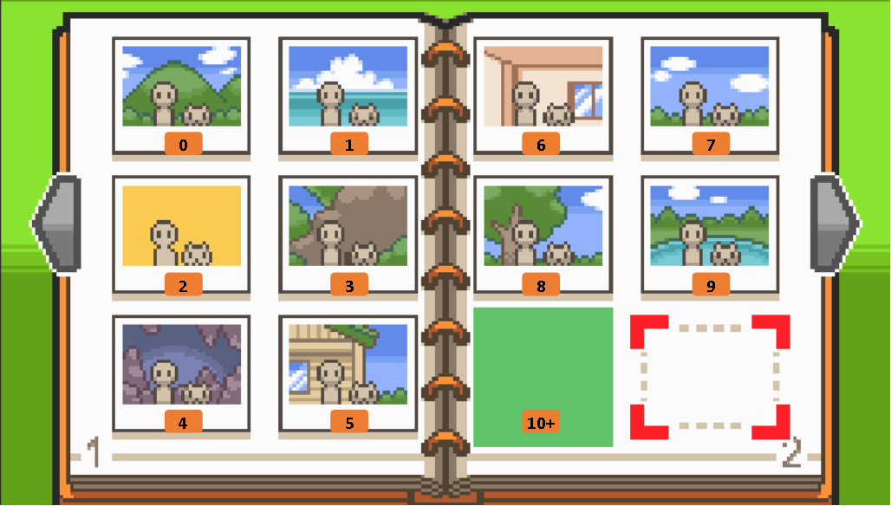

# Photo Locations
> Author(s): MrHam88.

This page summarises how **photo locations** are configured in Pokémon HeartGold and SoulSilver, and provides guidance on editing existing locations or adding new ones.

---

## Location
Photo location definitions are stored in the NARC at: `a/2/5/4`.
Photo album icon graphics are stored in the NARC at: `a/1/7/1`.

- Each file in this NARC represents a single camera/photo location that can be used by the `TakePhoto` command, see [scrcmd](https://docs.google.com/spreadsheets/d/1WE6aCJeVbIMDfWYPykQEqLyBAZCDK8YlYFBD6hChiVA/edit?gid=572153767#gid=572153767) for details on command usage.
- The structure used by the game is documented in the pokeheartgold decomp [here](https://github.com/pret/pokeheartgold/blob/44252f38568dc2c0dce3bd95970d678333f57c20/include/photo_album.h#L42)
- Most vanilla photo locations are listed on Bulbapedia, however their order does **not** match the order of entries in this NARC.

---

## File Structure

Each entry file inside the unpacked NARC is **16 bytes** long and follows the format:

```
AA AA BB BB CC CC DD DD EE EE FF FF GG GG HH HH
```

### Field Definitions

| Bytes | Name | Description |
|---|---|---|
| `AA AA` | Header ID | Header where the photo can be taken |
| `BB BB` | Photo Album Icon ID | Icon shown in the photo album (see below) |
| `CC CC` | Player X Coordinate | Global X coordinate of the player as they appear in the photo |
| `DD DD` | Player Y Coordinate | Global Y coordinate of the player as they appear in the photo |
| `EE EE` | Unknown | Always `01 FF` in vanilla |
| `FF FF` | Overworld Entry ID | NPC that appears in the photo, or `00 00` if no NPC |
| `GG GG` | Parameter 1 | Unknown |
| `HH HH` | Parameter 2 | Unknown |

All values are **little endian halfwords**.

---

### Photo Album Icons

`BB BB` determines the icon displayed in the photo album for that picture.

| Value | Icon |
|---|---|
| `00 00` | Mountain landscape |
| `01 00` | Sea |
| `02 00` | Yellow plain |
| `03 00` | Rough terrain |
| `04 00` | Cave (interior) |
| `05 00` | Building (exterior) |
| `06 00` | Building (interior) |
| `07 00` | Grassland |
| `08 00` | Forest |
| `09 00` | Lake |

Only some of these are used in vanilla.



---

### NPC Behaviour

The `Overworld Entry ID` controls whether the photo contains an NPC.

| Value | Behaviour |
|---|---|
| `00 00` | Group photo with the player's full party |
| Non‑zero | Player + first Pokémon + specified NPC |

The NPC used in the photo is taken **directly from this ID**, regardless of what NPCs are actually present on the map.

---

### Unknown Parameters

`GG GG` and `HH HH` are used in some vanilla entries but their exact function is currently unknown.

Important behaviour observed:

- If **no NPC is present** (`Overworld Entry ID = 0`), both parameters must be `00 00`.
- If either value is non‑zero in this situation, the game **fails to load**.

Despite appearing in some entries, these parameters do **not appear to visibly affect the resulting photo**.

Their purpose remains unresolved.

---

### Example Entry

Example: file `0009` (Route 34 Day Care).

```
26 00 05 00 6B 01 9A 01 01 FF 4A 01 00 00 00 00
```

Breakdown:

| Value | Meaning |
|---|---|
| `26 00` | Header `38` (Route 34) |
| `05 00` | Building exterior icon |
| `6B 01` | Player X coordinate `363` |
| `9A 01` | Player Y coordinate `410` |
| `01 FF` | Unknown constant |
| `4A 01` | Overworld Entry `330` (Day Care Man) |
| `00 00` | Parameter 1 |
| `00 00` | Parameter 2 |

Player global coordinates can be read from the **DSPRE Event Editor** by hovering the cursor over the map.

---

## Adding New Photo locations

The system is self-contained inside the NARC, so new entries can safely be added.

### Steps

1. Unpack the NARC `a/2/5/4`.
2. Create a new 16‑byte file matching the format described above for your desired photograph (or copy and edit an existing file as a starting point).
3. Set the new file's name to be the last current file +1
4. Ensure no temporary or backup files remain in the folder.
5. Repack the NARC.

A reference guide for unpacking NARCs can be found [here](/docs/universal/guides/unpacking_narcs/)

Once added, the new locations can be triggered normally using the `TakePhoto` script command and the index number of the new photo location. See the latest version of [scrcmd](https://docs.google.com/spreadsheets/d/1WE6aCJeVbIMDfWYPykQEqLyBAZCDK8YlYFBD6hChiVA/edit?gid=572153767#gid=572153767) to confirm the command name, parameters and parameter types.

---
