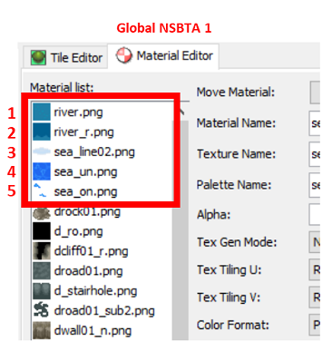

# Animations
> Author(s): [MrHam88](https://github.com/DevHam88).

This page summarises the main types of animations present in Generation IV Nintendo DS Pokémon games that are relevant for ROM hacking mapping purposes.  

As outlined in the summary page [here](/docs/generation-iv/guides/mapping/#textures-materials--animations), there are five types of possible animations that can be used in the Generation IV Nintendo DS Pokémon games. This page will provide more context and detail around the first three types:
 - Geometry SRT
 - Texture SRT
 - Texture Patterns

--- 

[← Return to Mapping Overview page](../mapping)

---

## Geometry Scale Rotate Translate (SRT)
These are skeletal animations, where parts of 3D models are moving relative to others (a good example from HGSS are the windmills in New Bark Town). They are also used in other non-mapping animations (such as the Lugia/Ho-oh model on the start game screen of SoulSilver and HeartGold respectively).

This animation data is held in `.nsbca` (*Nitro System Binary Character Animation*) files relevant to Buildings.

These animations are intrinsically linked to the model (e.g. building) that they are animating. Best practice is to configure these using a 3D modelling tool such as Blender, which can be used for the model and the animation. It is worth noting that different versions of the [NNS Blender plugin](/docs/generation-iv/guides/mapping/#tooling) are recommended for buildings (with one 'bone' per object) as opposed to complex animations such as the start game screen legendary Pokémon (which may require multiple 'bones' per object).

The following are some video tutorials that provide further context and instructions on the correct use of Geometry SRT animations:
 - [How to make Animated Buildings for Pokemon DS games](https://youtu.be/fXejyDusJ7s?feature=shared)
 - [Creating custom title screen with bone animations in Pokemon Platinum](https://youtu.be/JwBZUIpW66g?feature=shared)  

  
  

## Texture Scale Rotate Translate (SRT)
These are UV map animations, where the UV map position is essentially moved across the faces/polygons it is applied to (a good example from HGSS are the river and pond surfaces).

This animation data is held in `.nsbta` (*Nitro System Binary Texture Animation*) files relevant to maps (via **global** `.nsbta` files used in every areadata) and buildings (individual `.nsbta` files).

These animations are linked to a 'positioned' (HGSS) material in the map `.nsbtx` (for global `.nsbta`), or to a named material in the buildings. Custom `.nsbta` animations can be designed and created using 3D modelling tools such as Blender, and it is also possible to edit an existing `.nsbta` file using CTRMap (usually not a tool used in Generation IV mapping: see Generation V [Getting Started](/docs/generation-v/guides/getting_started/) Wiki page for details).

The following are some video tutorials that provide further context and instructions on the correct use of Texture SRT animations:
 - [Making your own .nsbta through blender](https://www.youtube.com/watch?v=uZdN3yjkzso)
 - [Steps to edit an existing .nsbta using CTRMap](https://discord.com/channels/446824489045721090/490610651002306561/1372676606442737756)

  

### Adding, Replacing & Deleting NSBTA Files
New global `.nsbta` can be added, replaced or deleted to the ROM using the Building Editor in PDSMS, on the "Area Data Editor" tab.  
The Building Editor in PDSMS applies changes to the unpacked "contents" folder created by DSPRE. To apply these changes to the ROM, the ROM must be:
1. Opened in DSPRE, ensuring that "Yes" is selected when the Data Detected dialog is displayed.
2. Saved to a `.nds` file using the Save button in DSPRE.  

Global `.nsbta` can also be assigned to specific Areadata in PDSMS Buildings Editor, or in DSPRE (after the Global `.nsbta` has been applied to the ROM). To assign "no animations" to an areadata in DSPRE, use an ID of `65535`.  

> HGSS uses global `.nsbta`, DPPt does not, and `.nsbta` are only used in these games for buildings.  

  

### Global NSBTA in HGSS (Vanilla)
Specifically in HGSS, texture SRT animations that apply to map elements (not buildings), are determined by the *order* of animations in the global `.nsbta` file associated to the areadata in use, and the order of the materials in the map files (`.nsbmd`).  
There are two global `.nsbta` in the vanilla HGSS, and it is also possible to assign an invalid global `.nsbta` (using an ID of `65535`) to remove all Texture SRT animations from that Header and associated maps.
1. Global NSBTA 0 (typically used for most external map locations)
2. Global NSBTA 1 (typically used for some, but not all, internal cave locations)

> Typically urban interiors (houses, shops etc.) have the global `.nsbta` set to an invalid value to disable them.

When creating custom maps in PDSMS (and therefore custom `.nsbmd` files), it is important to align the materials array order with the global `.nsbta` to be used.  

Achieving this is split into two parts:
1. Assigning the global `.nsbta` to the required Areadata (see [section](#adding-replacing--deleting-nsbta-files) above)
2. Ensuring that the Material Array in the custom map files is set correctly (see [section](#aligning-material-array-to-global-nsbta) below)   

### Global NSBTA in HGSS (Custom)
It is possible to import other global `.nsbta` files to HGSS, which can then be aligned to Areadata. When using a custom global `.nsbta`, the order should match that in the *custom* `.nsbta` configuration.  

A frequently desired use-case for this is to use the Generation V animations in a HGSS ROM hack (usually one that is using Generation V textures).  
The below image shows where to find the `.nsbta` used in Black 2 Version for overworld/route animations (`/a/0/6/8/8_0.BTA0`, ).

Achieving this is split into four parts:
1. Sourcing/creating a custom `.nsbta` file (see [tutorials](#texture-scale-rotate-translate-srt) above)
2. Importing a custom `.nsbta` file (see [importing section](#adding-replacing--deleting-nsbta-files) above)
3. Assigning the global `.nsbta` to the required Areadata (see [section](#adding-replacing--deleting-nsbta-files) above)
3. Ensuring that the Material Array in the custom map files is set correctly (see [section](#aligning-material-array-to-global-nsbta) below)  

### Aligning Material Array to Global NSBTA
To ensure a custom map correctly animates based on the selected global `.nsbta` (whether that is a vanilla selection, or custom imported file), the following must be done.

Ordering the materials in PDSMS's Materials Editor so that the top 'x' match the order and quantity in the global `.nsbta`.
The `Always include in IMD` checkbox in the Materials Editor is selected for all the materials in theglobal `.nsbta` to ensure that these specific materials are always present in the `.imd` (the file that is then used to define values in the `.nsbmd`), even if they materials are not used in the map.  

Both steps are crucial for avoiding animation errors in HGSS.  

Importantly for HGSS, the *names* of the materials don't matter at all, only the *positions*.  

When using vanilla **Global NSBTA 0**, the following order of materials should be used:
1. S-shaped top right to bottom left, then top left to bottom right movement
2. Up-and-down small movement (slightly vertically offset)
3. Right-to-left movement
4. Up-and-down small movement
5. Diagonal bottom left movement to top right
6. Diagonal top right to bottom left movement
7. Same as position 1
8. Same as position 3

When using vanilla **Global NSBTA 1**, the following order of materials should be used:
1. S-shaped top right to bottom left, then top left to bottom right movement
2. Right-to-left movement
3. Up-and-down small movement
4. Diagonal bottom left movement to top right
5. Diagonal top right to bottom left movement

  

  

When using **NSBTA 8_0 from Black 2** (as a Generation V example), the following order of materials should be used:
1. ue_grass01
2. kawa01a
3. kawa01b
4. kawa01b_1
5. kawa01b_2
6. shore01
7. sea_zanami2
8. sea_zanami
9. sea_mizu1
10. sea_mizu1_1
11. sea_gake02
12. sea_asase02
13. mizu_sita2
14. ike01

## Texture Patterns
These are "flipbook" or sequence animations, where a series of image textures are displayed in sequence, where the relative time any given image texture is visible can vary (an example of this from HGSS are the red and white flowers placed on many grass areas).  

This animation data is held in `.nsbtp` (*Nitro System Binary Texture Pattern*) files relevant to Buildings, and a `.bin` file relevant to maps.

The process for creating a texture pattern varies slightly where the intended use is for a map element/tile or a building. The below tutorials provide the methods for both.

 

The following are some tutorials that provide further context and instructions on the correct use of Texture Pattern animations:
 - [How to add animated tiles in Pokemon DS maps](https://youtu.be/Rsweh-nSwuc?feature=shared)*
 - [Making Flipbooks using Texture Pattern Animations](/docs/universal/guides/nsbtp_creation/)

**This video refers to Platinum (in terms of file locations). When hacking Platinum Version, the animation files that must be replaced/added to are located in `data/data/fldanime.narc` (as mentioned in the tutorial). When hacking HeartGold or SoulSilver Versions, the animation files that must be replaced/added to are located in `data/data/a/1/3/9` instead. Credit to xZERCx for documenting this.*

### Fixing Texture Pattern Palettes when using Custom NSBTX
Since texture pattern animations use a series of textures (not just the first one that's used in a tile in PDSMS), the palette used by the full range of images in the pattern will likely have more colours. These means that if a custom `.nsbtx` is created with one of the named textures that uses pattern animations, the palette from the custom `.nsbta` will result in incorrect colours being displayed when the animation play.

Therefore it is advisible to selectively take the palette from these specific materials from a vanilla `.nsbtx` file and replace the custom `.nsbtx` entries of the same name. This replacing of textures and/or palettes can be achieved using the PDSMS NSBTX Editor to open the `.nsbtx` and then import the "good" textures and palettes from an exported vanilla `.nsbtx`, delete the original and re-save the `.nsbtx` file.

In HGSS there are nine Pattern Animations in the mapping bin file. These relate specifically to the following materials, if these are used on a custom map, they should be replaced with vanilla texture/palettes:
1. sea_on
2. swave_p
3. swave_un
4. sea_rock
5. sea_rock_m
6. flower01
7. flower02
8. dsea_on
9. r_sea_rock  

Textures 1-7 are commonly found in the main overworld in HGSS, Textures 1, 4-5, 8-9 are used in some caves.