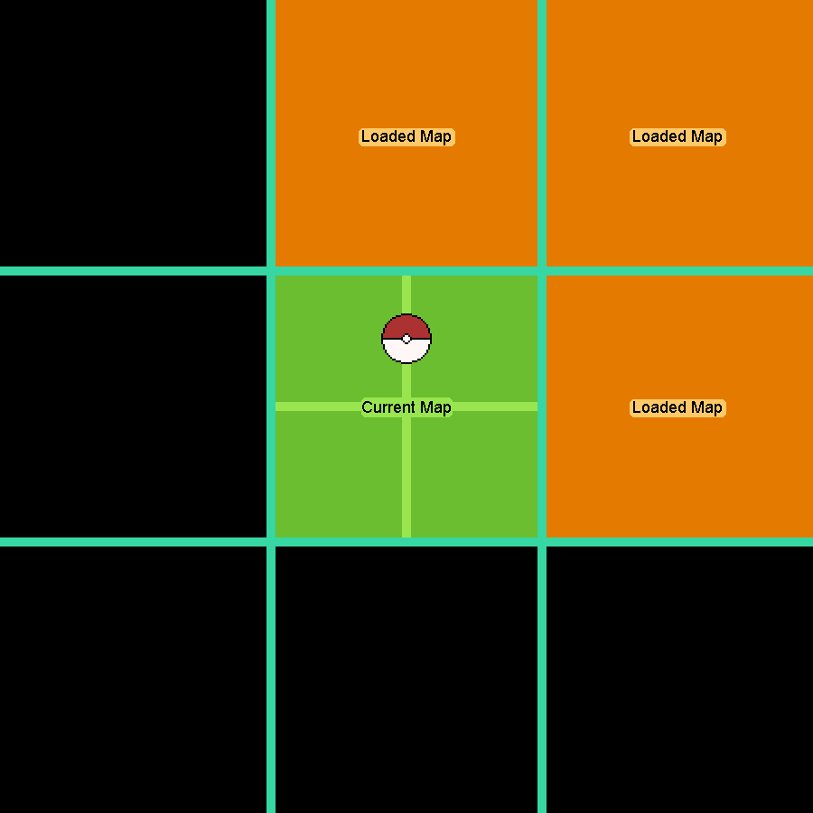

# Mapping
> Author(s): [MrHam88](https://github.com/DevHam88).

This page is intended to help you get to know the relevant components associated with map definitions in Generation IV Nintendo DS Pokémon games (Diamond, Pearl, Platinum, HeartGold & SoulSilver versions), and to understand how to interact with these to create and edit custom maps.

--- 
## Concepts, Constraints, Structures & Guidance
### Hierarchy/Structures
As with many elements of Generation IV Pokemon ROM Hacking, the data structure begins at the **Header**, with items within this hierarchy inheriting and/or sharing information.

#### Summary
A simple outline of the structure is below:
 - Header
    - Area Data
      - Mapping Texture Pack (`.nsbtx`)
      - Building Texture Pack (`.nsbtx`)
      - Global Animation File (`.nsbta`)*
    - Matrix
    - Map (`.nsbmd`)
      - Terrain Data (`.bdhc`)
      - Permission Data (`.per`)
      - Background Sound Data (`.bgs`)*
      - Building Data (`.bld`)
    - *Various other data & files not directly related to mapping.*

**HGSS only*

Some of these data are unique per the higher level of hierarchy (for example, there must exist one and only one set of Permission data for every map file), whereas others have different relationships (one matrix may contain one or more instances of one or more map files, and conversely zero or more headers may use any given mapping texture pack).

#### Maps
Map models in Generation IV Pokémon games are singular 3D models, and may be *conceptually* divided into a grid of 1,024 grid squares (32x32). Each grid square is the equivelent to 16 metres when viewed in 3D modelling software (such as Blender), for a nominal map size of 512 metres squared. However, the majority of the ROM Hacking tools that are in common use will apply a scale factor of 0.0625 (for example this scaling is visible in the DSPRE Map Editor 'Buildings' tab).

> For the purposes of simplicity, this guide will refer to each 1/32 division as one "**unit**" of distance; so a map is nominally 32 units wide by 32 units deep, and each grid square is one unit wide and one unit deep.

It is possible for the map model to extend beyond the square 32x32 units area, but the data from levels of hierarchy below the 'Map' level cannot. Functionally, this may be implemented to provide additional visual-only elements that extend beyond the map boundary, or to have model elements/geometry that straddle the boundary between adjacent maps.

One **unit** (the width of one grid square) is:
 - Aproximately equivelent in size to the width of the player sprite.
 - The smallest complete in-game movement distance possible by the player or other overworld sprites.

 Each map grid square is attributed with a number of data points from the lower levels of hierarchy (below the 'Map' level):
  - Terrain Data
  - Movement Permissions (two data values, one each of the below)
    - Collision
    - Type
  - Background Sound

#### Map Attributes

| Attribute | | File Extension | Detail |
| :------------------: | :---------- | :-----: | :--------------------------------------------------------------- |
| **Terrain Data** | | .bdhc | Each terrain "plate" **may** intersect with a grid square zero or more times. These plates represent the z-axis heights the the player and other overworld sprites can laterally move along (on each grid square), and may be parallel to the "ground" or angled to allow ascent or descent. Terrain plate boundaries must adhere to grid square boundaries horizontally (in the x and y axes), but can be set to smaller divisions of distance vertically (in the z axis). |
| **Movement Permission** | | .per | Each grid square **must** contain data for each of the following: |
| ---> | **Collision** | | A small set of values which determine significant restrictions upon the overworld sprite movements, and some associated sounds (for example a value of `04` in HGSS allows movement and produces the grass rustling noise when the player sprite moves on this grid square, while `80` prevents any overworld sprites from moving on the grid square, regardless of terrain data). |
| ---> | **Type** | | A larger set of values that provide additional functionality within the game (for example `02` in HGSS is the Permission Type required to trigger tall grass animation when the player intersects with the grid square, and wild Pokémon encounters if the appropriate encounter table and encounter rate are populated). |
| **Background Sound** | | .bgs | Each sound "plate" **may** intersect with a grid square zero or more times. These plates determine whether a specific background sound will play when the player sprite is present on the grid square. *HGSS only.* |

  

### Editing Maps & Tooling Abstractions
As mentioned above, in these games, each map is a *discrete 3D model*, with various additional attributes assigned to it, and each of the 1,024 grid squares within it. Of particular importance is that, in addition to the single 3D model per map, commonly used (and typically more complex) 3D models can also be placed "on top of" this, these are referred to as "Buildings" (whether or not they are actually a representation of a building).

There are a number of ways that maps can be changed from the original (or "vanilla") model:
1. **Edit the 3D model:** Exporting the full 3D model from the game, and making changes in a 3D modelling software (such as Blender), before re-importing.
2. **Place additional Buildings:** Additive changes (adding something that was previously absent, such as a patch of tall grass, or a ledge), by placing more instances of buildings onto the map (either buildings from the original game, or custom ones), using the DSPRE tool.
3. **Re-create the map:** Re-creating the map (with either small or large changes to the original) using the PDSMS tool, using its tile-based asset placement system, and re-importing.
4. **Re-texture the map:** Only replacing the textures of the models, without chaning the geometry, can be done by altering the image textures in the `.nsbtx` (while retaining the same names).

Option three is usually the most accessible method for large changes (or changes that involve the *removal* of some elements of the map). Option one may be appropriate for someone with experience in these tools, but it is also limiting (as the changes are purely applied to that instance of the map model, and effort expended here cannot directly have benefit for other maps).

> It *is* worth noting that there are some situations where original maps are difficult to re-create in PDSMS faithfully, as some element does not work well with the tile-based asset placement system.

#### Tiles
In order to create a map in PDSMS, component models must be created, which are reusable components that contain some (usually smaller) aspect of an overall map, for example: a tree. These components are commonly referred to as **tiles**, and are composed of two files with the extensions `.obj` & `.mtl`. It is important to remember that **tiles** are a complete abstraction within PDSMS, and have no meaning in the original games: there are no ready-made tiles to extract and use from the base ROM.

Some examples of basic tiles are shown below (from the "Tileset 2 - Overworld" tileset that is included with PDSMS), the white grid shown represents the 32x32 subdivision of the map, where each grid square is one unit by one unit.
  

#### Tilesets

**Tilesets** are groupings of **tiles** that also include a number of other attributes, such as the texture & material data and attributes and definitions for some PDSMS-specific features (for example "Smart Drawings").

Some commonly-used **tilesets** are included with the PDSMS tool, and others are created and shared in ROM Hacking communities, such as the **Kingdom of DS ROM Hacking** Discord server.

> See the following pages for more detail on [map & building models](/docs/generation-iv/guides/mapping/models), and [tiles and tilesets](/docs/generation-iv/guides/mapping/tiles_and_tilesets)

### Textures, Materials & Animations
#### Textures and Materials
The geometry or "mesh" of a 3D model is the basis for all maps in Generation IV Pokémon games, but without different textures to apply to the faces/polygons of the geometry, the maps would be completely uniform in colour (discounting attributes such vertex colours).
 - A **texture** is the image file that can be "mapped" to the faces of a mesh.
 - A **UV map** is the exact mapping of the image texture to each face of the mesh.
 - A **material** is an instance of the **texture** with multiple other attributes (ranging from 'out of bounds' options that define what happens if the UV extends beyond the boundary of the image texture, to colour formats such as `16-colour` palette or `A3I5`).

In Generation IV Pokémon game hacking there are a number of rules that must be adhered to (some are from game constraints, others from tool constraints):
 - Every face/polygon **must** be assigned a material, which must relate to an **image** texture.
 - Every tile `.obj` to be imported into PDSMS as a tile **must** have no unused material slots/definitions.
 - Every tile `.obj` (in PDSMS) **must** have no more than one material that uses any given image texture.

#### Animations
Various types of animations are possible in Generation IV Pokémon games, below is a brief overview of these types:
1. **Geometry Scale Rotate Translate (SRT):** these are skeletal animations, where parts of 3D models are moving relative to others (a good example from HGSS are the windmills in New Bark Town). This animation data is held in `.nsbca` (*Nitro System Binary Character Animation*) files relevant to Buildings.
2. **Texture Scale Rotate Translate (SRT):** these are UV map animations, where the UV map position is essentially moved across the faces/polygons it is applied to (a good example from HGSS are the river and pond surfaces). This animation data is held in `.nsbta` (*Nitro System Binary Texture Animation*) files relevant to maps (via **global** `.nsbta` files used in every areadata) and buildings.
3. **Texture Patterns:** these are "flipbook" or sequence animations, where a series of image textures are displayed in sequence, where the relative time any given image texture is visible can vary (an example of this from HGSS are the red and white flowers placed on many grass areas). This animation data is held in `.nsbtp` (*Nitro System Binary Texture Pattern*) files relevant to maps and Buildings.
4. **Material Animations:** rarely used animation types (an example from HGSS are the bells from Lugia's chamber in the Whirl Islands). This animation data is held in `.nsbma` (*Nitro System Binary Material Animation*) files relevant to Buildings.
5. **Visibility Animations:** unknown use in Generation IV Pokémon games. This animation data is held in `.nsbva` (*Nitro System Binary Visibility Animation*) files.

> It is worth noting that these animation types can be combined. For example, the "tips" of the ocean waves in HGSS use texture pattern animations to change the image texture being displayed, ***and*** texture SRT animations to diagonally translate the UV across affected faces/polygons. These compound effects can create a much more immersive player environment.

  
  

There are various methods & tutorials detailing how to create and edit these animations, and there are differences in use and implementation between HGSS & DPPt games.

> See the following page for more detail on [animations](/docs/generation-iv/guides/mapping/animations) in Generation IV games.

### In-Game Performance
As a handheld games console from 2004, the Nintendo DS (and consequently the games designed for it) does not natively have the same graphical capabilities of any modern games consoles. There are a number of constraints that should be considered, some specifically relevant to mapping and graphical rendering (which also crosses into other areas, such as quantity of sprites on screen, for example).

These constraints often come down to **file sizes**. When modifying the files that makes up the visible map, it is possible to increase the file size itself (typically by adding more detail in one way or another). Comparatively large file sizes (compared to the orignals) may result in performance degredation, loss and/or crashes. An
examples may be:
 - **Texture quantity/sizes:** The texture pack (`.nsbtx` file) loaded for the map and/or buildings has increased in size because either: the quantity of textures has signifiicantly increased; and/or the dimensions of these images are very large.
  - **Polygon quantity:** The number of polygons (`.nsbmd` file) loaded for the map and/or buildings has increased in size due to more detailed/complex geometry/meshes.

There are no "hard and fast" rules on maximum file sizes or quantity of polygons, as these are just elements of a much wider array of things that are consuming game resources. However, some proven guidelines are:
 - Aim to keep files close to the range of the originals as possible (tools such as DSPRE) allow the user to view the existing file sizes in many cases.
 - When adding or editing textures:
    - Stick to "legal" texture sizes (any combination of 8, 16, 32, 64, 128, 256, 512, 1024px),
    - Use the smallest possble colour format (based on number of unique colours),
    - For authentic Nintendo DS look and feel, a ratio of about **16px per unit** (grid square width) is sufficient.
 - Certain material settings have an impact on other files, for example non-uniform normals data can add considerable content to an `.nsbmd` file.
 - Some tools will provide warnings at certain file size thresholds (for example PDSMS when converting a map to `.imd`)
 - When the player navigates the map in-game, up to four adjacent maps in a square will be simultaneously loaded based on the player sprite position. The polygons on all of these maps, including any visible buildings and dynamic overworld sprites results in the total rendered polygons at any one time. The four maps are:
   - The map the player sprite *is on*,
   - The adjacent map *horizontally closest* to the player sprite,
   - The adjacent map *vertically closest* to the player sprite, and
   - The adjacent map *diagonally closest* to the player sprite.
  - A general 'rule of thumb' would be to aim for a polycount of **less than 1,000 polygons** per map file where possible, particularly for main overworld maps. It is not recommended to exceed 2,000 polygons total (maps, buildings, sprites) per map.  
  - There is a lot of contextual 'wiggle room', for example, the following may perform adequately: a single high-polygon count map surrounded by very low polygon count maps (or no maps even, consider somethng like a cave matrix that only has a single map within it).

This GIF from **Shamanka27** demonstrates the map loading: the green square is the map the player is in and the yellow are the loaded maps from the maps surrounding that map, while the red dot is the relative position in the map the player is stood.

### Scaling & Conversions 
As previously detailed, the scale of the map files (and therefore all associated files such as buildings), is arbitrarly 512 metres squared. However, the primary tool for map creation requires this to be scaled to 1/16th of the size (scale factor of 0.0625). When maps are converted in PDSMS ready to be imported back into the game, this scaling is automatically completed as long as the correct import steps are taken sequentially.
However the scale factor is useful to know when extracting or "ripping" models from vanilla maps. If a full 3D model of a map is exported from DSPRE, it will need scaling down by a factor of 0.0625 to be scaled correctly for PDSMS. The scaling can be completed either within the 3D modeling software when processing the model from `.dae` to `.obj`, or as a selectable scale factor entered during the import of the `.obj` file to PDSMS.
Additionally, the default Y & Z axes will need to be swapped when importing the same model into PDSMS. Again, this can be completed within the 3D modelling software, or as a checkbox when adding the `.obj` to PDSMS.

## Tooling
The primary tools used for Generation IV mapping are detailed in the [Generation IV Getting Started](/docs/generation-iv/guides/getting_started/) page (PDSMS, DSPRE, Emulation software such as MelonDS, and in some cases Tinke). However, there are a number of additional tools & plugins that are of use when mapping, which are outlined here.

| Tool / Plugin Name | Notes |
| :--------------- | :--------------------------------------------------------------- |
| [Blender](https://www.blender.org/download/releases/4-2/) | Widely used free 3D modelling software. There are specific versions which are not recommended due to issues with .obj import/export functionality. Safe & recommended versions include versions `2.78`-`2.83`, and versions `4.2`. |
| [Nintendo Nitro System (NNS) Blender plugin](https://www.mediafire.com/file/x8z2pgz96l04t2s/nns-blender-plugin-master_pokemon_buildings.zip/file) | Used for creating correct .NSBCA animation files for geometry/skeletal animations with one 'bone' per object definition (**buildings**) |
| [Nintendo Nitro System (NNS) Blender plugin v0.2.1](https://github.com/jellees/nns-blender-plugin/releases/tag/v0.2.1) | Used for creating correct .NSBCA animation files for geometry/skeletal animations with multiple 'bones' per object definition |
| Maya Blender plugin | Plugin that allows for the creation of NSBTP (Nitro System Binary Texture Pattern) files, used for "flipbook" animations |
| [FreshLad's DS Blender plugin](https://discordapp.com/channels/446824489045721090/1361335146653028492/1361335146653028492) | QoL plugin to reduce steps/complexity when working with 3D models |
| MarioKart DS (MKDS) Course Maker | Tool used in the creation & editing of pattern animations | 
| [Apicula](https://github.com/scurest/apicula) | Tool for converting to/from the Nitro files that are used throughout DS games, in particularly for mapping related elements, including various animation types |
| [GIMP](https://www.gimp.org/downloads/), [Paint.net](https://www.getpaint.net/), [Nitropaint](https://github.com/Garhoogin/NitroPaint) | Simple painting tools useful for editing and creating textures. These examples contain many relevant features, for example simply being able to configure the alpha channel for translucency/transparency|

## Resources

There are a number of helpful resources for both beginner and experienced mapping ROM hackers, that roughly fall into three categories:
1. Video & written tutorials & guides
2. Support communities (including tooling support)
3. Mapping assets

### Attribution
Remember, attribution (crediting someone for help and/or resources small or large) is always the right thing to do. Consider the metaphor:
> "We stand on the shoulders of giants"

Without those who have created the tools to enable accessible mapping, this would be an area of ROM-hacking restricted to a knowledgable few. Without assets created and shared freely, we may not have been able to progress towards our individual and group hacking goals (without significantly more time and effort).

### Video & Written Tutorials & Guides
 - [Trifindo's PDSMS Video Tutorial Series](https://youtube.com/playlist?list=PLMApHmLZV8Su89cIfu1KCOhdeCENJFgAa&feature=shared)
 - [JaySan's Beginner Video Mapping Tutorials using PDSMS Series](https://youtube.com/playlist?list=PLKTW2ZuQjbEH5mUYt1rM0R8jLZGVlyIX8&feature=shared)
 - [SauceyaTTa's Mapping Introdction (HGSS)](https://youtu.be/793-cuRe8Tw?feature=shared)
 - This Wiki!

### Support Communities
 - The [Kingdom of DS ROM Hacking (KoDSH)](https://discordapp.com/channels/@me/1314711434097332234/1395005701935464539) Discord server. Generation IV mapping related support channels:
   - #mapping-general: Here you can post your finished maps, your WIPs, and everything map related!
   - #g4-mapping-support: Trying to create a new map? Having problems with warps? Ask your questions here!
   - #tutorial-videos: links to the JaySan mapping tutorials (amongst others).
   - #tutorial-zone: community content on achieving specific ROM hacking goals (including and beyond mapping)

### Mapping Assets
 - The [Kingdom of DS ROM Hacking (KoDSH)](https://discordapp.com/channels/@me/1314711434097332234/1395005701935464539) Discord server
   - #tile-sharing: community-created tiles and tilesets for PDSMS are shared here for use by others (attribution is required if stated by the sharing party, but encouraged in all cases).
 - [Google Drive of tiles collected/curated by Monkeyboy0](https://drive.google.com/drive/folders/1Hj9_6hVH96B2uYwTsseHPubdcxgkbTyl).

## Further Details
For more information on specific subjects, review the other pages in this section, and the overarching Generation IV Guides section.