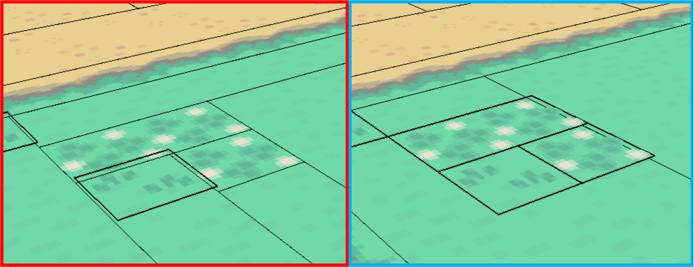
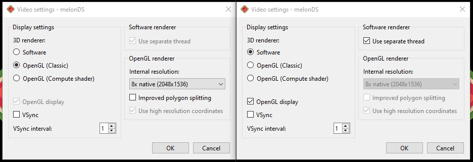

# Models
> Author(s): [MrHam88](https://github.com/DevHam88).

This page summarises how the Generation IV Nintendo DS Pokémon games use 3D models in the context of maps (and buildings), and provides guidance on some PDSMS features related to general models/meshes and geomtery.

--- 

[← Return to Mapping Overview page](../mapping)

---

## Files

3D models in these games use the `.nsbmd` (Nitro System Binary Model Data) file format, details of which can be found [here](https://wiki.vg-resource.com/Nitro_Files#1._NSBMD_Format).  

### Export from ROM
Since this file type is not editable in 3D modelling software, hacking tools such as DSPRE and SDSME allow for converting and exporting the models in other more accessible formats (e.g. `.dae`), which can then be subsequently transformed and exported as `.obj` files, which are able to be imported to PDSMS as tiles.  

### Import to ROM
The PDSMS mapping tool takes imports of `.obj` files, and can also output the maps created as `.obj` files, which are then converted to `.nsbmd` files via an intermediate `.imd` file. Alternatively, PDSMS allows for export of all map-related files (including Permissions, Terrain, Background Sounds) packaged together as a `.bin` file.

## Components
In the most basic sense, a 3D model is made up of vertices, edges and faces (polygons). Models used in these games require all polygons to be triangles or quadrilaterials to render. A polygon with more than four sides is called an "n-gon", and will not render in-game if used in map or building models. Some geometry patterns result in more memory-efficient stored data within the overall model data. [Triangle strips](https://learn.microsoft.com/en-us/windows/uwp/graphics-concepts/triangle-strips) are an example that is applicable to Generation IV Nintendo DS Pokémon games, where all three vertices for each individual triangle do not need specifying if they are shared by adjacent triangle faces.  
> Ultimately, a four-sided polygon is a very simple triangle strip where coordinates for only four vertices are needed, instead of six. When using quadrilaterals, these should be co-planar, if not, triangle strips are required.  

Ensuring map and building models are efficient (such as in lower polygon counts) is good practice, and while it may not be *required* for every model built, it can be advantageous to ensure game resources are not unecessarily used, and thus available for other things, such as materials, overworld sprites etc.  
> See also: [In-Game Performance](/docs/generation-iv/guides/mapping/#in-game-performance).

## Model Types
3D models are used in two ways in terms of mapping in Generation IV Nintendo DS Pokémon games: maps & buildings.
### Map Models
Map models typically form the bulk of the visible 'world' to the player, the ground, walls, trees, water and *predominantly* non-interactable objects (this has a large asterisk on the definition of interactable, many Permissions will result in some kind of interaction which is not technically related to the map model, such as Headbutt trees, surfing or fishing).

### Building Models
Building models are typically used for literal buildings, and other repeatable objects that appear on a map. Buildings can have unique animations (and not restricted to the animations avaiable to the map model), animation types (such as [Geometry SRT](/docs/generation-iv/guides/mapping/animations#geometry-scale-rotate-translate-srt)) & animation triggers (such as doors, or day/night lights). Buildings take their textures from the buildings `.nsbtx`, and not the map `.nsbtx`. Multiple instances of the same building can be placed on any given map, and across multiple maps.  

Here are some video tutorials on creating a custom buildings and importing them into a ROM, which is an excellent introduction to buildings configuration and use, including geometry animated buildings. 
 - [How to add custom Buildings - Part 1: Modelling the building](https://www.youtube.com/watch?v=YOLRIAkzAfs&list=PLMApHmLZV8SvXBAXYdVlptICFoKPT-a3x&index=4)
 - [How to add custom Buildings - Part 2: Adding buildings into the game (DPPt)](https://www.youtube.com/watch?v=Eo_uIwvWQIs&list=PLMApHmLZV8SvXBAXYdVlptICFoKPT-a3x&index=5)
 - [How to make Animated Buildings for Pokemon DS games](https://www.youtube.com/watch?v=fXejyDusJ7s&list=PLMApHmLZV8SvXBAXYdVlptICFoKPT-a3x&index=6)

### Choosing: Map or Building?
There are times when a decision one whether to import a model as a map or building need to be made, there are a number of factors that can be considered, including:
 - Does the model require any geometry SRT animations (elements of the model that physically move in relation to the rest)?
 - What materials/textures does the model use, and are these already available in either map or building `.nsbtx`?
 - Will the model's placement relative to the 32x32 grid squares be static (i.e. any given vertex of the model will always be the same distance from the corner of a grid square intersection)?
 - Is the model additive only (no removal of geometry from the vanilla map model is needed, i.e. can placing the new model "on top" of the existing model achieve the desired outcome)?
 - Are there (or could there be) performance issues from loading the model every time the map is loaded, regardless of whether the model is in view (buildings are de-spawned when out of view, whereas map models are always loaded if the map is loaded)?

## PDSMS Features
As discussed [here](/docs/generation-iv/guides/mapping/#editing-maps--tooling-abstractions), map models in the vanilla ROMs are discrete 3D models, which are abstracted in various ways by Pokémon DS Mapping Studio (PDSMS) to allow for easy map creation, before the "abstractions" are built into the required file formats to insert back into the ROM when the map is exported.  

Some of these abstractions require and/or allow for some further features that help in map-building, such as heights and layers.

### Heights
#### Tile Height Context
Each tile that is placed in PDSMS has it's own relative verticality and height.  

For example (as can also be seen in the screenshot below):
 - A ground tile may be a single quadrilateral polygon with all four vertices at the same height (relatively "zero" in the context of the tile), but occupying the four corners of a single tile grid square.
 - A boulder/rock tile may be a single quadrilateral polygon where two pairs vertices are at the same height, but the pairs have different heights, creating an angled geometry which has some height. In this case, even the lower vertices may not be at a height of "zero" in the context of the tile.
 - A tree (at least in some cases), is a combination of the two, with one polygon parallel to ground, and another angled.

 

 In order to use the same tile for ground (grass in the screenshot above) at different heights, there are three options, with one being significantly preferrable to the other two:
 1. Use PDSMS map heights functionality to use the same tile at different heights as desired/required.
 2. Create a duplicate tile and use the `Z Offset` tile property (available only in the AdAstra fork of PDSMS).
 3. Create a new (or edit a copy) 3D model in a 3D modelling tool such as Blender and vertically edit the relative position of the geometry.

Using option one allows for a much cleaner tileset and a simpler user experience. Option two is quick to implement, but has the disadvantage that the 'offset' is no visually applied in the preview, or when placing the tile and results in unecessary duplication. Option three is more time-consuming and results in unecessary duplication.

#### Map Heights
Heights are defined in PDSMS **per grid square** of a map grid, within each **layer** (for clarity on the use of the term "grid square", see [here](/docs/generation-iv/guides/mapping/#maps)). The map heights are only visible for the selected map grid (and not adjacent maps), and are made visible by selecting the blue gridded button hightlighted in purple in the screenshot below. The height of any given grid square can be set by selecting the desired value from the range on the right side (highlighted in blue below), and either left-clicking on a single grid square, or centre-clicking to fill a continguous range of grid squares.

It is important to remember that:
1. Map heights are configured **per layer** (though it is possible to [copy map heights from one map layer to another](#copying-and-pasting)).
2. Each grid square **always** has a map height, the default in PDSMS being `0`.

 

### Layers
As PDSMS is a tile-based system, with a 32unit x 32unit grid, each grid square can be given only a single 'tile'. However, importantly, this is ***per layer***.

 - There are **eight layers** available for use in PDSMS (highlighted in red below), or **nine layers** in the AdAstra fork of PDSMS, the currently active layer is shown with a red bounding box.
 - In the AdAstra fork of PDSMS only, layers can be moved in terms of position using the up and down arrows on the bottom of the vertical toolbar (highlighted in blue below).
 - Layers can be made **visible** or **invisible** from the right-click menu, or by centre-clicking.
 - The entire content of a layer (tiles and heights) can be **erased** by selecting the "Clear Layer" option from the right-click menu.

> Moving the position of a layer in PDSMS has no bearing on the finished map model, and does not in any way denote height or position in and of itself, however when rendering within the main viewer in PDSMS, the higher position layer will take priority in cases of [co-planar, co-located geometry](#multiple-co-planar-co-located-geometry).

#### Layers Use Case
Layers allow multiple tiles to occupy the same `x` and `y` co-ordinates on the grid. A simple example of where this is desirable is to have flowers 'on top of' grass, where the flower tile uses a texture that is transparent except for the flower shape itself. This 'overlaying' approach is highly useful when designing and building tiles for two main reasons:
1. It allows a single overlay tile (such as a flower) to be **used with any number of ground tiles** (for example different colours of grass, or even the transition between grass and a path).
2. It prevents an 'interruption' in the underlying polygon that could result in larger polygon count, which could in turn have **performance and visual impacts**.

To demonstrate this, see the examples below.
 - On the left is tile made from a vanilla material in the HGSS game for a type of non-animated flower.
    - This texture has the underlying grass included in it, so much be placed at the same height as the rest of the ground, but interupting the main ground polygons.
    - This has resulted in three new polygons being required.
    - This also means it is only really usable on this exact grass colour/texture.
 - On the right is a tile made from a custom adpatation of the same material.
    - This texture has had the background grass element replaced with transparency, and the 3D model of the tile has been raised up (on the z-axis) by 0.0625 units.
    - It is placed in a different layer, and therefore does not interrupt the underlying polygon and can be used on top of different underlying textures.  

The total polygon count of this map (which is a recreation of New Bark Town), is **245** for the left model, and **242** for the right model. In this map, these tiles/textures are only used once in this single location, so the impact is small, but the impact would be larger if the tile were used more frequently.

> An example of where this *hasn't* been done in the vanilla games, but a cleaner outcome would have occurred if it *had*, look at Blackthorn City in HGSS at the short walk from the exit of Ice Path. You'll find two small areas of ground using the `flower03` material, the first has dark green 'background' grass, but is places on light green grass; the second interupts the transition between light and dark grass.

#### Copying and Pasting
PDSMS supports a "per map, per layer" copy and paste functionality. It is not possible to directly copy/paste selected elements or tiles within a map, but it is possible to copy an entire map layer, and then paste onto another layer (on the same or a different map grid). When pasting, there are multiple options that can be selected:  
1. Paste Tiles (this will paste *only* the tiles themselves)
2. Paste Heights (this will paste on the heights settings applicable to the layer)
3. Paste Layer (this will paste both the tiles and heights)

> There are different potential use-cases for each option, but for example, when building a map that uses multiple layers, being able to determine the heights once, and then copy/paste these to all other used layers can be a significant time and error save.

### Geometry Interactions & Issues
There are a number of model, mesh or geometry-specific interactions that can occur that have undesirable consequences for in-game use. Some examples are listed here.

#### Multiple Co-Planar, Co-Located geometry
This can be seen to be referred to as "z-fighting" or "clipping" in various places. If two polygons occupy some or all of the exact same space in a map or building model, the image textures that are mapped to the polygons will "fight" for visibility. This can be seen in-game as a flickering of the textures.

A fairly common situation where this may happen is where a map is built using ground tiles that occupy a tile-relative height of `0` and a map layer height of `0`, and in another map layer a tree tile is placed at the same map layer height of `0`, where the tree contains two polygons, one for the vertical foliage element, and one for the base and tree trunk.  
The flat polygon in the tree tile is also positioned at tile-relative height of `0`, and so when the entire map is built, this polygon occupies the same z-axis position as some of the ground tiles. In this case the trunk and shadow of the tree will appear to flicker in and out of view (also often depending upon the camera position/angle at the time). The grass/ground is also "z-fighting", but this is not visible, because both competing polygons look the same in these areas.
 - This issue is **not** noticeable in the "NSBMD Preview" window when exporting map files.
 - This issue can  also usually be seen in DSPRE after the map has been imported, either as a striped effect between textures, or invisibility of the desired texture (and zooming in/out can also shift the visibly affected areas).
 - A good practice to follow is to always allow a minimum distance of `0.0625` (or 1/16th of a unit) between polygons that have parallel planes.
 - This issue can be masked or highlighted in PDSMS due to the way that layers are rendered. If one gridsquare is occupied by two co-planar polygons from tiles on different layers, PDSMS will render the highest position layer and hide the other. This "priority" effect exists only within PDSMS.

#### Gaps in the Map Geometry
This issue is less obvious, but can be seen in many cases. Essentially, the player can see "between" two adjacent polygons to what is behind them. In lots of cases, what is behind is nothing, so what is seen is the black "void", but it is also possible to see other polygons/textures that are vertically lower and underneath.
 - This actually occurs in the vanilla games. If a ROM of a vanilla Generation IV Nintendo DS Pokémon game is played on an emulator such as MelonDS on a PC, this issue may be visible.
 - This symptom can appear more or less pronounced due to the contrast between the upper surface colour and either the lower surface colour, or black (if no lower surface).
 - This issue can also be more or less visible when the "gap" is viewed from different camera angles (i.e. may show up only for tiles that have been rotated in a given way).
 - The issue tends to be more pronounced for polygon boundaries that are running "up and down" (where those polygown edges are directed towards/away from the camera, rather than from left to right).
 - A similar symptom may be confused with this one, where the UV map of a polygon using a texture that has harsh boundaries of colour (or areas of transparency) has "spilled over" to the opposite end of the UV map. This similar issue can be differentiated because it will only apply on certain "edges" of the UV map, usually regardless of camera angle.

There are three relatively simple ways to mitigate or hide this issue if desired.
1. When exporting the map to `.obj` in PDSMS, **increase the `Tile Upscaling`** factor from the default value of `1` to something very slightly larger (e.g. `1.01`). This is essentially increasing the sizes of all polygons on the map  very slightly, creating a situation where they are overlapping, preventing the gap from being visible.
2. Use **'underplating'** to hide the effect, by placing large polygons of a similar (or same) coloured texture underneath the visible maps.
3. Adjust the **emulator's rendering/video settings**. Some example settings for MelonDS are shown below. With `OpenGL` rendering on the left, and `Software` rendering on the right. The internal resolution setting may be tweaked to procdue better results, but total removal of the gaps under all circumstances requires switching to `Software` rendering.

Option 1 is simple to do and usually does not result in adverse effects, but would require all maps (even vanilla ones) to be adjusted in such a way.  
Option 2 requires more specific intention, is more difficult on maps with varied colouration and/or differences in height, and adds load to the game by requiring more polygons to be loaded for any given map. Option 2 is, however, used in various places in the vanilla games, such as many caves.  
Option 3 (or similar per emulator) requires no ROM hacking at all, and impacts on vanilla ROM experience as well. Using `Software` rendering is mimicing the Nintendo DS hardware's rendering capabiltiies most faithfully.

### Import/Export
#### Exporting Models
After creating a map model in PDSMS, a *sequential* set of steps must be followed to create an `.nsbmd` file that can be imported into the ROM:
 - Export as OBJ with Textures
 - Convert OBJ to IMD
 - Convert IMD to NSBMD

These options are all visible from the horizontal menu bar in PDSMS, and they have a few choices available at each stage.

> Alternatively, the fourth option can be used to export the map and all associated files (Permissions, Terrain & Sounds) as a `.bin` file. If used, this method will override the content of all those associated data in the ROM with whatever is present in PDSMS (which could be default values if this has not been created in PDSMS).  

Details of the specific options/choices in each step are outlined below:
##### Export as OBJ with Textures
 - **Include Vertex Colours** is selected by default, and is useful for interior maps that use vertex colours. If a map has vertex colours, but you do not wish them to be applied when loaded into the ROM, deselect this (for example if a map was made using cave tiles that are vertex coloured, but the intention is to use in an exterior location and have day/night lighting apply to the textures).
 - **[Tile Upscaling](#gaps-in-the-map-geometry)** can be used to "scale" the sizes of every polygon in the entire model.
 - **Export...** radio button options allow for the selective exporting of individual maps, maps joined to the centre map, or export of all maps in the file.
 - **Use [Export Groups](#export-groups)** (detailed below).

##### Convert OBJ to IMD
 - **OBJ folder path** is the location of the `.obj` files to convert.
 - Selection dialog allows for individual or groups of `.obj` files to be converted.
 - **IMD destination folder path** is the location that the `.imd` files will be output to.

##### Convert IMD to NSBMD
 - **IMD folder path** is the location of the `.imd` files to convert.
 - Selection dialog allows for individual or groups of `.imd` files to be converted.
 - **NSBMD destination folder path** is the location that the `.nsbmd` files will be output to.
 - **Include NSBTX in NSBMD** is unselected by default, and not required or recommended for final imports, but allows the user to view the rendered output in the next window. This is useful for spot-checking graphical/rendering elements that are not rendered in the main PDSMS viewer, for example where the `Tex Tiling U` and/or `Tex Tiling V` values for a material are configured as `Clamp` or `Flip`.

 > The Folder Path options will be remembered within a saved PDSMS file, but will need to be re-entered every time if the file has not yet been saved.

#### Export Groups
Export groups can be used to export multiple map grids in PDSMS into a single NSBMD file. This is most useful when using custom camera angles, so that maps that would not normally be loaded based on the player sprite position (see explanation [here](/docs/generation-iv/guides/mapping/#in-game-performance)), but would be visible with a different camera angle; are loaded together.