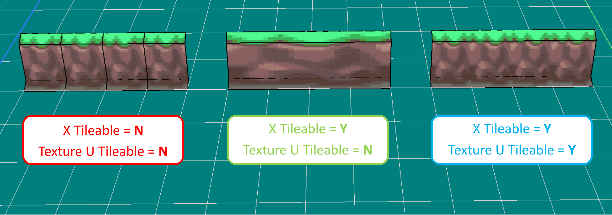

# Tiles & Tilesets
> Author(s): [MrHam88](https://github.com/DevHam88).

This page summarises the features and usage of tiles and tilesets in the **Pokémon DS Mapping Studio (PDSMS)** tool, and basic guidance on creation of custom tiles either by extraction from Generation IV or V Nintendo DS Pokémon games, or built from scratch. Both creation methods require the use of other third party tools for 3D modelling, such as Blender.

--- 
## PDSMS Features
PDSMS provides a variety of ways in which **tiles** can be manipulated within the program. The bulk of these features are accessible from the Tilset Editor window, which can be launched from the main horizontal toolbar.  

Once open, the Tileset Editor consists of four panels/areas. From left to right, these are:
1. **Tile Preview** (highlighted in red)
2. **Tile Selector** (highlighted in green)
3. **Smart Drawing Editor** (highlighted in blue)
4. Properties Editor (highlighted in yellow), which is tabbed to present two views:
   - **Tile Editor**
   - **Material Editor**
  
 

### Tile Preview
The Tile Preview allows for a 3D rendered display of the currently selected tile, and tile rotation & translation options.  

#### Display Options
The display options can be adjusted to show/hide wireframes, normal orientations, shading (model light), textures, and to enable/disable `Backface Culling`.  

Enabling `Backface Culling` and/or `Normals` will allow the user to easily view and assess the normal orientation of all polygons in a tile. Textures (or white faces if `Textures` is disabled) will only be displayed on the 'front' face, and will be fully transparent if viewed from behind. This can help in troubleshooting issues with custom tiles that may not be visible in the main PDSMS map editor window (which does not cull backfaces).  

#### Tile Rotation & Translation
PDSMS has options to translate a given tile in the **x** (red arrows), **y** (green arrows) & **z** (blue arrows) axis orientations. The smallest increment of translation is one *grid square width*, or one `unit` (see [here](/docs/generation-iv/guides/mapping/#maps) for definition of a unit).

 - This tile position is relative to the visible origin point/centre point (where the red, green & blue axis lines in the preview meet).  
 - The tile may also be rotated at 90° intervals from these options.  
 - The `Flip` option is nonfunctional/unavailable.

> The translation & rotation, along with the tile size (see [Tile Properties](#tile-properties) below) affect the visible elements of the tile seen in the Tile Selector.

### Tile Properties
The tile properties section within the Tile Editor tab of the Properties Editor panel, contains the bulk of PDSMS-configuration tile options. The below sections outline the use of each, and highlights any features which are only present in specific versions/forks.

 

#### A: Size (X & Y)
`X Size` & `Y Size`  

hese options may be a number from 1-6 in either 2D directions, and represent the tile size as visible in the Tile Selector and it's "footprint" when placed. The footprints of any two tiles may not occupy any of the same grid squares within a single [Layer](/docs/generation-iv/guides/mapping/models#layers).  
The footprint of a tile does not have any inherent relation to the size of a 3D model, it is entirely up to the user/provider of the tileset to determine the right values.

#### B: Tile Grouping (X & Y)
`X Tileable` & `Y Tileable`  

When enabled, this will stretch the geometry of a tile in one or both dimensions when multiple tiles are placed adjacent to each other. If both are enabled, the stretch will be applied in both directions only when adjacent tiles are placed in regular rectangular shapes. Tile grouping is limited to a maximum of **eight times** the [Tile Size](#a-size-x--y) (in the respective direction).  
Because the distance between vertices is increased when tiles are grouped, the colour gradient between different vertex colours is also "stretched".  
Tile grouping works best with tile 3D models that extend exactly to boundaries of the grid square (e.g. 1, 2, 3... units wide). Tiles that do not extend to the boundaries of the grid square can still be grouped, but the result will "stretch" the gap as well as the model.

#### C: Texture Repetition (U & V)
`Texture U Tileable` & `Texture V Tileable`  

When enabled, and only in conjunction with at least one enabled Tile Grouping on the tile, `Texture # Tileable` options will result in the UV map of the tile being propograted across the resultant grouped geometry. This propogation is based on the "out of bounds" UV mapping settings (`Tex Tiling U` and/or `Tex Tiling V`) configured in the **Materials Editor** for all of the materials used by the tile (the default is to repeat the UV map, but there are options to `Flip` or `Clamp`).  

It is important to note that this setting **applies to *all* the materials** assigned to the tile, and is applied by the U or V direction in the *material* (not the tile).  
> The main map view in PDSMS will render flipped or clamped texture repetition as `Repeat`, but the correct rendering will be visible once the model is converted from IMD to NSBMD, if the [`Include NSBTX in NSBMD`](/docs/generation-iv/guides/mapping/models#convert-imd-to-nsbmd) option is selected.

The below shows how enabling/disabling **Tile Grouping** and **Texture Repetition** options results in different outcomes for a wall tile for Pokémon Platinum version (tiles sourced & settings changed from PDSMS default tilesets). The impact of these settings can be seen in two ways (with wireframe view enabled):
1. The visual **appearance** (the texture UV map), and
2. The geometric impact (the **number of polygons** needed).

#### D: Translation Offsets (X, Y & Z*)
`X Offset`, `Y Offset` & `Z Offset`*  

This allows for a very granular level of translation of the tile in the **X**, **Y** & **Z*** axes.
- A value of `1.0` in any direction is equivelant to one `unit`, or grid square width.
- The `Apply` button must be clicked after entering a new value in the text box in order for it to be applied.  
- Positive and negative values may be applied.  
- Decimal numbers of up to eight decimal places may be applied.
> This offset is not visible in the Tile Selector, or in the "preview" of the tile that is visible at the cursor when placing it on a map (unlike the [Tile Rotation & Translation](#tile-rotation--translation) settings).  

**Z-offset is only available in the AdAstra fork of PDSMS*

#### E: Global Texture Mapping & Scale
`Global Texture Mapping` & `Texture Scale`  

Enabling global texture mapping allows for a single continuous: **position**, **orientation** and **scale** for the UV maps of materials to be applied across all tiles that have this option enabled. This is useful in conjunction with the [Tile Rotation](#tile-rotation--translation) options to maintain a consistent and continuous UV map, regardless of the rotation of the tile, without the need for unqiuely oriented 3D models (tiles).  

It is important to note that this setting **applies to *all* the materials** assigned to the tile. When this is selected and applied, the tile's individual UV map & scale is ignored in favour of the global UV map.

The below image shows how rotated surface water tiles (highlighted in red) no longer appear to match the continuous UV map (expected to see similar to the section highlighted in green). Applying global texture mapping to the tile that contained only the water material, would result in a correctly rendered result. This particular example would be even more noticeable, as it is from HGSS and the material is animated by [Texture SRT](/docs/generation-iv/guides/mapping/animations#texture-scale-rotate-translate-srt).

### Vertex Colours
Vertex colours (the assigment of RGB values to the vertices present in a 3D model) can be defined on any tile in PDSMS (from the `Edit Vertex Colors...` option). When defined (and where vertex colours are enabled for the material(s) that are UV mapped to a given polygon in the tile's model); vertex colours can be used to add colour to a tile when rendered in-game, that is not present in the image textures used.  
 - One common example of the use of vertex colours is to apply shade to map models that are being used in interior (building or cave) locations.
 - There is nothing preventing the use of vertex colours in exterior locations, however, the result is usually undesirable when used in an area that has the Areadata's `Light type` set to `Day/Night Light`, as opposed to `Model's Light`.
 - The `Light type` can be seen and set in the **NSBTX Editor** of DSPRE, or the **Area Data Editor** tab in the Building Editor of PDSMS.  

Once open, to apply, or "paint" vertex colours:
1. Select a colour to be applied, either by:
    - Entering RGB values, or
    - Selection from the colour wheel & saturation sliding scale, or
    - "Grabbing" the colour from an existing vertex on the model (`Grab Vertex Color` edit mode)
2. Change the size of the brush as needed using the sliding scale.
3. Select the application method:
    - `All Vertex Mode` to apply to any vertices in the model that are within the diameter of the paintbrush, or
    - `Per Face Mode` to apply to only vertices of an individually select polygon/face (to select a face, right mouse click the centre of the face).
4. Click, or click and hold the left mouse button to apply the colour.

 - The model can be rotated and zoomed using the mouse wheel.
 - There is no undo/redo in this window, so errors must be corrected by re-applying the correct colour.
 - Every vertex always has a colour assigned, the default is white (RGB = `255`,`255`,`255`)
 - Vertex colours can be stripped from a whole map [during the export process](/docs/generation-iv/guides/mapping/models#export-as-obj-with-textures).
 - Vertex colouring can be used to make duplicate tiles with different look and feel with no graphical design/image editing need. However, it must be noted that the image texture colour is still present "under" the vertex colours, so range of variation is more limitied than a re-coloured image texture.

> When vertex colours are used in conjunction with [Tile Grouping](#b-tile-grouping-x--y), the colour gradient between vertices is stretched across the grouped geometry.

### Tile Materials
The Tile Materials section of the Tile Editor shows the material **slots** that are used by the 3D model (defined by the `.obj` & `.mtl` files initially imported), and the materials that are assigned to each slot. For the purposes of map models for Generation IV & V Nintendo DS Pokémon games, each material slot must use an image texture, and no two material slots for a given tile should use the same material.  

The material being used by any given material slot can be changed by selecting the material slot and either:
1. Selecting a material that exists already in PDSMS (i.e. it is used on one or more other tiles) from the pulldown menu, or
2. Adding a new material by clicking the `Add texture...` button.

> If a tile uses the same material in multiple places, this should be defined as a **single material slot** in the 3D modelling software used to create it. If this is not done, polygons of the model that are assigned to the material slot using the "duplicate" material *will not render* (and therefore appear transparent), in-game.

### Smart Drawing Tool
The Smart Drawing tool is a quality of life feature of PDSMS. It allows for the quick "filling" of a bounded space, or surrounding of a bounded space with predetermined set of tiles.  
The feature is most useful for groups of tiles that form a continuous landscape/mapping feature, for example ground tiles with an "edge" transition, or walls.  

Each set of Smart Drawing configuration has space for:
 - A centre "fill" tile,
 - Four straight "edge" tiles (each at right angles to each other)
 - Four "inside corner" tiles (each at right angles to each other),
 - Four "outside corner" tiles (each at right angles to each other).

Some constraints are:
 - Each tile must have a Tile Size of exactly `1` in both **x** and **y** directions.
 - Any positions in the Smart Drawing that are not configured with a tile will result in empty grid squares for those positions when applied.

A Smart Drawing is configured in the Tileset Editor by adding a new entry (`+` button), selecting a tile from the Tile Selector, and then left mouse clicking on a position in the Smart Drawing configuration. Repeat this for all positions needed.
 - A Smart Drawing can be selected by clicking the `Select` button associated to it,
 - Smart Drawings can be re-ordered by selecting it and using this up and down arrows at the bottom of the Smart Drawing panel,
 - Smart Drawings definitions are included in the `.pdsts` file produced when exporting a tilset, however, they will only be imported when the entire tileset is imported (overriding the current tileset).

In the example below (from the **Tileset 17 - Stark Mountain**, available by default within PDSMS for a Platinum map), a set of wall tiles have been configured as a Smart Drawing (highlighted in green). The tiles highlighted in red make up the fill, straight edges and corner tiles listed above.  

1. When the Smart Drawing is selected in the main map-building view, the icon defaults to the yellow pointer (highlighted in yellow). With this selected, clicking within the empty space (as seen at the top of the screenshot), will result in the outcome shown in bottom left (and [Tile Heights](/docs/generation-iv/guides/mapping/models#heights) have also been configured for the "fill" tiles to be one unit higher than the surrounding tiles).  
2. Alternatively, after the Smart Drawing has been selected in the main map-building view, the blue pointer icon (highlighted in blue) can be selected, which will produce the *inverse* results. Here, clicking the empty space (as seen at the top of the screenshot), will result in the outcome shown in bottom left (and [Tile Heights](/docs/generation-iv/guides/mapping/models#heights) have also been configured for the "fill" tiles to be one unit lower than the surrounding tiles). In this example, the "fill" tiles would be replace after the Smart Drawing has been used to have the 'rocky' surface instead.

This shows how a single Smart Drawing can be used for two different purposes.  

### Tile Organisation
Tiles are organised starting at the top left of the Tile Selector, running towards the right, and then beginning a new line underneath. Each row in the Tile Selector view can hold a maximum of eight tiles (if they are all sized to an `X Size` of `1`).  

Tiles can be **re-organised** in the Tile Selector view in a number of ways:
 - Select one or more tiles:
    - Select a single tile by left-clicking it, or
    - Select multiple tiles in a range by left-clicking the first, and right-clicking the last in the range.
    - Selected tiles appear highlighted in a red bounding box.
    - A range can be selected forwards or backwards (the right-click end of range selection can be before or after the initial left-click selection).
    - If a range is selected, the Tile Preview will show the tile that was left-clicked at the beginning or end of the range.  
 - Use the `Move tile:` up and down arrows to alter their position(s) in the list.
 - Left-click & hold and move the mouse to drag the selected tile(s) around the list.
 - Duplicate the selected tile(s) using the `Duplicate Tiles...` button.
    - The duplicates will be placed immediately after the source tiles, if a range is duplicated, the order of the range is also duplicated.
    - The duplicates have all the same Tile Properties as the source tile(s).
    - The original tiles will remain selected after the duplication.
 - Delete the selected tile(s) using the `Remove Tiles` button.
 - Replace the selected tile (only for individual tiles) with a different `.obj` file using the `Replace OBJ...` button.
   - The Tile Properties of the original tile will be retained and applied to the new model.  

  

### Import/Export
There are several import and export methods for tiles and tilesets in PDSMS.  

#### Tiles
One or more 3D models can be imported to PDSMS as individual tiles from `.obj` file by clicking on the `Add Tiles...` button from the Tile Editor tab in the Tileset Editor. A standard file navigation tool is then used to select one or more `.obj` files. Each `.obj` file will be imported as a tile.  

An imported tile will:
 - Have [Tile Properties](#tile-properties) set to their default values,
 - Use materials that are already present in PDSMS with the same names as those materials used by the `.obj` file (if there are any), and
 - Be added to the bottom of the Tile Selector view.

Tiles that are *imported* to the tileset open in PDSMS from another tileset will retain all of their Tile Properties (see [below](#tilesets)).  

An individual tile can be exported from PDSMS by selecting the tile and clicking on the `Export OBJ...` button. An opportunity to rename the `.obj` file will be presented at this point.  

#### Tilesets
 - An entire tileset (`.pdsts`, or *Pokémon DS TileSet*, file) can be imported into the current PDSMS session (**overriding the current tileset**), by selecting  `File` and `Import Tileset`. This method also replaces any current Smart Drawings with those that were configured in the imported `.pdsts` file.
 - An entire or partial tileset (`.pdsts` file) can be **appended** to the current PDSMS session (added to the end of the current tileset), by selecting the `Import Tiles...` button from the Tileset Editor. A dialog allows for the selection of multiple tiles, and includes `Select All` and `Deselect All` buttons. This method does not import any Smart Drawings that were configured in the `.pdsts` file.
 - The current PDSMS session's tileset can be **exported** to a `.pdsts` file, by selecting  `File` and `Export Tileset`.  

#### Compatibility
Tilesets exported from the AdAstra fork of PDSMS are typically incompatible with (and cannot be imported to) the Trifindo version of PDSMS, however, individual `.obj` files can be exported from and imported to either version freely, and Tilesets exported from the Trifindo version of PDSMS are compatible with (and can be imported to) the AdAstra fork of PDSMS.  

## Extracting & Creating Tiles
### Extracting Tiles
The process of extracting components of the 3D maps from existing Nintendo DS Pokémon games to be used in PDSMS as tiles (often referred to as "ripping"), is theoretically the same across all Nintendo DS games, but there are practical and process differences to be aware of.  
#### From Generation IV Games
Extracting assets from the Generation IV games requires a few more steps than the process for Generation V, and there are some additional downsides for vertex painted interior maps.  
This video (link to a post in the Kingdom of DS ROM Hacking discord server) is a very brief and basic demonstration of the process of extracting individual components of a map from a Generation IV Pokémon : using Blender and a `.dae` export of the map (exported via DSPRE).
 - [Extract Gen IV Mapping Assets as OBJ](https://discord.com/channels/446824489045721090/490619776918618123/1384979455273074729)

#### From Generation V Games
There are some comprehensive video tutorials on extracting tiles from Generation V Nintendo DS Pokémon games, which is somewhat streamlined by the CTRMap tool:
 - [Make Your Own Pokemon ROM Hack! -- Ripping Floor Tiles](https://youtu.be/fjKbR0mjLvA?feature=shared)
 - [Make Your Own Pokemon ROM Hack! -- Ripping Individual Models](https://youtu.be/i99-Rw1e7I8?feature=shared)

### Editing Existing Tiles
To edit an existing tile, select the tile in PDSMS Tileset Editor and click the `Export OBJ` button. Then open the `.obj` file in a 3D modelling tool such as Blender.