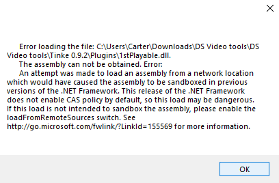
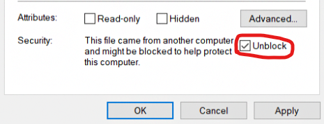
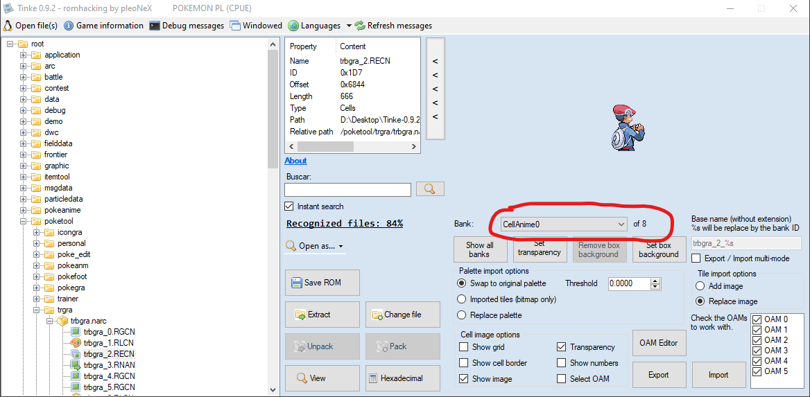

# Cell Editing for Sprites
> Author(s): [Jay-San](#), [Sunnhild](#) (reformatting for the wiki).  

Editing trainer sprites without patterns *(Aka: An apology letter from Jay-san about Tutorial Episode 2)*

	
🎥 Video version

	

		<a href="https://www.youtube.com/watch?v=kZW9LTiAfrY">
			<strong>Pokemon DS Rom Editing Tutorial Pt 2.5: Easier Editing w/ RECN Files (Aka: NCER)</strong>
		</a>
		 
		

			<iframe type="text/html" width="480" height="270" src="https://www.youtube.com/embed/kZW9LTiAfrY" frameborder="0" title="Jay-San: Pokemon DS Rom Editing Tutorial Pt 2.5: Easier Editing w/ NCER Files (Aka: NCER)" allowfullscreen></iframe>
		

	

--- 

## 📌 Table of Contents
- [Cell Editing for Sprites](#cell-editing-for-sprites)
	- [📌 Table of Contents](#-table-of-contents)
	- [📋 Introduction](#-introduction)
	- [💾 Getting Tinke 0.9.2](#-getting-tinke-092)
	- [🛠️ Editing Your Sprite](#️-editing-your-sprite)

## 📋 Introduction
Hello! You are seeing this as you’ve most likely seen my video on editing the RGCN trainer sprites with the colored pattern I shared. While this method technically still works, I came up with it before I was more experienced in ROM hacking and admittedly is just a little inefficient. It turns out that **ONLY** if you use a certain version of Tinke, you can edit an NCER “cell” file that is a complete image instead of having to split the sprite into pieces. Which will hopefully be far simpler to edit sprites with.

## 💾 Getting Tinke 0.9.2 

**⚠️ (IMPORTANT: This method will not work on Tinke 0.9.0 or older versions. Be sure to get the version below if you don’t have it already.)**

1. First of all, here is the version of Tinke you’ll want to use. It’s a copy stored in the google drive owned by the hacking server:
[https://drive.google.com/file/d/1lNMtiqKPoQigTExe-2eL7CFJApOaWX8q/view?usp=sharing](https://drive.google.com/file/d/1lNMtiqKPoQigTExe-2eL7CFJApOaWX8q/view?usp=sharing)

2. You want to use the download button in the upper right to download it

    

3. Once you’ve downloaded the zip file, be sure to extract the contents into the folder of your choice.

## 🛠️ Editing Your Sprite

1. Once you have an extracted copy of Tinke 0.9.2 folder ready to use, you want to click the Tinke launcher.

	
⚠️ Getting an Error?

	

		A few people have gotten the error below when opening Tinke 0.9.2 specifically.

		

		This seems to be related to their computer putting a block on the Tinke files. If you see this error you should:
		1. Delete the Tinke folder you just made.
		2. Locate the zip file you downloaded from the link above.
		3. Right click it and select Properties.
		4. If you see an “Unblock” checkbox like the one circled below, uncheck it and click OK.
			
				
			
		5. Then extract your zip file again to make a new Tinke Folder, and try to open Tinke to see if the error is fixed.

		<blockquote>
			<strong>
				📝 Note: If the error continues please let us know in Discord.
			</strong>
		</blockquote>
	

	
1. Then a window will open where you can browse to the ROM you want to edit and open it.

2. Browse the ROM files and expand the narc that holds the sprite you are looking for. 

	> 💡 If you want any help locating certain sprites in your nds pokemon ROM, check out this narc list we wrote [HERE](https://docs.google.com/document/d/1_nRfhDEoNFbvYP-yjx4oAWmgGXxvqFBvLwYANFehxUU). <!-- TODO add list of known sprite location ressource -->

	Anyway, for my example I am going to edit the male player’s ball throw sprite in platinum. Which is located at the file path `poketool / trga / trbgra`. Where I’ll click `trbgra.narc` and click **Unpack** to see its contents.

	

	And are these files here.

	

3. First I need to double click file `trbgra_1.RLCN`, which is the palette.

4. Then I click `trbgra_0.RGCN` and click **“View”**. This brings up the puzzle-like RGCN file you may have seen me talk about in my video.

	

5. Now we go one step further by clicking `trbgra_2.NCER` and then clicking **View** again. This opens the “Cell” file where you can see the sprite as a complete image. If you scroll through the “Bank” circled picklist below you will jump between the different frames of this animated sprite. Our goal is to replace each of these frames with a matching edited version of the sprite you want to use.

	

6.  Before working with the NCER file, it is very important that you first **uncheck** the “Transparency” checkbox as shown below. This will get the background color to show up. Which is important for both export and importing the frames in the next steps.

	

	

	
<strong>💡(Optional)</strong> Exporting frames

	

		If you want, you can export each of the frames of this sprite as png images by scrolling to each of them in the “Bank” picklist and clicking <strong>Export</strong> for each one. Then you could use them as references when making your own edited frames that you want to insert in the next step. However if you already have the edited frames you want, you can skip this step.
		
		
		When you export a frame it will look like the example below. Where the frame is a tiny box in the center of a large transparent image. You want to make sure background is displaying like my example below, by following [step 7](#7).
		
		The area covered by the background is your drawable area, but you still want to make sure your edited frame keeps the same large transparent border around it like my example in the next step. 
		
		 
	

	

7. Once you are done you want your edited frames to look like my example below. Then you’ll need to repeat this process for each of the frames that this sprite uses. Like for the Platinum ball throw sprite, I’ll need to make 8 frames.

	

8. Once all your frames are ready, you want to scroll the “Bank” picklist to the first frame you want to replace. Normally people just start with the first frame. However if there are any colors that are not being shown on the first frame, you want to switch to a frame that displays all the colors your sprite uses. 

	> 💡 For example if your character has a yellow emblem on their shirt that’s not showing until after they throw the pokeball and their chest turns towards the camera. So you’d want to pick any later frame that shows the colors used by that emblem, if those colors aren’t shown on the earlier frames already.

9.  Once you’ve selected the best first frame, next change the “Palette Import Option” to **Replace Palette**. Use the Import button to import your edited frame that matches the one that Tinke is displaying. Since you picked “Replace Palette”, this will replace the colors in the related palette with all the colors of your sprite. So in my example, this would change the colors on `trbgra_1.RLCN`.

	This is why it was so important to find the right frame that showed all of your colors in <a href="#10">step 10</a>. To make sure all colors were added into the new palette. All 8 of the frames that the ball throw sprite I am editing will pull their colors from `trbgra_1.RLCN`. So if I pick a first frame that is missing colors that the others need, those other frames will have those colors removed when you import them.

	

	
💡Having trouble getting the right colors into your palette?

	

		You can use <strong>Console Tool</strong> to set the colors manually. Then you can import all frames just using “Swap to Original Palette” instead. You can learn about how to do so with this video:
		<a href="https://www.youtube.com/watch?v=ESQjr7OB1pA">
			<strong>Pokemon DS Rom Editing Tutorial Pt 14: Quick Color Changes with Console Tool</strong>
		</a>
		

			<iframe type="text/html" width="480" height="270" src="https://www.youtube.com/embed/ESQjr7OB1pA" frameborder="0" title="Jay-San: Pokemon DS Rom Editing Tutorial Pt 14: Quick Color Changes with Console Tool" allowfullscreen></iframe>
		

	

	
⚠️ If you have a <strong>glitched spot</strong>

	

		Now after importing your first frame it’s possible that it looks mostly ok but has a glitched spot like mine below. Worry not, this seems to happen a lot.

		
		
		The fix should be to:
    	1. Change the **Palette Import Option** to “Swap to Original Palette”.
		2. Import your frame again.
			Since your colors should be correctly inserted into the Palette by [step 10](#10), they are reapplied to the frame automatically. This seems to fix the glitched spot, though we are not certain why this happens.
	

	
⚠️ Possible <strong>follow up issue</strong>

	

		A follow up issue that can happen after you do the <a href="#fix-1">fix</a> is that some of the colors of the sprite may be missing. Like if you look REALLY close at my sprite below, my pants are transparent. The fix I found is the steps below, but if all the colors on all your sprites look ok you can skip this step.

		<blockquote>📝 <strong>NOTE:</strong> This is a <strong>newly discovered issue</strong>, so this fix is not widely tested yet. If the steps below give you any trouble let us know in the sprite support channel in the discord and we’ll try to help further. </blockquote>

		1. Type **442** into the Threshold field that is next to the “Pallet Import Options”.
		*(**442** is just the **max value** this field can hold)*

				
			1. Change the “Pallet Import Option” back to **Replace Palette**.
		2. **Import** your frame again.
		3. You may need to **repeat** the <a href="#fix-1">fix</a> above to fix the glitched area again.
		4. The sprite should now look 100% correct!
	

1.  Once your first frame is inserted and it looks correct, you want to make sure the “Pallet Import Option” is set to “Swap to Original Palette” and **import** each of the other frames. To do so, you just need to scroll to another frame and click **import**, then scroll to the next frame, and repeat the import until all the frames are replaced.

	

2.  Be sure to look each of the new frames over closely to make sure none of them have any parts that are transparent that shouldn’t be. If you find some missing colors you will want to first try the <a href="#fix-2">fix</a> above, if you haven’t already. Then **reinsert** all your frames again.

3.  If all frames look good, then it’s time to **pack** the narc! 

	> 💡 if you are not sure how to do this, check out this document [HERE](https://docs.google.com/document/d/1nyuRlun9Gm_5lWodBVLZgOwTgU26k8oyfscnPZZSfV8/edit?usp=sharing).<!-- TODO add how to pack a NARC in ressource -->

4.  Then you should be set to **save** a new ROM and test your sprite!

	
