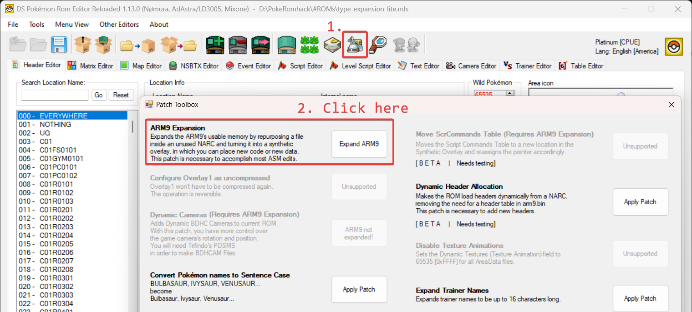
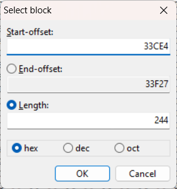

# Type Expansion / Fairy Type<sup>*(Platinum)*</sup>
> Author: Yako <br />
> Previous implementations: Mikelan98 and BagBoy ([Original guide](https://pokehacking.com/tutorials/fairypt/) to Fairy Type), Drayano ([Another guide](https://pastebin.com/hTeS5EkD) to Fairy Type) <br /> 
> Credits: Mikelan98 and Nomura (ARM9 Expansion), the entire DSPRE team and everyone who worked on pokeplatinum

This is a tutorial on how to expand the types available in Platinum. This includes but is not limited to the addition of the Fairy Type.
This **only works on the US Version of the game**.

**Looking for HGSS?** This guide does not cover HGSS, however, there is an excellent guide by BluRose available [here](https://www.pokecommunity.com/threads/hg-adding-a-new-type-to-heart-gold-using-fairy-as-an-example.439891/).

This guide is split into two versions: A **lite version** that replaces the existing Mystery Type (also known as ??? Type) with the Fairy Type, and an **advanced version** that sets up an environment that allows you to add multiple new types, including Fairy, without replacing any existing type.
I want to preface this guide by saying that even just replacing existing types is a very complex process, and it is not recommended for beginners. It requires a lot of knowledge about [hex editing](https://ds-pokemon-hacking.github.io/docs/universal/guides/hex_editing/), spriting and the inner workings of the game. You will need to be comfortable using a hex editor, adding and modifying sprites, working with Nitro Paint as well as using DSPRE. The advanced version requires a basic understanding of armips and ASM code, but you won't need to write any ASM code yourself. If you are not comfortable with these things, I recommend you start with the lite version of this guide. 
Remember that you can always start with another part of your hack first and come back to this later, when you feel more comfortable with the required skills.

This guide was only possible thanks to the work of Mikelan98 and BagBoy, who created the original Fairy Type implementation for Platinum, which served as a starting point for this guide. I also want to thank everyone who worked on pokeplatinum, I am heavily relying on their work for this guide.

Before you start: In addition to this guide I have created a  a folder with a couple of helpful files which is available [here](https://drive.google.com/file/d/10Ozf26GwUvjnUmsjasIDODuxoTa6RLNk/view?usp=sharing). Throughout this guide I will refer to these files as the "resources folder". The resources folder contains:
- A readme file which you should read before starting
- The `type_expansion_PLAT.asm` armips script
- All python scripts mentioned in this guide
- Images / Sprite resources used in this guide

---
## Table of Contents
- [Type Expansion](#type-expansion)
  - [Table of Contents](#table-of-contents)
  - [Lite Version](#lite-version)
    - [Tools used:](#tools-used)
    - [Making space for the new type chart](#making-space-for-the-new-type-chart)
    - [Editing the type chart](#editing-the-type-chart)
    - [Assigning new types to moves and Pokémon](#assigning-new-types-to-moves-and-pokémon)
    - [Adding sprites](#adding-sprites)    
  - [Advanced Version](#advanced-version)
    - [Prerequisites](#prerequisites)
    - [Setting up the armips script](#setting-up-the-armips-script)
    - [Adding new types](#adding-new-types)
    - [Assigning new types to moves and Pokémon](#assigning-new-types-2)
  - [Not (yet) covered in this guide](#not-yet-covered-in-this-guide) 
## Lite Version
This version replaces the existing Mystery type with the Fairy Type. It is a simpler version of the advanced version, but it still requires some knowledge of hex editing and spriting as well as a basic understanding of DSPRE.

### Tools used:
- [DSPRE](https://github.com/Mixone-FinallyHere/DS-Pokemon-Rom-Editor/releases)
- [Nitro Paint](https://github.com/Garhoogin/NitroPaint/releases)
- [HxD](https://mh-nexus.de/en/downloads.php?product=HxD) (or any other hex editor)
- [Python](https://www.python.org/downloads/) - Or install from the Microsoft Store (optional, for the type chart and palette helper scripts)
- The resources folder belonging to this guide which can be found [here](https://drive.google.com/file/d/10Ozf26GwUvjnUmsjasIDODuxoTa6RLNk/view?usp=sharing)

### Making space for the new type chart
**Before you start, make a backup of your ROM!** <br />
First make sure you have the ARM9 expansion patch applied to your ROM. If you don't have it, you can apply it using DSPRE's toolbox.



We will take advantage of the newly available space by repointing the move effect subscript table to a different location. The reason we do this is a practical one: repointing this table is much simpler than repointing the type chart itself. Since the type chart is located just before the this table, it will create ample space for us to modify the type chart without having to repoint it.

Next you will need to actually move the move effect subscript table to a different location. Open up your extracted folder generated by DSPRE and go to the `platinum_DSPRE_contents/overlay/` folder. Inside, you will find a file called `overlay_0016.bin`. Open it in a hex editor (I recommend HxD) and navigate to the offset `0x33CE4`. HxD can do this with the shortcut `Ctrl + G` by default. The beginning of the table should look like this:
```
00 00 00 00 12 00 00 00 16 00 00 00 19 00 00 00 ...
```
In total this table is a whole 0x244 (= 580) bytes long. Select the entire table and copy it to the clipboard. 
In HxD, you can do this by pressing `Ctrl + E` which will bring up a block selection menu. Your start offset should be `0x33CE4` and the length should be `0x244`. Copy the selected data to the clipboard by pressing `Ctrl + C`. <br />
Keep your hex editor and this file open, as we will need it again later.



Next navigate to `platinum_DSPRE_contents/unpacked/synthOverlay/`. Open the file called `0009` in your hex editor. This file is your synthetic overlay. If you haven't applied the ARM9 expansion before, this file will be empty. Otherwise, it may contain some data. Make sure not to accidentally overwrite any existing data, as it will most likely prevent your game from functioning properly.

We will now move the move effect subscript table to a location in this file. I recommend using the offset `0x1000` for this, simply because it is a nice round number and it is far enough away from the beginning of the file, making it unlikely that you will overwrite any existing data. Double check to make sure that this offset is actually empty before proceeding. You can do this by block selecting the next 0x244 (= 580) bytes and checking if they are all zeroes. <br />
(This location isn't empty for you? You can put it somewhere else, but make sure to adjust the pointer accordingly later on. If you don't know how to do this, I recommend asking for help on discord.) <br />
Paste the move effect subscript table into this file without changing the file's length. In HxD, you can do this by pressing `Ctrl + B`. Make sure to save the file after pasting the data. 

The table is now in its new location, however, we still need to tell the game where to find it. To do this, we will need to modify the pointer to the move effect subscript table.
Our table is now located at `0x1000` in the synthetic overlay, which is loaded at address `0x023C8000` in memory. Because of this, our new pointer will be `0x023C9000 = 0x023C8000 + 0x1000`.
The game uses little-endian format, so we will need to write this pointer in reverse order. In hex, this is `00 90 3C 02`.
Navigate to the offset `0x204F8` in the `overlay_0016.bin` file. You should see `24 EE 26 02`. Select and replace these four bytes with `00 90 3C 02`. Don't forget to save the file after making this change.

At this point I strongly advice you save your ROM in DSPRE and test it to make sure it actually still works. Get in a battle and use a move (preferably one that has an effect beyond just dealing damage) to make sure the game doesn't crash. If it does or you see weird graphical glitches, you probably made a mistake somewhere. If it doesn't, congratulations! You have successfully moved the move effect subscript table to a new location.

### Editing the type chart
Now that we have made space for the new type chart, we can actually edit it. This section will guide you through the process of editing the type chart using a hex editor, explaining how the type chart works and how to add new types or change existing types along the way. If you know how to run a python script, you can use the file `type_chart_helper.py` which is included in the accompanying resources folder. It will generate the triplets for you by reading a csv as input. A template csv with mystery type replaced by Fairy Type and the modern Steel Type changes is included in the resources folder as well. You can also use the modern type chart provided [here](#the-modern-type-chart) and paste it at the correct offset.
If you decide to go this route, I recommend you read through this section anyway, as it will help you understand how the type chart works and how it is actually structured in the ROM.

The type chart is located at the offset `0x33B94` in `overlay_0016.bin`. Open this file in your hex editor and navigate to this offset. You should see a table that looks like this:
```
00 05 05 00 08 05 0A 0A 05 ...
```
The table is 0x150 (= 336) bytes long and contains the type effectiveness multipliers for each type against every other type. It consists of a series of triplets that have the following structure:
| Attacking Type | Defending Type | Multiplier |
|:--------------:|:--------------:|:----------:|
|     Byte A       |     Byte D      |   Byte M     |

The first byte (Byte A) is the attacking type, the second byte (Byte D) is the defending type and the third byte (Byte M) is the multiplier. The multiplier M is equal to:
- `0x0` (= 0) for no effect
- `0x5` (= 5) for not very effective
- `0xA` (= 10) for normally effective
- `0x14` (= 20) for super effective

In damage calculations, these multipliers are divided by 10, so 0x5 becomes 0.5, 0xA becomes 1.0 and 0x14 becomes 2.0.
To determine effectiveness, the game will go through this table trying to find a match for the attacking type and the defending type. If it finds a match, it will use the multiplier to calculate the damage dealt. You might notice that most type interactions are absent from this table. This is because the game **defaults to normal effectiveness (1.0)** if no match is found.

At the end there is a set of three spacer bytes (`0xFE 0xFE 0x00`) followed by the Ghost Type immunities. It's important that you preserve these bytes, as otherwise moves like foresight and odour sleuth will not work properly. After the Ghost Type immunities, there is a set of three bytes that mark the end of the type chart (`0xFF 0xFF 0x00`). If you are using the python script this is largely handled for you.

To add a new type or change an existing type we can insert new triplets into this table, modify the existing triplets or remove existing triplets. If you want to add a new type, you will need to add a new triplet for each type it is effective against, as well as triplets for each type that resists it or is immune to it. Make sure to add the triplets before the spacer bytes. Also keep in mind that **duplicate triplets will be ignored**, only the first match will be used.

Before we can edit the type chart, we will also need the list of the type's IDs:
<a id="type-ids"></a>
<details>
<summary>Type IDs</summary>
| Type Name | Type ID | Type ID (Decimal) |
|:---------:|:-------:|:-----------------:|
| Normal    | 0x00    |  0                |
| Fighting  | 0x01    |  1                |
| Flying    | 0x02    |  2                |
| Poison    | 0x03    |  3                |
| Ground    | 0x04    |  4                |
| Rock      | 0x05    |  5                |
| Bug       | 0x06    |  6                |
| Ghost     | 0x07    |  7                |
| Steel     | 0x08    |  8                |
| Mystery   | 0x09    |  9                |
| Fire      | 0x0A    | 10                |
| Water     | 0x0B    | 11                |
| Grass     | 0x0C    | 12                |
| Electric  | 0x0D    | 13                |
| Psychic   | 0x0E    | 14                |
| Ice       | 0x0F    | 15                |
| Dragon    | 0x10    | 16                |
| Dark      | 0x11    | 17                |
</details>

Simply modifying the type chart is actually sufficient to have a functional Fairy Type in the game, however, it will still display as the Mystery Type in battle, in the menu and in the Pokédex.
We also need to assign the type to the desired moves and Pokémon.

#### The modern type chart
For your convenience, here is the modern type chart with the Fairy Type replacing the Mystery Type. You can use this as a reference when editing the type chart or simply copy and paste it as is.
<details>
<summary>Modern Type Chart (Fairy Type replacing Mystery Type)</summary>
```
00 05 05 00 08 05 0A 0A 05 0A 0B 05 0A 0C 14 0A 0F 14 0A 06 14 0A 05 05 0A 10 05 0A 08 14 0B 0A 14 0B 0B 05 0B 0C 05 0B 04 14 0B 05 14 0B 10 05 0D 0B 14 0D 0D 05 0D 0C 05 0D 04 00 0D 02 14 0D 10 05 0C 0A 05 0C 0B 14 0C 0C 05 0C 03 05 0C 04 14 0C 02 05 0C 06 05 0C 05 14 0C 10 05 0C 08 05 0F 0B 05 0F 0C 14 0F 0F 05 0F 04 14 0F 02 14 0F 10 14 0F 08 05 0F 0A 05 01 00 14 01 0F 14 01 03 05 01 02 05 01 0E 05 01 06 05 01 05 14 01 11 14 01 08 14 01 09 05 03 0C 14 03 03 05 03 04 05 03 05 05 03 07 05 03 08 00 03 09 14 04 0A 14 04 0D 14 04 0C 05 04 03 14 04 02 00 04 06 05 04 05 14 04 08 14 02 0D 05 02 0C 14 02 01 14 02 06 14 02 05 05 02 08 05 0E 01 14 0E 03 14 0E 0E 05 0E 11 00 0E 08 05 06 0A 05 06 0C 14 06 01 05 06 03 05 06 02 05 06 0E 14 06 07 05 06 11 14 06 08 05 06 09 05 05 0A 14 05 0F 14 05 01 05 05 04 05 05 02 14 05 06 14 05 08 05 07 00 00 07 0E 14 07 11 05 07 07 14 10 10 14 10 08 05 10 09 00 11 01 05 11 0E 14 11 07 14 11 11 05 11 09 05 08 0A 05 08 0B 05 08 0D 05 08 0F 14 08 05 14 08 08 05 08 09 14 09 10 14 09 01 14 09 11 14 09 03 05 09 08 05 09 0A 05 FE FE 00 00 07 00 01 07 00 FF FF 00
```
</details>

#### Using the `type_chart_helper.py` script
If you want to use the `type_chart_helper.py` script, you will need to have Python installed on your computer. You can download it from [here](https://www.python.org/downloads/). Alternatively, you can install it from the Microsoft Store, which is the easiest way to get it on Windows. At the top of the file you will find the settings for the script. You will need to provide the path to your overlay 16 file, the path may be something like `platinum_DSPRE_contents/unpacked/overlay/overlay_0016.bin`. There is also a `mode` setting which can be set to either `bin-to-csv` or `csv-to-bin`. The first mode will convert the binary type chart to a CSV file, while the second mode will convert a CSV file to a binary type chart and write it to your overlay. The script will create a new file called `type_chart.csv` in the same folder as the script. If you plan on adding new types, you can also add them to the enum at the top of the file. The resources folder contains a template CSV file for the modern type chart with the Fairy Type replacing the Mystery Type calles `modern_type_chart.csv`. You can use this as a starting point for your own type chart or just copy it as is. The folder also contains a copy of the vanilla type chart called `vanilla_type_chart.csv` which you can use to revert your changes if needed. If you don't want to write to the overlay directly you can also use the `csv-to-local-bin` mode.


### Assigning new types to moves and Pokémon
To do this we can simply use DSPRE. Open your ROM in DSPRE and go to *Other Editors* > *Pokémon Editor*. Select the Pokémon you want to assign the new type to and select it from the *Types* dropdown.
You can also assign the new type to moves in the *Move Editor* in the same way. Make sure to save your changes after assigning the new type to the desired Pokémon and moves. In our case the Fairy Type replaces the Mystery type, so that's the type we need to select. You can also edit text archive 624 to change the name of the type to Fairy. This is not strictly necessary however.

For the sake of this guide, I am assigning Clefairy the Fairy Type and also changing the type of Charm and Moonlight. In game this will look like this:

import battle_no_sprite from './resources/battle_no_sprite.png';
import summary_no_sprite from './resources/summary_no_sprite.png';
import dex_no_sprite from './resources/dex_no_sprite.png';

<div className="image-container">
  
  
  
</div>

### Adding sprites
In total we will need to add 3 things: A sprite for the type icon, a sprite for the type in the Pokédex and a palette used by the move selection in battle. The first two can be done using DSPRE and Nitro Paint, while the third one requires some hex editing.
I recommend you make a temporary workspace folder that you can use to store some extracted files and sprites. 

<details>
<summary>Type Icon</summary>

Let's take care of the easiest one first: the type icon. Open your ROM in DSPRE and select *Tools* > *NARC Utility* > *Unpack to Folder*. (You can also use the button in the bar at the top.)
When promted, select `platinum_DSPRE_contents/data/battle/graphic/pl_batt_obj.narc` as the NARC file and unpack it to your workspace folder. This will create a new folder called `pl_battle_obj` in your workspace folder. When asked if you want to rename the files, select "Yes". This will make it easier to find the files later on.

The type icons consist of four files: a palette file (`0074.rlcn`), the icon itself (for Mystery Type this is `0236.rgcn`) and a cell resource as well as an animation which we will refrain from touching.
You can drag both the palette file and the icon file into Nitro Paint to open them. The palette file contains the colors used by the icon, while the icon file contains the actual sprite.
If you want to make your own icon, some basic knowledge of Nitro Paint and Aseprite are required. If you only care about the Fairy Type, you can use the icon I made for this guide, which is included in the resources folder as `fairy_icon.png` as well as `fairy_icon.rgcn`.
You could just replace the existing Mystery Type icon with the Fairy Type icon, but I recommend you create a new file for it instead. Have a look inside the `pl_battle_obj` folder again. The last file should be `0342.rnan`. Take your `.rgcn` file and name it something like `0343.rgcn` (i.e. make sure the number is higher than the last file). Then use DSPRE to pack the folder back into a NARC file. Select the `pl_battle_obj` folder and pack it into `pl_batt_obj.narc`. After that replace the original `pl_batt_obj.narc` in your ROM with the newly created one.

Next we will need to tell the game to use the new type icon instead of the Mystery Type icon. To do this, we will need to modify the pointer to the type icon in battle. The game uses a table to determine which type icon to use for each type. This table is located at the offset `0xF0AF0` in the `arm9.bin` file of your ROM.

Open `platinum_DSPRE_contents/arm9.bin` in your hex editor and navigate to the offset `0xF0B14`. You should see `EC 00 00 00`. This is the index of the type icon in the `pl_batt_obj.narc`. Change this to the index of your new type icon. In this case, we will use `57 01 00 00` which corresponds to index 343 (the index of the new Fairy Type icon we just created). Make sure to save the file after making this change.

If you check it out in game, you will notice that the icon is using the wrong palette. This is because the game is still using the palette of the Mystery Type icon. To fix this, we will need to change the palette used by the type icon in battle. The game uses a table to determine which palette to use for each type icon. This table is located at the offset `0xF0B4C` in the `arm9.bin` file of your ROM.

Open `platinum_DSPRE_contents/arm9.bin` in your hex editor and navigate to the offset `0xF0B55`. You should see the byte `02`. Change this to the palette index of your new type icon. In this case, we will use `01` for the Fairy Type which is the correct palette for the icon included in the resources folder.
Save the file and test it in game. The icon should now display correctly in battle and in the summary screen.
</details>


<details>
<summary>Move Selection Palette</summary>

Let's take care of the move selection palette next. This palette is used in battle when selecting a move and is located at the offset `0x28C` in `overlay/overlay_0011.bin`. Open this file in your hex editor and navigate to the offset `0x28C`. You should see a series of bytes that look like this:
```
cd 75 ff 7f 7a 5a 17 4e b5 45 72 3d 30 31 ed 28 cb 20 fb 66 c6 18 00 00 8c 31 5c 37 be 57 00 00
```
This is the palette used for the Mystery Type. This one is a bit more tricky to edit. The resources folder contains a file called `palette.pal` which contains the palette for the Fairy Type, a file called `move_selection_box.aseprite` which should help you get started with creating your own palette and a python script called `palette_helper.py` which can help you convert a palette from JASC-Pal to the format used in the game and vice versa. If you wish you can use the palette I made for this guide, which is represented by the following bytes:
```
CD 75 FF 7F 7C 66 17 52 18 56 1B 5E 35 41 F2 38 B2 34 DD 6E C6 18 00 00 8C 31 5C 37 BE 57 00 00
```
</details>

<details>
<summary>Pokédex Type Icon</summary>

The last thing we need to do is add the type icon to the Pokédex. This is the most annoying one to do since all the icons are stored as different animations that pull from a large cell graphic. The Pokédex icons are located in the `/data/resource/eng/zukan/zukan.narc` file. Unpack this file to your workspace folder using DSPRE's NARC utility just like we did with the other type icon. To save you some pain the resource folder contains the required files for Fairy Type. If that's all you want to do, you can [skip](#packing-zukan-narc) the next section and just drag the provided files into the zukan folder, don't forget to pack the NARC again. If you want to learn how to add your own type icons, read on.

You'll need the palette file `0013.rlcn` and the cell graphic `0090.rgcn` again, but this time we will also need the animation file `0089.rnan` and the cell resource `0088.recn`.
Drag them all into Nitro Paint to open them. The cell graphic contains the actual sprite, the animation file contains the animation data and the cell resource contains the cell data that tells the game how to display the sprite. The .rgcn can be a bit hard to process visually, because frustratingly GF decided to throw in another unrelated and exceptionally large sprite at the end of the file. You'll also notice that the sorting of the cells is completely arbitrary, which will cause a ton of issues later since we will need to sort the cells by internal type ID. To save you having to painstakingly reorder the cells, the included `.rnan` file is already sorted. If you are planning to add your own type icons I suggest working with the provided files as a template. The template is already completely set up to work with the Fairy Type, so the rest of this section explains the process on how you can recreate this on your own.

We will need to add a new cell for the Fairy Type icon. To do this, click on the "New Cell" cell button and save. This will create a new cell with the at the end of the list. Next have a look at the `.rgcn` file. I recommend setting the width to 4 since it makes it easier to see the individual sprites. Click "Resize" and add 3 extra rows for a total size of 4 by 74. This will give us enough space to add the new type icon without overwriting any existing data. After that save the file.

Next we will need to add the actual sprite. You can either create your own sprite or use the one I made for this guide, which is included in the resources folder as `fairy_icon_pokedex.png`.
In the Cell Editor, select the new cell you created and click "Generate Cell". You will be promted to select a sprite file. Select the `fairy_icon_pokedex.png` file and click "Open". In the generate cell dialog, make sure to select the **correct palette** (the one you used for the type icon). The provided icon uses **palette 3. Do not tick write palette** as this will overwrite the palette used by the other type icons. Click "Complete" to create the cell. You should now see the new type icon in the cell editor. Make sure to save the cell resource after generating the cell.

Next we'll need to add the new cell to the animation. Open the animation file in Nitro Paint. It should contain 17 existing animations, one for each type and one for the unrelated Pokédex sprite at the end. Click on the "New Sequence" button to append a new sequence. We now have enough space for all the icons. Next we will need to sort them according to the internal type ID. We will see exactly why later. Sequence 0 should be the yellow rectangle, having it be the first sequence is convenient for mapping the type IDs to the sequences later. The remaining sequences should be ordered according to the internal type ID, which is the same as the type ID used in the type chart (see [this](#type-ids) table). You can therefore double check that you have the right order by subtracting 1 from the sequence number and comparing it to the type ID. For example, sequence 1 should be the Normal Type, which has the type ID 0 and so on. Since we are replacing the Mystery Type with the Fairy Type, sequence 10 should be the Fairy Type icon.

import nitro_paint_1 from './resources/nitro_paint_1.png';
import nitro_paint_2 from './resources/nitro_paint_2.png';
import nitro_paint_3 from './resources/nitro_paint_3.png';

<details>
<summary>Steps in Nitro Paint</summary>
<div className="image-container">
  
  
  
</div>
</details>

<a id="packing-zukan-narc"></a>

Use DSPRE's NARC utility to pack the `zukan` folder back into a NARC file. Select the `zukan` folder and pack it into `zukan.narc`. After that replace the original `zukan.narc` in your ROM with the newly created one.

#### Modifying the game's code to show the Pokédex icon

Since we completely resorted the sequences in the animation file, we will need to modify the game's code to make sure it uses the correct sequence for each type. In vanilla Platinum, the game uses a function that reads from a table to determine which sequence to use for each type. The function is located at offset `0xE400` in `overlay_0021.bin`. Open this file in your hex editor and navigate to this offset. You should see a series of bytes that look like this:
```
11 28 38 D8 01 18 79 44 ...
```

Replace it (Ctrl + B in HxD) with the following bytes:
```
01 30 70 47 00 00 00 00 00 00 00 00 00 00 00 00 00 00 00 00 00 00 00 00 00 00 00 00 00 00 00 00 00 00 00 00 00 00 00 00 00 00 00 00 00 00 00 00 00 00 00 00 00 00 00 00 00 00 00 00 00 00 00 00 00 00 00 00 00 00 00 00 00 00 00 00 00 00 00 00 00 00 00 00 00 00 00 00 00 00 00 00 00 00 00 00 00 00 00 00 00 00 00 00 00 00 00 00 00 00 00 00 00 00 00 00 00 00 00 00
```

Instead of doing some complex mapping of the type IDs to the sequences, we simply add 1 to the type ID and use that as the sequence number. This is the reason we sorted the sequences to begin with.
We also need to tell the game where to find the yellow rectangle sprite (used in the backround of the Pokédex). To do so navigate to following three offsets:
- `0xE514` 
- `0x1066C`
- `0x187C8`

At each of these offsets you should see `11 21`. Replace it with `00 21`.

import battle_fairy from './resources/battle_fairy.png';
import summary_fairy from './resources/summary_fairy.png';
import dex_fairy from './resources/dex_fairy.png';

<div className="image-container">
  
  
  
</div>
</details>

At this point you should have a fully functional Fairy Type in your game. You can test it by using a Pokémon with the Fairy Type in battle and checking the Pokédex to see if the new icon is displayed correctly. If everything works as expected, congratulations! You have successfully added the Fairy Type to Platinum.

## Advanced Version
The advanced version of this guide is meant for those who want to add **multiple new types to the game without replacing any existing type**. It is a more complex process that requires a rudimentary understanding of armips. You won't actually need to know how to write any ASM code, but you will need to know how to apply patches using armips. You will also need to know how to make minor edits to armips scripts as well as edit and run python scripts. The advanced version of this guide isn't actually independent from the lite version, so I recommend you read through the lite version first to get a better understanding of how the type chart works and how to add new types.

### Tools used:
- All the tools used in the lite version of this guide, plus:
- [armips](https://github.com/Kingcom/armips/releases)

### Prerequisites
- As before make sure you have the ARM9 expansion patch applied to your ROM. If you don't have it, you can apply it using DSPRE's toolbox.
- Go ahead and repoint the move effect subscript table as described in the lite version of this guide. This is necessary to make space for the new type chart.
- Modify the type chart to include your new types as described. If you're adding multiple new types, then don't even bother doing this manually, just use the `type_chart_helper.py` script included in the resources folder.
- Make sure you have the `armips` tool installed and available in your PATH. You can download it from [here](https://github.com/Kingcom/armips/releases)
- Make sure you have `python` installed and available in your PATH. On windows you can actually download it from the Microsoft Store, which is the easiest way to get it. I personally recommend setting up anaconda since it allows for easy management of python packages and environments, but this is not strictly necessary for this guide nor will it be covered here.
- You'll need to make all the graphic assets for your new types. This includes the type icon, the Pokédex icon and the move selection palette. You can use the resources provided in the lite version of this guide as a starting point, but you will need to create your own assets for any other types you want to use.
- When inserting your sprites, make sure to take note of their indices in the respective NARC file / Cell Resource. You will need to use these indices in the armips script later on.
### Setting up the armips script
The armips script is used to modify the game's code to support the new types. You don't need to do any of the hex edits from the lite version as the script will do it for you. While it will also handle the repointing of the the move effect subscript table altough you will need to actually paste it at the defined offset yourself. The script is included in the resources folder as `type_expansion_PLAT.asm`. Open it in an editor of your choice and have a look at it. You will need to make some changes to it before you can use it.
- First edit the *GameFolder* variable to point to the folder where your unpacked ROM is located. This folder will usually be called something like `platinum_DSPRE_contents`.
- Next edit the *MoveEffectSubscriptOffset* variable to point to the offset where you want to paste the move effect subscript table. This should be the same offset you used when moving the table in the lite version of this guide. If you followed the guide, this should be `0x1000`.
- You will also need to specify the length of the move effect subscript table in the *SubscriptLength* variable. This should be `0x244` (the length of the table in bytes). By default, this is set to `0x250` to make it a bit easier to identify the table in the hex editor, but you can change it to `0x244` if you prefer.
- (Side note: By changing this variable and putting new scripts in the right narc you can actually add more move effects to the game as well, but this is not covered in this guide.)
- Edit the *SynthOverlayRelativeOffset* variable to point to an empty location in the synthetic overlay file. This one should be at an even offset before the offset you used for the move effect subscript table. This could be something like `0xF00`. We will use this to hold some code that will handle the new types.
- You will need to specify the total amount of types in the *TypeCount* variable. This should be the total amount of types including the existing types. For example, if you want to add the Fairy Type and the Sound Type, this should be `20 = 18 (vanilla) + 2 (new)`.
### Adding new types
The main part of the the script is the *Tables* section at the bottom of the file. This is where you will tell the game where to look for your new icons and which palettes to use. This is also where you can define new palettes for the move selection box in battle. The script is already set up to handle the Fairy Type, so you can use it as a template for your own types.
- The *MoveIconTable* contains the indices of the respective .rgcn files for the type icons in battle and summary screen. The indices are in the same order as the type IDs defined in the `type_chart_helper.py` script (have a look at the enum at the top). For example, if you want to add the Sound Type, you would add a new entry to this table with the index of your Sound Type icon.
- The *MoveIconPaletteTable* contains the indices of the palettes used by the type icons in battle and summary screen. The game always uses `0074.rlcn` for the type icons, if you want custom palettes you will need to add it to this file.
- Just to make sure you don't go looking for it: There is no need to make changes to the Pokédex icon table. We just read the animation with the same ID as the type ID from `0090.rnan`. If you correctly added the animation and associated graphics using Nitro Paint the game will take care of the rest.
- The *MoveSelectionPaletteTable* contains the addresses of the palettes used by the move selection box in battle.
- Finally, you can define the actual palettes used by the *MoveSelectionPaletteTable*. Make sure to define the addresses of any new palettes up top in the *AdressDefinitions* section. You can **and should(!)** use the `palette_helper.py` script to convert your palette from JASC-Pal format to the format used in the game. This way you can use Aseprite to create your palettes and then convert them to the format used in the game. 
### Assigning new types to moves and Pokémon
<a id="assigning-new-types-2"></a>
Unlike before we need to to a bit of extra work so that DSPRE actually knows about the new types. Open up Text Archive 624 in DSPRE. Append a new line to the end of the file with the name of your new type. For example, if you want to add the Fairy and Sound Type, you would add a new line with the name "FAIRY" and one named "SOUND". The message number in this file is actually what DSPRE uses to determine the type ID, so make sure to add them in the correct order or everything will break. Also make sure not to remove any lines from this file, unless there are no Pokémon or moves that use the type you are removing. If you don't do this, DSPRE will crash the next time you try to open the Pokémon or Move Editor.

## Not (yet) covered in this guide
As of right now, this guide does not yet cover:
- Adding the new types to the Move Tester Pokétch app
- Adding the new types to the TV related menus
- Adding new types to hidden power (vanilla did not actually implement hidden power fairy so this is not strictly necessary)
- Adding new types to natural gift
- Adding new type boosting items (e.g. Pixie Plate, Sound Plate, etc.)
- Adding new Arceus forms for the new types
I may cover these topics in a future update to this guide, but they aren't a priority right now. I suspect that expanding Arceus forms will be particularly difficult, so I may not cover it at all.


