# Move Animations
> Author(s): [MrHam88](https://github.com/DevHam88)  
> Source: Bulbapedia

This page provides a filterable and sortable table of the filestructure of the move animations from Generation IV Pokémon games Versions.  
The majority of animations are common across all Generation IV games, where there are version differences, if an animation image was available for HeartGold & SoulSilver that is used, else the Platinum animation, else the Diamond & Pearl.

import FilterableSortableTable from '/src/components/FilterableSortableTable';

<FilterableSortableTable defaultSort={{ column: 0, direction: "desc" }} types={["number","string","string","string","string"]}>
  | Move_ID | Move_Name | Type | Category | Image |
| --- | --- | --- | --- | --- |
| 1 | Pound | Normal | Physical |  |
| 2 | Karate Chop | Fighting | Physical | 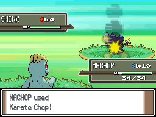 |
| 3 | Double Slap | Normal | Physical | 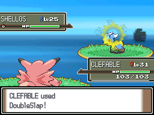 |
| 4 | Comet Punch | Normal | Physical | 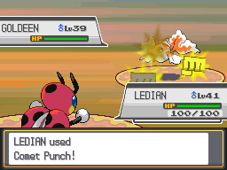 |
| 5 | Mega Punch | Normal | Physical | 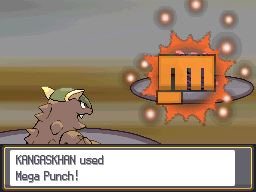 |
| 6 | Pay Day | Normal | Physical | 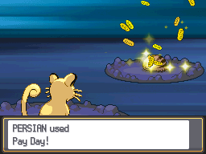 |
| 7 | Fire Punch | Fire | Physical | 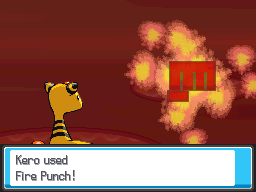 |
| 8 | Ice Punch | Ice | Physical | 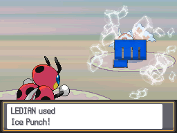 |
| 9 | Thunder Punch | Electric | Physical | 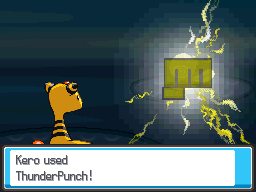 |
| 10 | Scratch | Normal | Physical | 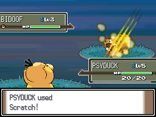 |
| 11 | Vise Grip | Normal | Physical | 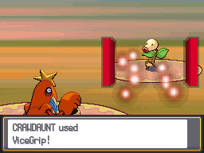 |
| 12 | Guillotine | Normal | Physical | 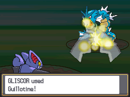 |
| 13 | Razor Wind | Normal | Special | 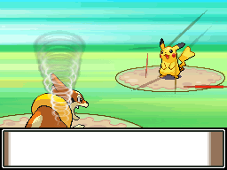 |
| 14 | Swords Dance | Normal | Status | 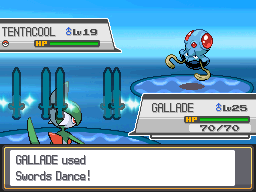 |
| 15 | Cut | Normal | Physical | 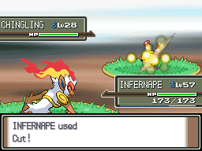 |
| 16 | Gust | Flying | Special | 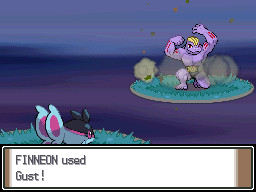 |
| 17 | Wing Attack | Flying | Physical | 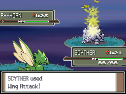 |
| 18 | Whirlwind | Normal | Status | 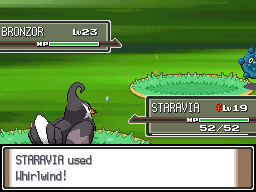 |
| 19 | Fly | Flying | Physical | 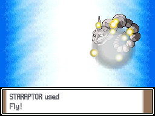 |
| 20 | Bind | Normal | Physical | 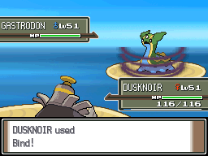 |
| 21 | Slam | Normal | Physical | 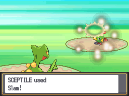 |
| 22 | Vine Whip | Grass | Physical | 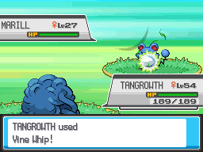 |
| 23 | Stomp | Normal | Physical | 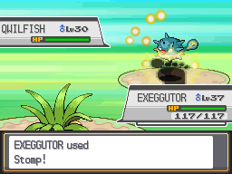 |
| 24 | Double Kick | Fighting | Physical | 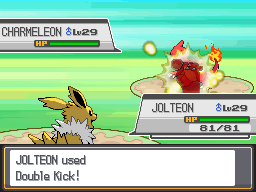 |
| 25 | Mega Kick | Normal | Physical | 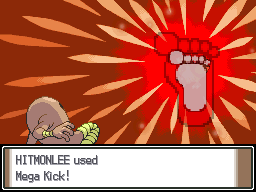 |
| 26 | Jump Kick | Fighting | Physical | 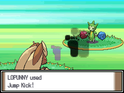 |
| 27 | Rolling Kick | Fighting | Physical | 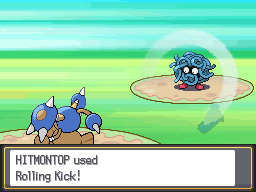 |
| 28 | Sand Attack | Ground | Status | 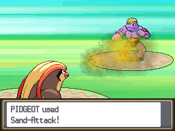 |
| 29 | Headbutt | Normal | Physical | 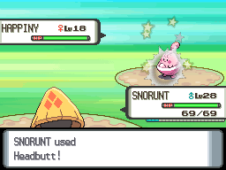 |
| 30 | Horn Attack | Normal | Physical | 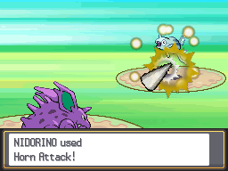 |
| 31 | Fury Attack | Normal | Physical | 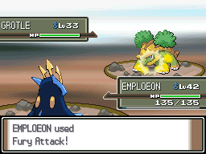 |
| 32 | Horn Drill | Normal | Physical | 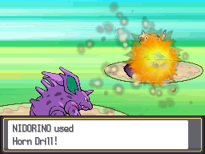 |
| 33 | Tackle | Normal | Physical | 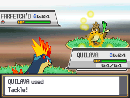 |
| 34 | Body Slam | Normal | Physical | 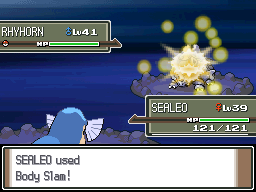 |
| 35 | Wrap | Normal | Physical | 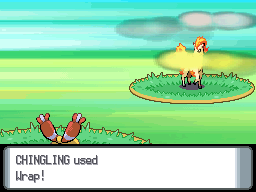 |
| 36 | Take Down | Normal | Physical | 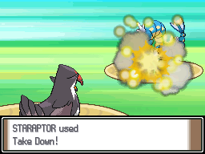 |
| 37 | Thrash | Normal | Physical | 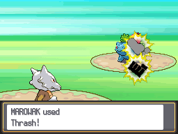 |
| 38 | Double-Edge | Normal | Physical | 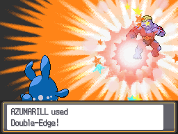 |
| 39 | Tail Whip | Normal | Status | 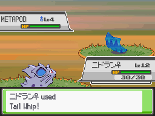 |
| 40 | Poison Sting | Poison | Physical | 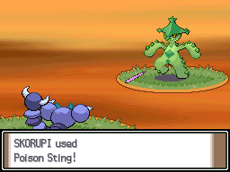 |
| 41 | Twineedle | Bug | Physical | 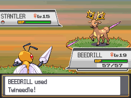 |
| 42 | Pin Missile | Bug | Physical | 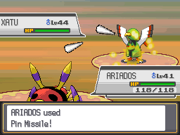 |
| 43 | Leer | Normal | Status | 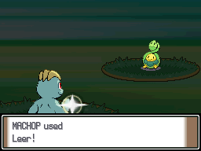 |
| 44 | Bite | Dark | Physical | 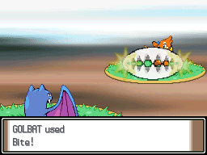 |
| 45 | Growl | Normal | Status | 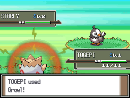 |
| 46 | Roar | Normal | Status | 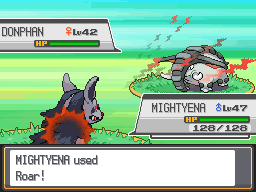 |
| 47 | Sing | Normal | Status | 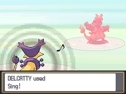 |
| 48 | Supersonic | Normal | Status | 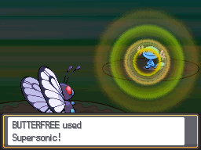 |
| 49 | Sonic Boom | Normal | Special | 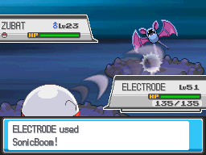 |
| 50 | Disable | Normal | Status | 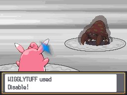 |
| 51 | Acid | Poison | Special | 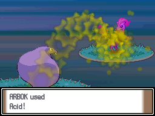 |
| 52 | Ember | Fire | Special |  |
| 53 | Flamethrower | Fire | Special |  |
| 54 | Mist | Ice | Status |  |
| 55 | Water Gun | Water | Special |  |
| 56 | Hydro Pump | Water | Special |  |
| 57 | Surf | Water | Special |  |
| 58 | Ice Beam | Ice | Special |  |
| 59 | Blizzard | Ice | Special |  |
| 60 | Psybeam | Psychic | Special |  |
| 61 | Bubble Beam | Water | Special |  |
| 62 | Aurora Beam | Ice | Special |  |
| 63 | Hyper Beam | Normal | Special |  |
| 64 | Peck | Flying | Physical |  |
| 65 | Drill Peck | Flying | Physical |  |
| 66 | Submission | Fighting | Physical |  |
| 67 | Low Kick | Fighting | Physical |  |
| 68 | Counter | Fighting | Physical |  |
| 69 | Seismic Toss | Fighting | Physical |  |
| 70 | Strength | Normal | Physical |  |
| 71 | Absorb | Grass | Special |  |
| 72 | Mega Drain | Grass | Special |  |
| 73 | Leech Seed | Grass | Status |  |
| 74 | Growth | Normal | Status |  |
| 75 | Razor Leaf | Grass | Physical |  |
| 76 | Solar Beam | Grass | Special |  |
| 77 | Poison Powder | Poison | Status |  |
| 78 | Stun Spore | Grass | Status |  |
| 79 | Sleep Powder | Grass | Status |  |
| 80 | Petal Dance | Grass | Special |  |
| 81 | String Shot | Bug | Status |  |
| 82 | Dragon Rage | Dragon | Special |  |
| 83 | Fire Spin | Fire | Special |  |
| 84 | Thunder Shock | Electric | Special |  |
| 85 | Thunderbolt | Electric | Special |  |
| 86 | Thunder Wave | Electric | Status |  |
| 87 | Thunder | Electric | Special |  |
| 88 | Rock Throw | Rock | Physical |  |
| 89 | Earthquake | Ground | Physical |  |
| 90 | Fissure | Ground | Physical |  |
| 91 | Dig | Ground | Physical |  |
| 92 | Toxic | Poison | Status |  |
| 93 | Confusion | Psychic | Special |  |
| 94 | Psychic | Psychic | Special |  |
| 95 | Hypnosis | Psychic | Status |  |
| 96 | Meditate | Psychic | Status |  |
| 97 | Agility | Psychic | Status |  |
| 98 | Quick Attack | Normal | Physical |  |
| 99 | Rage | Normal | Physical |  |
| 100 | Teleport | Psychic | Status |  |
| 101 | Night Shade | Ghost | Special |  |
| 102 | Mimic | Normal | Status |  |
| 103 | Screech | Normal | Status |  |
| 104 | Double Team | Normal | Status |  |
| 105 | Recover | Normal | Status |  |
| 106 | Harden | Normal | Status |  |
| 107 | Minimize | Normal | Status |  |
| 108 | Smokescreen | Normal | Status |  |
| 109 | Confuse Ray | Ghost | Status |  |
| 110 | Withdraw | Water | Status |  |
| 111 | Defense Curl | Normal | Status |  |
| 112 | Barrier | Psychic | Status |  |
| 113 | Light Screen | Psychic | Status |  |
| 114 | Haze | Ice | Status |  |
| 115 | Reflect | Psychic | Status |  |
| 116 | Focus Energy | Normal | Status |  |
| 117 | Bide | Normal | Physical |  |
| 118 | Metronome | Normal | Status |  |
| 119 | Mirror Move | Flying | Status |  |
| 120 | Self-Destruct | Normal | Physical |  |
| 121 | Egg Bomb | Normal | Physical |  |
| 122 | Lick | Ghost | Physical |  |
| 123 | Smog | Poison | Special |  |
| 124 | Sludge | Poison | Special |  |
| 125 | Bone Club | Ground | Physical |  |
| 126 | Fire Blast | Fire | Special |  |
| 127 | Waterfall | Water | Physical |  |
| 128 | Clamp | Water | Physical |  |
| 129 | Swift | Normal | Special |  |
| 130 | Skull Bash | Normal | Physical |  |
| 131 | Spike Cannon | Normal | Physical |  |
| 132 | Constrict | Normal | Physical |  |
| 133 | Amnesia | Psychic | Status |  |
| 134 | Kinesis | Psychic | Status |  |
| 135 | Soft-Boiled | Normal | Status |  |
| 136 | High Jump Kick | Fighting | Physical |  |
| 137 | Glare | Normal | Status |  |
| 138 | Dream Eater | Psychic | Special |  |
| 139 | Poison Gas | Poison | Status |  |
| 140 | Barrage | Normal | Physical |  |
| 141 | Leech Life | Bug | Physical |  |
| 142 | Lovely Kiss | Normal | Status |  |
| 143 | Sky Attack | Flying | Physical |  |
| 144 | Transform | Normal | Status |  |
| 145 | Bubble | Water | Special |  |
| 146 | Dizzy Punch | Normal | Physical |  |
| 147 | Spore | Grass | Status |  |
| 148 | Flash | Normal | Status |  |
| 149 | Psywave | Psychic | Special |  |
| 150 | Splash | Normal | Status |  |
| 151 | Acid Armor | Poison | Status |  |
| 152 | Crabhammer | Water | Physical |  |
| 153 | Explosion | Normal | Physical |  |
| 154 | Fury Swipes | Normal | Physical |  |
| 155 | Bonemerang | Ground | Physical |  |
| 156 | Rest | Psychic | Status |  |
| 157 | Rock Slide | Rock | Physical |  |
| 158 | Hyper Fang | Normal | Physical |  |
| 159 | Sharpen | Normal | Status |  |
| 160 | Conversion | Normal | Status |  |
| 161 | Tri Attack | Normal | Special |  |
| 162 | Super Fang | Normal | Physical |  |
| 163 | Slash | Normal | Physical |  |
| 164 | Substitute | Normal | Status |  |
| 165 | Struggle | Normal | Physical |  |
| 166 | Sketch | Normal | Status |  |
| 167 | Triple Kick | Fighting | Physical |  |
| 168 | Thief | Dark | Physical |  |
| 169 | Spider Web | Bug | Status |  |
| 170 | Mind Reader | Normal | Status |  |
| 171 | Nightmare | Ghost | Status |  |
| 172 | Flame Wheel | Fire | Physical |  |
| 173 | Snore | Normal | Special |  |
| 174 | Curse | ??? | Status |  |
| 174 | Curse | ??? | Status |  |
| 175 | Flail | Normal | Physical |  |
| 176 | Conversion 2 | Normal | Status |  |
| 177 | Aeroblast | Flying | Special |  |
| 178 | Cotton Spore | Grass | Status |  |
| 179 | Reversal | Fighting | Physical |  |
| 180 | Spite | Ghost | Status |  |
| 181 | Powder Snow | Ice | Special |  |
| 182 | Protect | Normal | Status |  |
| 183 | Mach Punch | Fighting | Physical |  |
| 184 | Scary Face | Normal | Status |  |
| 185 | Feint Attack | Dark | Physical |  |
| 186 | Sweet Kiss | Fairy | Status |  |
| 187 | Belly Drum | Normal | Status |  |
| 188 | Sludge Bomb | Poison | Special |  |
| 189 | Mud-Slap | Ground | Special |  |
| 190 | Octazooka | Water | Special |  |
| 191 | Spikes | Ground | Status |  |
| 192 | Zap Cannon | Electric | Special |  |
| 193 | Foresight | Normal | Status |  |
| 194 | Destiny Bond | Ghost | Status |  |
| 195 | Perish Song | Normal | Status |  |
| 196 | Icy Wind | Ice | Special |  |
| 197 | Detect | Fighting | Status |  |
| 198 | Bone Rush | Ground | Physical |  |
| 199 | Lock-On | Normal | Status |  |
| 200 | Outrage | Dragon | Physical |  |
| 201 | Sandstorm | Rock | Status |  |
| 202 | Giga Drain | Grass | Special |  |
| 203 | Endure | Normal | Status |  |
| 204 | Charm | Fairy | Status |  |
| 205 | Rollout | Rock | Physical |  |
| 206 | False Swipe | Normal | Physical |  |
| 207 | Swagger | Normal | Status |  |
| 208 | Milk Drink | Normal | Status |  |
| 209 | Spark | Electric | Physical |  |
| 210 | Fury Cutter | Bug | Physical |  |
| 211 | Steel Wing | Steel | Physical |  |
| 212 | Mean Look | Normal | Status |  |
| 213 | Attract | Normal | Status |  |
| 214 | Sleep Talk | Normal | Status |  |
| 215 | Heal Bell | Normal | Status |  |
| 216 | Return | Normal | Physical |  |
| 217 | Present | Normal | Physical |  |
| 218 | Frustration | Normal | Physical |  |
| 219 | Safeguard | Normal | Status |  |
| 220 | Pain Split | Normal | Status |  |
| 221 | Sacred Fire | Fire | Physical |  |
| 222 | Magnitude | Ground | Physical |  |
| 223 | Dynamic Punch | Fighting | Physical |  |
| 224 | Megahorn | Bug | Physical |  |
| 225 | Dragon Breath | Dragon | Special |  |
| 226 | Baton Pass | Normal | Status |  |
| 227 | Encore | Normal | Status |  |
| 228 | Pursuit | Dark | Physical |  |
| 229 | Rapid Spin | Normal | Physical |  |
| 230 | Sweet Scent | Normal | Status |  |
| 231 | Iron Tail | Steel | Physical |  |
| 232 | Metal Claw | Steel | Physical |  |
| 233 | Vital Throw | Fighting | Physical |  |
| 234 | Morning Sun | Normal | Status |  |
| 235 | Synthesis | Grass | Status |  |
| 236 | Moonlight | Fairy | Status |  |
| 237 | Hidden Power | Normal | Special |  |
| 238 | Cross Chop | Fighting | Physical |  |
| 239 | Twister | Dragon | Special |  |
| 240 | Rain Dance | Water | Status |  |
| 241 | Sunny Day | Fire | Status |  |
| 242 | Crunch | Dark | Physical |  |
| 243 | Mirror Coat | Psychic | Special |  |
| 244 | Psych Up | Normal | Status |  |
| 245 | Extreme Speed | Normal | Physical |  |
| 246 | Ancient Power | Rock | Special |  |
| 247 | Shadow Ball | Ghost | Special |  |
| 248 | Future Sight | Psychic | Special |  |
| 249 | Rock Smash | Fighting | Physical |  |
| 250 | Whirlpool | Water | Special |  |
| 251 | Beat Up | Dark | Physical |  |
| 252 | Fake Out | Normal | Physical |  |
| 253 | Uproar | Normal | Special |  |
| 254 | Stockpile | Normal | Status |  |
| 255 | Spit Up | Normal | Special |  |
| 256 | Swallow | Normal | Status |  |
| 257 | Heat Wave | Fire | Special |  |
| 258 | Hail | Ice | Status |  |
| 259 | Torment | Dark | Status |  |
| 260 | Flatter | Dark | Status |  |
| 261 | Will-O-Wisp | Fire | Status |  |
| 262 | Memento | Dark | Status |  |
| 263 | Facade | Normal | Physical |  |
| 264 | Focus Punch | Fighting | Physical |  |
| 265 | Smelling Salts | Normal | Physical |  |
| 266 | Follow Me | Normal | Status |  |
| 267 | Nature Power | Normal | Status |  |
| 268 | Charge | Electric | Status |  |
| 269 | Taunt | Dark | Status |  |
| 270 | Helping Hand | Normal | Status |  |
| 271 | Trick | Psychic | Status |  |
| 272 | Role Play | Psychic | Status |  |
| 273 | Wish | Normal | Status |  |
| 274 | Assist | Normal | Status |  |
| 275 | Ingrain | Grass | Status |  |
| 276 | Superpower | Fighting | Physical |  |
| 277 | Magic Coat | Psychic | Status |  |
| 278 | Recycle | Normal | Status |  |
| 279 | Revenge | Fighting | Physical |  |
| 280 | Brick Break | Fighting | Physical |  |
| 281 | Yawn | Normal | Status |  |
| 282 | Knock Off | Dark | Physical |  |
| 283 | Endeavor | Normal | Physical |  |
| 284 | Eruption | Fire | Special |  |
| 285 | Skill Swap | Psychic | Status |  |
| 286 | Imprison | Psychic | Status |  |
| 287 | Refresh | Normal | Status |  |
| 288 | Grudge | Ghost | Status |  |
| 289 | Snatch | Dark | Status |  |
| 290 | Secret Power | Normal | Physical |  |
| 291 | Dive | Water | Physical |  |
| 292 | Arm Thrust | Fighting | Physical |  |
| 293 | Camouflage | Normal | Status |  |
| 294 | Tail Glow | Bug | Status |  |
| 295 | Luster Purge | Psychic | Special |  |
| 296 | Mist Ball | Psychic | Special |  |
| 297 | Feather Dance | Flying | Status |  |
| 298 | Teeter Dance | Normal | Status |  |
| 299 | Blaze Kick | Fire | Physical |  |
| 300 | Mud Sport | Ground | Status |  |
| 301 | Ice Ball | Ice | Physical |  |
| 302 | Needle Arm | Grass | Physical |  |
| 303 | Slack Off | Normal | Status |  |
| 304 | Hyper Voice | Normal | Special |  |
| 305 | Poison Fang | Poison | Physical |  |
| 306 | Crush Claw | Normal | Physical |  |
| 307 | Blast Burn | Fire | Special |  |
| 308 | Hydro Cannon | Water | Special |  |
| 309 | Meteor Mash | Steel | Physical |  |
| 310 | Astonish | Ghost | Physical |  |
| 311 | Weather Ball | Normal | Special |  |
| 312 | Aromatherapy | Grass | Status |  |
| 313 | Fake Tears | Dark | Status |  |
| 314 | Air Cutter | Flying | Special |  |
| 315 | Overheat | Fire | Special |  |
| 316 | Odor Sleuth | Normal | Status |  |
| 317 | Rock Tomb | Rock | Physical |  |
| 318 | Silver Wind | Bug | Special |  |
| 319 | Metal Sound | Steel | Status |  |
| 320 | Grass Whistle | Grass | Status |  |
| 321 | Tickle | Normal | Status |  |
| 322 | Cosmic Power | Psychic | Status |  |
| 323 | Water Spout | Water | Special |  |
| 324 | Signal Beam | Bug | Special |  |
| 325 | Shadow Punch | Ghost | Physical |  |
| 326 | Extrasensory | Psychic | Special |  |
| 327 | Sky Uppercut | Fighting | Physical |  |
| 328 | Sand Tomb | Ground | Physical |  |
| 329 | Sheer Cold | Ice | Special |  |
| 330 | Muddy Water | Water | Special |  |
| 331 | Bullet Seed | Grass | Physical |  |
| 332 | Aerial Ace | Flying | Physical |  |
| 333 | Icicle Spear | Ice | Physical |  |
| 334 | Iron Defense | Steel | Status |  |
| 335 | Block | Normal | Status |  |
| 336 | Howl | Normal | Status |  |
| 337 | Dragon Claw | Dragon | Physical |  |
| 338 | Frenzy Plant | Grass | Special |  |
| 339 | Bulk Up | Fighting | Status |  |
| 340 | Bounce | Flying | Physical |  |
| 341 | Mud Shot | Ground | Special |  |
| 342 | Poison Tail | Poison | Physical |  |
| 343 | Covet | Normal | Physical |  |
| 344 | Volt Tackle | Electric | Physical |  |
| 345 | Magical Leaf | Grass | Special |  |
| 346 | Water Sport | Water | Status |  |
| 347 | Calm Mind | Psychic | Status |  |
| 348 | Leaf Blade | Grass | Physical |  |
| 349 | Dragon Dance | Dragon | Status |  |
| 350 | Rock Blast | Rock | Physical |  |
| 351 | Shock Wave | Electric | Special |  |
| 352 | Water Pulse | Water | Special |  |
| 353 | Doom Desire | Steel | Special |  |
| 354 | Psycho Boost | Psychic | Special |  |
| 355 | Roost | Flying | Status |  |
| 356 | Gravity | Psychic | Status |  |
| 357 | Miracle Eye | Psychic | Status |  |
| 358 | Wake-Up Slap | Fighting | Physical |  |
| 359 | Hammer Arm | Fighting | Physical |  |
| 360 | Gyro Ball | Steel | Physical |  |
| 361 | Healing Wish | Psychic | Status |  |
| 362 | Brine | Water | Special |  |
| 363 | Natural Gift | Normal | Physical |  |
| 364 | Feint | Normal | Physical |  |
| 365 | Pluck | Flying | Physical |  |
| 366 | Tailwind | Flying | Status |  |
| 367 | Acupressure | Normal | Status |  |
| 368 | Metal Burst | Steel | Physical |  |
| 369 | U-turn | Bug | Physical |  |
| 370 | Close Combat | Fighting | Physical |  |
| 371 | Payback | Dark | Physical |  |
| 372 | Assurance | Dark | Physical |  |
| 373 | Embargo | Dark | Status |  |
| 374 | Fling | Dark | Physical |  |
| 375 | Psycho Shift | Psychic | Status |  |
| 376 | Trump Card | Normal | Special |  |
| 377 | Heal Block | Psychic | Status |  |
| 378 | Wring Out | Normal | Special |  |
| 379 | Power Trick | Psychic | Status |  |
| 380 | Gastro Acid | Poison | Status |  |
| 381 | Lucky Chant | Normal | Status |  |
| 382 | Me First | Normal | Status |  |
| 383 | Copycat | Normal | Status |  |
| 384 | Power Swap | Psychic | Status |  |
| 385 | Guard Swap | Psychic | Status |  |
| 386 | Punishment | Dark | Physical |  |
| 387 | Last Resort | Normal | Physical |  |
| 388 | Worry Seed | Grass | Status |  |
| 389 | Sucker Punch | Dark | Physical |  |
| 390 | Toxic Spikes | Poison | Status |  |
| 391 | Heart Swap | Psychic | Status |  |
| 392 | Aqua Ring | Water | Status |  |
| 393 | Magnet Rise | Electric | Status |  |
| 394 | Flare Blitz | Fire | Physical |  |
| 395 | Force Palm | Fighting | Physical |  |
| 396 | Aura Sphere | Fighting | Special |  |
| 397 | Rock Polish | Rock | Status |  |
| 398 | Poison Jab | Poison | Physical |  |
| 399 | Dark Pulse | Dark | Special |  |
| 400 | Night Slash | Dark | Physical |  |
| 401 | Aqua Tail | Water | Physical |  |
| 402 | Seed Bomb | Grass | Physical |  |
| 403 | Air Slash | Flying | Special |  |
| 404 | X-Scissor | Bug | Physical |  |
| 405 | Bug Buzz | Bug | Special |  |
| 406 | Dragon Pulse | Dragon | Special |  |
| 407 | Dragon Rush | Dragon | Physical |  |
| 408 | Power Gem | Rock | Special |  |
| 409 | Drain Punch | Fighting | Physical |  |
| 410 | Vacuum Wave | Fighting | Special |  |
| 411 | Focus Blast | Fighting | Special |  |
| 412 | Energy Ball | Grass | Special |  |
| 413 | Brave Bird | Flying | Physical |  |
| 414 | Earth Power | Ground | Special |  |
| 415 | Switcheroo | Dark | Status |  |
| 416 | Giga Impact | Normal | Physical |  |
| 417 | Nasty Plot | Dark | Status |  |
| 418 | Bullet Punch | Steel | Physical |  |
| 419 | Avalanche | Ice | Physical |  |
| 420 | Ice Shard | Ice | Physical |  |
| 421 | Shadow Claw | Ghost | Physical |  |
| 422 | Thunder Fang | Electric | Physical |  |
| 423 | Ice Fang | Ice | Physical |  |
| 424 | Fire Fang | Fire | Physical |  |
| 425 | Shadow Sneak | Ghost | Physical |  |
| 426 | Mud Bomb | Ground | Special |  |
| 427 | Psycho Cut | Psychic | Physical |  |
| 428 | Zen Headbutt | Psychic | Physical |  |
| 429 | Mirror Shot | Steel | Special |  |
| 430 | Flash Cannon | Steel | Special |  |
| 431 | Rock Climb | Normal | Physical |  |
| 432 | Defog | Flying | Status |  |
| 433 | Trick Room | Psychic | Status |  |
| 434 | Draco Meteor | Dragon | Special |  |
| 435 | Discharge | Electric | Special |  |
| 436 | Lava Plume | Fire | Special |  |
| 437 | Leaf Storm | Grass | Special |  |
| 438 | Power Whip | Grass | Physical |  |
| 439 | Rock Wrecker | Rock | Physical |  |
| 440 | Cross Poison | Poison | Physical |  |
| 441 | Gunk Shot | Poison | Physical |  |
| 442 | Iron Head | Steel | Physical |  |
| 443 | Magnet Bomb | Steel | Physical |  |
| 444 | Stone Edge | Rock | Physical |  |
| 445 | Captivate | Normal | Status |  |
| 446 | Stealth Rock | Rock | Status |  |
| 447 | Grass Knot | Grass | Special |  |
| 448 | Chatter | Flying | Special |  |
| 449 | Judgment | Normal | Special |  |
| 450 | Bug Bite | Bug | Physical |  |
| 451 | Charge Beam | Electric | Special |  |
| 452 | Wood Hammer | Grass | Physical |  |
| 453 | Aqua Jet | Water | Physical |  |
| 454 | Attack Order | Bug | Physical |  |
| 455 | Defend Order | Bug | Status |  |
| 456 | Heal Order | Bug | Status |  |
| 457 | Head Smash | Rock | Physical |  |
| 458 | Double Hit | Normal | Physical |  |
| 459 | Roar of Time | Dragon | Special |  |
| 460 | Spacial Rend | Dragon | Special |  |
| 461 | Lunar Dance | Psychic | Status |  |
| 462 | Crush Grip | Normal | Physical |  |
| 463 | Magma Storm | Fire | Special |  |
| 464 | Dark Void | Dark | Status |  |
| 465 | Seed Flare | Grass | Special |  |
| 466 | Ominous Wind | Ghost | Special |  |
| 467 | Shadow Force | Ghost | Physical |  |
</FilterableSortableTable>
