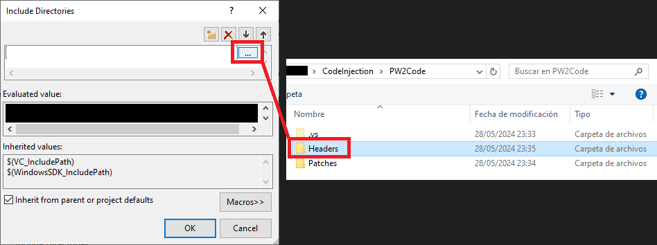
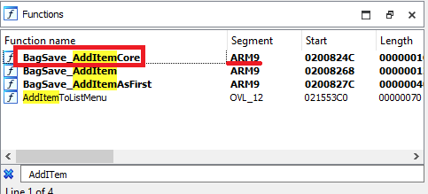
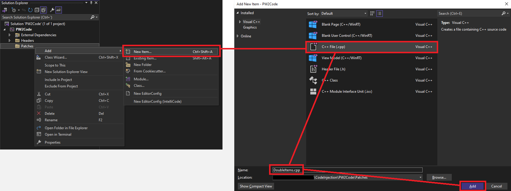
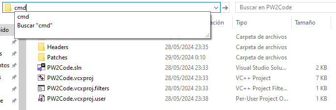

# Code Injection set up
> Author(s): [Dararo](https://github.com/Paideieitor) <br />

This guide will take you thought the steps to get a working Code Injection environment to make your own patches and/or compile patches from other people in Gen V games (White 2 recommended).

This is a practical guide so it doesn't stop to explain the reason behind the steps, it is NOT a replacement for the [Code Injection guide](../bw_b2w2-code_injection), but it should help getting started in a practical way. It should also do the trick if you only want to compile a patch, even if you can't code yourself.

Disclaimers:
- The guide uses Windows 10 and [Visual Studio](https://visualstudio.microsoft.com/es/), you can use other operating systems and IDEs as long as the tools are compatible, but most steps in this guide will not be valid for you and you will have to find out how to do them in your set up
- The guide assumes a general knowledge of C/C++ and basic UI navigation capabilities
- This is one way to set up your environment, there are diferent ways to do this

Before starting I recomend creating a ``CodeInjection`` folder to store all code injection related files and applications.

---
## Table of Contents
- [Code Injection set up](#code-injection-set-up)
  - [Table of Contents](#table-of-contents)
  - [Environment set up](#environment-set-up)
    - [File structure](#file-structure)
    - [VS Project set up](#vs-project-set-up)
    - [CTRMap set up](#ctrmap-set-up)
    - [CTRMap project set up](#ctrmap-project-set-up)
  - [Making a Code Injection patch](#making-a-code-injection-patch)
    - [IDA pseudocode to compilable code](#ida-pseudocode-to-compilable-code)
    - [Compiling a patch](#compiling-a-patch)
    - [Injecting a patch](#injecting-a-patch)

## Environment set up

### File structure
1. Create an Empty C++ Project inside of the ``CodeInjection`` folder, for this guide it will be called PW2Code
2. Create a folder named "ExternalDependencies" at ``CodeInjection/PW2Code`` 
3. Clone the [SWAN repositiory](https://github.com/ds-pokemon-hacking/swan) in the ``CodeInjection/PW2Code/ExternalDependencies`` folder
4. Clone the [NitroKernel repositiory](https://github.com/HelloOO7/NitroKernel) in the ``CodeInjection/PW2Code/ExternalDependencies`` folder
5. Clone the [ExtLib repositiory](https://github.com/HelloOO7/ExtLib) in the ``CodeInjection/PW2Code/ExternalDependencies`` folder
6. Clone the [libRPM repositiory](https://github.com/HelloOO7/libRPM) in the ``CodeInjection/PW2Code/ExternalDependencies`` folder
7. Create ``CodeInjection/PW2Code/Patches`` (here will go all your code)

File structure should look like this:
- CodeInjection
  - PW2Code
    - ExternalDependencies
      - ExtLib
      - libRPM
      - NitroKernel
      - swan
    - Patches
    - PW2Code.sln
    - PW2Code.vcxproj
    - PW2Code.vcxproj.filters
    - PW2Code.vcxproj.user
	
### VS Project set up
1. Open the project with Visual Studio
2. In the "Solution Explorer" view, click the ``Show All Files`` button (shows all the files in the project folder)

3. In the "Solution Explorer" view, select all the folders, "Right-Click" it and select the ``Include In Project`` option

4. In the "Solution Explorer" view, "Right-Click" the project and select ``Properties``
5. Go to ``Configuration Properties -> VC++ Directories -> Include Directories`` and select ``<Edit...>``

6. In the "Include Directories" window, paste ``$(ProjectDir)ExternalDependencies/swan``, ``$(ProjectDir)ExternalDependencies/NitroKernel/include``, ``$(ProjectDir)ExternalDependencies/ExtLib`` and ``$(ProjectDir)ExternalDependencies/libRPM/include`` or use the ``...`` button to look them up    

7. Click ``Ok`` and remember to click ``Accept`` in the ``Properties`` window to save the changes

Now whenever you create a CPP file in the Patches folder you will be able to include any SWAN header and use its definitions.

### CTRMap set up
For more in-depth CTRMap installation instructions check this [guide](../bw_b2w2-using_ctrmap/#setup).

1. Download [CTRMap-Community Edition](https://github.com/ds-pokemon-hacking/CTRMap-CE/releases)
2. Download the [CTRMapV plug-in](https://github.com/ds-pokemon-hacking/CTRMapV/releases)
3. Open CTRMap, select the CTRMap checkbox and click ``Launch``
4. In the "CTRMap Project Manager" window, go to the ``Games`` tab, click the ``Add ROM`` button and select your USA White 2 NDS file
5. In the "CTRMap Project Manager" window, go to the ``Additional plug-ins`` tab and click the ``Install plug-in`` button
6. Select the CTRMapV plug-in that you downloaded and install it

Now you can create Gen V CTRMap projects compatible with Code Injection.

### CTRMap project set up
This steps are required everytime you create a new project where you intend to use Code Injection, but only once per project.

1. Open CTRMap, select the CTRMap checkbox and click ``Launch``
2. Click ``File -> Create New Project`` and select the path of the project, for this example ``CodeInjection/CTRMapProject``
3. Click the ``Open`` button to open the project
4. Download [PMC](https://github.com/ds-pokemon-hacking/PMC/releases)
5. In CTRMap, go to the ``Extras`` tab and click the ``Install/Update PMC`` button and select the PMC you downloaded (``PMC_W2.rpm`` for White 2, ``PMC_B2.rpm`` for Black 2)
6. Make sure there is a patches directory at ``vfs/data/patches``, if there isn't create one
7. Download the latest [NitroKernel](https://github.com/HelloOO7/NitroKernel/releases) DLL, if you use DeSmuMe download the ``NitroKernel_DeSmuMe.dll`` (recomended)
8. In the file explorer, go to the ``CodeInjection/CTRMapProject/vfs/data/patches`` folder and add the DLL you downloaded

This Project is now ready to inject your ASM, C and C++ patches.

## Making a Code Injection patch
In this guide we will make a Code Injection patch for White 2 that doubles the amount of items the player gets, although pretty much useless this should teach the basic steps to make a patch from start to finish.

- This guide uses White 2 since it is more researched but it also works for Black 2 if you have the correct IDBs

### External Tools
This are the tools you will need to get started making your Code Injection patches:
 - [ARM GNU Toolchain](https://developer.arm.com/downloads/-/arm-gnu-toolchain-downloads)
 - IDA Pro (any disassembler works, but most of the research and documentation has been done in IDA and thus stored in IDB files which you will have to convert if you are using a different program)
 - White 2 IDBs (you can get them in the [Kingdom of DS Hacking Discord](https://discord.gg/zAtqJDW2jC) )
 - [DeSmuMe](https://github.com/TASEmulators/desmume/releases), make sure that the console is enabled at ``Tools -> Console -> Enabled``
 
### IDB research
We want to duplicate the amount of items the player gets so we want to look in the IDBs for the function that Adds an Item.

Looking in the ``Bag.idb`` in IDA and filtering the functions using "Ctrl + F" and looking for "AddItem", we find the BagSaveAddItemCore (this function is located in the ARM9 overlay so it can be found in most IDBs).


This research process will vary depending on what you are trying to implement, keep in mind not every part of the game has been researched at the same level so this step is most of the time the most time-consuming part.

### IDA pseudocode to compilable code
Now that we have located the function we want to change we can create a CPP file called ``DoubleItems.cpp`` in out ``Patches`` folder in Visual Studio.


Make sure all your functions are defined and declared inside of the scope of ``extern "C" { <declarations> }``

We can start by pasting the pseudo-code from IDA to the CPP file:

```cpp
BagItem *__fastcall BagSave_AddItemCore(BagSaveData *bag, u16 item_idx, u16 quantity, HeapID heapId)
{
  BagItem *bagItem; // r0

  bagItem = BagSave_GetItemHandleAddCheck(bag, item_idx, quantity, heapId);
  if ( !bagItem )
  {
    return 0;
  }
  bagItem->ItemID = item_idx;
  bagItem->Count += quantity;
  return bagItem;
}
```

You will see many errors, now we have to define any struct, function or global variable that the function contains.

We don't have to declare functions or struct pointers that don't get used as a struct, defining them is enough (this is called forward declaration).

1. Always remove ``__fastcall``, it is not necesary and we avoid a compiler warning
2. We need to tell CTRMap that this function is overriding another one so we use a "tag" before the function name, in this case "THUMB_BRANCH" -> ``THUMB_BRANCH_BagSave_AddItemCore`` (for more info on the relocation type tags check the [Code Injection guide](../bw_b2w2-code_injection/#preparing-our-code-for-injection) )
3. General ``typedef`` like ``u16`` are in the ``swantypes.h`` file so we include it -> ``#include "swantypes.h"``
4. The ``HeapID`` definition is in the ``gfl/core/gfl_heap.h`` file so we include it -> ``#include "gfl/core/gfl_heap.h"``
5. ``BagSaveData`` is only used as a pointer so we can use forward declaration -> ``struct BagSaveData;``
6. Even though ``BagItem`` is also a pointer we do use it as a struct so we need to declare it and define it:
- 6.1. Go to IDA and open the IDB in use (``Bag.idb`` in this case)
- 6.2. Go to the ``Local Types`` tab (if you don't see it use ``View -> Open Subviews -> Local types``)
- 6.3. Press "Ctrl + F" and type "BagItem" and click on the slot with the same name once
- 6.4. Press "Ctrl + E", copy the C struct and paste it in the CPP	

7. The function uses a function called "BagSave_GetItemHandleAddCheck" we can double click it in IDA to get the declaration -> ``BagItem * BagSave_GetItemHandleAddCheck(BagSaveData *bag, u16 item_idx, u16 quantity, HeapID heapId);``
8. To make the changes we want we can analyze the function and see that the quantity to add is added to the bagItem::Count, so to double the items given we can multiply the quantity by 2 -> ``bagItem->Count += quantity * 2;``
9. Finally we want to print a console message (this is very useful since we can't use breakpoints):
- 9.1. We include the print header -> ``#include "kPrint.h"``
- 9.2. We make a print call at the end of the function to notify us of what happened -> ``k::Printf("Added %d of the following item -> %d\n", bagItem->ItemID, bagItem->Count);``

Now the patch is done and we should have the following code without any visible errors:

```cpp
#include "swantypes.h"
#include "gfl/core/gfl_heap.h"

#include <cstdarg>
#include "kPrint.h"

struct BagSaveData;
struct BagItem
{
    u16 ItemID;
    u16 Count;
};

extern "C" 
{

BagItem* BagSave_GetItemHandleAddCheck(BagSaveData* bag, u16 item_idx, u16 quantity, HeapID heapId);
BagItem* THUMB_BRANCH_BagSave_AddItemCore(BagSaveData* bag, u16 item_idx, u16 quantity, HeapID heapId)
{
    BagItem* bagItem;

    bagItem = BagSave_GetItemHandleAddCheck(bag, item_idx, quantity, heapId);
    if (!bagItem)
    {
        return 0;
    }
    bagItem->ItemID = item_idx;
    bagItem->Count += quantity * 2;

    k::Printf("Added %d of the following item -> %d\n", quantity * 2, bagItem->ItemID);
    return bagItem;
}

}
```

### Compiling a patch
These instructions assume you followed the previous steps, your SWAN headers and other External Dependencies are in the ``CodeInjection/PW2Code/ExternalDependencies`` folder and your code in the ``CodeInjection/PW2Code/Patches`` folder.

1. Open a cmd terminal in the PW2Code folder (in the "File Explorer" window go the the PW2Code folder, click the path input box, type "cmd" and clik "Enter")   

2. Paste the following command in the terminal:    
``arm-none-eabi-g++ Patches/DoubleItems.cpp -I ExternalDependencies/swan -I ExternalDependencies/NitroKernel/include -o DoubleItems.elf -r -mthumb -march=armv5t -Os``   
General structure of the command for a C++ patch:    
``arm-none-eabi-g++ [patch path] -I [include directory path] -o [output path] -r -mthumb -march=armv5t -Os``   

``-I`` is used to provide Additional Include Directories, which are used to search included files outside of the local folder. Since our External Dependencies include files relative to their respective local folder (``#include "swantypes.h"``) using ``-I`` allows this files to compile without changing the source to include from our local folder (``#include "../ExternalDependencies/swan/swantypes.h"``).     
In this particular example we only use ``-I`` to include the SWAN and NK directories since they are the only ones we use, you can use it to include as many External Include Directories as you need.

I recommend that you set the output file to be in a specific folder for the ELF files, to keep stuff organized.

### Injecting a patch
You can use the ESDB in the SWAN headers but I recomend making your own using this [guide](../bw_b2w2-code_injection/#building-code-injection-patches). 

Once you have the correct ESDB follow these steps:

1. Open your CTRMapProject and go to the "Extras" tab
2. Click the ``Convert ELF to DLL`` button and select the correct ESDB, then the ELF file you just compiled and create the DLL
3. If the ``Install to /patches`` checkbox is not enabled you will have to manually move the DLL to the ``CTRMapProject/vfs/data/patches`` folder
4. Now you can go to ``File -> Export ROM`` and your patch should be applied in the exported ROM

The patch has been applied to the ROM, and if you play the game you should receive double the items whenever you are given them, also a message should be displayed in the console.

For example, if you buy 5 pokeball you should get 10 in your bag. 
