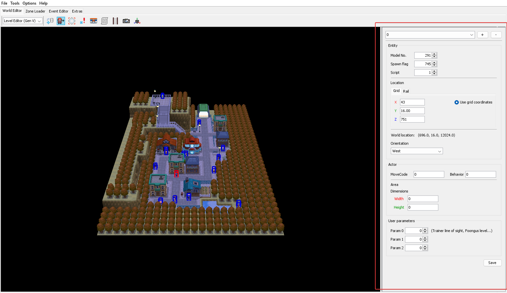
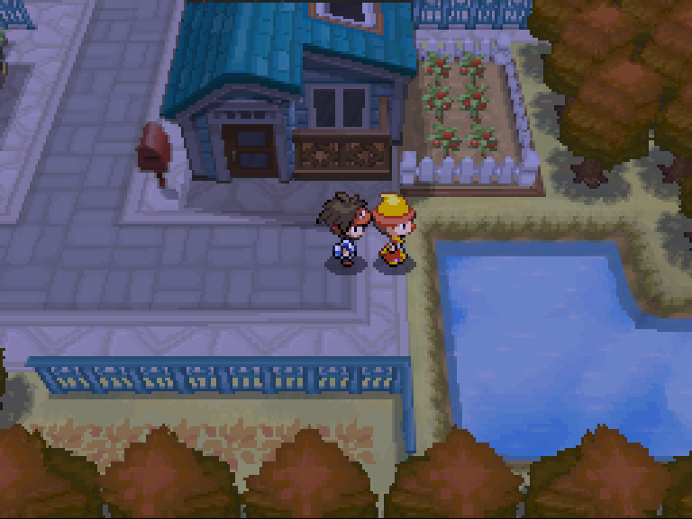
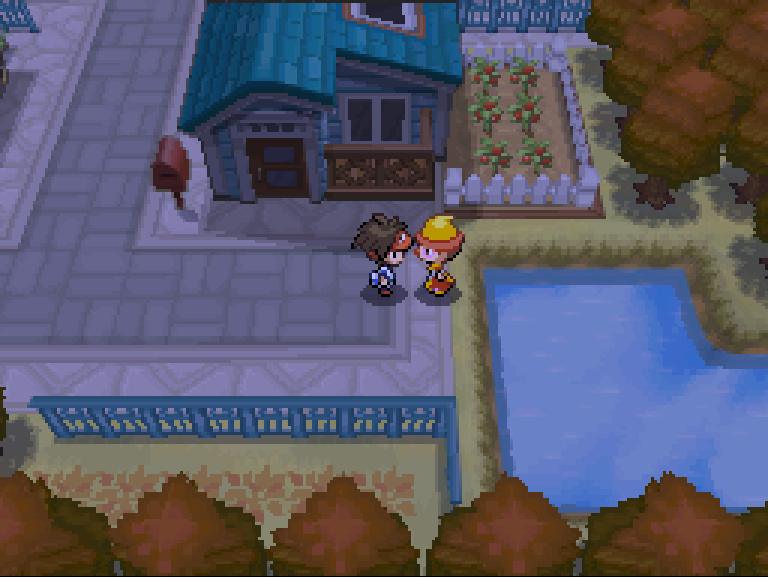
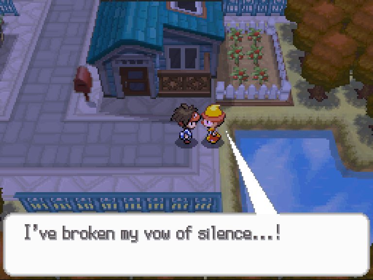

# Hands-on with PokéScript:<br />Our First Script
> Author(s): [Brom](https://github.com/brombrombromley)

What do a static encounter with a Legendary Pokémon, a talk with a Gym Leader, and a guy talking about technology have in common? They all make use of scripting! Getting started with scripting may be a little scary at first, but with some guidance, it can actually start to be pretty fun. By the end of this guide, you will be able to have a basic NPC that you can talk to like in this video here:

<video controls>
  <source src="/video/generation-v/guides/bw_b2w2-pokescript/script_demo01.mp4" type="video/mp4"/>
</video>


## Loading into our map

First, let's load into Aspertia City by going into the Zone Loader tab
at the top and going to Zone 427. Now that we've done that, let's return
to the World Editor tab.


Looks pretty neat, right? But, we can get a better view to help us
place ourselves a new NPC. First press the F5 button to exit the
simulated player view and then press F3 to switch to the perspective
camera. Now you can see the whole map!


To move around, you can use the WASD keys and Q and E to move up and down
vertically respectively.

## Making our new NPC

To place an NPC, click the little person icon at the top to start
using the NPC tool. With this, you can add, remove, and edit info
of NPCs around a map. You can see all of this information on the
rightside panel.



In the panel we just opened, click the + button up at the top to
create a new NPC. You can click and drag the NPC to place it where
you'd like on the map, but you can also type in the coordinates
manually in the location box.

For now, let's put an NPC at X 50, Y 16, Z 763 and having the NPC
face to the right by setting the orientation to “East.” With the “Model No.” field, we can change the graphic used by our NPC as well. Feel free to set it to whatever you'd like!

:::note

The Y coordinate for NPCs actually uses a smaller unit than
your standard grid tile! If you look at the "World location"
below the boxes to edit the NPC's location, you can see the
location of the NPC with the world's sub units. Each standard
grid tile is made up of 16 of these subunits, so if you want
to move an NPC up to be a grid unit high, you gotta set Y to 16!

:::

Let's build ourselves a new ROM now by going to File > Export ROM
(or pressing Ctrl + E) and head to Aspertia City!

:::note

If you add an NPC to the map that is loaded when you resume the
game, you will have to re-enter it for them to show up! This
also applies for when you remove an NPC.

:::

If you did everything right, you'll probably see an NPC facing
the pond towards your house! Try going up to them and trying
to talk to them.



...It seems like our new NPC is ignoring us, but fret not! We still
haven't given the NPC a script! Let's change that!

## Making our new script

Let's go over to the Event Editor panel up top then click Open in IDE.
Make sure the "Attempt to decompile" option is checked. This should
open up the PokéScript IDE which will be our primary tool for scripting.
After you open the script file for Aspertia City, you should see all the
scripts going on in Aspertia City. There sure are a lot! Don't get too
bogged down, though! Let's scroll down until we find line 1120 on the
left side of the code editor. This should be right after the script
function called "main_33." This is where we will be writing our new
script function, so make sure to give it some breathing room by pressing
enter a few times to add some lines around where we're putting it.

:::note

You may notice there's a lot of weird stuff going on with the names of
some of the functions (like the function called `sub_03eb()`) or the random
labels like `LABEL_0997`. This is because any PokéScript we write gets
boiled down into something the game can actually read. The reason we had to
check the "Attempt to decompile" box is because CTRMap was turning what the
game already had into PokéScript for us! But, things like the naming or
comments don't exist in what the game reads, so instead we get those
random-seeming names. Those names come from their actual location in
the script file since they don't have a real name!

:::

For our new script, let's call the function for it `main_34()` and we'll
make a code block like this:
```java
public static void main_34() {
	Actor.PauseAll();
	Sound.SEPlay(1351);
	Actor.FacePlayer();
	Runtime.FinishSubEvents();
	Actor.UnpauseAll();
}
```
Save the script file then go back to the main CTRMap window and return to the
World Editor tab. Let's assign our new NPC by the pond script 34 with the NPC
tool and then export a new ROM.



In game, try talking to our NPC now. It looks like our NPC is noticing us!
But it doesn't seem like they're able to talk, though... Let's break down
what we wrote first then we'll try to get them to speak.

First let's look at the top of our new function. Whenever you want to 
make a function that can be used as a script, you always need 
`public static void` and then a name for the function. The function
can be named anything that you'd like, but it's important
to keep track of what script ID it will be.

:::tip

You may notice how the functions in the script file are labeled `main_1()`, 
`main_2()`, and so on. This lines up with script ID 1, script ID 2, and so on. 
You don't need to name your functions this way, but it's good to label the 
first public function as `main_1()` and the second public function as `main_2()` 
or making a comment of the ID that matches with the function. If you make 
the game use script ID 2 for an NPC, it doesn't matter if it's named `main_2()` 
or `RunMyReallyCoolScript()`, as long as it is the second 
`public static void` function in the script file, that's what will be used.

:::

Next, we'll look at `Actor.PauseAll()` and `Actor.UnpauseAll()`. As the name
implies, it makes all the NPCs on the map stop moving and resume moving respectively.
For most events, you'll probably want these so the NPC you're talking to doesn't
just walk away from you while you're talking to them accidentally.

After this, we have `Sound.SEPlay(1351)`. With `Sound.SEPlay()` we can play any
sound effect that we want! In this case, sound effect 1351 is SE_MESSAGE.

:::tip

You can look at the other sound effects [here](https://docs.google.com/spreadsheets/d/17YDObYDZWu4hioMmH4tQqln4a4Dzz_vXj5jfKWwvUDI/edit?usp=drivesdk) or even better,
a tool like [Nitro Studio 2 Deluxe](https://github.com/Lonk12/NitroStudio2Deluxe/releases/download/v0.2.2.2/Nitro.Studio.2.Deluxe.Zipped.zip) can be used if you want to hear the
sound effects, too!

:::

And then, with `Actor.FacePlayer()`, if you talked to the NPC by pressing A
on them, then they'll face the direction of the player automatically!

Lastly, we have `Runtime.FinishSubEvents()`. Don't worry too hard about this one.
This one just cleans up after our script once we're done with it.

## Giving our NPC something to say

Let's go back to the main CTRMap window again and go to the Event Editor tab.
With the script text, scroll all the way to the bottom and right click on the
last dialogue line and click "Add line after." Let's give our NPC something
to say now.

::::warning

The text you write doesn't wrap automatically. If it's too long, it'll
get cut off! Consider using something like [this](https://docs.google.com/spreadsheets/d/1qkUqyu8AP0blNr8YGiRRJxPxl3MRijj5qXKA2SQxiNI/edit?usp=drivesdk) to preview how long
your text will look in the text box to prevent it from being cut off.

:::note

With the linked spreadsheet template, it gives a conservative estimate
  of what your text will look like, so sometimes more may be able to fit
  if you are using a thin letter like i or lowercase l.

:::

::::

Give your NPC something to say! Have some fun!

Once you're done writing some dialogue, let's go back to our script function,
`main_34()`. After the command that makes the NPC face the player, let's
make them speak. Assuming your new dialogue message is message 131, we'll add
```java
Message.Actor(1024, 131, 0, 0);
Input.LastKeyWait();
Message.CloseAll();
```
so then your function should look like this:
```java
public static void main_34() {
	Actor.PauseAll();
	Sound.SEPlay(1351);
	Actor.FacePlayer();
	Message.Actor(1024, 131, 0, 0);
	Input.LastKeyWait();
	Message.CloseAll();
	Runtime.FinishSubEvents();
	Actor.UnpauseAll();
}
```
Again, let's export another ROM and look at what we see.



Wow, look! They can talk now!

To break this down, let's look at this bit by bit, too.

- `Message.Actor()` makes a textbox that comes from an NPC you directly had
to interact with to start the script. If you want it to come from someone
else, you'll have to use `Message.ActorEx()`. Using the non-ex version is
handy though because you don't need to specify who's talking, but in
some cases you might need to.

- The first argument of `Message.Actor()` is the container of messages that
the dialogue box will use. But, when you use 1024 as the container, the
game knows just to use the default one for scripts on the map (which you
can see in the Zone Loader tab.) Generally, you can just keep this at
1024 without worrying too much about it.

- The second argument of `Message.Actor()` is the message that will be used
for the text box. In this case, the message we wrote in message 131
from Aspertia City's message container will be shown.

- The third argument of `Message.Actor()` is the position of the text box.
Since we selected 0, it will automatically place the text box.
Try comparing talking to your NPC from above them compared to
below them! If we select 1, the text box will always show on
top and if we select 2, the text box will always show on the bottom.

- The fourth and final argument of `Message.Actor()` is the message box type.
If you use 0, it'll just be the standard talking frame, but if you set
it to 1, it'll become spiky. There is a thought bubble box if you select
option 2, but the text box arrow partly breaks it.

Yikes! That's a lot of parameters to remember, right? Fret not! There's
a document with all the commands in the game right [here](https://docs.google.com/spreadsheets/d/1zvLQFVdv6kbEgP9TY9yfV6ChK0qsz79E6PvF5lohnGk/edit#gid=0)!

Anyway, to continue, we have `Input.LastKeyWait()`. This command paired
with something like `Message.CloseAll()` are great when you're at the
end of a script and you're OK with the player immediately walking
away after the NPC is done talking. Without this, if your message
didn't have a `\c` character to show the next message cursor, the
text box would close as soon as the text was done printing! How rude!

Our last new addition is `Message.CloseAll()`. This closes text boxes
of any type. Right now, we've only seen Actor-type text boxes, but
if you look at the [script command doc](https://docs.google.com/spreadsheets/d/1zvLQFVdv6kbEgP9TY9yfV6ChK0qsz79E6PvF5lohnGk/edit?usp=sharing), you might see other box
types such as the place sign or info boxes. This command closes
these message boxes, too.

:::warning

You must use a close command every time you use a message command. If you don't, the message box can stick on the screen even after the event and potentially make the game perform weird behaviors otherwise.

:::

Congrats! Now that you've done this, you can make an NPC that
can talk to you! ...What do you mean you want to do more than that?

Well, luckily for you, there's another part! ...Coming soon, so sit tight! In the meantime, though, feel free to join the [DS Modding Community Discord server](https://discord.gg/YBtdN3aXfv) for support with scripting and more!
