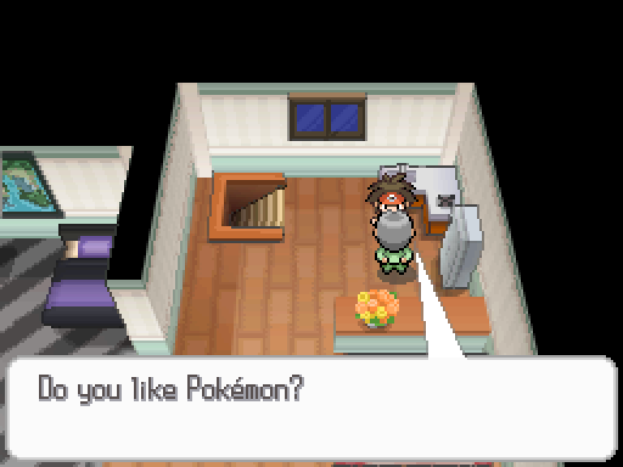
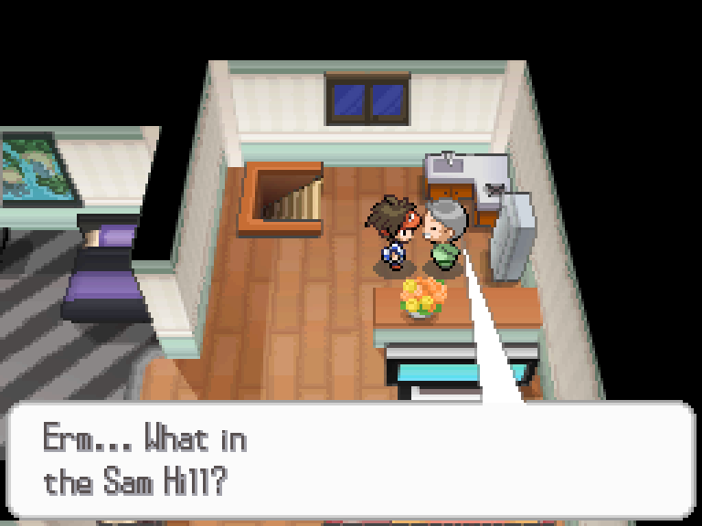
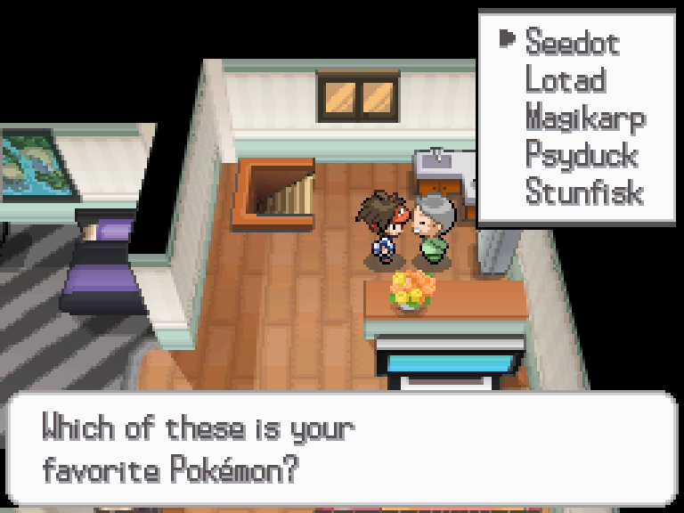
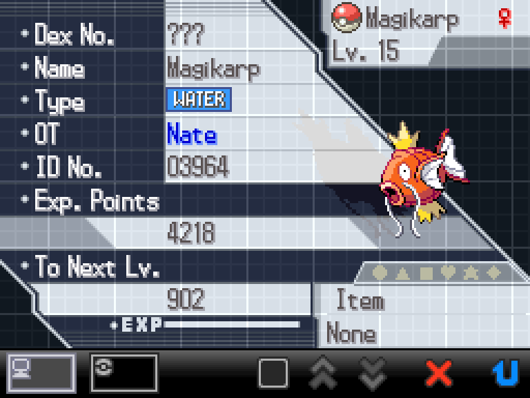

---
title: 'Hands-on with PokéScript: Yes, No, Maybe a Battle So'
tags:
  - Guide (Black)
  - Guide (White)
  - Guide (Black 2)
  - Guide (White 2)
  - Hands-on with PokéScript
  - Hands-on with...
---

# Hands-on with PokéScript:<br />Yes, No, Maybe a Battle So
> Author(s): [Brom](https://github.com/brombrombromley)

In the [last part of _Hands-on with PokéScript_](/generation-v/guides/bw_b2w2-pokescript01/bw_b2w2-pokescript01.md), we learned how to get an NPC to speak to us! But, what if we wanted to have an NPC ask us a question? Or, something more exciting, how about if we wanted to have them challenge us to a battle? In this entry of _Hands-on with PokéScript_, we'll be learning how to do just that! By the end of this entry, we'll have something that looks like this:

<video controls>
  <source src="/video/generation-v/guides/bw_b2w2-pokescript02/battle_demo01.mp4" type="video/mp4"/>
</video>

## Setting Up

For this entry, there will be a [save file](resources/pokescript02.sav) provided to help with following along. With this save file, it will place you in the lower part of Hugh's house in Aspertia City, Zone 429. For this entry, we will be placing a new NPC in the upstairs area, Zone 430. This save file can be imported by most emulators.

- For MelonDS, this save can be imported using the `File > Import savefile` option then opening `pokescript02.sav`.
- For DeSmuME, this save can be imported using the `File > Import Backup Memory...` option then opening `pokescript02.sav`.

:::note

If you remember from the last part, if you don't reload a map after adding a new NPC, moving them around, reassigning their script, and things like that, they won't appear changed in game. This is the main reason for why the save is in the downstairs area rather than directly in the upstairs area.

:::

After getting the save file loaded, let's get back into our CTRMap project and head to Zone 430 using the Zone Loader. Now that we're in Zone 430, let's add another NPC just like how we did in the [first part](/generation-v/guides/bw_b2w2-pokescript01/bw_b2w2-pokescript01.md) and place it at `(x: 12, z: 4)` and have it face to the west like so. 


:::note

In this case, I have set the `Model No.` field to 69 to be a Janitor in order to match the Trainer party we will be using later in this guide.

:::

Using what we learned in the [last part](/generation-v/guides/bw_b2w2-pokescript01/bw_b2w2-pokescript01.md), let's try making an NPC that faces us when we talk to them and asks us if we like Pokémon.



:::note

If you want to see a solution of how you might script this, you can see a sample version below.

<details>
  <summary>Sample Solution</summary>

  ```java
  public static void main_5() {
		Actor.PauseAll();
		Sound.SEPlay(1351);
		Actor.FacePlayer();
		Message.Actor(1024, 9, 0, 0);
		Input.LastKeyWait();
		Message.CloseAll();
		Runtime.FinishSubEvents();
		Actor.UnpauseAll();
	}
  ```

  Do keep in mind that you might have to use a different message ID when using `Message.Actor()` depending on where you put your text at.
</details>

:::

You might notice, though, that we won't be able to respond to the question he asks us, so what can we do about that? Let's tackle some ways we can let the player respond to questions that we might want NPCs to ask them.

## Handling Yes/No Responses

For simple responses to questions asked by NPCs, we can use `YesNoWin.Show()` to give us a basic box that lets us answer with “YES” or “NO.” You might notice, though, when you try to directly put `YesNoWin.Show()`, at the bottom of the screen, CTRMap will say `Could not resolve method: YesNoWin.Show()`. This is because we need to “import” the `YesNoWin` package. 

To fix this, we need to go up to the top of our file and add `import event.dialogs.YesNoWin;`. For a lot of commands, you will need to import them into your PokéScript file, but luckily, just like the script commands themselves, the package you need to import can also be found in the [script command doc](https://docs.google.com/spreadsheets/d/1zvLQFVdv6kbEgP9TY9yfV6ChK0qsz79E6PvF5lohnGk/edit?usp=sharing) in the second to last column. This might be a little difficult to get used to at first, but with time it will gradually become more familiar.

:::note

You might not have noticed it, but even when we use `Message.Actor()` or `Message.CloseAll()`, we are actually using functions from `event.dialogs.Message`. You can see this at the top of the script file where it says `import event.dialogs.Message;` along with the other “packages” that are being imported for this script.

:::

Now that we can put in Yes/No Windows using `YesNoWin.Show()`, let's replace the `Input.LastKeyWait()` with `YesNoWin.Show()` for now. Let's take a look at what that does!

<video controls>
  <source src="/video/generation-v/guides/bw_b2w2-pokescript02/yesno_demo01.mp4" type="video/mp4"/>
</video>

Hm... Well, the Yes/No Window shows up, but let's see how we can get our NPC to say different things depending on if we say yes or no.

For this, we will need to introduce our handy friend, the `if` block. Basically, whenever we want something to happen only *if* some specific thing happens, we can use an `if` block. Generally, `if` blocks look like this:

```java
if (condition) {
  // The script commands that will
  // run if the special condition
  // happens
}
```

Within `if` blocks, if something is `true`, then the code inside will happen, and if the condition is `false`, then the code inside will be skipped. For example, if we can see:

```java
if (2 + 2 == 4) {
    // The code inside here
    // will always run since
    // unless math changes,
    // 2 + 2 will always be 4
}

if (2 + 2 == 5) {
    // This code will never run
    // because it is false to say
    // that 4 equals 5.
}
```

This isn't the most useful for things that are always true like 2 + 2 being 4 and 2 + 2 not being 5, but for something that could change like if the player says yes or no, using this, we can do exactly what we wanted! Let's try making our NPC say something when we select no after we give our NPC another line to say.



```java
public static void main_5() {
    Actor.PauseAll();
    Sound.SEPlay(1351);
    Actor.FacePlayer();
    Message.Actor(1024, 9, 0, 0);

    boolean isNo = YesNoWin.Show();
    
    if (isNo == true) {
        Message.CloseAll();
        Message.Actor(1024, 10, 0, 0);
        Input.LastKeyWait();
    }
    
    Message.CloseAll();
    Runtime.FinishSubEvents();
    Actor.UnpauseAll();
}
```

This might look a little scary at first, but let's break it down! Let's look at the line with our `YesNoWin.Show()` first:
- `boolean isNo`: This here is a variable. With a variable, we can store different kinds of values depending on its type. Because our variable `isNo` is a `boolean` type, it means we can hold values that are `true` or `false`. In this case, if the player says no, then `isNo` will be `true` and if the player says yes, then `isNo` will be `false`. Once the script is finished and the player can move again, variables we make like this get their contents deleted.
- `YesNoWin.Show()`: In addition to showing a Yes/No Window on the screen, it'll also let us know if the player said no or not. If we don't store it somewhere like in a variable, then it's like a guy shouting alone in a forest with no one to hear him.
- `=`: When we have a single equal sign, instead of seeing if two things are equal to each other, it'll put whatever came from the right into the variable on the left. In this case, we take whatever `YesNoWin.Show()` said and give it to `isNo`.

How about we make our NPC do something else if we don't say no? This is where the `if` block's handy associate comes in, the `else` block. Whenever you want something to run if it's not the special condition that the `if` block is checking for, then the `else` block will run. We can use it like so:

```java
if (isNo) {
    Message.CloseAll();
    Message.Actor(1024, 10, 0, 0);
    Input.LastKeyWait();
} else {
    Message.CloseAll();
    Message.Actor(1024, 11, 0, 0);
    Input.LastKeyWait();
}
```

Now, when the player says no, the NPC will say line 10, but if not, then the NPC will say line 11 instead! We'll be using these “conditionals” more as we continue working on this script.

:::note

Similar to how `YesNoWin.Show()` can give us a `boolean` value, every function in PokéScript has a return type! One of the things we handwaved before earlier is the `void` whenever we make a new script. This is because when a function returns `void`; just like the real void, it returns nothing.

:::

If you've gotten to this portion, pat yourself on the back! Getting the tools of making a script, importing packages, and using basic conditionals is much of what you will need when scripting! By the end of this section, you should have something like this:

<video controls>
  <source src="/video/generation-v/guides/bw_b2w2-pokescript02/yesno_demo02.mp4" type="video/mp4"/>
</video>

## Handling Multiple Choice Responses

How about if we wanted to answer something more complex than yes or no? If we let's say wanted to have a list of different Pokémon to choose from, then using a list from the `ListMenu` package is right what we need.

Similar to how we needed to import the `YesNoWin` package for us to be able to show a Yes/No Window, we'll need to import the `ListMenu` package like so:
```java
import event.dialogs.ListMenu;
```
Let's make our NPC which Pokémon the player likes the most out of five Pokémon. In the Event Editor tab, let's add five new lines at the end and put in the names of five different Pokémon.

After we add the text that is supposed to show up in our List Menu, we can create a List Menu with 5 elements like this:
```java
int result;
ListMenu.InitRightAnchor(31, 1, 0, 0, result);
ListMenu.AddItem(12, 0xFFFF, 273);
ListMenu.AddItem(13, 0xFFFF, 270);
ListMenu.AddItem(14, 0xFFFF, 129);
ListMenu.AddItem(15, 0xFFFF, 54);
ListMenu.AddItem(16, 0xFFFF, 618);
ListMenu.ShowDialog();
Message.CloseAll();
```
Let's break this down again bit by bit again, starting with the first line.
- `int result`: This is another kind of variable. If you remember how our `boolean` variable `isNo` could hold `true` or `false` values, our `int` (integer) variable called `result` can hold numbers. In this case, this variable will be the *result* from the item in the List Menu that we selected. After the script finishes, though, this is reset, so it won't remember what we picked last time unless we save it some other way. We'll look at how we can store things like this even after the script finishes in another lesson.
- `ListMenu.InitRightAnchor()`: This here is what we need to say we would like to make a ListMenu. Here, we generally want to have the right side of the List Menu to be our reference point for positioning it. This is why we use the `InitRightAnchor()` command. If we wanted to use the left side as our reference point, we could use `InitLeftAnchor()` instead. Let's look at each of the parameters for these functions:
  - The first parameter: This lets us set how far to the right the menu should be positioned. Generally, if you want it to appear on the right edge of the screen when using `InitRightAnchor()`, setting it to `31` is good.
  - The second parameter: This lets us set how far down the menu should be positioned. Generally, if you want it to appear on the top edge of the screen, setting it to `1` is good.
  - The third parameter: This is the List Menu item that will be selected by default once we show the List Menu.
  - The fourth parameter: This lets us set if we can close out from this menu using the B Button or not. If we set this to `0`, then the player must select something, but if we do want the player to be able to cancel by pressing the B Button, we can set this to `1`.
  - The fifth parameter: This is what variable will be used to store what the player selected from the list.
  
  Just like last time with `Message.Actor()`, you can find the parameters for a command in the [script command doc](https://docs.google.com/spreadsheets/d/1zvLQFVdv6kbEgP9TY9yfV6ChK0qsz79E6PvF5lohnGk/edit?usp=sharing), so don't worry about trying to remember every parameter here!
- `ListMenu.AddItem()`: Before we put our List Menu on the screen, we need to add our items to it. Think of it like how a café needs to write everything on its menu board before it can put it out for the day. Let's go through each of the parameters:
  - The first parameter: This is the message ID that will be used for this entry. In this case, I added messages 12-16 as entries for my menu items.
  - The second parameter: If we used `Message.System()` instead of `Message.Actor()` to show our text, we can have additional explanation text for each List Menu item. But, since we're using `Message.Actor()` here, we can't use this feature. If you don't want to use any explanatory text, you can set this argument to `0xFFFF`.
  - The third parameter: This is the value that our `result` variable will be set to if we select this option. Here, I made it so that `result` will get the Pokédex number of the Pokémon we select.
- `ListMenu.ShowDialog()`: Now that we've said that we wanted to make a List Menu then added items to it, we can call `ListMenu.ShowDialog()` to show the List Menu on the screen.
- `Message.CloseAll()`: After the player selects an item from the List Menu, we want it to close.



Amazing! Now we have a List Menu on the screen! But, just like last time with the Yes/No Windows, after we select an option, it doesn't to anything. Let's doing something about it!

List Menus are a little more complex than simple Yes/No Windows. Since we can have more than two options, it might at first seem like our `if` and `else` blocks won't be enough for us. Something that may be surprising, though, is that we can make an `else if` block by combining both of them together! We can see it here:
```java
if (conditionA) {
    // ...
} else if (conditionB) {
    // ...
} else if (conditionC) {
    // ...
} else if (conditionD) {
    // ...
} else {
    // ...
}
```
By doing this, not only are we able to do something only when Condition A is true, but we can also specify code for when only Condition B, C, or D are true! Let's see how we can use this with List Menus.

Let's say that we want our NPC to say one thing if we pick their favorite Pokémon, one thing if we pick their least favorite Pokémon, and one thing if we pick anything else. For this example, let's suppose this Janitor's favorite Pokémon is Stunfisk and his least favorite Pokémon is Magikarp.

If we do something like this here after we create our list:
```java
if (result == 618) {
    Message.Actor(1024, 18, 0, 0);
    Input.LastKeyWait();
} else if (result == 129) {
    Message.Actor(1024, 19, 0, 0);
    Input.LastKeyWait();
} else {
    Message.Actor(1024, 20, 0, 0);
    Input.LastKeyWait();
}
```
:::note

There is a difference between `=` with a single equal sign and `==` with two equal signs. With just `=` it assigns a value to a variable, but with `==` it compares both sides to see if they are equal in value to each other.

:::

We can see that if the player selected Stunfisk, `result` in this case will be set to `618` and then trigger the first `if` block. If we instead chose Magikarp, then `result` would be set to `129` in this case, triggering the code in the middle. If we selected any of the other options, though, then the `else` block's code will run. The value that `result` is set to will depend on what you used in `ListMenu.AddItem()`, but this general format is what you can use to check through multiple scenarios. If we combine everything we've used so far, we can get something like this!

<video controls>
  <source src="/video/generation-v/guides/bw_b2w2-pokescript02/list_demo01.mp4" type="video/mp4"/>
</video>

## Giving a Pokémon

You may have noticed that with this save, you don't have any Pokémon. Let's change that! 

For this, normally we'd need to import the `PokeParty` package from `pokemon.PokeParty`, but since this map already has this imported, we don't have to worry about it like we did for our List Menus and Yes/No Windows!

To add a Pokémon to the player's party, we'll use `PokeParty.AddPkm()`. If we wanted to give the player a Level 15 Magikarp for example, we would write:
```java
PokeParty.AddPkm(129, 0, 15);
```
Here, the first parameter is the Pokémon species ID, the second parameter is the form of the Pokémon, and the third parameter is the level. Since we don't have any special forms for Magikarp, we just set that argument to `0`.

If we try to take a look in-game after adding this, we won't really notice anything, so let's at least try to look at the Pokémon menu. ...Except, we can't do that either! For us to see the Pokémon option in the X Menu, let's briefly talk about Flags.

Flags are a longer-term way to store the “state” of something being `true` or `false`. Unlike our variable `isNo` from earlier, Flags can persist even after the script ends. Throughout the game they are used for many purposes such as letting the game know things like if the player has picked up an item or not, if it should show an NPC to us or not, if a player has battled a Trainer.

In this case, we'll be touching a System Flag. These flags start at Flag 2400 and they track things like if we finished the game, if we've visited a town or not, or in this case, with Flag 2401, if we can see the Pokémon menu or not.

If we want Flag 2401 to be `true`, we can use the `EventFlags.Set()` function. If we wanted it to be `false`, then we can use the `EventFlags.Clear()` function. So, let's make the Pokémon menu visible like so:
```java
EventFlags.Set(2401);
```
When we run our script again, we can see the Pokémon that we were supposed to be gifted! As a challenge, try to use our `result` variable from earlier to give the player the Pokémon that they selected instead of Magikarp. In a later part, we will go into further detail on Flags, plus  will also later look more in depth at things we can do with text.



## Prepare for Battle!

Now is finally the part that you've likely been waiting for! Let's see how we can battle a Trainer! For this lesson, editing Trainers won't be covered, but for now, we will just use a Trainer that already exists in game, Janitor Orville.

To make a battle, we'll need to import the `Battle` package from `event.Battle`. Based on how we've imported packages before, try importing the `Battle` package on your own.

After we get the `Battle` package imported, we can set up a battle like so:
```java
Battle.CallTrainerBattle(182, 0, 0);
boolean didPlayerWin = Battle.IsTrainerVictory();
if (didPlayerWin == true) {
    Battle.EndTrainerBattle();
} else {
    Battle.CallTrainerLose();
}
```
One more time, let's break down what is happening part by part again:
- `Battle.CallTrainerBattle()`: This is what starts the Trainer battle for us. We have a few parameters, so let's see what they do as well.
  - The first parameter: This is the party that the Trainer will use for this battle. In this case, Trainer 182 is the one used by Janitor Orville.
  - The second parameter: If you want a multi-battle against two Trainers, then this can be used to set the party to be used by the second Trainer. If this is set to `0` like it is here, though, it will just be a single battle.
  - The third parameter: Depending on what this is set as, it makes the battle handle certain special cases. For most people, though, you only need to know that if this is set to `1`, it will be a battle where the game continues even if all of your Pokémon have fainted. If we don't want anything special like that, we can just keep this set to `0`.
- `boolean didPlayerWin = Battle.IsTrainerVictory()`: Similar to when we set `isNo` earlier on, we are doing the same thing here, but this `boolean` variable will be `true` if the player won the battle and `false` if the player lost the battle.
- `Battle.EndTrainerBattle()`: If the player won the battle, then they can continue on with the rest of the script by ending the battle normally.
- `Battle.CallTrainerLose()`: If the player lost the battle, they should go to the last Pokémon Center that they visited. If this battle is one where you're not supposed to black out after losing, you will get a screen saying `An error has occurred.`

:::note

As one last challenge, given what was said in the breakdown above, try making a Trainer battle that you can continue from even after you lose! And as an additional twist, by looking at another script or in the [script command doc](https://docs.google.com/spreadsheets/d/1zvLQFVdv6kbEgP9TY9yfV6ChK0qsz79E6PvF5lohnGk/edit?usp=sharing), try figuring out how to heal your party without going to the Pokémon Center!

<details>
  <summary>Sample Solution</summary>

  ```java
  Battle.CallTrainerBattle(182, 0, 1);
  Battle.EndTrainerBattle();
  PokeParty.RecoverAll();
  ```

</details>

:::

<video controls>
  <source src="/video/generation-v/guides/bw_b2w2-pokescript02/battle_demo01.mp4" type="video/mp4"/>
</video>

Congratulations on surviving until the end! Now that you've finished this entry, now we can have our NPCs ask us questions and battle us in addition to getting them to face us and talk to us like before! Take a look at some other scripts and continue to be adventurous with scripting until the next entry of *Hands-on with PokéScript*! If you need any additional support join the [DS Modding Community Discord server](https://discord.gg/YBtdN3aXfv) to get help with scripting and more!
=======
---
title: 'Hands-on with PokéScript: Yes, No, Maybe a Battle So'
tags:
  - Guide (Black)
  - Guide (White)
  - Guide (Black 2)
  - Guide (White 2)
  - Hands-on with PokéScript
  - Hands-on with...
---

# Hands-on with PokéScript:<br />Yes, No, Maybe a Battle So
> Author(s): [Brom](https://github.com/brombrombromley)

In the [last part of _Hands-on with PokéScript_](/generation-v/guides/bw_b2w2-pokescript01/bw_b2w2-pokescript01.md), we learned how to get an NPC to speak to us! But, what if we wanted to have an NPC ask us a question? Or, something more exciting, how about if we wanted to have them challenge us to a battle? In this entry of _Hands-on with PokéScript_, we'll be learning how to do just that! By the end of this entry, we'll have something that looks like this:

<video controls>
  <source src="/video/generation-v/guides/bw_b2w2-pokescript02/battle_demo01.mp4" type="video/mp4"/>
</video>

## Setting Up

For this entry, there will be a [save file](resources/pokescript02.sav) provided to help with following along. With this save file, it will place you in the lower part of Hugh's house in Aspertia City, Zone 429. For this entry, we will be placing a new NPC in the upstairs area, Zone 430. This save file can be imported by most emulators.

- For MelonDS, this save can be imported using the `File > Import savefile` option then opening `pokescript02.sav`.
- For DeSmuME, this save can be imported using the `File > Import Backup Memory...` option then opening `pokescript02.sav`.

:::note

If you remember from the last part, if you don't reload a map after adding a new NPC, moving them around, reassigning their script, and things like that, they won't appear changed in game. This is the main reason for why the save is in the downstairs area rather than directly in the upstairs area.

:::

After getting the save file loaded, let's get back into our CTRMap project and head to Zone 430 using the Zone Loader. Now that we're in Zone 430, let's add another NPC just like how we did in the [first part](/generation-v/guides/bw_b2w2-pokescript01/bw_b2w2-pokescript01.md) and place it at `(x: 12, z: 4)` and have it face to the west like so. 


:::note

In this case, I have set the `Model No.` field to 69 to be a Janitor in order to match the Trainer party we will be using later in this guide.

:::

Using what we learned in the [last part](/generation-v/guides/bw_b2w2-pokescript01/bw_b2w2-pokescript01.md), let's try making an NPC that faces us when we talk to them and asks us if we like Pokémon.


:::note

If you want to see a solution of how you might script this, you can see a sample version below.

<details>
  <summary>Sample Solution</summary>

  ```java
  public static void main_5() {
		Actor.PauseAll();
		Sound.SEPlay(1351);
		Actor.FacePlayer();
		Message.Actor(1024, 9, 0, 0);
		Input.LastKeyWait();
		Message.CloseAll();
		Runtime.FinishSubEvents();
		Actor.UnpauseAll();
	}
  ```

  Do keep in mind that you might have to use a different message ID when using `Message.Actor()` depending on where you put your text at.
</details>

:::

You might notice, though, that we won't be able to respond to the question he asks us, so what can we do about that? Let's tackle some ways we can let the player respond to questions that we might want NPCs to ask them.

## Handling Yes/No Responses

For simple responses to questions asked by NPCs, we can use `YesNoWin.Show()` to give us a basic box that lets us answer with “YES” or “NO.” You might notice, though, when you try to directly put `YesNoWin.Show()`, at the bottom of the screen, CTRMap will say `Could not resolve method: YesNoWin.Show()`. This is because we need to “import” the `YesNoWin` package. 

To fix this, we need to go up to the top of our file and add `import event.dialogs.YesNoWin;`. For a lot of commands, you will need to import them into your PokéScript file, but luckily, just like the script commands themselves, the package you need to import can also be found in the [script command doc](https://docs.google.com/spreadsheets/d/1zvLQFVdv6kbEgP9TY9yfV6ChK0qsz79E6PvF5lohnGk/edit?usp=sharing) in the second to last column. This might be a little difficult to get used to at first, but with time it will gradually become more familiar.

:::note

You might not have noticed it, but even when we use `Message.Actor()` or `Message.CloseAll()`, we are actually using functions from `event.dialogs.Message`. You can see this at the top of the script file where it says `import event.dialogs.Message;` along with the other “packages” that are being imported for this script.

:::

Now that we can put in Yes/No Windows using `YesNoWin.Show()`, let's replace the `Input.LastKeyWait()` with `YesNoWin.Show()` for now. Let's take a look at what that does!

<video controls>
  <source src="/video/generation-v/guides/bw_b2w2-pokescript02/yesno_demo01.mp4" type="video/mp4"/>
</video>

Hm... Well, the Yes/No Window shows up, but let's see how we can get our NPC to say different things depending on if we say yes or no.

For this, we will need to introduce our handy friend, the `if` block. Basically, whenever we want something to happen only *if* some specific thing happens, we can use an `if` block. Generally, `if` blocks look like this:

```java
if (condition) {
  // The script commands that will
  // run if the special condition
  // happens
}
```

Within `if` blocks, if something is `true`, then the code inside will happen, and if the condition is `false`, then the code inside will be skipped. For example, if we can see:

```java
if (2 + 2 == 4) {
    // The code inside here
    // will always run since
    // unless math changes,
    // 2 + 2 will always be 4
}

if (2 + 2 == 5) {
    // This code will never run
    // because it is false to say
    // that 4 equals 5.
}
```

This isn't the most useful for things that are always true like 2 + 2 being 4 and 2 + 2 not being 5, but for something that could change like if the player says yes or no, using this, we can do exactly what we wanted! Let's try making our NPC say something when we select no after we give our NPC another line to say.


```java
public static void main_5() {
    Actor.PauseAll();
    Sound.SEPlay(1351);
    Actor.FacePlayer();
    Message.Actor(1024, 9, 0, 0);

    boolean isNo = YesNoWin.Show();
    
    if (isNo == true) {
        Message.CloseAll();
        Message.Actor(1024, 10, 0, 0);
        Input.LastKeyWait();
    }
    
    Message.CloseAll();
    Runtime.FinishSubEvents();
    Actor.UnpauseAll();
}
```

This might look a little scary at first, but let's break it down! Let's look at the line with our `YesNoWin.Show()` first:
- `boolean isNo`: This here is a variable. With a variable, we can store different kinds of values depending on its type. Because our variable `isNo` is a `boolean` type, it means we can hold values that are `true` or `false`. In this case, if the player says no, then `isNo` will be `true` and if the player says yes, then `isNo` will be `false`. Once the script is finished and the player can move again, variables we make like this get their contents deleted.
- `YesNoWin.Show()`: In addition to showing a Yes/No Window on the screen, it'll also let us know if the player said no or not. If we don't store it somewhere like in a variable, then it's like a guy shouting alone in a forest with no one to hear him.
- `=`: When we have a single equal sign, instead of seeing if two things are equal to each other, it'll put whatever came from the right into the variable on the left. In this case, we take whatever `YesNoWin.Show()` said and give it to `isNo`.

How about we make our NPC do something else if we don't say no? This is where the `if` block's handy associate comes in, the `else` block. Whenever you want something to run if it's not the special condition that the `if` block is checking for, then the `else` block will run. We can use it like so:

```java
if (isNo) {
    Message.CloseAll();
    Message.Actor(1024, 10, 0, 0);
    Input.LastKeyWait();
} else {
    Message.CloseAll();
    Message.Actor(1024, 11, 0, 0);
    Input.LastKeyWait();
}
```

Now, when the player says no, the NPC will say line 10, but if not, then the NPC will say line 11 instead! We'll be using these “conditionals” more as we continue working on this script.

:::note

Similar to how `YesNoWin.Show()` can give us a `boolean` value, every function in PokéScript has a return type! One of the things we handwaved before earlier is the `void` whenever we make a new script. This is because when a function returns `void`; just like the real void, it returns nothing.

:::

If you've gotten to this portion, pat yourself on the back! Getting the tools of making a script, importing packages, and using basic conditionals is much of what you will need when scripting! By the end of this section, you should have something like this:

<video controls>
  <source src="/video/generation-v/guides/bw_b2w2-pokescript02/yesno_demo02.mp4" type="video/mp4"/>
</video>

## Handling Multiple Choice Responses

How about if we wanted to answer something more complex than yes or no? If we let's say wanted to have a list of different Pokémon to choose from, then using a list from the `ListMenu` package is right what we need.

Similar to how we needed to import the `YesNoWin` package for us to be able to show a Yes/No Window, we'll need to import the `ListMenu` package like so:
```java
import event.dialogs.ListMenu;
```
Let's make our NPC which Pokémon the player likes the most out of five Pokémon. In the Event Editor tab, let's add five new lines at the end and put in the names of five different Pokémon.

After we add the text that is supposed to show up in our List Menu, we can create a List Menu with 5 elements like this:
```java
int result;
ListMenu.InitRightAnchor(31, 1, 0, 0, result);
ListMenu.AddItem(12, 0xFFFF, 273);
ListMenu.AddItem(13, 0xFFFF, 270);
ListMenu.AddItem(14, 0xFFFF, 129);
ListMenu.AddItem(15, 0xFFFF, 54);
ListMenu.AddItem(16, 0xFFFF, 618);
ListMenu.ShowDialog();
Message.CloseAll();
```
Let's break this down again bit by bit again, starting with the first line.
- `int result`: This is another kind of variable. If you remember how our `boolean` variable `isNo` could hold `true` or `false` values, our `int` (integer) variable called `result` can hold numbers. In this case, this variable will be the *result* from the item in the List Menu that we selected. After the script finishes, though, this is reset, so it won't remember what we picked last time unless we save it some other way. We'll look at how we can store things like this even after the script finishes in another lesson.
- `ListMenu.InitRightAnchor()`: This here is what we need to say we would like to make a ListMenu. Here, we generally want to have the right side of the List Menu to be our reference point for positioning it. This is why we use the `InitRightAnchor()` command. If we wanted to use the left side as our reference point, we could use `InitLeftAnchor()` instead. Let's look at each of the parameters for these functions:
  - The first parameter: This lets us set how far to the right the menu should be positioned. Generally, if you want it to appear on the right edge of the screen when using `InitRightAnchor()`, setting it to `31` is good.
  - The second parameter: This lets us set how far down the menu should be positioned. Generally, if you want it to appear on the top edge of the screen, setting it to `1` is good.
  - The third parameter: This is the List Menu item that will be selected by default once we show the List Menu.
  - The fourth parameter: This lets us set if we can close out from this menu using the B Button or not. If we set this to `0`, then the player must select something, but if we do want the player to be able to cancel by pressing the B Button, we can set this to `1`.
  - The fifth parameter: This is what variable will be used to store what the player selected from the list.
  
  Just like last time with `Message.Actor()`, you can find the parameters for a command in the [script command doc](https://docs.google.com/spreadsheets/d/1zvLQFVdv6kbEgP9TY9yfV6ChK0qsz79E6PvF5lohnGk/edit?usp=sharing), so don't worry about trying to remember every parameter here!
- `ListMenu.AddItem()`: Before we put our List Menu on the screen, we need to add our items to it. Think of it like how a café needs to write everything on its menu board before it can put it out for the day. Let's go through each of the parameters:
  - The first parameter: This is the message ID that will be used for this entry. In this case, I added messages 12-16 as entries for my menu items.
  - The second parameter: If we used `Message.System()` instead of `Message.Actor()` to show our text, we can have additional explanation text for each List Menu item. But, since we're using `Message.Actor()` here, we can't use this feature. If you don't want to use any explanatory text, you can set this argument to `0xFFFF`.
  - The third parameter: This is the value that our `result` variable will be set to if we select this option. Here, I made it so that `result` will get the Pokédex number of the Pokémon we select.
- `ListMenu.ShowDialog()`: Now that we've said that we wanted to make a List Menu then added items to it, we can call `ListMenu.ShowDialog()` to show the List Menu on the screen.
- `Message.CloseAll()`: After the player selects an item from the List Menu, we want it to close.


Amazing! Now we have a List Menu on the screen! But, just like last time with the Yes/No Windows, after we select an option, it doesn't to anything. Let's doing something about it!

List Menus are a little more complex than simple Yes/No Windows. Since we can have more than two options, it might at first seem like our `if` and `else` blocks won't be enough for us. Something that may be surprising, though, is that we can make an `else if` block by combining both of them together! We can see it here:
```java
if (conditionA) {
    // ...
} else if (conditionB) {
    // ...
} else if (conditionC) {
    // ...
} else if (conditionD) {
    // ...
} else {
    // ...
}
```
By doing this, not only are we able to do something only when Condition A is true, but we can also specify code for when only Condition B, C, or D are true! Let's see how we can use this with List Menus.

Let's say that we want our NPC to say one thing if we pick their favorite Pokémon, one thing if we pick their least favorite Pokémon, and one thing if we pick anything else. For this example, let's suppose this Janitor's favorite Pokémon is Stunfisk and his least favorite Pokémon is Magikarp.

If we do something like this here after we create our list:
```java
if (result == 618) {
    Message.Actor(1024, 18, 0, 0);
    Input.LastKeyWait();
} else if (result == 129) {
    Message.Actor(1024, 19, 0, 0);
    Input.LastKeyWait();
} else {
    Message.Actor(1024, 20, 0, 0);
    Input.LastKeyWait();
}
```
:::note

There is a difference between `=` with a single equal sign and `==` with two equal signs. With just `=` it assigns a value to a variable, but with `==` it compares both sides to see if they are equal in value to each other.

:::

We can see that if the player selected Stunfisk, `result` in this case will be set to `618` and then trigger the first `if` block. If we instead chose Magikarp, then `result` would be set to `129` in this case, triggering the code in the middle. If we selected any of the other options, though, then the `else` block's code will run. The value that `result` is set to will depend on what you used in `ListMenu.AddItem()`, but this general format is what you can use to check through multiple scenarios. If we combine everything we've used so far, we can get something like this!

<video controls>
  <source src="/video/generation-v/guides/bw_b2w2-pokescript02/list_demo01.mp4" type="video/mp4"/>
</video>

## Giving a Pokémon

You may have noticed that with this save, you don't have any Pokémon. Let's change that! 

For this, normally we'd need to import the `PokeParty` package from `pokemon.PokeParty`, but since this map already has this imported, we don't have to worry about it like we did for our List Menus and Yes/No Windows!

To add a Pokémon to the player's party, we'll use `PokeParty.AddPkm()`. If we wanted to give the player a Level 15 Magikarp for example, we would write:
```java
PokeParty.AddPkm(129, 0, 15);
```
Here, the first parameter is the Pokémon species ID, the second parameter is the form of the Pokémon, and the third parameter is the level. Since we don't have any special forms for Magikarp, we just set that argument to `0`.

If we try to take a look in-game after adding this, we won't really notice anything, so let's at least try to look at the Pokémon menu. ...Except, we can't do that either! For us to see the Pokémon option in the X Menu, let's briefly talk about Flags.

Flags are a longer-term way to store the “state” of something being `true` or `false`. Unlike our variable `isNo` from earlier, Flags can persist even after the script ends. Throughout the game they are used for many purposes such as letting the game know things like if the player has picked up an item or not, if it should show an NPC to us or not, if a player has battled a Trainer.

In this case, we'll be touching a System Flag. These flags start at Flag 2400 and they track things like if we finished the game, if we've visited a town or not, or in this case, with Flag 2401, if we can see the Pokémon menu or not.

If we want Flag 2401 to be `true`, we can use the `EventFlags.Set()` function. If we wanted it to be `false`, then we can use the `EventFlags.Clear()` function. So, let's make the Pokémon menu visible like so:
```java
EventFlags.Set(2401);
```
When we run our script again, we can see the Pokémon that we were supposed to be gifted! As a challenge, try to use our `result` variable from earlier to give the player the Pokémon that they selected instead of Magikarp. In a later part, we will go into further detail on Flags, plus  will also later look more in depth at things we can do with text.


## Prepare for Battle!

Now is finally the part that you've likely been waiting for! Let's see how we can battle a Trainer! For this lesson, editing Trainers won't be covered, but for now, we will just use a Trainer that already exists in game, Janitor Orville.

To make a battle, we'll need to import the `Battle` package from `event.Battle`. Based on how we've imported packages before, try importing the `Battle` package on your own.

After we get the `Battle` package imported, we can set up a battle like so:
```java
Battle.CallTrainerBattle(182, 0, 0);
boolean didPlayerWin = Battle.IsTrainerVictory();
if (didPlayerWin == true) {
    Battle.EndTrainerBattle();
} else {
    Battle.CallTrainerLose();
}
```
One more time, let's break down what is happening part by part again:
- `Battle.CallTrainerBattle()`: This is what starts the Trainer battle for us. We have a few parameters, so let's see what they do as well.
  - The first parameter: This is the party that the Trainer will use for this battle. In this case, Trainer 182 is the one used by Janitor Orville.
  - The second parameter: If you want a multi-battle against two Trainers, then this can be used to set the party to be used by the second Trainer. If this is set to `0` like it is here, though, it will just be a single battle.
  - The third parameter: Depending on what this is set as, it makes the battle handle certain special cases. For most people, though, you only need to know that if this is set to `1`, it will be a battle where the game continues even if all of your Pokémon have fainted. If we don't want anything special like that, we can just keep this set to `0`.
- `boolean didPlayerWin = Battle.IsTrainerVictory()`: Similar to when we set `isNo` earlier on, we are doing the same thing here, but this `boolean` variable will be `true` if the player won the battle and `false` if the player lost the battle.
- `Battle.EndTrainerBattle()`: If the player won the battle, then they can continue on with the rest of the script by ending the battle normally.
- `Battle.CallTrainerLose()`: If the player lost the battle, they should go to the last Pokémon Center that they visited. If this battle is one where you're not supposed to black out after losing, you will get a screen saying `An error has occurred.`

:::note

As one last challenge, given what was said in the breakdown above, try making a Trainer battle that you can continue from even after you lose! And as an additional twist, by looking at another script or in the [script command doc](https://docs.google.com/spreadsheets/d/1zvLQFVdv6kbEgP9TY9yfV6ChK0qsz79E6PvF5lohnGk/edit?usp=sharing), try figuring out how to heal your party without going to the Pokémon Center!

<details>
  <summary>Sample Solution</summary>

  ```java
  Battle.CallTrainerBattle(182, 0, 1);
  Battle.EndTrainerBattle();
  PokeParty.RecoverAll();
  ```

</details>

:::

<video controls>
  <source src="/video/generation-v/guides/bw_b2w2-pokescript02/battle_demo01.mp4" type="video/mp4"/>
</video>

Congratulations on surviving until the end! Now that you've finished this entry, now we can have our NPCs ask us questions and battle us in addition to getting them to face us and talk to us like before! Take a look at some other scripts and continue to be adventurous with scripting until the next entry of *Hands-on with PokéScript*! If you need any additional support join the [DS Modding Community Discord server](https://discord.gg/YBtdN3aXfv) to get help with scripting and more!
