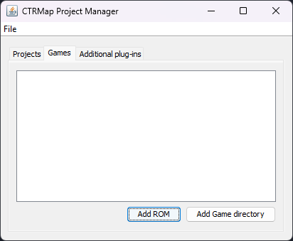
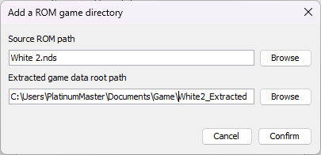
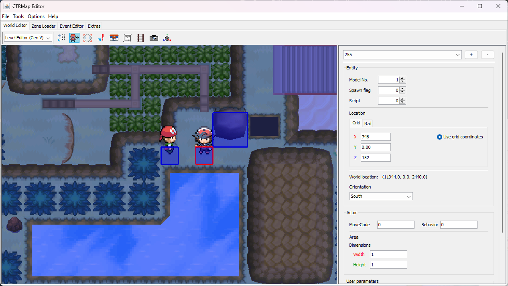
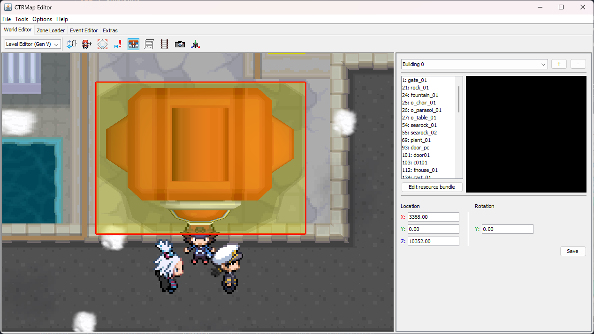
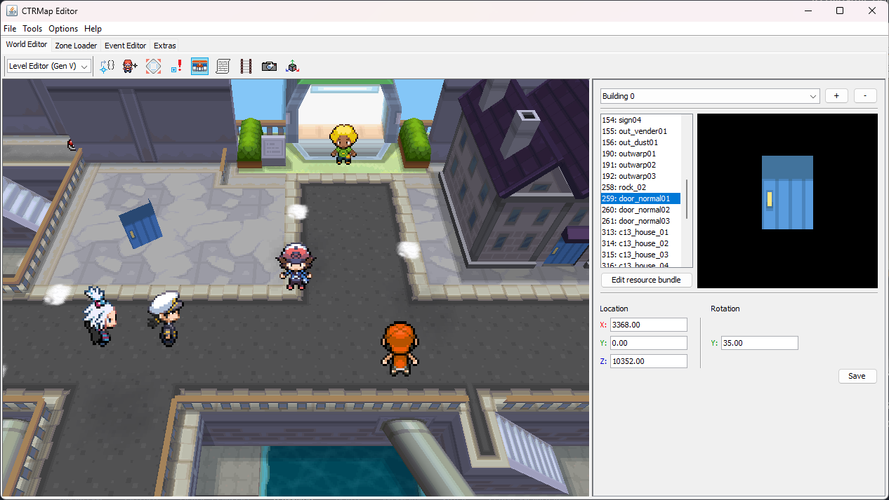
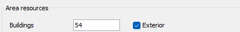
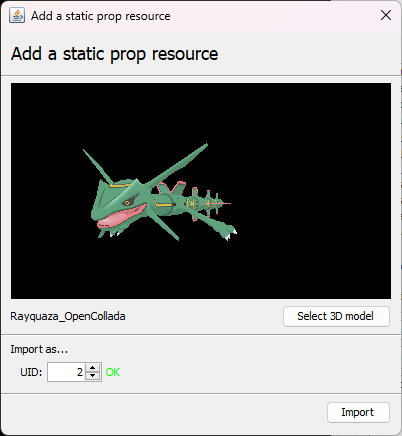
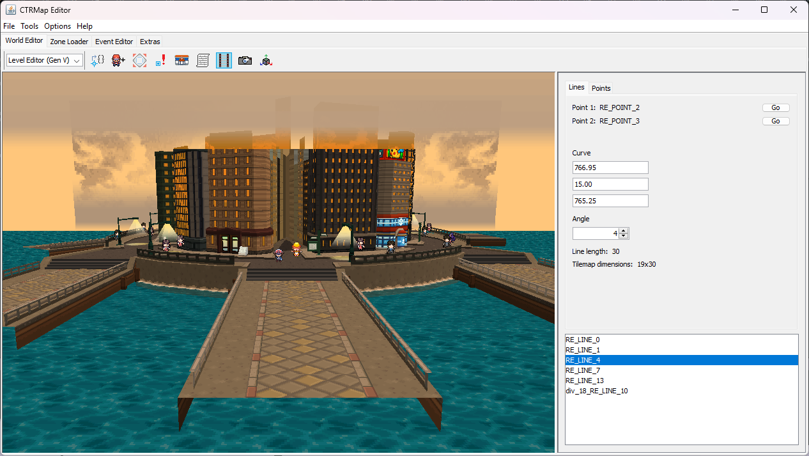

# Using CTRMap for Generation V Hacking
> Author(s): [PlatinumMaster](https://github.com/PlatinumMaster), [SpagoAsparago](https://github.com/SpagoAsparago)

CTRMap is an experimental level and script editor with strong emphasis on graphical interface and interactivity. It has the goal of facilitating the modification of Generation V games, allowing for modifications to scripts, text, field object properties, dynamic camera placements, and more!

CTRMap supports the following game versions:
- `IRAO` | Pokémon White (USA)
- `IRBO` | Pokémon Black (USA)
- `IRDO` | Pokémon White 2 (USA)
- `IREO` | Pokémon Black 2 (USA)
  
Please note: If the game you are trying to modify is not listed here, CTRMap is not guaranteed to work properly with it. Furthermore, ROMs modified with other tools may not work correctly (as there is no guarantee that they were modified correctly).

## Setup
### Requirements
To use CTRMap, you will need the following:
- A computer running Microsoft Windows, or Linux. ***macOS (any version) is not supported.***
- [Java 1.8+](https://www.java.com/en/download/).
  
### Installing CTRMap & CTRMapV
In order to use CTRMap for Generation V, you will need to follow the steps below.

- Download and install Java 1.8+ if you have not already. 
    - If you are on Windows, you can get it from [java.com](https://www.java.com/en/download/).
    - If you are on Linux, the exact instructions depend on your distribution.

- Go to the [CTRMap-CE release page](https://github.com/kingdom-of-ds-hacking/CTRMap-CE/releases), and download the latest release. You do this by expanding the `Assets` drop down, and clicking on `CTRMap.jar`. Ensure that, when you are downloading the tool, **you download the `CTRMap.jar`, and not the source code**.
   


- Go to the [CTRMapV release page](https://github.com/kingdom-of-ds-hacking/CTRMapV/releases), and download the latest release. You do this by expanding the `Assets` drop down, and clicking on `CTRMapV.jar`. Ensure that, when you are downloading the tool, **you download the `CTRMapV.jar`, and not the source code**.

- After installing the aforementioned, run `CTRMap.jar`. You should be greeted with the following window:


- Click `Global plug-in manager`, then click `Launch`. This will bring up the plugin manager, which we will use to install the `CTRMapV` plugin.


- Click `Install plug-in`. You will then be prompted with a file select window titled `Select a plug-in JAR file`. Browse to where you saved `CTRMapV.jar`, click on it, then click `OK`.
   


- If all goes well, you will see `CTRMapV.jar` in the plugins window, as shown below.


If so, you are now ready to start using CTRMap for Generation V! Just click `Back`, and you will be brought back to the main menu.

### Adding Games
In order to create a CTRMap project, you need to add a source of game data.

With CTRMap open, click the `Games` tab. This will show you a list of the games you have installed. In our case, this is blank.



If you already have an extracted ROM, click `Add Game directory`. Otherwise, if you have a dumped ROM, click `Add ROM`.

#### Specifying a Game Directory
Clicking `Add Game directory` will bring up the following dialog. Simply click `Browse` and point it to the extracted ROM data you wish to use. 


Once you are done, click `Confirm`.

#### Specifying a ROM
Clicking `Add ROM` will bring up the following dialog. Simply click `Browse` on the `Source ROM path` option, and point it to the ROM you wish to use. 


After doing so, the `Extracted game data root path` will be autopopulated. If you want to change it, you can click `Browse` and specify a new path. 



Once you are done, click `Confirm`.

### Creating a Project
In order to use CTRMap, you will need to create a project to store your data. This is a fairly straightforward endeavor.

Once you have defined game paths as mentioned in the previous section, simply go to `File > Create New project` (or press `Ctrl + N`).

This will open a dialog asking you to specify the `Project path`. Specify where it should go, then click `Initialize Project`.

This should add your project to the CTRMap registry.

### Opening a Project
To open your project, you have two options:
- Open it from the `Recent` dialog in the `Project` tab.
- Open it from `File > Open Existing project` option.

If all goes well, your project should load. If this the first time the project is being opened *ever*, CTRMap will prompt you to set up backup options. This is optional, but highly recommended.


Whenever you are done here, click `Confirm`.

## Using the Tool
After opening your project, you will be presented with the following view.


There are 4 tabs here:
- `Zone Loader`, which allows you to load a zone and edit its properties.
- `World Editor`, which will show a rendered version of the currently loaded zone and allow editing some properties.
- `Event Editor`, which allows you to edit event scripts and text banks.
- `Extras`, which houses dumping utilities for scripts and the Interactive Sound System, as well as the Code Injection suite.

## World Editor
As stated previously, the World Editor renders the maps associated with a zone, as well as the field objects and buildings associated with the map. It also allows you to edit these properties.


### Default Controls
To change the currently loaded zone (and, thus, the rendered view), simply change the zone in the `Zone Loader`.
#### MissionControl
MissionControl is the emulation of the game camera. It is enabled when the camera follows the player, and is off when the camera is free to move around without following the player.
- `F5`: Toggle MissionControl.
- `W`: Move character forward.
- `S`: Move character backwards.
- `A`: Move character left.
- `D`: Move character right.
- `CTRL`: Toggle between walking and running.
- `Shift (Hold)`: Run.

#### Camera Controls
- `F2`: Change the camera view to an perspective view. Must disable MissionControl first.
- `F3`: Change the camera view to an orthogonal view. Must disable MissionControl first.
- `Left Click (Hold) + Mouse Drag` (orthogonal only): Rotate camera.
- `Right Click (Hold) + Mouse Drag`: Move camera around, amongst the planes.

### Sub-Editors
The toolbar at the top under the tab represents the editors which you can utilize to modify the game. Clicking on one of these items will open the editor on the right of the screen.

---

#### Proxy Editor
The Proxy Editor allows for modifcation of the proxy field objects, which are interactable script objects. 


The dropdown on the sidebar allows you to select a given proxy object to modify. 
- To add a new proxy, click the `+` button.
- To remove the selected proxy, click the `-` button.
- To save your changes to the proxy, click the `Save` button.

As shown in the screenshot, you can modify:
- `Script`: The script in the container which is assigned to this proxy.
- `X`/`Y`/`Z`: The grid coordinates (either by typing, or dragging the object in perspective mode).
- `Interactibility`: The interactability (including the condition needed for the proxy to be interactable).
---

#### NPC Editor
The NPC Editor allows for modifcation of the NPCs on the map. 



The dropdown on the sidebar allows you to select a given proxy object to modify. 
- To add a new NPC, click the `+` button.
- To remove the selected NPC, click the `-` button.
- To save your changes to the NPC, click the `Save` button.
  
As shown in the screenshot, you can modify:
- `Model No.`: The sprite associated with the NPC.
- `Spawn flag`: The flag which will be used to determine if the NPC is visible.
- `Script`: The script in the container which is assigned to the NPC.
- `X`/`Y`/`Z`: The grid coordinates (either by typing, or dragging the object in perspective mode).
- `Orientation`: The default facing of the NPC.
- `MoveCode`: ???
- `Behavior`: The movement which the NPC does.
- `Area Width/Height`: The region which the NPC is allowed to perform its behavior.
- `User Parameters`: Parameters which can be passed into scripts for later usage (for example, line of sight, the level of wild Foongus, etc).

---

#### Warp Editor
The Warp Editor allows for modification of the warp field objects, which allow a player to warp to other zones.


The dropdown on the sidebar allows you to select a given warp object to modify. 
- To add a new warp, click the `+` button.
- To remove the selected warp, click the `-` button.
- To save your changes to the warp, click the `Save` button.

As shown in the screenshot, you can modify:
- `X`/`Y`/`Z`: The grid coordinates (either by typing, or dragging the object in perspective mode).
- `Dimensions`: The width and height of the warp area. 
- `Contact direction`: The direction which the player can enter the warp from.
- `Transition type`: The transition which plays when the warp is activated.
- `Target zone`: The zone which the player is teleported to when going through the warp.
- `Target warp`: The warp object in the target zone the player will be spawned at after warping.

---

#### Trigger Editor
The Trigger Editor allows for modification of the trigger field objects, which conditionally execute a script when it comes in contact with the player.


The dropdown on the sidebar allows you to select a given proxy object to modify. 
- To add a new trigger, click the `+` button.
- To remove the selected trigger, click the `-` button.
- To save your changes to the trigger, click the `Save` button.
  
As shown in the screenshot, you can modify:
- `Script`: The script in the container which is assigned to the trigger.
- `Spawn flag`: The Work which will be used to determine if the trigger is enabled.
- `Ref. value`: The value which needs to be in the Work for the trigger to be enabled.
- `X`/`Y`/`Z`: The grid coordinates (either by typing, or dragging the object in perspective mode).
- `Dimensions`: The width and height of the trigger area. 
- `Type`: The trigger type.
- `U12`: Unknown.

---

#### Building Editor
The Building Editor allows for modification of the building field objects, which can range from static objects like buildings to dynamic objects.



The dropdown on the sidebar allows you to select a given building object to modify. 
- To add a new building, click the `+` button.
- To remove the selected building, click the `-` button.
- To save your changes to the building, click the `Save` button.

In addition to specifying the `Location` and `Rotation`, you are able to change the model which the building shows up as by clicking on the list of buildings. The list of buildings comes from the currently assigned resource bundle (specified by the zone header).



Since there are two sets of resource bundles (exterior resources, and interior resources), a checkbox can be found in the `Zone Loader` to toggle between the two sets.



##### Adding a Resource

To add a resource entry, click the `+` icon. A dialog will pop up which will allow you to add a static prop resource.


You can then proceed to select a 3D model to assign this resource to. The model must be in one of the following formats:
- COLLADA (`.dae`)
- Source Engine StudioMdl (`.smd`)
- Wavefront OBJ (`.obj`)

Standard DS limitations apply with models, so bear that in mind.

After loading in your model, you can specify the ID which will be used to index it by changing the `UID`. CTRMap will tell you if the `UID` you have requested is already in use (look next to the `UID` box).



Once you are ready to continue, hit import. CTRMap will then ask if you would like to auto generate primitive strip sub-meshes. It can reduce the vertex count (which can help your model load in game under tight resources), but may break models utilizing smooth skinning with a high vertex count. **Only hit Yes if you intend this.**


After that, you will be brought back to the resource bundle list, with your new resource. You can now edit the properties as you see fit.


##### Editing Resources
To edit the currently assigned resource bundle, click `Edit resource bundle`, and the following dialog will show up.


Here, you can modify the properties of each resource entry, as well preview its assigned animations. 

To select a resource entry to edit, click an element of the list on the left.

You can modify the following properties:
- `UID`: The ID of the resource that the game will use.
- `Type`: The type of resource.
- `Door`: This allows you to specify the model which serves as the door, as well as the position of it relative to the parent model.
- `Animation controller`: The controller which is responsible for handling animations. The options you have for this are:
  - `Not animated`: Static, without any animations.
  - `Ambient generic`: One set of animations is played at all times.
  - `Dynamic`: Has multiple animation sets, which can be played on demand.
  - `Ambient RTC`: An animation for each time of day.
- `Animation set layout`: This allows you to choose how many sets you have, as well as how many animations you can have per set. The options you have for this are:
  - `1 set, 4 animations`
  - `2 sets, 1 animation per set`
  - `2 sets, 2 animations per set`
  - `4 sets, 1 animation per set`
  
To import a model, click `Open in CS`. This will open CreativeStudio, where you can modify the model as you see fit. When you finish, close CreativeStudio; you will be prompted to convert the model back into the NNS Resource format.

To import an animation and set it up correctly:
  - Material Animations: Make sure your animation controller is set to *Ambient Generic*, and `1 set, 4 animations`. Select the first **X** in the list, then click the blue arrow pointing downwards button, and select the `.nsbta` file you previously exported/created.
  - Skeletal Animations: Same steps as above, the only differences are that you have to set the animation controllers to *Dynamic* instead, and you will import a `.nsbta` file.

##### Exporting Resource Assets
Select the building you want to export from the list on the left side of the editor, then click the *Open in CS* button right below. 
This will launch CTRMap CreativeStudio, where you can export the model in a number of different formats, using the *Export* options from the top bar.

About the different file types you can get, it's worth mentioning:
* COLLADA (`.dae`)
* Nitro-SYSTEM Binary Model (`.nsbmd`)
* WaveFront OBJ (`.obj`)

If you're planning to import the building in a gen 4 game, both DSPRE and PDSMS building editors only acccept NSBMD files. For gen 5 games, both OBJ and DAE work but the latter is recommended.

##### Exporting Animations
If the building you want to export has an animation, you can export it by selecting the animation on the menu on the right side of the editor after having selected the building, then click the *Open in CS* button right below it. This will open CreativeStudio, where you can then export it to whatever format you see fit.


In CreativeStudio, select the animation in the dropdown menu (it will be either in the Material or Skeletal Animation folder), then right click on it, click `Export`, and it will be saved as a `.nsbta/.nsbca` file depending on the animation type.


##### Saving Changes
Click `Commit changes > Resource bundle` to save the changes you have made to your resource bundle, and `Commit changes > Static texture pack` to save the changes to the texture banks. From there, you should be able to use it.

---

#### Scripting Assistant Tool
This helps to faciliate some PokeScript scripting.


##### EVCamera.MoveTo Helper
This will help you generate script command invocations for camera movement.

When in MissionControl mode, move your player to a given location. When you click `Copy`, CTRMap will autogenerate a script command for you, which moves the camera to the location you specified with the angle you are facing. A sample command may look like this:

```Java
EVCamera.MoveTo(2.365234f, 0.0f, 237.0f, 3447.1162f, 4.0f, 10389.169f, 40);
```

You can also specify the `Interval`, which is how many frames it should take to complete the transition.

---

#### Rail Tool
This tool allows you to mess around with the 3D collision system, known as RailSystem. 

<p align="center">
  </img>
</p>

At the moment, it does not save changes, as the tool is too volatile for daily usage.

---

#### Dynamic Camera Tool
This tool allows you to create and modify dynamic cameras. However, the tool currently restricts you to editing zone with the cameras already built in.


The dropdown on the sidebar allows you to select a given dynamic camera configuration to modify. 
- To add a new camera configuration, click the `+` button.
- To remove the selected camera configuration, click the `-` button.
- To save your changes to the camera configuration, click the `Save` button.

As shown in the screenshot, you are able to modify:
- The starting position (`x`, `z`) of the camera transition, along with the width and height.
- The transition type (whether or not the camera changes with respect to vertical or horizontal movement).
- The pitch, yaw, camera distance, field of view, and camera offsets for the initial and terminating coordinates.
- The parameters which are modified in real time by the movement of the player.
  - `Pitch/Yaw/Dist`: the pitch (up and down rotation), the yaw (left and right rotation), and the distance of the player from the camera.
  - `FOV/Target`: the field of view (how wide the camera perspective is), and the target offset (where the camera will point in each case).

##### Adding a Dynamic Camera
- Go to the `Zone Loader` and make sure the `Dynamic camera` checkbox is clicked.
- Add an entry (`+`), and make sure it is selected in the dropdown.
- Then, make sure the entry is enabled, so that the camera will work.
- Now, specify the `X` and `Z` coordinates. This is where you want the camera to start (aka `Coordinates 1`). 
- Specify the transition type (`Vertical` means forward and backwards movement, `Horizontal` means left and right movement).
- Set the capabilities you want. There are three scenarios: `Main`, `Entry`, and `Exit`. `Entry` happens when you first enter the dynamic camera zone, `Main` while you are in the zone, and `Exit` when you exit the zone.
- Now, specify the parameters.
  - If you are using `Pitch/Yaw/Dist`:
    - Specify the initial pitch (up and down rotation) and yaw (left and right rotation). The angle you provide for the camera must be in **degrees**.
      - To better assist with this, you can use the mouse (as long as you are in the camera area with `MissionControl`). `Left Click + Drag` allows you to change the `Pitch` (by moving up and down) and the `Yaw` (by moving left and right) or both (by moving diagonal/nonlinearly).
      - When using the mouse, however, make sure your player is at coordinates (`x`, `y`) or (`x + w`, `y + h`), as it will adjust accordingly.
    - Specify the camera distance from the player.
  - If you are using `FOV/Target`:
    - Specify the `Camera target offset`.
      - To better assist with this, you can use the mouse (as long as you are in the camera area with `MissionControl`). `Right Click + Drag` allows you to change the `Camera Target Offset`.
      - When using the mouse, however, make sure your player is at coordinates (`x`, `y`) or (`x + w`, `y + h`), as it will adjust accordingly.
    - Specify the `FOV` (field of view). This measurement is also in degrees.
- Click `Save`.

---

#### Scenegraph Explorer Tool

This allows you to see the current scene geometry hierachies, as interpreted by CTRMap. This is *not* a accurate representation of what the game's geometry is.


---

### Zone Loader

Allows you to edit zone properties (such as text and scripts).


---

### Event Editor


---

### Extras

