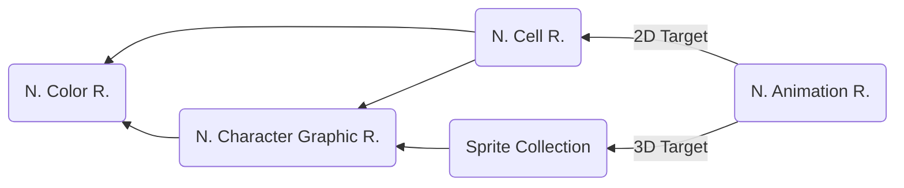

# Sprite Collection
> Author(s): [Gonhex](https://github.com/Gonhex) <br />
> Research: [PlatinumMaster](https://github.com/PlatinumMaster), [Gonhex](https://github.com/Gonhex)


This file functionally replaces the NCER, if the render target is provided by the 3D engine of the DS. It uses the NCGR (must contain a line buffer, no tiles!) as texture to create multiple sprites. It is used for battle sprites (Trainer and Pokemon) and in the game intro (professor juniper).

## Table of Contents
* [Data Structure](#data-structure)
  * [Sprite Container](#sprite-container)
  * [Sprite Pair](#sprite-pair)
  * [Sprite](#sprite)
  * [Size](#size)
* [Specification](#specification)
  * [Optional Component](#optional-component)
* [TODO](#todo)

---
## Data Structure

### Sprite Container
```c
struct ContainerSprites
{
    /* 0x0    */ uint32_t numberSprites;
    /* 0x4    */ int16_t boundRight;
    /* 0x6    */ int16_t boundBottom;
    /* 0x8    */ int16_t boundLeft;
    /* 0xA    */ int16_t boundTop;
    /* 0xC    */ struct SpritePair body[numberSprites];
    /* append */ uint32_t padding;
}; // entry size = numberSprites * 0x30 + 0x10
```
| Field Name     | Description                                                                             | Data Type |
|----------------|-----------------------------------------------------------------------------------------|-----------|
| numberSprites  | Number of sprites which can be indexed by the NANR.                                     | uint32_t  |
| boundRight     | Probably unused.                                                                        | int16_t   |
| boundBottom    | Probably unused.                                                                        | int16_t   |
| boundLeft      | Probably unused.                                                                        | int16_t   |
| boundTop       | Probably unused.                                                                        | int16_t   |
| body           | Contains two sprites which share the same index.                                        | [SpritePair[]](#sprite-pair) |
| padding        | Padding.                                                                                | uint32_t  |

### Sprite Pair
```c
struct SpritePair
{
    /* 0x0  */ struct Sprite bodyPart;
    /* 0x18 */ struct Sprite component;
}; // entry size = 0x30
```
| Field Name     | Description                                                                             | Data Type         |
|----------------|-----------------------------------------------------------------------------------------|-------------------|
| bodyPart       | One sprite. It is equivalent to a cell from the NCER.                                   | [Sprite](#sprite) |
| component      | Usually all values are zeroed out. Only used for game-controlled parts, see [Optional Component](#optional-component). | [Sprite](#sprite) |

### Sprite
```c
struct Sprite
{
    /* 0x00 */ fx<1.23.8> spritePositionX;
    /* 0x04 */ fx<1.23.8> spritePositionY;
    /* 0x08 */ struct Size sizePropertiesX;
    /* 0x0C */ struct Size sizePropertiesY;
    /* 0x10 */ fx<1.19.12> texturePositionX;
    /* 0x14 */ fx<1.19.12> texturePositionY;
}; // entry size = 0x18
```
| Field Name       | Description                                                                             | Data Type       |
|------------------|-----------------------------------------------------------------------------------------|-----------------|
| spritePositionX  | Initial x position. The final position on screen depends on further processing.         | [fx<1.23.8>]()  |
| spritePositionY  | Initial y position. This coordinate is upside down (multiply with -1).                  | [fx<1.23.8>]()  |
| sizePropertiesX  | Horizontal sizes.                                                                       | [Size](#size)   |
| sizePropertiesY  | Vertical sizes.                                                                         | [Size](#size)   |
| texturePositionX | Left edge position on the texture image.                                                | [fx<1.19.12>]() |
| texturePositionY | Top edge position on the texture image.                                                 | [fx<1.19.12>]() |

### Size
```c
struct Size
{
    /* 0x0 */ uint32_t unknown0 : 12;  // 0b00000000'00000000'00001111'11111111
              uint32_t dimension : 12; // 0b00000000'11111111'11110000'00000000
              uint32_t scaling : 8;    // 0b11111111'00000000'00000000'00000000
}; // entry size = 0x4
```
| Field Name     | Description                                                                             | Data Type      |
|----------------|-----------------------------------------------------------------------------------------|----------------|
| unknown0       | Unused?                                                                                 | uint32_t : 12  |
| dimension      | Width or height of the sprite's bounding box.                                           | uint32_t : 12  |
| scaling        | Effects sprite scaling but not on the shadow, undocumented behavior.                    | uint32_t : 8   |

---
## Specification

### Optional Component
The 2nd sprite in a [pair](#sprite-pair) is only used for subimages, which are controled by the game:
* Pokemon eyes: They close their eyes to blink in battles or sleep.
* Professor intro: She only moves her mouth while talking (adding letters to the text box).

These actions require the ability to change a specific part of the sprite asynchronously. The 2nd sprite provides this feature. If the game sends a command to display the alternative sprite, it moves the bounding box down by its height.

For the most body parts this isn't needed (not linked to the head). In these cases all entries of the sprite are zero, resulting in a `0 x 0` pixel sized "sprite".

---
## TODO
* Document `scaling` in [Size](#size)
* Link fixed point definition
