# Pokémon DS Music Composing guide
> (by recordreader/thisisausername/icecream, with massive help from the VGM Resources community)

NOTES: 
- If I ever say just "Nitro Studio", assume I am talking about 2 Deluxe as really that's the only version you should be using, unless stated otherwise.
- If I ever refer to a specific key on the keyboard, note that I'm talking strictly about notes in the C-1 to G9 keyrange, since that is what SMFT labels them as.
- In these contexts, I use wave and sample interchangeably. In case there's any confusion, this is why.
- If you are coming here because you know nothing about digital music production and want to learn, then I strongly advise that you close this, get one of the DAWs I recommended in the insertion guide, and practice using it before coming back, because none of what I'm about to say about SSEQ files will make any sense if you don't know how to use a DAW. This guide is not here to teach digital music production, but rather to help people that can use a DAW apply their workflow to the DS sound system; I've given samples on what your basic workflow for writing DS music should be in the insertion guide anyway.
- Perhaps more importantly, this all runs under the assumption that you haven't hacked the ARM7 to manipulate the sound system in any way, with the exception of AdAstra's music hack, since that's a whole can of worms that can invalidate much of what I say here.

Let's start by addressing one of the most common questions people have: "why can't we insert YouTube music like you can on the 3DS?". And the answer is that the games simply were not designed that way. Most DS games use **sequenced** audio, which involves creating soundbanks and interfacing with MIDI data to save on storage/memory. 3DS games largely use **streamed** audio, which is the format YouTube music actually comes in. It's a different story if the YouTube video itself comes with a MIDI or something similar, but otherwise it will need to be recreated into a format the games can actually accept, which involves cutting corners; the same applies to any soundtrack that is streamed. DS games that actually use streamed audio, such as Trauma Center and The World Ends With You, are designed around that, and in fact rarely if ever use the DS' proprietary STRM format. Black/White 2's title screen, one of the few instances of STRM in any game, has performance tanks in part due to the stream, even in a situation that isn't actively processing player inputs and is simply panning around a 3D model. Getting the games to play streamed audio throughout, thus, would require a total rewire of the game's memory management to make enough headroom for it without sacrificing performance, a massive assembly hack in and of itself. Not only would you massively inflate the size of the ROM, you'd also have to insert a real-time audio decompression routine that would tank the game's performance even further. And this is just a personal observation, but I am skeptical of any DS music hacker actually wanting to attempt this as they probably like sequenced music and want to keep doing it.

So for probably the foreseeable future, DS Pokémon ROM hacks will be stuck largely using sequenced audio.

At a basic level, music on the DS consists of three things: a sequence (SSEQ), a bank definition (SBNK), and a wave archive (SWAR). SWAR files contain audio data that is assigned to a bank. SBNK files define how these wave files are mapped across the keyrange, and how they sound when played, and when they play. SSEQ files are lists of commands processed in a fixed order at a (mostly) user defined rate, using program numbers defined by the bank. All of these are contained within a data (SDAT) file, which allows for a maximum of 65536 slots for each of these things.

An important range to remember when dealing with MIDI music is 0-127. Those numbers designate the list of keys, the values all CC data can be set to, and the slots all of your programs are assigned to.

### SWAR

This is your wave archive. These are collections of .SWAV files, sampled compressed for use on the DS, that will be loaded into memory when its ID in the SDAT is called. As such, it requires the most real estate, and may be the very thing that decides whether your track plays or not. Wave files can be compressed either as PCM16, as PCM8, or with the IMA-ADPCM codec. Obviously, the more compression there is, the worse the quality is but the smaller the file size is. Wave files that are being compressed to an .SWAV must be mono when converting them; if you want stereo, you must split your wave file's two channels into two separate wave files that will be played simultaneously, one panned all the way to the left, and the other panned all the way to the right.

Most DS games, Pokémon included, use IMA-ADPCM almost exclusively; the sole exceptions in Pokémon are the cries, which must be PCM16, and the BW2 title screen music, which doesn't have to be PCM16 but is anyway. In most cases however, the quality benefit from using standard PCM is simply not worth it on the cruddy speakers of the DS, and will preclude having a wide variety of samples.

### SBNK

This is your bank definition file. If you are familiar at all with sound banks in MIDI, or voicegroups on the GBA, this is more or less the same concept. SBNK files comprise a maximum of 128 uniquely defined programs that a sequence's notes will play under when called. Like most banks, SBNK files consist of melodic programs and percussive programs; however, in contrast to General MIDI, the two share the same selection of values. This means that any channel you define to use, say, program 44, will sound percussive or melodic depending on how it's programmed; this also means that Channel 10, which is defined in General MIDI as the percussion track, can be used for melodies as well. SBNK files are accompanied by at least one wave archive and at most four of them.

Almost every region of a program will contain the following: a wave ID, a wave archive ID (which is almost always 0, except if your bank uses multiple), a root note definition, individually defined ADSR values, and a panorama value. That last one defaults to 64 (center) if none is set. The ADSR controllers also probably don't work the way you think: while attack, decay, and release are what you'd expect from any envelope, sustain, instead of controlling the exact trough the sound drops to as it decays, is a ratio between delay length and volume. As such, for user defined instruments, you likely are not going to be able to recreate exactly what you have in a DLS or SF2 for instance.

I began the previous paragraph with "almost" because there is a "third" type of instrument, and that is hardware-generated. With these instruments, wave archive ID does not matter, and the section that chooses wave ID instead either controls the duty cycle, which is a number between 0 and 6 inclusive, if it's a pulse, or does nothing if it's noise. Rather humorously, you can set a root note to it as well, but expectedly it does nothing. Compared to sampled instruments, the real estate these hardware generated programs take is miniscule.

In practice, percussive and melodic programs on the DS are more or less the same thing, for they both consult the same wave data and interpret ADSR values the same way. But in concept, the two are created somewhat differently. Melodic programs take a maximum of 8 samples and pull them all the way down from a user-defined peak to fill the entire 128 key range. Percussive programs read a series of wave files (I don't know the exact limit but it's greater than 8), take a user defined trough, and pull it up to the next user defined trough; anything after that plays no sound.

### SSEQ

Now what most of you are probably here for. This is your sequence file, which contains instructions for how and when the system should actually produce sound, i.e. the actual music, meaning this where stuff like notes, panorama, volume, and expression will go. To create one usually involves exporting a MIDI from a DAW and feeding it through a converter that interprets MIDI controller events as commands the DS can actually process. I say "usually" as you can technically make an SSEQ entirely in plaintext or using the python library ndspy, but I have no envy for the people that choose to go through that shit for being too lazy to learn even the most basic tenets of music production.

ndspy's API has a full list of the commands available in SSEQ, but just looking at official SSEQs through Nitro Studio 2 Deluxe's plaintext editor will tell you a lot of what you need to know as well. I'm not going to go through every single one because I don't understand them all that's not really the point of this guide, so I'll go over some of the ones you'll be using the most often:

- The Modulation commands
Also known as low frequency oscillator, or "LFO", commands, these control when and how individual tracks respond to modulation. Most of these range from 0 to 127 unless otherwise noted. These are the following:
	- `mod_depth`: The main one, and the one that determines whether or not you'll even notice the others. By default, this is set to 0. This is how much the sound is affected: for instance, setting it to 32 means it will affect a fourth of the sound, setting it to 64 means it will affect half the sound, and setting it to 127 means it will affect the entirety of the sound.
	- `mod_speed`: This controls how fast the modulation occurs. By default, this is set to 16.
	- `mod_type`: This controls the way the sound will modulate. By default, this is set to 0. While it can be any value from 0 to 127, only values of 0, 1, and 2 are meaningful. Type 0 modulates pitch, Type 1 modulates volume, and Type 2 modulates panorama.
	- `mod_range`: This controls how far out the modulation reaches in either direction. By default, this is set to 1.
  
- Portamento commands
Use these to configure how and when notes glide between each other.
	- `porta_on` / `porta_off`: Simple toggles that control when it is active or not. These do not have any parameters.
	- `porta_time`: The length of the glide.
	- `porta`: The key to glide from. If none is specified, it will glide from the one that was last pressed.

- Expression
Known internally as volume2, this is a secondary volume control generally used for sweeping, like with a saxophone. You can get away with using normal volume exclusively, and those on the GBA had no choice, but I find that to be messy and reserve volume for when I need to vary the overall volume of the track and don't want to mess with velocity.

- Pitch bend
Bends the sound up or down. Programmatically, pitchbends range from values of -128 to 127, although when composing it's better to let the converter approximate.

- Bend range
How far in semitones the pitchbends reach. In most cases, it is set to 12, which means pitchbends reach a full octave in both directions.
- Attack, Decay, Sustain, Release
These commands will override the ADSR of any instrument playing on the specified track. They work exactly as they would in the bank.

Another thing to go over is the timebase of SSEQ, which is 48, and the fact that SSEQ has no concept of time signature. This means that every SSEQ you create will have a quarter note be 48 ticks long, whose actual length in time is determined by the tempo (not precisely according to the tempo however because any sequenced music system using a clock can use only a handful of exact tempos and has to approximate the rest). If you attempt to convert a MIDI with an alternate time signature or a different timebase, the data will be retimed and approximated, which *generally* works okay as long as your converter isn't shit (**cough** stop using MIDI2SSEQ **cough**), but introduces needless variability between the data in the MIDI and the data in the SSEQ. This can be problematic if you for instance have something like a 36th note in your MIDI. You can't have those in an SSEQ exactly because 48 doesn't divide into 9 like 36 does. You either have to live with a slightly mistimed note, or stretch the track so that it can be used as a 24th note in 3/4 time.

# Composing guidelines

But enough prattle. How do you actually write music for DS games? The process is...basically the same as writing MIDI music in general, and that's greatly dependent on your own personal workflow. But there are a few important things to keep in mind.

## General guidelines

As I said in the insertion guide, each DAW has a varying level of compatibility with writing MIDI music. It's not *impossible* with most DAWs, but it does necessitate more work if the one you're using is not designed for it. And obviously there's no right or wrong answer to this question, since everyone has their own M.O.; asking it is usually a sign that you don't have one.

Another thing to note is that the DS has an absolute maximum voice limit of 16, sound effects included. As such, you will rarely get the full 16 and will have to work towards a limit of 13 or 14 voices (that is assuming your player even supports 16 voices, but that's a discussion being saved for the very end). This also means that you likely will not use all 16 channels (and you probably should not, lest your MIDI be wasteful). Similarly, because of this, even though you can use Channel 10 melodically, in practice you shouldn't, as you can get a full sounding MIDI while touching 12 channels at most, and you likely will not be utilizing all 16 channels to even justify using Channel 10 in the first place anyway.

## Continuous Controller (CC) list

The main thing to keep track of is MIDI CC, since those are interpreted into the DS' sound commands. These are as follows:
- CC1 controls mod_depth.
- CC5 controls porta_time.
- CC11 controls volume2/expression.
- CC20 controls bend_range.
- CC21 controls mod_speed.
- CC22 controls mod_type.
- CC23 controls mod_range.
- CC65 is a boolean that sets portamento either off (0) or on (127).
- CC84 controls the portamento starting key.
- CC85 overrides the Attack value.
- CC86 overrides the Decay value.
- CC87 overrides the Sustain value.
- CC88 overrides the Release value.
- Program changes, volume changes, and panorama changes occupy the aptly named prg, volume, and pan commands respectively, and thus they are relatively trivial to change in any MIDI based software without the need to configure fancy knobs.

There exists another important command present in nearly every .SDAT based game known as "prio", which acts as an override to determine what voice will play when they overlap. This is controlled by CC14. As you can tell from my terse explanation, I don't really understand what this command does, nor have I been able to find out how to stop notes from cutting out by using this. I am mentioning it here however because I do believe it is essential.

## Simple control curves

Another thing to make sure of when composing is to keep your MIDI as small as possible. Aside from avoiding bloat being generally good practice, an overly large sequence can and will break the heap and render the track unplayable. Obviously composing shorter tracks lends itself to having smaller sequence files, but I don't want to endorse a specific length. What I do want to endorse, however, is keeping your event curves simple.

Take this curve on CC11, for instance:

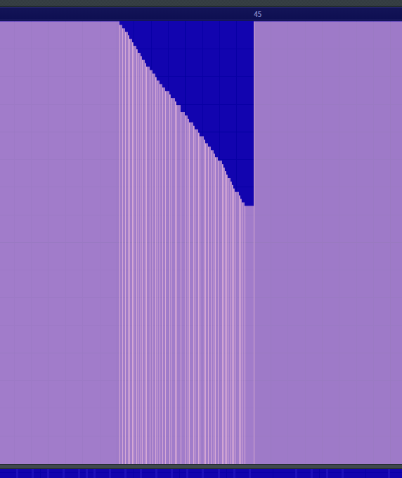

Obviously general audio renders dictate that more articulate event curves means smoother and therefore more realistic ones. However, following this practice to the letter on the DS, or anything with very limited memory, will greatly balloon the size of your sequence, because each one of these tiny changes is another event change. So instead of making it ultra smooth, it's better to do something like this:

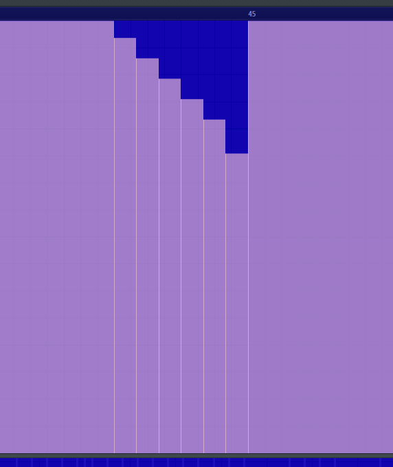

This accomplishes the same effect while sounding more or less indistinguishable from its articulate counterpart in real time and making a much smaller MIDI. Of course, this is not exhaustive, and different tracks will need different things. But if there's ever a situation in which you have a MIDI with rather simple notation that is so large it breaks the heap, overly articulate event curves are a likely suspect.

# Custom soundbanks

Now this simply goes over making the MIDI that you then convert per the insertion guide. Making the bank and corresponding wave archive(s) is a different story. While creating the former is a bit of a hassle, and this guide largely assumes a non-problematic conversion method exists, creating the former two is fairly trivial (if a bit tedious) with the current toolset. But before we get into the exact process, we have to go over several things.

First is the major factor that distinguishes hacking Gen 4 music to hacking Gen 5 music. Gen 4 uses a master bank that contains nearly every program, with sub-banks with minor variations, while Gen 5 gives nearly every sequence a completely custom bank with their own program definitions. Among other things, this means that you can't just port a track over from one gen to the other, or even between DPPt and HGSS, as is: some alterations will have to be made with at least one of the assets (This does however mean that porting between BW2 and BW1 is very trivial, with the sole exceptions of the downloadable Musical tracks since they're the only ones in all of Gen 5 to use multiple wave archives, thus you can only get them to play correctly by injecting them into your save file, but I digress). But it also is going to play a lot in how you design your track, especially in Gen 4 in which you are constrained largely to what is in the basic bank (and it's difficult to change it due to it also containing sound effects). While you have a lot more freedom in Gen 5 in theory, in practice you have to fit it in with a size of roughly 240 kilobytes across all of your sound assets (I believe the overall limit in Gen 4 is 480 kilobytes but don't quote me on that). And that limit will generally be a test of your wave archive(s), which is(are) going to be the biggest by far.

Now for why I recommend Nitro Studio 2 Deluxe for everything. For the longest time, people who want sound assets from DS games generally use VGMTrans; after all, it's a multipurpose program for many things. However, the code that converts SSEQ data doesn't recognize some of the more obscure commands and has not been updated in over a decade. Though NS2D is far from perfect (it interprets bends that have a value of -1200 cents as +1200 cents, though that's simple if not tedious to correct; it fails to convert a sequence with a mod_delay value that is set to a number greater than 127, such as the Johto Wild Battle, due to how the sound system interprets mod_delay when converting, which is partially why I haven't mentioned that command until now...and the fact that it's mostly useless :p; and it exports MIDIs to an inexplicably high resolution of **960**, which is **20 times higher** than what the DS actually uses, but that's not too problematic when converting), it still does a much better job at retaining the commands upon conversion to MIDI.

You also might have noticed something I glossed over completely in regards to the soundfonts exported from NS2D, and that's the fact that the ADSR is often completely off. I ignored it because this unfortunately is a problem with Nitro Studio itself: its interpretations of the sustain value are inaccurate for basically every possible value aside from 0 and 127 (the technical reason for this is that it extends the sustain to nearly *every possible value between 0 db and -96 db*, when in most cases anything less than -16 db will make the sound inaudible). It is possible to correct them manually in a program that can edit soundfont files like Awave Studio or Polyphone, but that is an extremely tedious process, especially for a Gen 4 soundfont; doesn't solve the problem so much as circumvent it; and is borderline impossible without the exact ADSR graph (especially so since, as mentioned before, "sustain" on the DS is a ratio).

Part of me ignoring this is that, until this is fixed, there's really no reason you should bother manually fixing the soundfont, and if it's to demo the track, testing in game will serve you invariably better than a soundfont ever will. And unfortunately, VGMTrans exacerbates the problem because, not only are the ADSR curves *worse* (in my opinion at least), but the samples are also not converted correctly. Since you have to correct the ADSR anyway if you're set on demoing with a soundfont, you might as well use something that at least exports the samples correctly (Honestly, if you'd rather just export each sample individually a la VGMToolbox and manually recreate the soundfont from there, more power to you).

Now, if this is your first time doing it, you might see that NS2D lets you convert an SF2 file into what you need and think you're home free.

Yeah, don't touch that.

It's not *impossible* to work with its inaccurate conversions, but I find this workflow to only really benefit when you have your own soundbank files, i.e. you know how to make them in the first place and you're not just trying to import a DLS or SF2 file (even soundfonts exported from NS2D don't import correctly), and the manual correction needed for pinpoint accuracy means it's just better to do it within the software you're going to be using at the end anyway.

You can create them in any order you wish, though I recommend making the wave archive(s) first as otherwise you'll have to make a bunch of dummy assignments. Custom Gen 4 stuff is constrained to tiny accompaniment wave archives, and whatever you can replace in the basic bank without inflating the file size too much; using completely custom banks is impossible without deleting the basic bank, which not only requires burning down every track that uses it, i.e. every track in the game, but also necessitates redoing a good chunk of the sound effects because for some reason they're jumbled in with the music stuff. If you are using AdAstra's music hack, the basic procedure is the same as in Gen 5. Speaking of Gen 5, if you want to not have so many instances of the same wave file in your SDAT, you theoretically could make a few basic SWAR files consisting of stuff you'll be using a lot as templates, as the Gen 5 games almost never use accompaniment wave archives. However, the saved space is miniscule.

In either case, if you are not using a custom bank, you can skip this step entirely and just insert the sequence as described far down below and in the insertion guide. However, I'm assuming you're here because that's what you want.

Now making a *completely* custom bank is something this guide will not cover because that depends greatly on the track and as such is rooted far more in the creative process, ~~also bank editing with only NS2D is tedious and slow compared to using tools that can't be named~~. What this guide will do instead is go over a few use cases that should tell you the basics of what you need to know.

## Custom banks (Generation 4)

Suppose you want a battle bank in HeartGold/SoulSilver with the QY70 sawtooth, the QY70 Dance kick, the Advanced Orchestra timpani, and the Orchestral Flavors hits. The first step is to gather the samples you want, and while these are all in Diamond/Pearl/Platinum as well, and you can use any samples you want as long as you don't break the heap, to keep things simple we're gonna stick to using waves inside HeartGold/SoulSilver. In this case, many of the default banks in HG/SS have three of these but not all four: BATTLE1 only has the second and third; BATTLE2 and BATTLE4 only have the first and second; BATTLE3 only has the third; BATTLE5 and BATTLE8 only have the third and fourth; BATTLE6 only has the first, second, and fourth; and BATTLE7 only has the third. ~~As you can imagine, this is where the request came from~~.

I like to store all my .SWAV files in one folder I can reference for everything, so go ahead and make one if you wish.

Since BATTLE5 and BATTLE6 have all of what we want, we're just gonna open those. In Nitro Studio, with the .SDAT open, we're gonna scroll down to the supplementary wave archives those banks use and extract the samples accordingly, being sure they save as .SWAV and not normal .WAV. We want the first two and last two waves of BATTLE5, and the first and third waves of BATTLE6. You can name them whatever you want, but I usually like to name them based on how they sound or where they come from. If you want to make the programs exactly how they are in-game, we can just take a look at the existing programs. We're first gonna open the BATTLE5 bank and find the programs we want, which in this case are 61, 63, and 64, and see how they are programmed:
- Program 61 (the timpani) is a keysplit, meaning it takes more than one wave. It takes its first wave, roots it at 41, and pulls it up to 48. It then takes its second wave, roots it to 46, and pulls it all the way up to 127. Its ADSR are set to 127, 80, 1, 116.
- Program 63 (the sawtooth) is a normal PCM instrument that takes a single sample and spreads it across the keyrange. It roots its single sample to 60 and sets the ADSR to 127, 120, 127, 120 (sidenote: setting the delay to anything other than 127 when the sustain is also 127 is pointless because that means it doesn't decay to anything...and they did it so go figure -_-).
- Program 64 (the orchestral hit...or at least one of them because there's a major chord hit and a minor chord hit) is also a normal PCM instrument that takes one sample and spreads it across the keyrange. Its parameters are exactly the same as the sawtooth so I'm not going to repeat it, but do keep in mind when it is different.
We'll then go to BATTLE6 to get the minor hit, which assigns it to program 62 and maps it exactly like the sawtooth as well, and the dance kick, which is part of the drum set on program 60 and defines its root, as well as one of the only two notes it has effect on, as 36, with the ADSR set to 127. 127, 127, 120 ~~which is what everything aside from the timpani should be set to but I digress~~.
In any case, keep information on your desired programs somewhere or memorize it.

### Creating wave archives

Next, we're gonna create a new wave archive. To create a slot for it, right click the wave archives dropdown (making sure to actually drop it down first so you can see it), and hit add, and it will put it in the next available empty slot at the bottom.

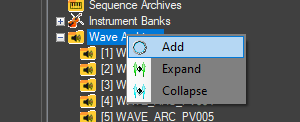
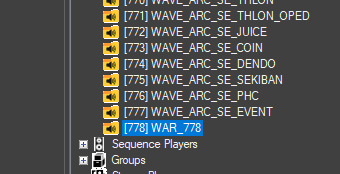

You can move it to any slot by going to the top left where it says Item Index, changing the number to one currently not used, and hitting Swap with Index, but take care to not rearrange any of the old ones; you *will* misalign everything and break the sound. Open it by double clicking the entry, and you should see a "wave archive" icon with nothing below it.

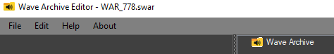

Right click it and hit add, and select your first .SWAV file.

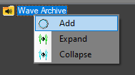
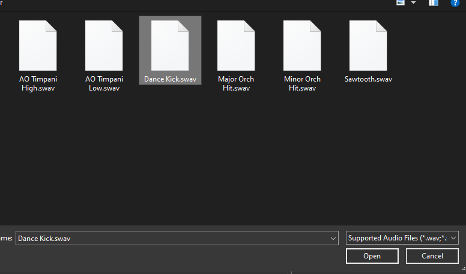

Now you can collapse the wave archive icon and see what's inside it like the others.
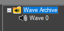

Repeat this for as many as you have. You can add them in any order you wish; just be sure to remember what order they're in and what number they're assigned to. Once you're done, **make sure you hit File -> Save before you close the window; otherwise, your changes will not save**.

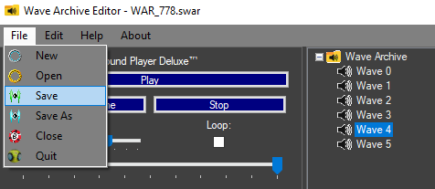

If you want to change the name, right click the wave archive and hit `Rename`.

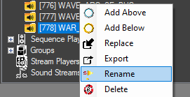

You can name it something else if you wish; for the sake of argument, I will call it WAVE_ARC_BATTLE_NEW. Note that the game does not read the names of any of these slots, only the numbers these slots are assigned to.

### Creating new banks

The next step is to make the new bank. Go to the bank dropdown, and before you make the new bank, we're actually going to extract BANK_BASIC by right clicking on it and hitting `Export`, then saving it as an .SBNK file.

You'll see why in a bit.

You create your bank in the same manner that you create your wave archive, by right clicking the dropdown and hitting add. Again, you can use Swap to Index to move it, but just be sure to not rearrange the existing slots.

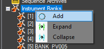
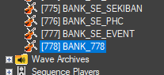

Next, you want to right click this new bank, hit `Replace`, and select the SBNK you just saved.

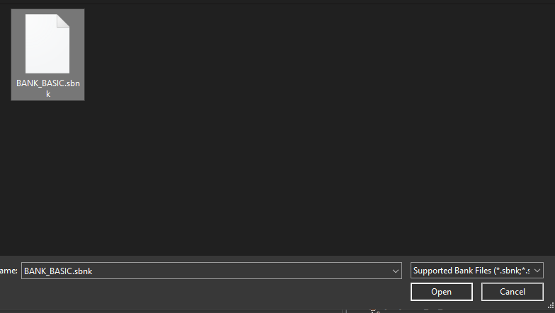

This is not a mandatory step, but because Gen 4 games are built around the basic bank, it's frivolous to exclude any of the data; otherwise, you'd have to recreate all of those programs manually.

To assign the wave archives accordingly, making sure the new bank is still selected, go to the top left and set the *first* wave archive to the basic one, which by default in HGSS is ID 700. Then set the *second* wave archive to the one you just created.

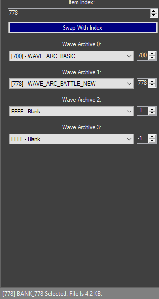

### Creating new programs

Now we can edit the bank by double clicking it. Technically you can just change the existing program numbers to anything you want because this bank will only affect this slot, but when it comes to doing Gen 4 stuff I find it easier to just leave everything as is. Adding new programs is done in the same fashion as adding anything else new, by right clicking the dropdown and hitting add.

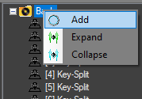
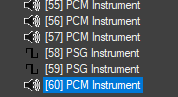

Like before, it will be added to the bottom and assigned the next available ID, and you can change it by using the Swap to Index feature mentioned previously. We're not going to do that in this situation because we don't need to, and all of the existing program numbers from other banks don't overlap.

Select the instrument to begin changing it. Take note of the section marked `Wave archive ID`: this chooses from which of the four wave archives assigned to the bank it will get the sound from. This is **not** the index of the wave archive in the .SDAT. Usually this number is 0 to denote the first wave archive, but in this case we want the supplementary wave archive so we will put 1 in that section.

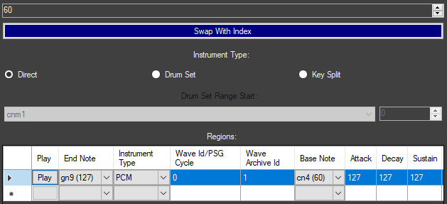

By default, the next empty slot in BANK_BASIC is 60 so we'll start with the dance kick. Because we're adding one sample this step isn't strictly necessary, but just for consistency's sake, we'll change it to a drum set and set the range start note to C2 / 36.

Next, we'll set the wave ID to whatever we have the dance kick set to. In my case I added it as the first sample so I'm going to leave it as ID 0 (remember that it starts from 0). I will set the root note to 36, as well as the end note to 36 since we just want the one note. Then we'll punch in the ADSR values from before and we're done.

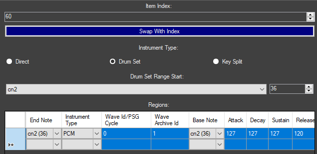

The next empty slot is 61 which was used for the timpani, so we'll do that next. As stated prior, this is a keysplit so we'll need to define two key ranges. After adding the instrument, change it to key split at the top left, wave archive ID to 1, and wave ID to the *first* timpani note. In my case I have it set to the fourth sample so I will set it to 3.

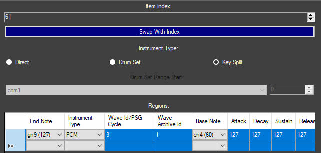

Again we'll use the data we gathered earlier, by rooting it to 41, setting the end to 48, and putting the ADSR in.

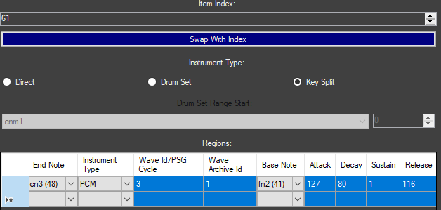

Define the second region by opening the dropdown under `End Note` (in the **next row**!!!) and setting that to 127.

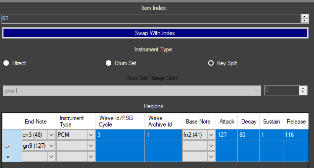

The next steps are pretty similar to that of the last sample: wave archive ID to 1, wave ID to the *second* timpani note (which in my case is ID 4), rooting it at 46, and setting the ADSR to the same values as before. If the column showing instrument type isn't set, just make sure it's PCM since that's what we're using.

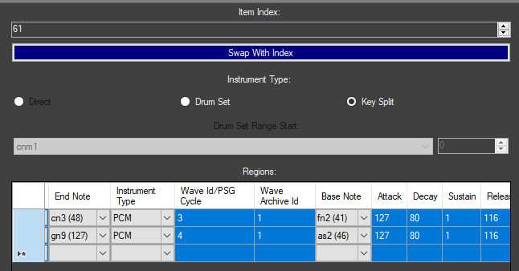

The next and last steps are exactly the same for the remaining three programs, only I'm going to put the minor and major orchestral hit programs on 62 and 63 respectively so that they're next to each other. Leave instrument type as `Direct`, set wave archive ID to 1, set wave ID to whichever you assigned it to in your archive, you don't need to change the root note since it's 60 by default, and put the ADSR as 127, 127, 127, 120 for all three instruments. They should all look something like this:

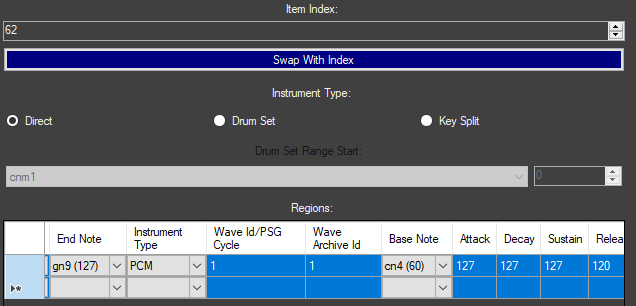

Again, **hit save before you close this window**, name it something else if you wish (I'm going to call it `BANK_BGM_BATTLE_NEW`), save the SDAT, and you now have a new supplementary bank you can use for any battle track.

## Custom banks (Generation 5)

Now again, we aren't going to cover making an entirely new bank with every instrument you'll need for one track, but by now you get the general principle: make wave archive, create bank assignments, give bank to sequence. But let's create a hypothetical scenario in which you need a bank containing a percussion program, a PSG program, and a noise program. This is mostly for Gen 5, or for Gen 4 if you are using AdAstra's music hack, but the general principle still applies to base Gen 4.

For this example, we will create a drum program consisting of the ProSamples dance kick, the ProSamples dance hihats, the PlugSound groove snare, the Battery crash and chinese cymbals, and one of the Addictive Drums toms. One thing we __*won't*__ be doing with this program is making it follow the original keymapping, and that has to do merely with preference. I like to obey General MIDI as much as possible when creating programs, and in terms of drumsets, some of these default keymaps are so obtuse I don't want to work with them. Plus, if you ever find yourself in a similar situation, this will tell you how to do it. As for the pulse and noise programs, I feel that it is easier if you play it by ear by using the keyboard in the bottom right and mess with the ADSR and duty cycle as you want until it sounds the way you like (I probably should have mentioned the keyboard earlier but it's a bit misleading as it ignores release entirely and stops once you let go of the key). Do keep in mind that, unlike the GBA, the DS does not have a wavetable generator; the best you can do for that situation is import the wavetable you want as a sample, preferably a PCM16 sample to minimize noise and compression (since it's a basic waveform it's not going to be very big). Also keep in mind that, while the instructions for creating noise and PSG instruments are in the Gen 5 section, the steps are exactly the same for Gen 4.

### Creating drumsets

The first step is to gather the samples you want. This is where knowing where *exactly* the samples you want are located is super helpful, because I will be honest: making new percussion programs is really hard if you're not intimately familiar with the samples available to you, especially given percussion samples will take a huge chunk of the heap. Familiarizing yourself with the drum samples from the game is something I recommend doing on your own since that will better help you remember where these are. But for our example, I already know that the dance kick and hihats are in the BW Rival battle theme, the groove snare is in the Subway Trainer battle theme, the crash and chinese cymbals are...in a lot of themes but I like to reference the Bicycle theme for them, and the toms are in a lot of new BW2 tracks with toms, but for the sake of an example I will pull from the BW2 Rival Encounter theme. Again, you can look into the banks of these respective themes if you want to copy the ADSR exactly.

With your .SDAT open in Nitro Studio, create your new wave archive, again by right clicking the wave archives dropdown and hitting add. Double click to open it, and now we can add our wave files one at a time. Make sure you remember the order you add these in: for my case I'm going to go Kick, Snare, Tom, Closed Hihat, Open Hihat, Crash Cymbal, Chinese Cymbal. Hit save and exit out, and name it something else if you wish.

Then make a new bank, once again by right clicking the bank dropdown and hitting add. Assign the wave archive you just created to this new bank, and open the bank. Right click and hit Add to create a new program, and we're gonna start with the percussion program simply because it'll invariably be the most complicated. By default, it will be a PCM instrument which is not what we want (or can even use if you have too many regions to assign to it), so we're going to select it and change Instrument Type to Drum Set. Also by default, it will be added to slot 0 since that is the first empty one. You can just leave it there, but I don't want to, so I'm going to move it to program 118 by selecting it, entering 118 in Item Index, and hitting Swap to Index. Next we have to define the trough, or the range start. General MIDI puts kicks on 36 / C2, and we're starting with the kick, so we're going to set that as our range start.

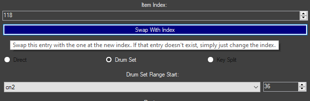

Our first region will thus be for the kick; all of our wave files are using the first wave archive so we don't need to change it, and we're using the first wave file so we don't need to change that either. Since we want it pitched like the original sample, we will also set the root note to 36. Since this is a percussion program, the range end doesn't really matter unless you want to use different pitches for a particular sample. I'm not going to so I'm just going to set the range end to also 36, thus it will only play on note 36. Then, I will insert 127, 127, 120, 116 for the ADSR. Next we'll want our snare, which GM likes to put on 40 / E2. On the next row, define the range end to 40, set the wave ID accordingly, the root note to 40, and I will set the ADSR to 127, 114, 90, 116. Also make sure the instrument type column (**NOT** the instrument type selection at the top) lists PCM for all of the rows.

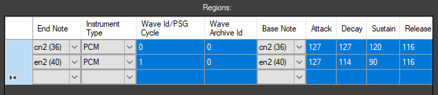

Now the tom is where things will get a bit finicky if you want to follow General MIDI since we have to define multiple ranges that use the sample, since the tom uses notes between 41 and 50, while the crash cymbal is 49 and the closed and open hihats are 42 and 46 respectively. We'll start by identifying a new range ending on F2 / 41 and choosing our third wave file (ID 2), but instead of setting the root note to 41 as well we're going to set it to 50. All of our tom regions will use 50 as the root note so they all pitch up as you ascend the keyboard. Then we'll set the ADSR to 127, 127, 127, 116 and we're done with the row. On the next row, we'll set up the closed hihat by setting the range end to 42 / F#2 and selecting our fourth wave file. This time, since we do want the sound to match, we're going to set the root note to 42 as well. Punch in all 127 for each of the ADSR values and we're done.

Now we want another tom region ending on A2, which will also make the tom play on G2 like in GM. Set it up to use the second sample again, root note to 50 as before, and the ADSR to what we had before. Then comes the open hihat, which is A#2 / 46 in General MIDI so we'll set that as our range end and root note. Make it use the fifth sample and put ADSR of all 127.

In case that was all a lot, here is what it should look like now:

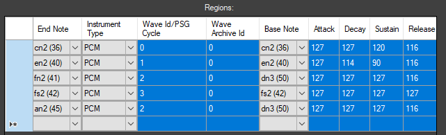

Now we'll define another tom region, this time occupying B2 and C3 so we'll set the latter as our range end. Choose the second wave, set root note to 50, and put in the ADSR as we did before. We're almost done with the toms but first we need our crash cymbal. GM defines that on 49 / C#3 so we'll set that as our range end. We want the sixth sample, the root note to be 49, and ADSR values of 127, 90, 0, 114. Now we can define our last tom region, where the root note and range end are the same. Load the second sample one last time and put in the ADSR you are very familiar with. The last thing we need to define is the Chinese cymbal which GM maps to E3 / 52, so those will be our root note and range end. Use our seventh and last sample, and set the ADSR to 127, 80, 0, 110. At the end of it all, you should now have this:

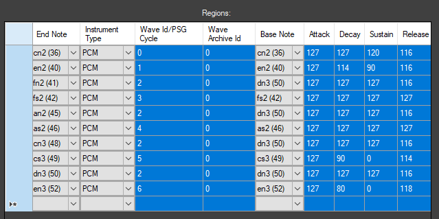

I didn't feel like adding panorama to each region, unlike what most percussion programs in Pokémon do, but if you want it, go to the last column labelled `Pan` and insert values under 64 if you want it to pan left, and over 64 if you want it to pan right.

### Creating programmable sound generation (PSG) instruments

Next we'll make the PSG program, which we'll create a slot for the same way by right clicking the dropdown and hitting add. If you moved the percussion program to 118 like I did, then it will be slotted on program 119 by default; I'm going to swap it to slot 80. The main thing to do is to change the instrument type in the regions section to `PSG` by hitting the drop down.

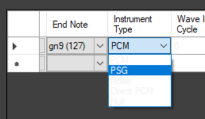

Technically speaking, you are done with this instrument and don't need to do anything else for it to work properly, but I want to mess with it a little. I'm going to set the duty ID to 1 just because I like the sound of that a bit more than ID 0, and I'll set the ADSR to 127,100,120,120 so it decays just a little and doesn't end abruptly as soon as we let go of the key.

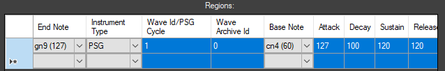

### Creating noise instruments

Last is the noise program, which I am going to assign to program 127 just for the heck of it. Like with the PSG program, we want to change the instrument type to "Noise".

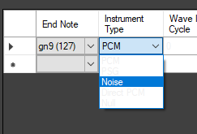

Again, we can just ignore PSG cycle and move onto ADSR, which we will also set to 127,100,120,120 like the PSG program we made. Now incidentally, you can actually do a weird mash of PSG and noise and PCM audio by making regions with different instrument types, but that feels a bit too experimental for my liking. :p

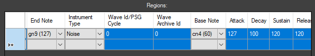

Our bank should now look like this.

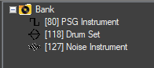

Save and exit, and now you have a bank that you can assign to any track as you please.

# Custom samples

At this point some of you might be asking "but what if I want to use my *own* wave samples?". The good news is that if you just want waves that are formatted exactly like those on the DS, like you will want in most cases, then that is readily doable within Nitro Studio. And by that, I mean use of the IMA-ADPCM codec, which is used for virtually everything aside from a few cries owing to its small size. Inserting loop data is also fairly trivial as you can use anything that can insert cues or markers in audio files, like Awave Studio, and when you import it into Nitro Studio the wave file will loop.

The bad news is that, if you want or need something that *isn't* IMA-ADPCM, your only options are either ndspy or manually hex editing an audio file into an .SWAV container. Both options require raw audio data, meaning the file you process must be stripped of information like sample rate and loop offsets; unlike with the forbidden, you cannot directly process a .WAV or .AIF file into an .SWAV. How to get the raw data depends greatly on your original audio file, but a Microsoft .WAV file needs its first 0x2C bytes trimmed off, while an AIF file needs its first 0x58 bytes trimmed off. Do keep in mind that, if you are importing PCM8 audio, it **must be signed**; raw PCM8 audio from a Microsoft WAV file is **unsigned**. Comparatively, AIF audio is signed. 

I'm not going to discuss making them with ndspy since I feel that is better served with some type of script, so here we're going to use a hex editor. First we need the header, which for .SWAV comprises the first 0x24 bytes. Start with the "SWAV" file magic, then the byte order mark (BOM), which for NDS is almost always little endian (FF FE 00 01). Leave the next four bytes blank for now; I'll explain why in a bit. After that, put the bytes "10 00 01 00"; these specify the size of the "SWAV" section and how many there are, which are almost always 0x10 and 0x1 respectively.

So far it should look like this:

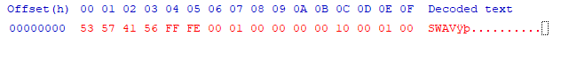

Next, put the "DATA" magic, and again leave the next four bytes blank for now. Set the next byte to 00 if you are using PCM8, or 01 if you are using PCM16. After that, put 01 if your sample loops, or 00 if your sample doesn't. Next comes the sample rate in two bytes, or four hexadecimal digits: remember that we are in little endian so **each byte of every integer is reversed**. In my case, my sample rate is 22050 which is 0x5622, so I will put "22 56". Next comes two bytes representing the clock rate, which in most cases is 16756991 divided by the sample rate, which in my case comes out to 0x2F7 so I will put F7 02.

If your sample doesn't loop, just leave the next six bytes as 00 00 00 00 00 00 and insert your raw audio right after. If it does, then you will need to insert your loop data here. The loop start is two bytes, and the loop length is four bytes, making for a total of twelve hexadecimal digits. If you are using PCM16, the offsets are half the value of the sample count of both parameters, meaning the resulting .SWAV file has the sample counts be multiples of two; if you are using PCM8, the offsets are one fourth of the sample count, so these values instead are multiples of four. I have a loop start and loop length of 38312 and 22580 respectively, and I am using a PCM16 sample, so I will put "D4 4A 1A 2C 00 00".

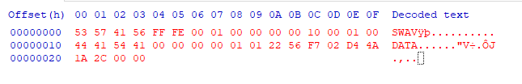

The header is now (mostly) done, so the next step is to copy over the *__raw__* audio data and paste it after the header. Then, go to the end and see if the total file size is divisible by 4.

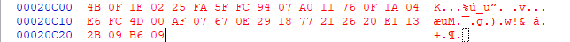

If it isn't, **you must add 00 padding until it is**. The DS does not like dealing with files whose file sizes are not divisible by 4.

The last step is to identify the sizes, and this is why I said to leave those previous sections blank: because those will obviously change depending on the raw data you insert. The four bytes after "DATA" comprise the size of everything starting from and *including* the `DATA` magic, and the four bytes after the byte order mark identify the size of the entire file. In my case they are 0x20C14 and 0x20C24 respectively so I will put "14 0C 02 00" after "DATA" and "24 0C 02 00" after the BOM.

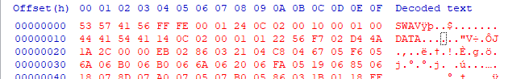

Now you can save your file as an .SWAV file and import it as you would any other .SWAV.

# Notes: About .STRM

Before I move onto sequences, I figured I should rip the band-aid off and explain why I haven't talked very much about STRM, which is what you'd need to replace something like the BW2 title screen. This is especially noteworthy as, unlike with SWAV, STRM files *can* be stereo. The format overall, however, doesn't seem very well researched. Just like with SWAV, Nitro Studio 2 Deluxe imports any wave you use to create an STRM as IMA-ADPCM. While that's all well and good, creating a PCM8/PCM16 STRM file without the forbidden doesn't seem very straightforward, and even *with* the forbidden it seems to not like it when the sample rate is not a specific number (NS2D seems to convert its STRM files with idiosyncratic sample rates perfectly fine though....). Even ndspy's api lists a bunch of unknowns in its STRM specification. To make a long story short, there are too many "what-ifs" for me to really suggest anything definitive. This can definitely change, but for the time being I'm skipping out.

# Adding new sequences

But at long last, we can go over adding new sequences. This guide assumes you have a converted SSEQ already per the insertion guide, and here I will finally explain how to add a new one. As you can guess, it is exactly the same as adding anything else new: right click the sequences and hit Add, and a new slot will be added at the next empty one. You can move it to any other unoccupied slot, and then you can replace it with your converted sequence. Now you're not done yet, because there are a few slot specific settings on the left you have to change.

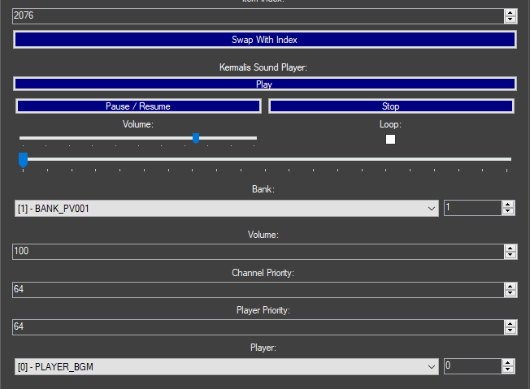

First is assigning the bank to the sequence, either by opening the dropdown and scrolling or by punching in the ID. In most cases, you can assign it to whatever is most appropriate (i.e. your custom bank, or FIELD/BATTLE/DUNGEON for DPPt). For HGSS, however, there is one complication: if you are inserting a field track, the bank in use must match the soundplate information for the map that the track will play on (can't really provide examples however due to my unfamiliarity with HGSS hacking). If there is a mismatch, the bank may not load out properly when changing maps and you will start getting weird playback errors.

Next is setting the track volume, channel priority, and voice priority: you can generally leave channel priority as 30 and voice priority as 64 as that's what most existing Pokémon tracks do (if you're curious, these control which sounds play when they overlap, but that's getting into prio stuff which again I don't really fully understand), but for volume you can set it to whatever makes you happy in game.

The last step is to assign the player, and this is where things get messy if you want to customize them, because players are also not very well researched (also in some cases they can be literally empty too which is **fun**). In general, Gen 4 uses PLAYER_FIELD for overworld tracks and PLAYER_BGM for everything else, while Gen 5 uses PLAYER_BGM for most things and PLAYER_BGM2 in a few miscellaneous places, mainly situations in which the game isn't really doing anything (such as with the Game Freak Logo and the credits sequence). If you want to keep the existing ones that's all well and good, but if you want to add new ones or modify the existing ones (not particularly necessary with Gen 5 since the default player uses dynamic heap sizing and has all the channels enabled), then things get a bit iffy. This may also be an issue when porting tracks between games, as the channel limits may be different (like if you were porting a Gen 5 track to Gen 4) or the voice priority will get overridden differently (as different instruments will be at different volumes).

But I digress. Creating a new player is a matter of adding anything else, by right clicking and hitting add; to configure it, you want to select it and change the max number of sequences to 1. And...for the most part you're done. Putting a non zero heap size means that stuffing anything larger than what you've allotted causes the sound to quit, while disabling some of the channel flags limits the number of voices that can play. Assign the player to the sequence the same way you assign the bank: by either dropping down and scrolling or punching in the index. At long last, you are done and you can save the .SDAT. Remember the slot you assigned your sequence to as that will be called by the relevant script commands, map header information, and any custom code you write. Now you can insert the .SDAT as described in the insertion guide, and you're done.

As a final note, save for converting to and from MIDIs since as I said in the insertion guide it cannot directly interface with the format, you can do almost all of the above with ndspy and never need to open a GUI (the only thing you *can't* do with ndspy is export a DSi mode ROM; that requires TinkeDSi, SwissArmyKnife, or CTRMap), and for people that either can't or don't want to use NS2D, ndspy is pretty much the best (if not only) choice. Of course, there's a reason it hasn't superseded every tool that can do some of what it can, and that's the fact that it's python. But it exists as a last resort.
