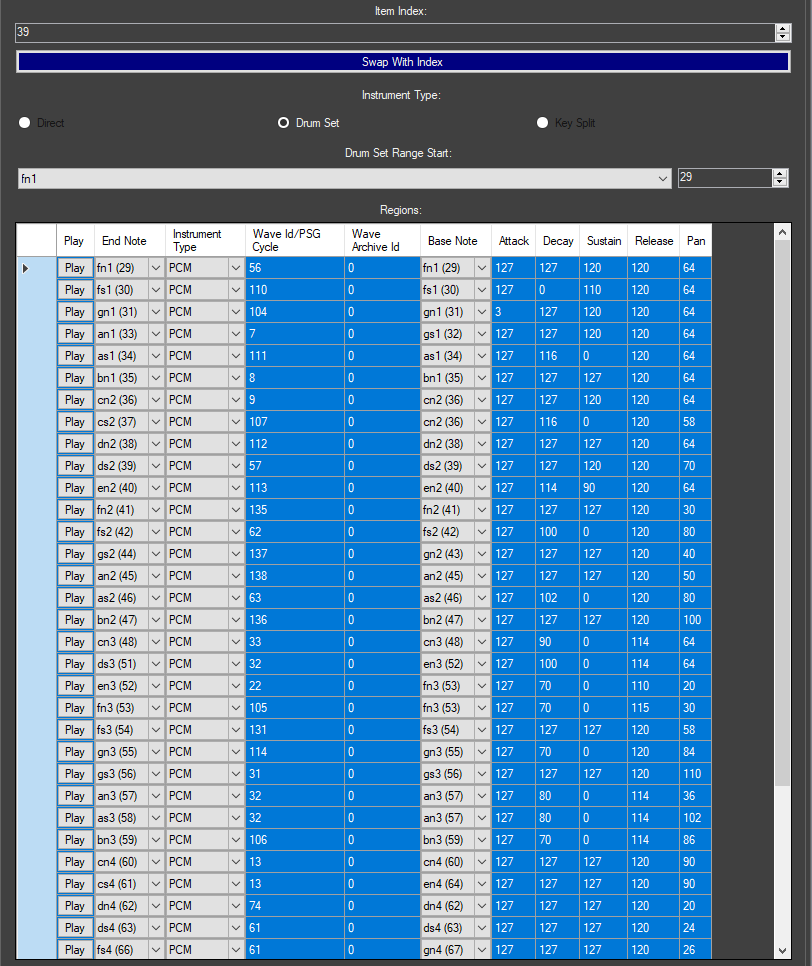
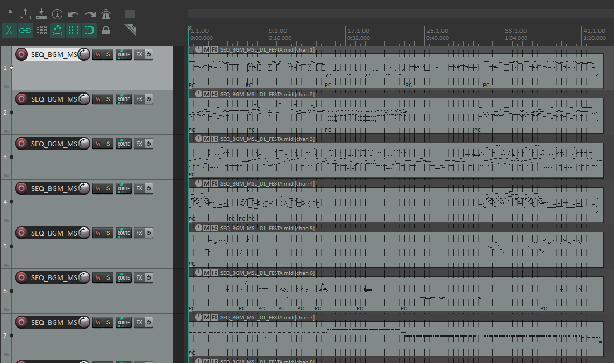
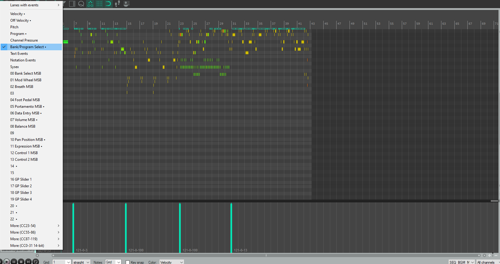
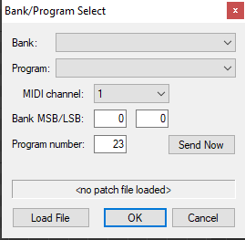
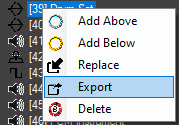
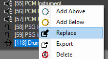
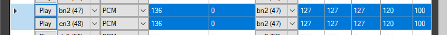
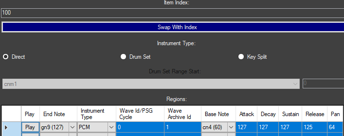
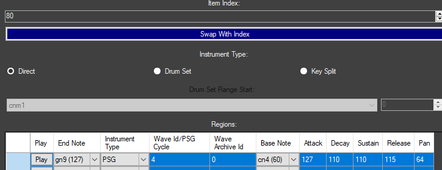

# Music Porting 
  > (By a person with an indeterminate username)

This guide aims to be a targeted dive into porting tracks between Generation 4 games and Generation 5 games (and to a lesser extent between DPPt and HGSS).

This guide assumes you have read through the composing and insertion guides, or at the very least know how to use Nitro Studio 2 Deluxe and a DAW of your choice to manipulate DS sound data as you see fit, as this is a more specific application of the concepts introduced there. But just to reiterate a point from them that is going to be the biggest problem:

> Gen 4 uses a master bank that contains nearly every program, with sub-banks with minor variations, while Gen 5 gives nearly every sequence a completely custom bank with their own program definitions. Among other things, this means that you can't just port a track over from one gen to the other, or even between DPPt and HGSS, as is: some alterations will have to be made with at least one of the assets (This does however mean that porting between BW2 and BW1 is very trivial, with the sole exceptions of the downloadable Musical tracks since they're the only ones in all of Gen 5 to use multiple wave archives, thus you can only get them to play correctly by injecting them into your save file, but I digress). But it also is going to play a lot in how you design your track, especially in Gen 4 in which you are constrained largely to what is in the basic bank (and it's difficult to change it due to it also containing sound effects). While you have a lot more freedom in Gen 5 in theory, in practice you have to fit it in with a size of roughly 240 kilobytes across all of your sound assets (I believe the overall limit in Gen 4 is 480 kilobytes but don't quote me on that). And that limit will generally be a test of your wave archive(s), which is(are) going to be the biggest by far.

In addition, if you do not make any player alterations, you may run into a voice limit when porting a Gen 5 track to a Gen 4 game, as the former uses 16 voice players by default whilst the latter uses 12 voice players. When players are given a more in depth breakdown I will explain how to address this issue, but for the time being this guide will assume you do not have this problem when porting your track, since if you do encounter it but do not want to touch the players, you will have to alter the sequence to fit the player (and it's unlikely for there to be a way to automate this).

Effectively what this all means is that, although the sound systems used by the games are the same, how they partition their assets differs, so you will need to make several adjustments to account for it. It's definitely doable to freestyle the porting process by yourself (i.e. remix the track), but this guide will aim to provide the easiest and simplest methods of porting a track over with as few alterations as possible.

Now in contrast to making new tracks, inserting the sequence is actually the easiest part of porting a track over. Simply export the SSEQ of the track you want to port, and then import it as described in either the insertion guide (if you are replacing an existing track) or the composing guide (if you are adding a new one). The actual rub, again a big contrast to the process of making a new track, is creating a program list, since at the current moment it is a tedious process that must be done manually.

Fortunately, we have references we can use as examples for porting tracks, specifically from Gen 4 to 5 and from Platinum to HeartGold/SoulSilver.

For the former, we can reference the Sinnoh Legendary Battle theme in BW2. The sequence is identical to its DP counterpart, but the banks assigned to them are completely different.

DP has every single instrument from its battle bank loaded in at once when it plays the track. There are 170 wave files that total over 480 KB on their own. This is obviously a no-go on Generation 5.

Here, every instrument that isn't used in the track has been culled, leading to a much smaller bank. Here, we instead have 20 wave files totaling merely 70 KB.

For the latter, we can reference the battle facility tracks in HGSS.
While the sequences are basically the same, the program assignments have been altered to match those in HGSS. Instruments were changed to acceptable counterparts when applicable.

### Porting from Gen 4 to Gen 5
This process is simpler compared to the other way around, so we will go over this first. For demonstration I will be porting the Buena's Password track from HGSS to BW/2, and be making entirely new entries for all of the new assets.

First, we want the sequence, so export it and save it somewhere. **Make sure you save it as an SSEQ file**.

Next, we want a program list of all the instruments used by the sequence, as well as their corresponding wave files. As far as I'm aware there's no public way to automate this so it must be done manually.

You can either peruse the sequence's plaintext by double clicking it and then seeing which numbers next to all "prg" events are used, and take the corresponding programs, or you can export the track as a MIDI and see which programs are in use (do **not** use this MIDI for porting the track however).

Once you see which programs the track uses, you can make a note of their bank data, as well as their slots which we will need to keep the same to minimize the amount of editing we have to do. In my case the programs encompass numbers 0, 1, 2, 3, 6, 19, and 39. You can also copy the ADSR numbers now so you don't have to later and need to have two instances of Nitro Studio open at once and get confused which one you're editing (trust me when I say I've made that mistake a lot).

Most of these next steps are retreads of concepts from the composing guide, so consult that if you get lost in the process.

Now we want the samples used by the track. If you don't already have them lying around somewhere, I recommend consulting the detailed sound sources spreadsheet by VGM Resources so you don't have to course through the entire wave archive(s) to find what you need. Besides the drumkit, I know that this track uses the various pianos, the double bass, and the marimba (it also uses the vibraphone after the first loop but I'm going to make a _slight_ alteration to the sequence so we don't have to port it). Thankfully we do not have to port over every percussion sample, only the ones used by the track.

Exporting all the necessary samples for this track gives us 30 SWAV files totaling 80 KB, a much more manageable size.

Now open your Gen 5 SDAT of choice in Nitro Studio, and add a new wave archive, filling it with all of those you just exported. Save it and close the window.

Now we want to create the bank, making sure to assign the wave archive we just created to it, then double click to begin modifying it. Since we aren't editing the sequence here, we have to make sure the programs we make are placed on the exact slots that the original game used. I won't go into too much detail, but I will show how different the percussion program looks compared to the original. You don't have to see the whole thing to see that it is much smaller, and most of the regions in between have been erased.\
    
    

Save your bank (before closing the window!) and you're done.

Now all that needs to be done is inserting the sequence, and then assigning the correct bank. Save the SDAT, insert it into the ROM, and you are done.

### Porting from Gen 5 to Gen 4
Or really, from any DS game to any Gen 4 game, or any Gen 4 track to an existing Gen 5 bank. If you do not create a custom bank or make any alterations to the bank of the game you are porting to, it is all but guaranteed that you will have to alter the sequence. Unless you make your samples ultra tiny and nondescript, there simply is not enough space to insert a huge collection of custom samples, so you will have to use the game's existing instruments.\
I am going to pick, whether you believe it or not, what is probably going to be one of the easiest tracks to port over from Gen 5 to HGSS: the Carnival Pokemon Center Musical track. This track (and a few others) is comprised almost entirely of samples and program assignments available already in HGSS.

First I am going to gather a list of instruments used in the track, as well as their corresponding bank assignments, since although the instruments are the same, they don't use the same slots.

Next, we will gather a list of instruments in the bank that we will be using, and make a chart describing what program should be changed to what. Again I don't want to go too far down into the weeds, since you might not find what you're looking for and this can be very personally driven. For this case, however, since everything except the new stuff is in HGSS, and especially since all of these are in the basic bank, this process should be fairly straightforward.
- Program 13 is the string ensemble, which corresponds to program 23 in HGSS.
- Program 3 is the rhode, which is actually the same as in HGSS so we don't need to change that.
- Program 12 is the slap bass, which corresponds to program 21 in HGSS.
- Program 4 is the vibraphone, which corresponds to program 5 in HGSS.
- Program 5 is the marimba, which corresponds to program 6 in HGSS.
- Program 22 is the percussion program which has most of its samples on program 39 in HGSS. However, we're gonna make a new one for reasons I will detail below.
- Program 6 is the tubular bell which corresponds to program 8 in HGSS.
- Program 20 is the flute which is program 35 in HGSS.
- Program 14 is the pizzicato string ensemble which is program 26 in HGSS.
- Program 15 is the harp which is program 27 in HGSS.
- Program 19 is the clarinet, which is program 34 in HGSS.
- Program 24 is a hardware synth. There's no exact equivalent for this one in HGSS, but thankfully we can just make one, and we'll put it on program 80.
The new stuff (programs 100-102) will be left on their original slots for simplicity's sake.

Now as much as I wanna say we should not convert this to MIDI since we'd be introducing a hoist of other potential problems, I realize the process is not only easier but more applicable if you do so, especially to alter the percussion, so we will be exporting a MIDI.

As mentioned in the insertion guide, having a DAW with good MIDI support is vital. If you are, for instance, using FL Studio, you will have to manually import all of the controllers it does not automatically take in (at least, if a direct, unmodified port is what you want). For the purpose of demonstration, and simply because it entails far fewer steps, I will showcase this in REAPER. I don't believe these instructions change depending on your version of REAPER, but keep it in mind if it does (the version in these screen captures is 7.06).

We will open the MIDI as described in the insertion guide, leaving us with something like this.\
    

First we will want to change all of the program changes to call the ones in HGSS, corresponding to the chart we just made. To do this, open the MIDI item by double clicking on it. We want to change the bottom row to display Bank / Program select.\
    

Now we can alter the program changes. Double click on them, and a window will pop up describing the program change. The value you want to change is the "program number". For instance, for this first event, the program number is 13, which we have to change to 23 like so.\
    

Repeat this process for every program change and MIDI item you have.

Now comes what's probably the hardest part: the percussion. In my case, most of the percussive elements are on the exact same notes, so there's not much I actually have to do. But I have two exceptions: a higher pitched tom on C3 and a higher pitched crash cymbal on F3, neither of which have exact equivalents on HGSS. In this case, you could do one of two things: 1) alter the drum track ever so slightly to account for these (for the cymbal I could use the one on A#3 and for the tom I could use the one on G#2, just to give an example), or 2) since every sample in this drum kit is in HGSS already, make a duplicate kit with alterations to match the BW track, and it won't take up too much real estate either (you can remove some of the elements to add some more space to save). Since I want the track to sound more or less identical to its original counterpart, I'm going to do the second one, placing it on program 118 just cause, so aside from shifting the program I'm not actually going to make any alterations to the percussion track.

Regardless, once you have made your necessary alterations, you can now export, convert, and insert the sequence as described in the insertion guide.

Like in the composing guide, we are going wave archive -> bank -> sequence, so first we want to gather any waves we might need and assemble them into a wave archive. Thankfully all of the new sounds for my track already have their own dedicated SWAR so we can just use that one.

First we will append our new sounds to the game. Since I already have an SWAR, I'm just going to add a new slot and replace the SWAR (then renaming it, in my case to WAVE_ARC_MUSICAL).

Next we will create our bank. We can use the same trick from the composing guide to save having to recreate all the BASIC programs by exporting it and then importing it over our new slot (which we will name BANK_BGM_MUSICAL). Be sure to set the supplementary wave archive to the one you just created.

Now we can modify it by double clicking it. First, we will export the drum program that we can then use for our own slot, by right clicking and hitting export. Save it somewhere you can remember.\
    

Add a new instrument. We will start with the drum kit, then swap its index to program 118. Right click and hit replace, and select the instrument you just exported. This will automatically change it to a drum kit.\
    

Now we have a duplicate of the standard drum kit that we can modify. First we'll tackle the tom on C3. Thankfully we can just copy the parameters of B2, which uses the same sample (this includes copying over the root note so the pitch actually ascends!).
(The top row is the original keymap, and the bottom row is the one we modified.)
    

Next we'll copy the F3 crash cymbal note. This uses wave 32 in WAVE_ARC_BASIC so we'll set it to that, and is pitched up one semitone from root, so we'll set the root to E3. Then we copy the ADSR values as need be.
    

Now we will add the new instruments. Thankfully the instruments themselves are very simple (they all even use the same ADSR envelope and root note) so there's not a whole lot I need to do. We will create three programs, move them to slots 100-102, and assign them appropriately as need be. Be sure that the wave archive ID is 1 as we are using the supplementary wave archive.

All of them should look roughly like this (the only difference between the three is the wave ID).
    

Finally we need the hardware instrument. Once again, we will create new, swap it to index 80, and plugin the parameters as they are in the original track (which in my case are these).
    

At last we are done. **Remember to save the bank before you close the window or your changes do not get flushed**.

Now we can add a new entry for our sequence, assign it to the bank we just created, and import the SSEQ we converted earlier. Save the .SDAT, import it into the ROM, and you're done.