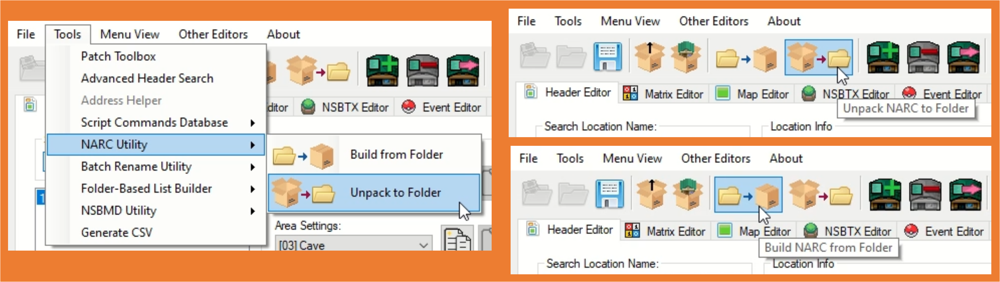

# Unpacking NARCs
> Author(s): [SpagoAsparago](https://github.com/SpagoAsparago)

This page includes tutorials on unpacking & packing NARCs (**N**itro **ARC**hives) using two tools:
1. [Knarc](#knarc)
2. [DSPRE](#dspre)

--- 

## Knarc
This is a tutorial on how to use Knarc to pack/unpack NARC files.
You can download the Knarc executable from [here](https://github.com/kr3nshaw/knarc/releases).
- [Opening the CMD](#opening-the-cmd)
- [Unpacking the NARC](#unpacking-the-narc)
- [Adding files and Packing the NARC](#adding-files-and-packing-the-narc)

### Opening the CMD
First, extract the NARC you want to unpack with Tinke and save it in the same folder as the Knarc.exe file.

Launch the Command Prompt in that same folder.

<details>
 <summary>On Windows you can type `cmd` in the folder address and press enter:</summary>

<video width="640" height="480" controls>
  <source src="/video/universal/guides/unpacking_narcs/quickcmdvideo.mp4" type="video/mp4"/>
</video>

</details>

### Unpacking the NARC

To unpack the NARC, you can use the command 

```Knarc -u file```
With `file` being the extracted NARC filename. This will extract all its content in the folder the NARC is currently located, if you want to extract them to a different folder, then use

```Knarc -d folder -u file```
With `folder` being the address of the destination folder you want. You can create a new folder inside the one from where you launched Knarc and simply use that folder name in the command.

You should do this if you plan to add additional files to the NARC.

### Adding files and Packing the NARC
If you're going to add a new file to the NARC, make sure the newly added file follows the same naming convention as the already existing files.

For repacking the narc, you can use: 
```Knarc -d folder -p file```

Now you can reinsert the NARC using Tinke. Just go to the same location as the original file you extracted, and use the `Change File` button instead of `Extract`. Now you can save your ROM.

--- 

## DSPRE
DSPRE has a tool for packing and unpacking Pokémon games NARCs, which is not game version or generation-dependant (although the tool generally is only for Generation IV Pokémon games).

The NARC Utility can be accessed from DSPRE in two places:
- Tools > NARC Utility > `Build from Folder` / `Unpack to Folder`
- Menu Bar > `Build from Folder` / `Unpack to Folder` (only if Menu View is set to Advanced or Complete)

  

### Unpack to Folder  
This command will allow the user to select a file to unpack.
- The default file selector will be looking for `.narc` file extensions, but this can be changed from **NARC File (`*.narc`)** to **All Files (`*.*`)**.
- This is particularly useful for HGSS, where the `.narc` file extension isn't used.  

### Build from Folder  
This command will take all the files in given folder, and pack them up into a narc format (with the `.narc` file extension).
- Any backup (e.g. `.bak` files) should be removed from the folder *before* using the `Build from Folder` option (see below for more detail).
- The file extension should be altered to match the original NARC (remove the file extension entirely for an HGSS NARC).  

> Generally when unpacking NARCs the intention will be to change an unpacked file, or to add/remove files. It is important to note that many Hex editing tools used to achieve this (such as HxD), will create backups of changed files.  
> - While it is important to keep these backups for reversion purposes, they should be removed from the folder *before* using the `Build from Folder` option.  
> - If they aren't removed, they will be assumed to be a valid file in the packed NARC, meaning that an extra file could be inadvertently added and cause issues.
