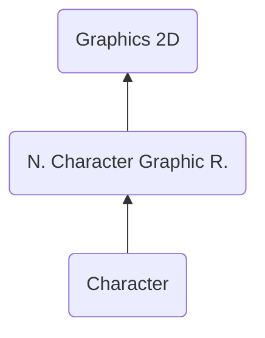

# CHAR ("RHAC") - Character
> Author(s): [Gonhex](https://github.com/Gonhex) <br />
> Research: [NOCASH](https://problemkaputt.de), [Gonhex](https://github.com/Gonhex)


The character section stores the sprite-image in form of indices to colors within a palette. The array layout is usually a tile map where each tile has a size of `8 * 8 pixels`, but can also be a line buffer which maps the image directly to the target.

## Table of Contents
- [CHAR ("RHAC") - Character](#char-rhac---character)
  - [Table of Contents](#table-of-contents)
  - [Data Structure](#data-structure)
    - [Section Container](#section-container)
    - [CHAR Container](#char-container)
  - [Specification](#specification)
    - [Pixel Data](#pixel-data)
      - [Color](#color)
      - [Layout](#layout)
    - [Dimensions](#dimensions)
    - [Mapping Type](#mapping-type)
    - [Flags](#flags)
    - [Files](#files)
  - [TODO](#todo)
---

## Data Structure

### Section Container
```c
struct ContainerSectionCHAR
{
    /* 0x0 */ struct NitroSectionHeader sectionHeader;
    /* 0x8 */ struct ContainerCHAR sectionData;
}; // entry size = sectionHeader.lengthSection
```
| Field Name     | Description                                                                             | Data Type    |
|----------------|-----------------------------------------------------------------------------------------|--------------|
| sectionHeader  | Header of this section. `sectionHeader.signature = "RAHC"`.   | [NitroSectionHeader](../nitro.md#nitro-section-header) |
| sectionData    | Content of this section.                                                                | [ContainerCHAR](#char-container) |

### CHAR Container
```c
struct ContainerCHAR
{
    // header
    /* 0x00 */ int16_t heightInTiles;
    /* 0x02 */ int16_t widthInTiles;
    /* 0x04 */ uint32_t pixelFormat;
    /* 0x08 */ uint16_t mappingType0;
    /* 0x0A */ uint16_t mappingType1;
    /* 0x0C */ uint32_t flags;
    /* 0x10 */ uint32_t lengthDataImage;
    /* 0x14 */ uint32_t offsetDataImage;
    
    // data
    /* offsetDataImage */ uint8_t dataImage[lengthDataImage];
}; // entry size = offsetDataImage + lengthDataImage
```
| Field Name      | Description                                                                             | Data Type |
|-----------------|-----------------------------------------------------------------------------------------|-----------|
| heightInTiles   | Height of the sprite or `-1`, see [Dimensions](#dimensions).                            | int16_t   |
| widthInTiles    | Width of the sprite or `-1`, see [Dimensions](#dimensions).                             | int16_t   |
| pixelFormat     | `== 3`: 4 bits per pixel. `== 4`: 8 bits per pixel.                                     | uint32_t  |
| mappingType0    | `== 0`: 2D mapping, else: 1D mapping(?).                                                | uint16_t  |
| mappingType1    | Sometimes used in combination with `mappingType0`(?).                                   | uint16_t  |
| flags           | Binary flags for different purposes. See [Flags](#flags).                               | uint32_t  |
| lengthDataImage | Length of the image data section in bytes.                                              | uint32_t  |
| offsetDataImage | Offset to the image data section relative to `ContainerCHAR`.                           | uint32_t  |
| dataImage       | Array holding all color indices to create an image, see [Pixel Data](#pixel-data).      | uint8_t[] |

---
## Specification

### Pixel Data

#### Color
The character graphic stores indices to colors on a [palette](section_pltt.md). This palette provides either 16 or 256 colors. The density of indices depends on the palette size. For a value of `0...15` only 4 bits (1 nibble) are needed. This allows to squeeze two indices into one byte, reducing the overall size by half.
* `pixelFormat == 3`: use 16 colors 
* `pixelFormat == 4`: use 256 colors

#### Layout
The 2D engine uses a tile based system. The pixel layout in the file represents this and can be imagined as a box with a width of 8 pixels and an infinite length. The data is written line by line into this box. Each tile can now be accessed at `y * 8`. Now we have 1D mapped tiles. For 2D mapping these tiles are also layed out row by row.

If the image is to be used by the 3D engine, the "infinite length box" from before becomes a bitmap which has the dimensions of the image. There are no tiles in this case. 

### Dimensions
The first two entries of [ContainerCHAR](#char-container) define the size of the sprite in tiles. To get the pixel values, multiply them with the side length of a tile (which is 8).

$$
\begin{align}
    height_{pixel} &= height_{tiles}\cdot 8\\
    width_{pixel} &= width_{tiles}\cdot 8
\end{align}
$$

Sometimes the width and height values are both set to `-1`. In this case the image itself has no size and the [CPOS section](section_cpos.md) is not part of the file. To display the sprite anyway, a width of four tiles often makes the image recognizable. The real image is constructed by the [cell runtime](file_ncer.md), which picks the needed tiles and positions them.

### Mapping Type
These values are `0`, if the image uses 2D mapping (positive values in `heightInTiles` an `widhtInTiles`). Both dimension values `== -1` indicate 1D mapping. In this case `mappingType0` usually has a value like `0x10`. In the most cases, the [cell runtime](file_ncer.md) indexes 1D mapped tiles.

### Flags
Apply properties to the sprite.
* `(flags & 0x00000001) > 0`: Use a line buffer instead of tiles.
* `(flags & 0x00000100) > 0`: Unknown. Maybe related to [Mapping Type](#mapping-type)?

### Files
* [Nitro Character Graphic Runtime](file_ncgr.md)

---
## TODO
* Research and document "mappingType"
