# Front Sprite Movement Types
> This document was written by [turtleisaac](https://github.com/turtleisaac)

> This document is referenced by [Sprite Poke_Data NARC](poke_data.md)

This document contains examples of every front sprite movement type contained in Gen 4.

## Table of Contents
* [Examples](#examples)
  * [Movement 0](#movement-0)
  * [Movement 1](#movement-1)
  * [Movement 2](#movement-2)
  * [Movement 3](#movement-3)
  * [Movement 4](#movement-4)
  * [Movement 5](#movement-5)
  * [Movement 6](#movement-6)
  * [Movement 7](#movement-7)
  * [Movement 8](#movement-8)
  * [Movement 9](#movement-9)
  * [Movement 10](#movement-10)
  * [Movement 11](#movement-11)
  * [Movement 12](#movement-12)
  * [Movement 13](#movement-13)
  * [Movement 14](#movement-14)
  * [Movement 15](#movement-15)
  * [Movement 16](#movement-16)
  * [Movement 17](#movement-17)
  * [Movement 18](#movement-18)
  * [Movement 19](#movement-19)
  * [Movement 20](#movement-20)
  * [Movement 21](#movement-21)
  * [Movement 22](#movement-22)
  * [Movement 23](#movement-23)

---

## Examples

### Movement 0
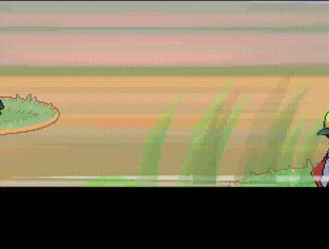

### Movement 1
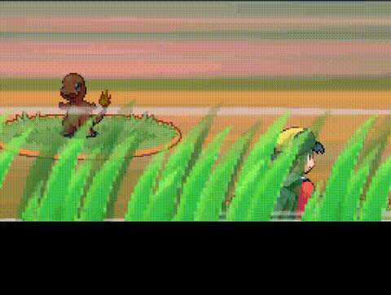

### Movement 2

### Movement 3
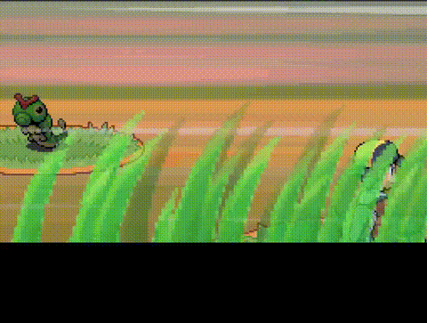

### Movement 4
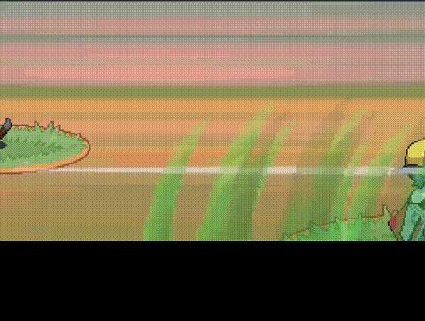

### Movement 5
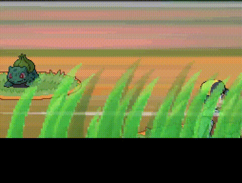

### Movement 6
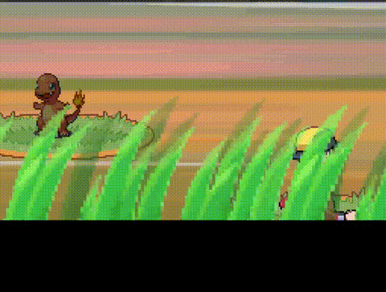

### Movement 7

### Movement 8
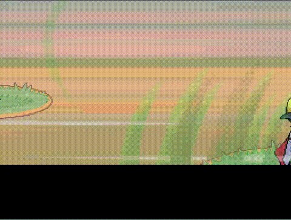

### Movement 9
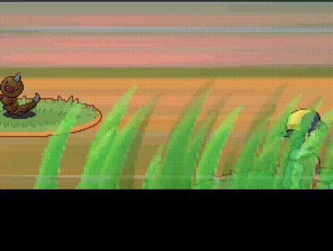

### Movement 10
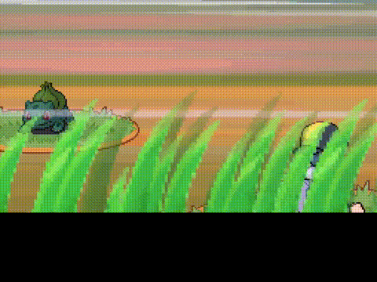

### Movement 11
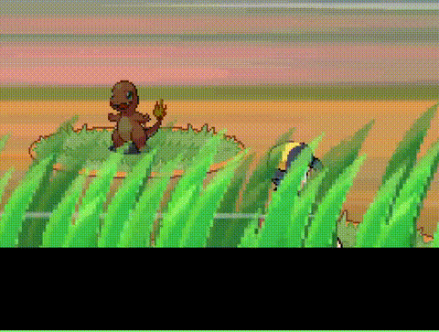

### Movement 12
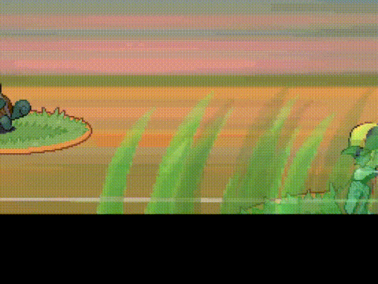

### Movement 13
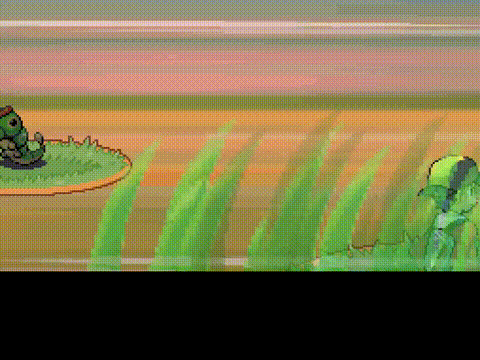

### Movement 14
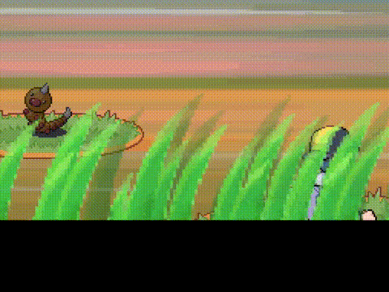

### Movement 15

### Movement 16
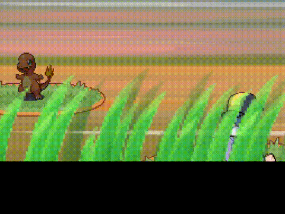

### Movement 17
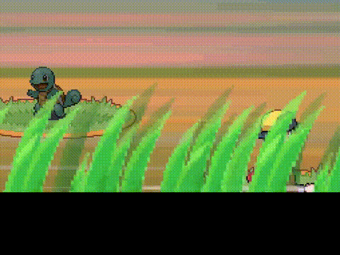

### Movement 18
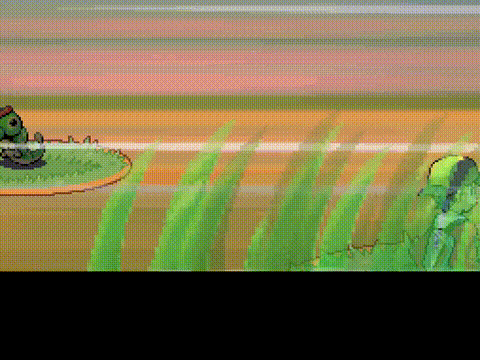

### Movement 19
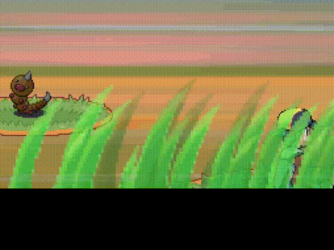

### Movement 20
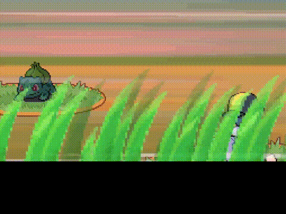

### Movement 21
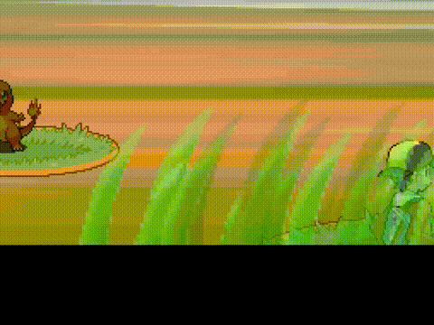

### Movement 22
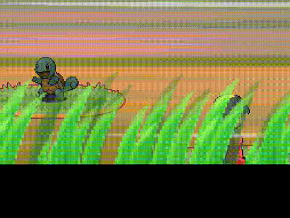

### Movement 23
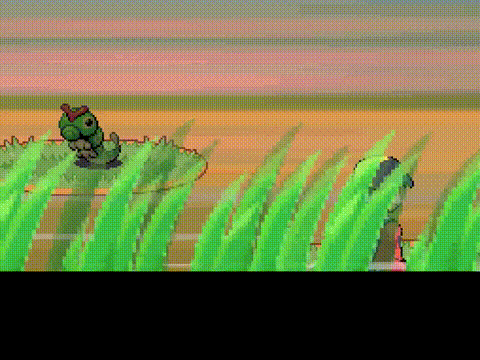