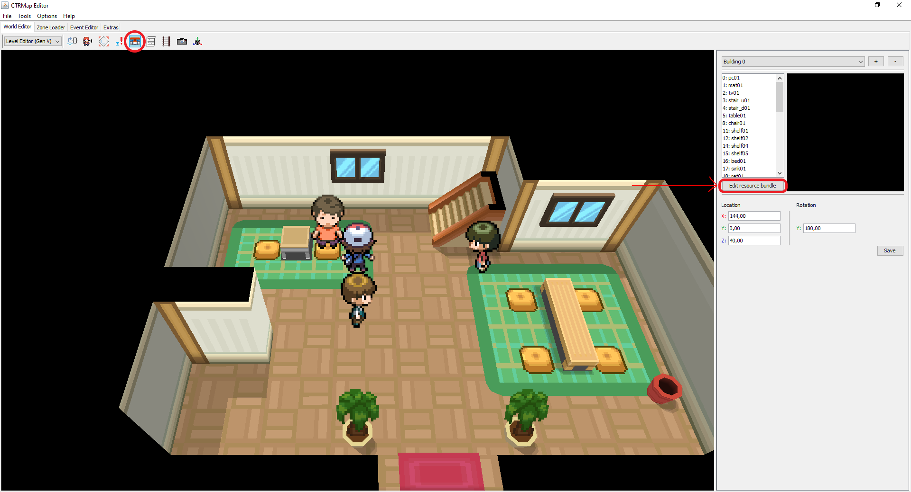

# Exporting and Importing buildings from/to Gen 5 games
> This guide was written by SpagoAsparago.

This is a tutorial on how to export and import buildings in gen 5 games.
You will need to have installed [CTRMap-CE](https://github.com/kingdom-of-ds-hacking/CTRMapV/releases) as well as the [CTRMapV](https://github.com/kingdom-of-ds-hacking/CTRMapV/releases) plugin, then create a project of the game you want to import/export buildings to/from if you haven't already.

--- 
## Table of Contents
* [Exporting Buildings](#section)
  * [Exporting Animations](#subsection)
* [Importing Buildings](#section-2)
  * [Importing Animations](#subsection-2)
  * [Animated Doors](#subsection-3)

 
The first thing you want to do is load the map you want to export/import your building(s) using the Zone Loader, then open the building editor by clicking the Pokémon Center icon in the World Editor's top bar, and then click *Edit Resource Bundle*

## Exporting Buildings
Select the building you want to export from the list on the left side of the editor, then click the *Open in CS* button right below. This will launch Creative Map studio, from where you can export the model in a number of different formats, using the *Export* options from the top bar.

About the different file types you can get, it's worth mentioning:
* COLLADA: exports as **DAE** format
* NNS Resource: exports as **NSBMD**, Nintendo's proprietary format
* WaveFront OBJ: exports as **OBJ** format. The textures will be exported as a separate **mtl** file, keep both in the same directory.

If you're planning to import the building in a gen 4 game, both DSPRE and PDSMS building editors only acccept NSBMD files. For gen 5 games, both OBJ and DAE work but the latter is recommended.

### Exporting Animations
If the building you want to export has an animation, you can export it by selecting the animation on the menu on the right side of the editor after having selected the building, then click the *Open in CS* button right below it.

In Creative Studio, select the animation in the dropdown menu (it will be either in the Material or Skeletal Animation folder), then right click on it > Export and it will be saved as a NSBTA/NSBCA file depending on the animation type.

## Importing Buildings

Keep in mind that adding a building will simply display the building model in the map, but it won't change the map collision. For that you have to edit the tile permissions of the map in question trough PDSMS.

Open the map you want to add your building(s) to from the Zone Loader, then open the Building Editor. If the type of building you want to add is already present in the map, you can just add it by clicking the + button and then choosing it from the list, setting the coordinates and saving it.

If the building is not present, click the Edit Resource Bundle, and click the **+** button in the bottom left of the screen. Choose the DAE or OBJ you previously exported (or made on your own), once you've added all the buildings click *Commit Changes* > *Resource Bundle* and *Static Texture Pack*.
Now you can close the tab and go back to the building editor in the world editor tab.

Click the **+** icon and select the type of the building from the list right below it. All that's left is setting coordinates of the new building you've added and clicking the save button. You can also press F5, the selected building will have a yellow outline; you can drag it across the map to the location you prefer.

### Importing Animations

* Material Animations:

  After having imported the DAE/OBJ model, on the right side of the screen set the Animation Controller to *Ambient Generic*. Select the first **X** in the list, then click the blue arrow pointing downwards button, and select the NSBTA file you previously exported/created.

* Skeletal Animations:
  Same steps as above, the only differences are that you have to set the animation controllers to *Dynamic* instead, and you will import a NSBCA file.

### Animated Doors

* If the building you want to import is a door (and its animations) you'll need to specify two different animations set:
Change the *1 set/4 animations* option to *2 sets/1 + 1 animation*, and for both sets you have to import respectively the Opening and Closing animation.
* You can set the sound by changing the *Type* value from the top right of the building editor.
* You need to bind the door to a building to have the animation actually work: select the building, then from the menu on the right side choose the door model and set its coordinates.

Remember that you still have to click both *Commit Changes* and *Static Texture Pack* buttons after importing animations as well.
