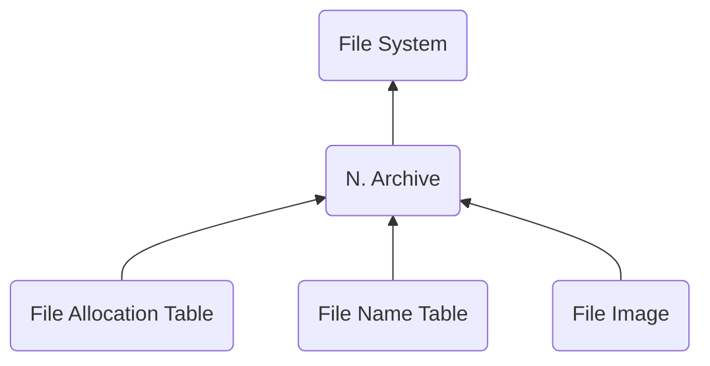

# NARC - Nitro Archive
> Author(s): [Gonhex](https://github.com/Gonhex) <br />
> Research: (see sections)


Nitro archives are virtual file systems (fs) nested into the fs of the ROM. They are often used to group related files at the final branches of the file tree.

## Table of Contents
* [Data Structure](#data-structure)
  * [File Container](#file-container)
* [Specification](#specification)
  * [Sections](#sections)

---
## Data Structure

### File Container
```c
struct ContainerFileNARC
{
    /* 0x00   */ struct NitroFileHeader fileHeader;
    /* 0x10   */ struct ContainerSectionFATB sectionDataFATB;
    /* append */ struct ContainerSectionFNTB sectionDataFNTB;
    /* append */ struct ContainerSectionFIMG sectionDataFIMG;
}; // entry size = fileHeader.lengthFile
```
| Field Name      | Description                                                                             | Data Type    |
|-----------------|-----------------------------------------------------------------------------------------|--------------|
| fileHeader      | Header of this file. `fileHeader.signature = "NARC"`.                       | [NitroFileHeader](../nitro_overview.md#nitro-file-header) |
| sectionDataFATB | File allocation table. Stores offsets to all entries.                       | [ContainerSectionFATB](section_fatb.md#section-container) |
| sectionDataFNTB | File name table. Can store names of all entries.                            | [ContainerSectionFNTB](section_fntb.md#section-container) |
| sectionDataFIMG | File image. The data of all entries.                                        | [ContainerSectionFIMG](section_fimg.md#section-container) |

---
## Specification

### Sections
* [File Allocation Table](section_fatb.md)
* [File Name Table](section_fntb.md)
* [File Image](section_fimg.md)
