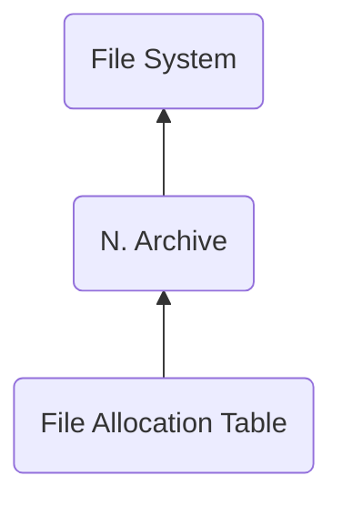

# FATB ("BTAF") - File Allocation Table
> Author(s): [Gonhex](https://github.com/Gonhex) <br />
> Research: [NOCASH](https://problemkaputt.de)


The file allocation table stores offsets to beginning and end of all entries within the file image.

## Table of Contents
* [Data Structure](#data-structure)
  * [Section Container](#section-container)
  * [FATB Container](#fatb-container)
  * [Entry Offset](#entry-offset)
* [Specification](#specification)
  * [Files](#files)

---
## Data Structure

### Section Container
```c
struct ContainerSectionFATB
{
    /* 0x0 */ struct NitroSectionHeader sectionHeader;
    /* 0x8 */ struct ContainerFATB sectionData;
}; // entry size = sectionHeader.lengthSection
```
| Field Name     | Description                                                                             | Data Type    |
|----------------|-----------------------------------------------------------------------------------------|--------------|
| sectionHeader  | Header of this section. `sectionHeader.signature = "BTAF"`.   | [NitroSectionHeader](../nitro_overview.md#nitro-section-header) |
| sectionData    | Content of this section.                                                                | [ContainerFATB](#fatb-container) |

### FATB Container
```c
struct ContainerFATB
{
    // header
    /* 0x0 */ uint16_t numberFiles;
    /* 0x2 */ uint16_t reserved;
    
    // data
    /* 0x4 */ EntryOffset dataEntries[numberFiles];
}; // entry size = sectionHeader.lengthSection - 0x8
```
| Field Name      | Description                                                                             | Data Type |
|-----------------|-----------------------------------------------------------------------------------------|-----------|
| numberFiles     | Number of files stored in this archive.                                                 | uint16_t  |
| reserved        | Always `0`.                                                                             | uint16_t  |
| dataEntries     | Contains offsets to all files managed by this archive.                                  | [EntryOffset[]](#entry-offset) |

### Entry Offset
```c
struct EntryOffset
{
    /* 0x0 */ uint32_t offsetBeginning;
    /* 0x4 */ uint32_t offsetEnd;
}; // entry size = 0x8
```
| Field Name      | Description                                                                             | Data Type |
|-----------------|-----------------------------------------------------------------------------------------|-----------|
| offsetBeginning | Offset to the file within the file image.                                               | uint32_t  |
| offsetEnd       | Offset to the end of the file within the file image.                                    | uint32_t  |

---
## Specification

### Files
* [Nitro Archive](file_narc.md)
