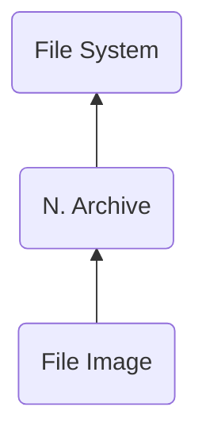

# FIMG ("GMIF") - File Image
> Author(s): [Gonhex](https://github.com/Gonhex) <br />
> Research: [NOCASH](https://problemkaputt.de)

A data buffer for all the files stored in this archive.

## Table of Contents
* [Data Structure](#data-structure)
  * [Section Container](#section-container)
  * [FIMG Container](#fimg-container)
* [Specification](#specification)
  * [Files](#files)

---
## Data Structure

### Section Container
```c
struct ContainerSectionFIMG
{
    /* 0x0 */ struct NitroSectionHeader sectionHeader;
    /* 0x8 */ struct ContainerFIMG sectionData;
}; // entry size = sectionHeader.lengthSection
```
| Field Name     | Description                                                                             | Data Type    |
|----------------|-----------------------------------------------------------------------------------------|--------------|
| sectionHeader  | Header of this section. `sectionHeader.signature = "GMIF"`.   | [NitroSectionHeader](../nitro_overview.md#nitro-section-header) |
| sectionData    | Content of this section.                                                                | [ContainerFIMG](#fimg-container) |

### FIMG Container
```c
struct ContainerFIMG
{
    // header
    // empty
    
    // data
    /* 0x0 */ uint8_t data[sectionHeader.lengthSection - 0x8];
}; // entry size = sectionHeader.lengthSection - 0x8
```
| Field Name      | Description                                                                             | Data Type |
|-----------------|-----------------------------------------------------------------------------------------|-----------|
| data            | Raw data. The allocation table is needed to separate the files.                         | uint8_t[] |

---
## Specification

### Files
* [Nitro Archive](file_narc.md)
