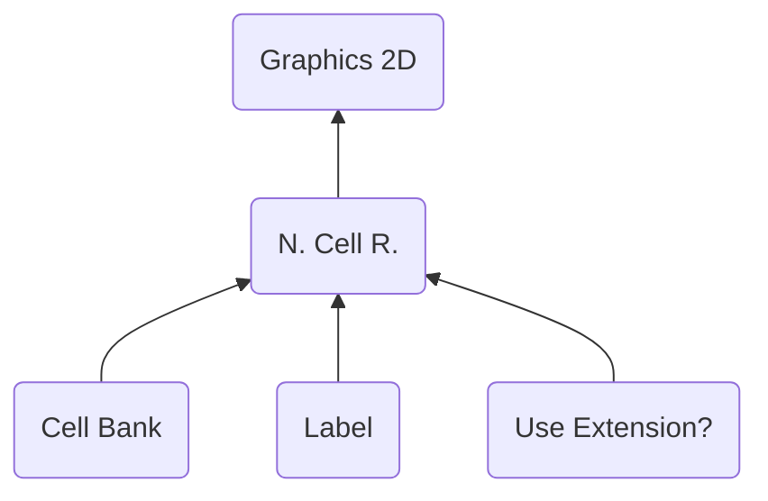

# NCER ("RECN") - Nitro Cell Runtime
> Author(s): [Gonhex](https://github.com/Gonhex) <br />
> Research: (see sections)


The cell runtime creates groups of tiles which will be displayed as small images. The cells can serve as base for frame animations.

## Table of Contents
* [Data Structure](#data-structure)
  * [File Container](#file-container)
* [Specification](#specification)
  * [Sections](#sections)

---
## Data Structure

### File Container
```c
struct ContainerFileNCER
{
    /* 0x00   */ struct NitroFileHeader fileHeader;
    /* 0x10   */ struct ContainerSectionCEBK sectionDataCEBK;
    /* append */ struct ContainerSectionLABL sectionDataLABL;
    /* append */ struct ContainerSectionLABL sectionDataUEXT;
}; // entry size = fileHeader.lengthFile
```
| Field Name      | Description                                                                             | Data Type    |
|-----------------|-----------------------------------------------------------------------------------------|--------------|
| fileHeader      | Header of this file. `fileHeader.signature = "RECN"`.                       | [NitroFileHeader](../nitro_overview.md#nitro-file-header) |
| sectionDataCEBK | Cell image data.                                                            | [ContainerSectionCEBK](section_cebk.md#section-container) |
| sectionDataLABL | Cell-name table.                                                            | [ContainerSectionLABL](section_labl.md#section-container) |
| sectionDataUEXT | Cluster flag.                                                               | [ContainerSectionUEXT](section_uext.md#section-container) |

---
## Specification

### Sections
* [Cell Bank](section_cebk.md)
* [Label](section_labl.md)
* [Use Extension?](section_uext.md)
