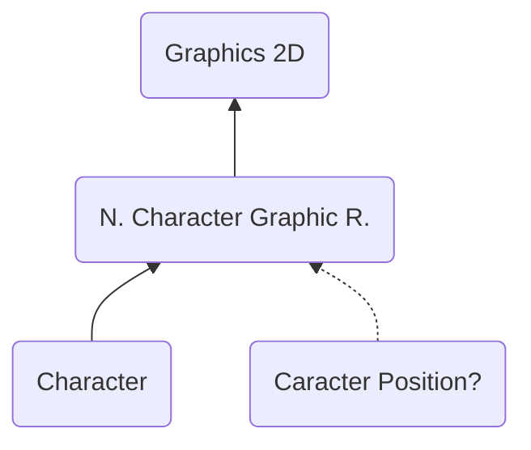

# NCGR ("RGCN") - Nitro Character Graphic Runtime
> Author(s): [Gonhex](https://github.com/Gonhex) <br />
> Research: (see sections)


The character graphic runtime holds the image data, usually in form of tiles. The image can be displayed directly or used as tile buffer for further processing as [screen map](file_nscr.md) or [cells](file_ncer.md).

## Table of Contents
* [Data Structure](#data-structure)
  * [File Container](#file-container)
* [Specification](#specification)
  * [Sections](#sections)

---
## Data Structure

### File Container
```c
struct ContainerFileNCGR
{
    /* 0x00   */ struct NitroFileHeader fileHeader;
    /* 0x10   */ struct ContainerSectionCHAR sectionDataCHAR;
    /* append */ struct ContainerSectionCPOS sectionDataCPOS; // optional
}; // entry size = fileHeader.lengthFile
```
| Field Name      | Description                                                                             | Data Type    |
|-----------------|-----------------------------------------------------------------------------------------|--------------|
| fileHeader      | Header of this file. `fileHeader.signature = "RGCN"`.                       | [NitroFileHeader](../nitro_overview.md#nitro-file-header) |
| sectionDataCHAR | Image data.                                                                 | [ContainerSectionCHAR](section_char.md#section-container) |
| sectionDataCPOS | Dimension related. Does only exist if `fileHeader.numberSections == 2`.     | [ContainerSectionCPOS](section_cpos.md#section-container) |

---
## Specification

### Sections
* [Character](section_char.md)
* [Character Position?](section_cpos.md)
