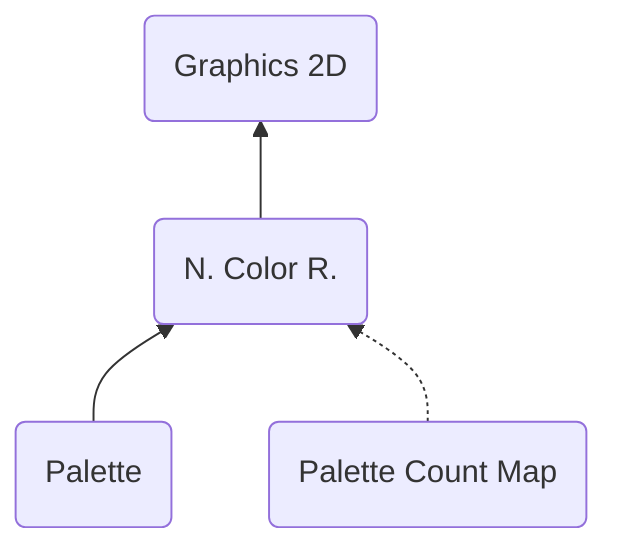

# NCLR ("RLCN") - Nitro Color Runtime
> Author(s): [Gonhex](https://github.com/Gonhex) <br />
> Research: (see sections)


The color runtime serves as base for all other 2D graphics components. It provides color palettes which are accessed via indexing. The count map (PCMP) is optional and sometimes used to limit the number of individual palettes. One palette can have either 16 or 256 colors. The number of colors is the same in all palettes of one file. 

## Table of Contents
* [Data Structure](#data-structure)
  * [File Container](#file-container)
* [Specification](#specification)
  * [Sections](#sections)

---
## Data Structure

### File Container
```c
struct ContainerFileNCLR
{
    /* 0x00   */ struct NitroFileHeader fileHeader;
    /* 0x10   */ struct ContainerSectionPLTT palette;
    /* append */ struct ContainerSectionPCMP countMap; // optional
}; // entry size = fileHeader.lengthFile
```
| Field Name      | Description                                                                             | Data Type    |
|-----------------|-----------------------------------------------------------------------------------------|--------------|
| fileHeader      | Header of this file. `fileHeader.signature = "RLCN"`.                       | [NitroFileHeader](../nitro_overview.md#nitro-file-header) |
| palette         | Palette color data.                                                         | [ContainerSectionPLTT](section_pltt.md#section-container) |
| countMap        | Palette count limiter. Does only exist if `fileHeader.numberSections == 2`. | [ContainerSectionPCMP](section_pcmp.md#section-container) |

---
## Specification

### Sections
* [Palette](section_pltt.md)
* [Palette Count Map](section_pcmp.md)
