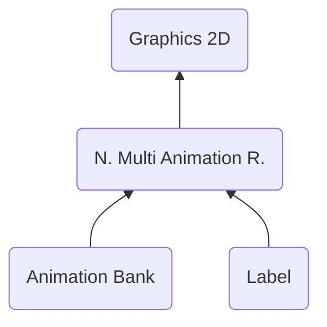

# NMAR ("RAMN") - Nitro Multi Animation Runtime
> Author(s): [Gonhex](https://github.com/Gonhex) <br />
> Research: (see sections)


The multi animation runtime works in the same way as the animation runtime does, but on multi cells. The animations on the individual cells are not effected.

## Table of Contents
* [Data Structure](#data-structure)
  * [File Container](#file-container)
* [Specification](#specification)
  * [Sections](#sections)

---
## Data Structure

### File Container
```c
struct ContainerFileNMAR
{
    /* 0x00   */ struct NitroFileHeader fileHeader;
    /* 0x10   */ struct ContainerSectionABNK sectionDataABNK;
    /* append */ struct ContainerSectionLABL sectionDataLABL;
}; // entry size = fileHeader.lengthFile
```
| Field Name      | Description                                                                             | Data Type    |
|-----------------|-----------------------------------------------------------------------------------------|--------------|
| fileHeader      | Header of this file. `fileHeader.signature = "RAMN"`.                       | [NitroFileHeader](../nitro_overview.md#nitro-file-header) |
| sectionDataABNK | Cell animation data.                                                        | [ContainerSectionABNK](section_abnk.md#section-container) |
| sectionDataLABL | Cell-name table.                                                            | [ContainerSectionLABL](section_labl.md#section-container) |

---
## Specification

### Sections
* [Animation Bank](section_abnk.md)
* [Label](section_labl.md)
