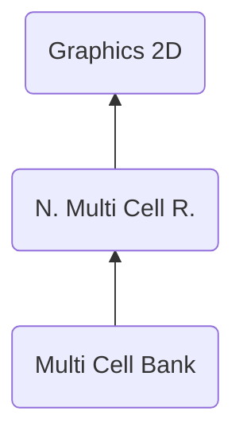

# NMCR ("RCMN") - Nitro Multi Cell Runtime
> Author(s): [Gonhex](https://github.com/Gonhex) <br />
> Research: (see sections)


The multi cell runtime combines multiple animated cells into objects. These can be animated again to allow more complex animations.

## Table of Contents
* [Data Structure](#data-structure)
  * [File Container](#file-container)
* [Specification](#specification)
  * [Sections](#sections)

---
## Data Structure

### File Container
```c
struct ContainerFileNMCR
{
    /* 0x00 */ struct NitroFileHeader fileHeader;
    /* 0x10 */ struct ContainerSectionMCBK sectionDataMCBK;
}; // entry size = fileHeader.lengthFile
```
| Field Name      | Description                                                                             | Data Type    |
|-----------------|-----------------------------------------------------------------------------------------|--------------|
| fileHeader      | Header of this file. `fileHeader.signature = "RCMN"`.                       | [NitroFileHeader](../nitro_overview.md#nitro-file-header) |
| sectionDataCEBK | Cell cluster data.                                                          | [ContainerSectionMCBK](section_mcbk.md#section-container) |

---
## Specification

### Sections
* [Multi Cell Bank](section_mcbk.md)
