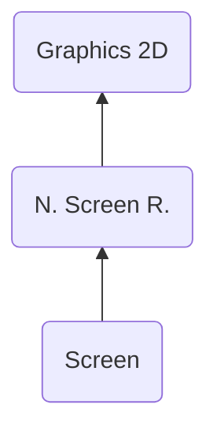

# NSCR ("RCSN") - Nitro Screen Runtime
> Author(s): [Gonhex](https://github.com/Gonhex) <br />
> Research: (see sections)


The screen runtime is used to rearrange the tiles of the character graphic on the screen. It also has the ability to flip tiles and change their palette index.

## Table of Contents
* [Data Structure](#data-structure)
  * [File Container](#file-container)
* [Specification](#specification)
  * [Sections](#sections)

---
## Data Structure

### File Container
```c
struct ContainerFileNSCR
{
    /* 0x00 */ struct NitroFileHeader fileHeader;
    /* 0x10 */ struct ContainerSectionCHAR sectionDataSCRN;
}; // entry size = fileHeader.lengthFile
```
| Field Name      | Description                                                                             | Data Type    |
|-----------------|-----------------------------------------------------------------------------------------|--------------|
| fileHeader      | Header of this file. `fileHeader.signature = "RCSN"`.                       | [NitroFileHeader](../nitro_overview.md#nitro-file-header) |
| sectionDataSCRN | Image data.                                                                 | [ContainerSectionSCRN](section_scrn.md#section-container) |

---
## Specification

### Sections
* [Screen](section_scrn.md)
