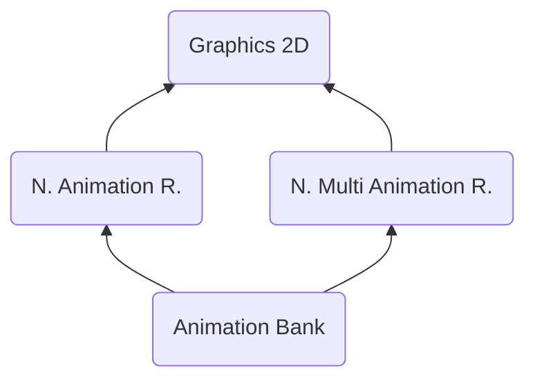

# ABNK ("KNBA") - Animation Bank
> Author(s): [Gonhex](https://github.com/Gonhex) <br />
> Research: [NOCASH](https://problemkaputt.de), [magical](https://github.com/magical), [Gonhex](https://github.com/Gonhex)


The animation bank is used to animate 2D graphics. It requires an object to work on, which can be either a cell bank or a multi cell bank. Internally it works like frame by frame animations. To achieve more dynamic results, affine transformations can be applied to selected frames.

## Table of Contents
* [Data Structure](#data-structure)
  * [Section Container](#section-container)
  * [ABNK Container](#abnk-container)
  * [Sequence](#sequence)
  * [Frame](#frame)
  * [FrameProperties](#frame-properties)
* [Specification](#specification)
  * [Animation](#animation)
  * [Loop Mode](#loop-mode)
  * [Affine Transformation](#affine-transformation)
  * [Files](#files)
* [TODO](#todo)

---
## Data Structure

### Section Container
```c
struct ContainerSectionABNK
{
    /* 0x0    */ struct NitroSectionHeader sectionHeader;
    /* 0x8    */ struct ContainerABNK sectionData;
}; // entry size = sectionHeader.lengthSection
```
| Field Name     | Description                                                                             | Data Type    |
|----------------|-----------------------------------------------------------------------------------------|--------------|
| sectionHeader  | Header of this section. `sectionHeader.signature = "KNBA"`.   | [NitroSectionHeader](../nitro_overview.md#nitro-section-header) |
| sectionData    | Content of this section.                                                                | [ContainerABNK](#abnk-container) |

### ABNK Container
```c
struct ContainerABNK
{
    // header
    /* 0x00 */ uint16_t numberSequences;
    /* 0x02 */ uint16_t numberFrames;
    /* 0x04 */ uint32_t offsetDataSequences;
    /* 0x08 */ uint32_t offsetDataFrame
    /* 0x0C */ uint32_t offsetDataFrameProperties;
    /* 0x10 */ uint32_t unknown0;
    /* 0x14 */ uint32_t unknown1;
    
    // data
    /* offsetDataSequences       */ struct Sequence dataSequences[numberSequences];
    /* offsetDataFrame           */ struct Frame dataFrames[numberFrames];
    /* offsetDataFrameProperties */ struct FrameProperties dataFrameProperties[?];
}; // entry size = sectionHeader.lengthSection - 0x8
```
| Field Name                | Description                                                                             | Data Type |
|---------------------------|-----------------------------------------------------------------------------------------|-----------|
| numberSequences           | Number of sequences.                                                                    | uint16_t  |
| numberFrames              | Number of frames.                                                                       | uint16_t  |
| offsetDataSequences       | Offset to the sequence data section relative to `ContainerABNK`.                        | uint32_t  |
| offsetDataFrame           | Offset to the frame data section relative to `ContainerABNK`.                           | uint32_t  |
| offsetDataFrameProperties | Offset to the frame property data section relative to `ContainerABNK`.                  | uint32_t  |
| unknown0                  | Unused offset?                                                                          | uint32_t  |
| unknown1                  | Unused offset?                                                                          | uint32_t  |
| dataSequences             | Animated object data.                                                                   | [Sequence[]](#sequence) |
| dataFrames                | Frame configuration data. Duration in frames and an index to the properties.            | [Frame[]](#frame) |
| dataFrameProperties       | Current (multi) cell index and affine transformation data, depends on the sequence.     | [FrameProperties[]](#frame-properties) |

### Sequence
```c
struct Sequence
{
    /* 0x0 */ uint32_t numberFrames;
    /* 0x4 */ uint16_t animationType;
    /* 0x6 */ uint16_t cellType;
    /* 0x8 */ uint32_t loopMode;
    /* 0xC */ uint32_t offsetFrame;
}; // entry size = 0x10
```
| Field Name    | Description                                                                             | Data Type |
|---------------|-----------------------------------------------------------------------------------------|-----------|
| numberFrames  | Refers to the count of [frame-blocks](#frame) used in this sequence.                    | uint32_t  |
| animationType | `0x0` = sequence, `0x1` = affine transform, `0x2` = translation.                        | uint16_t  |
| cellType      | `0x1` = unique cell, `0x2` = multi cell.                                                | uint16_t  |
| loopMode      | Behaviour of the frame sequence, values are documented in [Loop Mode](#loop-mode).      | uint32_t  |
| offsetFrame   | Offset to the first used frame, relative to `offsetDataFrame`.                          | uint32_t  |

### Frame
```c
struct Frame
{
    /* 0x0 */ uint32_t offsetProperties;
    /* 0x4 */ uint16_t durationInFrames;
    /* 0x6 */ int16_t unknown0;
}; // entry size = 0x8
```
| Field Name       | Description                                                                             | Data Type |
|------------------|-----------------------------------------------------------------------------------------|-----------|
| offsetProperties | Offset to the first used frame property, relative to `offsetDataFrameProperties`.       | uint32_t  |
| durationInFrames | Number of frames remaining in this state, 60 frames per second.                         | uint16_t  |
| unknown0         | Always `0xBEEF`.                                                                        | int16_t   |

### Frame Properties
```c
// if animationType == 0
struct FrameProperties
{
    /* 0x0 */ uint16_t cellIndex;
}; // entry size = 0x2

// if animationType == 1
struct FrameProperties
{
    /* 0x0 */ uint16_t cellIndex;
    /* 0x2 */ uint16_t rotate;
    /* 0x4 */ fx<1.19.12> scaleW;
    /* 0x8 */ fx<1.19.12> scaleH;
    /* 0xC */ int16_t translateX;
    /* 0xE */ int16_t translateY;
}; // entry size = 0x10

// if animationType == 2
struct FrameProperties
{
    /* 0x0 */ uint16_t cellIndex;
    /* 0x2 */ uint16_t unknown0;
    /* 0x4 */ int16_t translateX;
    /* 0x6 */ int16_t translateY;
}; // entry size = 0x8
```
| Field Name | Description                                                                             | Data Type |
|------------|-----------------------------------------------------------------------------------------|-----------|
| cellIndex  | Index of the displayed cell or multi cell block.                                        | uint16_t  |
| rotate     | Rotation angle, using the full range of uint16_t for one turn.                          | uint16_t  |
| unknown0   | Unused, `0x0` or `0xBEEF`.                                                              | uint16_t  |
| scaleW     | Width scaling factor.                                                                   | [fx<1.19.12>]() |
| scaleH     | Height scaling factor.                                                                  | [fx<1.19.12>]() |
| translateX | X position adjustment.                                                                  | int16_t   |
| translateY | Y position adjustment.                                                                  | int16_t   |

**Important:** The structs for `animationType > 0` must be DWORD aligned. If there is a region with an odd number of type-0 properties, a dummy entry is appended as padding.

---
## Specification

### Animation
To animate a sprite, three data blocks are required.
1. The entry point is the [sequence data](#sequence). This defines the gereral properties of a sequence. How many different frames are involved? Are transformations applied or does the animation only rely on changing images? This decision is applyed to all frames, which are part of the sequence.
2. The [frame data](#frame) tells, how long the image remains in this state. On a 60 fps system, setting it to 60 frames (`0x3C`) makes it last one second before switching to the next frame. It also points to an offset in the frame property data. To save memory, multiple frames can point to the same property offset.
3. The structure of the [frame properties](#frame-properties) depends on the `animationType` setting from the sequence data. If it is `== 0`, all it does is displaying the selected cell. If it is `== 2`, the position can also be changed. `animationType == 1` also adds scaling and rotation.

If the animation is applied to a normal cell bank, the image in each frame is static, meaning if one frame is set to remain for one second and the transformation is rotate 180°, the image will be displayed upside down for one second. If the animation is applied to multi cells, which already have animated parts, it will loop through the animations of the multi cell, while "being upside down".

### Loop Mode
The loop mode defines what to do, after the animation reached its last frame. There are four values, which can be used:
1. Stop animation at last frame.
2. Repeat animation after last frame.
3. Play frames backwards after reaching the last frame and stop at first frame.
4. Ping pong mode, repeat alternately forward and backward.

Other values are not supported and end up in the behavior of `1`.

### Affine Transformation
The transformation matrices are applied in the following order:
1. Scaling

$$
\begin{bmatrix}
 \textbf{scaleW} & 0               & 0 \\
 0               & \textbf{scaleH} & 0 \\
 0               & 0               & 1 \\
\end{bmatrix}
$$

2. Rotatating (adjust `rotate` first)

$$
\begin{bmatrix}
 cos(\textbf{rotate}) & -sin(\textbf{rotate}) & 0 \\
 sin(\textbf{rotate}) & cos(\textbf{rotate})  & 0 \\
 0                    & 0                     & 1 \\
\end{bmatrix}
$$

3. Translating

$$
\begin{bmatrix}
 1 & 0 & \textbf{translateX} \\
 0 & 1 & \textbf{translateY} \\
 0 & 0 & 1                   \\
\end{bmatrix}
$$

### Files
* [Nitro Animation Runtime](file_nanr.md)
* [Nitro Multi Animation Runtime](file_nmar.md)

---
## TODO
* Link fixed point definition
