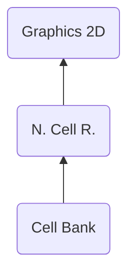

# CEBK ("KBEC") - Cell Bank
> Author(s): [Gonhex](https://github.com/Gonhex) <br />
> Research: [NOCASH](https://problemkaputt.de), [Gonhex](https://github.com/Gonhex)


The cell bank creates a number of cells by combining tiles and selecting a palette for each cell. It operates on dimensionless character graphics and is used in combination with the animation resource to display dynamic objects.

## Table of Contents
* [Data Structure](#data-structure)
  * [Section Container](#section-container)
  * [CEBK Container](#cebk-container)
  * [Cell Table](#cell-table)
  * [Cell](#cell)
* [Specification](#specification)
  * [Dimension Keys](#dimension-keys)
* [TODO](#todo)

---
## Data Structure

### Section Container
```c
struct ContainerSectionCEBK
{
    /* 0x0    */ struct NitroSectionHeader sectionHeader;
    /* 0x8    */ struct ContainerCEBK sectionData;
    /* append */ uint8_t paddingDWORD[?]
}; // entry size = sectionHeader.lengthSection
```
| Field Name     | Description                                                                             | Data Type    |
|----------------|-----------------------------------------------------------------------------------------|--------------|
| sectionHeader  | Header of this section. `sectionHeader.signature = "KBEC"`.   | [NitroSectionHeader](../nitro_overview.md#nitro-section-header) |
| sectionData    | Content of this section.                                                                | [ContainerCEBK](#cebk-container) |
| paddingDWORD   | Padding for DWORD alignment, if [LABL-sections](section_labl.md) follows.               | uint8_t[]    |

### CEBK Container
```c
struct ContainerCEBK
{
    // header
    /* 0x00 */ uint16_t numberCells;
    /* 0x02 */ uint16_t tableAttribute;
    /* 0x04 */ uint32_t offsetDataCellBank;
    /* 0x08 */ uint32_t sizeBoundary;
    /* 0x0C */ uint32_t unknown0;
    /* 0x10 */ uint32_t unknown1;
    /* 0x14 */ uint32_t unknown2;
    
    // data
    /* offsetDataCellBank */ struct CellTable dataTable[numberCells];
    /* offsetDataCellBank + numberCells * (8 << tableAttribute) */ struct Cell dataCell[?];
}; // entry size = sectionHeader.lengthSection - 0x8
```
| Field Name         | Description                                                                             | Data Type |
|--------------------|-----------------------------------------------------------------------------------------|-----------|
| numberCells        | Number of cells.                                                                        | uint16_t  |
| tableAttribute     | Extended [cell table](#cell-table), if `== 1`.                                          | uint16_t  |
| offsetDataCellBank | Offset to the cell table data section relative to `ContainerCEBK`.                      | uint32_t  |
| sizeBoundary       | Size boundary, `result = sizeBoundary << 6`.                                            | uint32_t  |
| unknown0           | Unused offset?                                                                          | uint32_t  |
| unknown1           | Unused offset?                                                                          | uint32_t  |
| unknown2           | Unused offset?                                                                          | uint32_t  |
| dataTable          | Cell configuration table.                                                               | [CellTable[]](#cell-table) |
| dataCell           | OAM cell data.                                                                          | [Cell[]](#cell) |

### Cell Table
```c
struct CellTable
{
    // header
    /* 0x0 */ uint16_t numberCellsOAM;
    /* 0x2 */ uint16_t unknown0;
    /* 0x4 */ uint32_t offsetCell;
// }; // entry size = 0x8, if tableAttribute == 0
    
    // optional, rename all
    /* 0x8 */ int16_t right;
    /* 0xA */ int16_t bottom;
    /* 0xC */ int16_t left;
    /* 0xE */ int16_t top;
}; // entry size = 0x10, if tableAttribute == 1
```
| Field Name         | Description                                                                             | Data Type |
|--------------------|-----------------------------------------------------------------------------------------|-----------|
| numberCellsOAM     | Number of OAM cells building this cell.                                                 | uint16_t  |
| unknown0           | What is this?                                                                           | uint16_t  |
| offsetCell         | Offset within OAM cell data.                                                            | uint32_t  |
| right              | TODO: rename and add description.                                                       | int16_t   |
| bottom             | TODO: rename and add description.                                                       | int16_t   |
| left               | TODO: rename and add description.                                                       | int16_t   |
| top                | TODO: rename and add description.                                                       | int16_t   |

### Cell
```c
struct Cell
{
    /* 0x0 */ uint16_t positionY : 8;          // 0b00000000'11111111
              uint16_t transformable : 1;      // 0b00000001'00000000
              uint16_t doubleSized : 1;        // 0b00000010'00000000
              uint16_t objectMode : 2;         // 0b00001100'00000000
              uint16_t mosaic : 1;             // 0b00010000'00000000
              uint16_t paletteMode : 1;        // 0b00100000'00000000
              uint16_t keyShape : 2;           // 0b11000000'00000000
    
    /* 0x2 */ uint16_t positionX : 9;          // 0b00000001'11111111
              uint16_t transformParameter : 3; // 0b00001110'00000000
              uint16_t horizontalFlip : 1;     // 0b00010000'00000000
              uint16_t verticalFlip : 1;       // 0b00100000'00000000
              uint16_t keySize : 2;            // 0b11000000'00000000
    
    /* 0x4 */ uint16_t tileIndex : 10;         // 0b00000011'11111111
              uint16_t priority : 2;           // 0b00001100'00000000
              uint16_t paletteIndex : 4;       // 0b11110000'00000000
}; // entry size = 0x6
```
| Field Name         | Description                                                                              | Data Type     |
|--------------------|------------------------------------------------------------------------------------------|---------------|
| positionY          | Y position, cast to a signed value.                                                      | uint16_t : 8  |
| transformable      | Enable flag for affine transformations.                                                  | uint16_t : 1  |
| doubleSized        | Double the size transformable. Not displayed if this flag is used without transformable. | uint16_t : 1  |
| objectMode         | `0` = normal, `1` = semi-transparent, `2` = OBJ window, `3` is not allowed.              | uint16_t : 2  |
| mosaic             | Enable mosaic.                                                                           | uint16_t : 1  |
| paletteMode        | Select type of the palette. `0`= 16 colors, `1` = 256 colors per palette.                | uint16_t : 1  |
| keyShape           | Shape: `0` = square, `1` = horizontal, `2` = vertical, `3` is not allowed. See [Dimension Keys](#dimension-keys) | uint16_t : 2  |
| positionX          | X position, cast to a signed value.                                                      | uint16_t : 9  |
| transformParameter | TODO: document this.                                                                     | uint16_t : 3  |
| horizontalFlip     | Flip horizontally, if enabled.                                                           | uint16_t : 1  |
| verticalFlip       | Flip vertically, if enabled.                                                             | uint16_t : 1  |
| keySize            | Used to get the size of the OAM cell, see [Dimension Keys](#dimension-keys).             | uint16_t : 2  |
| tileIndex          | Index of the tile selecten from the [character graphic](file_ncgr.md).                   | uint16_t : 10 |
| priority           | Display priority if overlapping. Lower value = higher priority.                          | uint16_t : 2  |
| paletteIndex       | Index of the palette used for this OAM cell.                                             | uint16_t : 4  |

---
## Specification

### Dimension Keys
The width and height of a cell is isn't defined directly. Instead it uses key values, which allow to reconstruct the size. For example if `keyShape == 0`, the cell will be a square which size depends on `keySize`. The dimenions can be converted using lookup tables.

#### Read dimensions
```c
const uint16_t tableSizeInTiles[4][4] = // [keyShape][keySize]
{
    { 1, 2, 4, 8 },
    { 2, 4, 4, 8 },
    { 1, 1, 2, 4 },
    { 1, 2, 3, 4 } // copy of row 0 for reversed index (3 - shape)
};

uint16_t getWidthInTiles()
{
    return tableSizeInTiles[keyShape][keySize];
}

uint16_t getHeightInTiles()
{
    return tableSizeInTiles[3 - keyShape][keySize];
}
```

#### Write dimensions
```c
const uint16_t tableShape[4][4] = // [width][height]
{   //h1 h2 h4 h8
    { 0, 2, 2, 0 },//w1
    { 1, 0, 2, 0 },//w2
    { 1, 1, 0, 2 },//w4
    { 0, 0, 1, 0 } //w8
};

const uint16_t tableSize[4][4] = // [width][height]
{   //h1 h2 h4 h8
    { 0, 0, 1, 0 },//w1
    { 0, 1, 2, 0 },//w2
    { 1, 2, 2, 3 },//w4
    { 0, 0, 3, 3 } //w8
};

void setSizeInTiles(uint16_t widthInTiles, uint16_t heightInTiles)
{
    const uint16_t width = (widthInTiles >= 8) ? 3 : (widthInTiles >> 1);
    const uint16_t height = (heightInTiles >= 8) ? 3 : (heightInTiles >> 1);
    
    keySize = tableSize[width][height];
    keyShape = tableShape[width][height];
}
```

---
## TODO
* Rename and document the entries of the extended cell table
* Document the transform parameters
* Research `unknown0` in cell table
