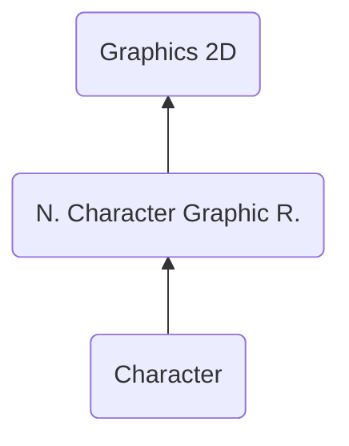

# CHAR ("RHAC") - Character
> Author(s): [Gonhex](https://github.com/Gonhex) <br />
> Research: [NOCASH](https://problemkaputt.de), [Gonhex](https://github.com/Gonhex)


The character section stores the sprite-image in form of indices to colors within a palette. The array layout is usually a tile map where each tile has a size of `8 * 8 pixels`, but can also be a line buffer which maps the image directly to the target.

## Table of Contents
* [Data Structure](#data-structure)
  * [Section Container](#section-container)
  * [CHAR Container](#char-container)
  * [Tile](#tile)
* [Specification](#specification)
  * [Dimensions](#dimensions)
  * [Mapping Type](#mapping-type)
  * [Flags](#flags)
  * [Special Case](#special-case)
  * [Files](#files)
* [TODO](#todo)
---

## Data Structure

### Section Container
```c
struct ContainerSectionCHAR
{
    /* 0x0 */ struct NitroSectionHeader sectionHeader;
    /* 0x8 */ struct ContainerCHAR sectionData;
}; // entry size = sectionHeader.lengthSection
```
| Field Name     | Description                                                                             | Data Type    |
|----------------|-----------------------------------------------------------------------------------------|--------------|
| sectionHeader  | Header of this section. `sectionHeader.signature = "RAHC"`.   | [NitroSectionHeader](../nitro_overview.md#nitro-section-header) |
| sectionData    | Content of this section.                                                                | [ContainerCHAR](#char-container) |

### CHAR Container
```c
struct ContainerCHAR
{
    // header
    /* 0x00 */ int16_t heightInTiles;
    /* 0x02 */ int16_t widthInTiles;
    /* 0x04 */ uint32_t pixelFormat;
    /* 0x08 */ uint16_t mappingType0;
    /* 0x0A */ uint16_t mappingType1;
    /* 0x0C */ uint32_t flags;
    /* 0x10 */ uint32_t lengthDataImage;
    /* 0x14 */ uint32_t offsetDataImage;
    
    // data
    /* 0x18 */ struct Tile dataImage[heightInTiles * widthInTiles];
}; // entry size = lengthDataImage + offsetDataImage
```
| Field Name      | Description                                                                             | Data Type |
|-----------------|-----------------------------------------------------------------------------------------|-----------|
| heightInTiles   | Height of the sprite or `-1`, see [Dimensions](#dimensions).                            | int16_t   |
| widthInTiles    | Width of the sprite or `-1`, see [Dimensions](#dimensions).                             | int16_t   |
| pixelFormat     | `== 3`: 4 bits per pixel. `== 4`: 8 bits per pixel.                                     | uint32_t  |
| mappingType0    | `== 0`: 2D mapping, else: 1D mapping(?).                                                | uint16_t  |
| mappingType1    | Sometimes used in combination with `mappingType0`(?).                                   | uint16_t  |
| flags           | Binary flags for different purposes. See [Flags](#flags).                               | uint32_t  |
| lengthDataImage | Length of the image data section in bytes.                                              | uint32_t  |
| offsetDataImage | Offset to the image data section relative to `ContainerCHAR`.                           | uint32_t  |
| dataImage       | Array holding all color indices to create an image.                                     | [Tile[]](#tile) |

### Tile
```c
struct Tile
{
    union
    {
        struct
        {
            /* 0x00 */ uint8_t lsn : 4;
                       uint8_t msn : 4;
        } /* 0x00 */ nibble;
        /* 0x00 */ uint8_t byte;
    } /* 0x00 */ indices[4 << pixelFormat];
}; // entry size = 4 << pixelFormat
```
| Field Name | Description                                                                             | Data Type |
|------------|-----------------------------------------------------------------------------------------|-----------|
| nibble     | If `pixelFormat == 3`, index on 16-color palette.                                       | struct{uint8_t : 4, uint8_t : 4}   |
| byte       | If `pixelFormat == 4`, index on 256-color palette.                                      | uint8_t   |
| indices    | Array of pixel-indices in one tile.                                                     | uint8_t[] |

---
## Specification

### Dimensions
The first two entries of [ContainerCHAR](#char-container) define the size of the sprite in tiles. To get the pixel values, multiply them with the side length of a tile (which is 8).

$$
\begin{align}
    height_{pixel} &= heigh_{tiles}\cdot 8\\
    width_{pixel} &= width_{tiles}\cdot 8
\end{align}
$$

Sometimes the width and height values are both set to `-1`. In this case the image itself has no size and the [CPOS section](section_cpos.md) is not part of the file. To display the sprite anyway, a width of four tiles often makes the image recognizable. The real image is constructed by the [cell resource](file_ncer.md), which picks the needed tiles and positions them.

### Mapping Type
These values are `0`, if the image uses 2D mapping (positive values in `heightInTiles` an `widhtInTiles`). Both dimension values `== -1` indicate 1D mapping. In this case `mappingType0` usually has a value like `0x10`. In the most cases, the [cell resource](file_ncer.md) indexes 1D mapped tiles.

### Flags
Apply properties to the sprite.
* `(flags & 0x00000001) > 0`: Use a line buffer instead of tiles.
* `(flags & 0x00000100) > 0`: Unknown. Maybe related to [Mapping Type](#mapping-type)?

### Special Case
There are sprites, which seem to breake some rules of the format. It looks like it applies to images with a width, that is not a power of two. Examples are the trainer and pokemon preview sprites in generation V games, which have a size of `10 * 10 tiles` for trainers and `12 * 12 tiles` for pokemon. There are three issues with these sprites:

#### 1. File length
The length specified in the [headers (both, file and section)](../nitro_overview.md) of the file/section does not match the actual length of the file/section. Instead, it assumes the image had side lengths of the next higher power-of-two-values.

#### 2. Missing CPOS section
Normally, if the image has a size, there should also be a [CPOS section](section_cpos.md) available within the file. Here this is not the case. Might be related to the wrong file length.

#### 3. Image layout
The tiles are not places line by line. Instead, it looks like the the largest square with power-of-two side lengths that fits into the image constrains is calculated and placed at the top left corner. Then, this process repeats with the remaining size making the comming squares smaller. Following figure illustrates this whith one `10 * 10 tiles` example (top) and one `12 * 12 tiles` (bottom):


### Files
* [Nitro Character Graphic Resource](file_ncgr.md)

---
## TODO
* Research and document "mappingType"
