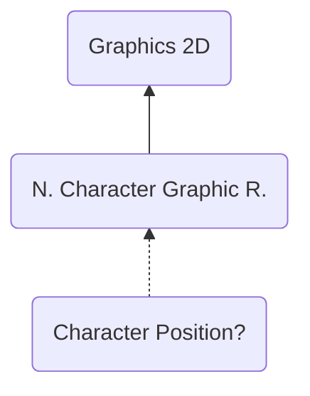

# CPOS ("SOPC") - (Character Position?)
> Author(s): [Gonhex](https://github.com/Gonhex) <br />
> Research: [NOCASH](https://problemkaputt.de)


This section does only exist, if the character image has a specified size. The purpose is not clear.

## Table of Contents
* [Data Structure](#data-structure)
  * [Section Container](#section-container)
  * [CPOS Container](#cpos-container)
* [Specification](#specification)
  * [Files](#files)

---
## Data Structure

### Section Container
```c
struct ContainerSectionCPOS
{
    /* 0x0 */ struct NitroSectionHeader sectionHeader;
    /* 0x8 */ struct ContainerCPOS sectionData;
}; // entry size = sectionHeader.lengthSection
```
| Field Name     | Description                                                                             | Data Type    |
|----------------|-----------------------------------------------------------------------------------------|--------------|
| sectionHeader  | Header of this section. `sectionHeader.signature = "SOPC"`.   | [NitroSectionHeader](../nitro_overview.md#nitro-section-header) |
| sectionData    | Content of this section.                                                                | [ContainerCPOS](#cpos-container) |

### CPOS Container
```c
struct ContainerCPOS
{
    // header
    /* 0x0 */ uint32_t padding0;
    /* 0x4 */ uint16_t widthInTiles;
    /* 0x6 */ uint16_t heightInTiles;
    
    // data
    // ...empty
}; // entry size = 0x8
```
| Field Name      | Description                                                                                                          | Data Type |
|-----------------|----------------------------------------------------------------------------------------------------------------------|-----------|
| padding0        | Always `0`.                                                                                                          | uint32_t  |
| widthInTiles    | Same as [ContainerCHAR::widthInTiles](section_char.md#char-container) or next higher base-2 value. Size boundaries?  | uint16_t  |
| heightInTiles   | Same as [ContainerCHAR::heightInTiles](section_char.md#char-container) or next higher base-2 value. Size boundaries? | uint16_t  |

---
## Specification

### Files
* [Nitro Character Graphic Runtime](file_ncgr.md)