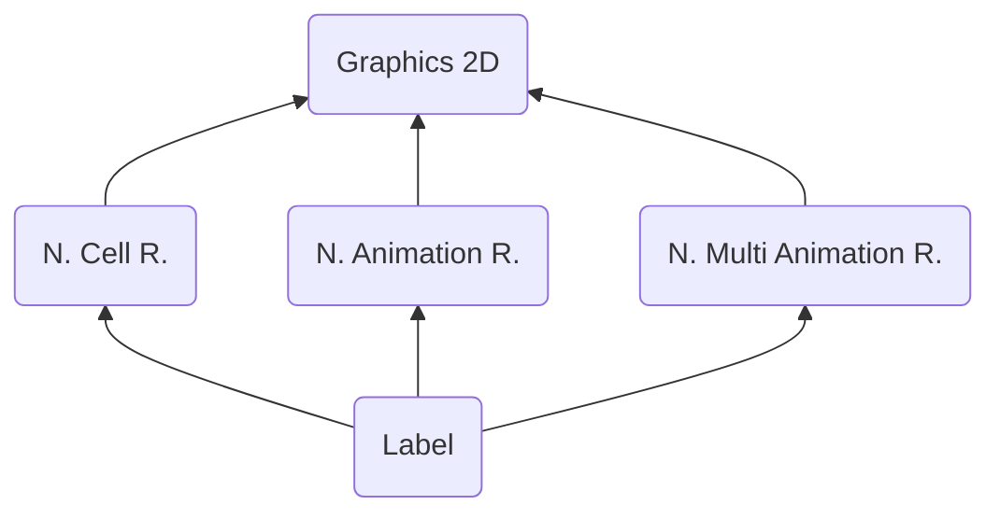

# LABL ("LBAL") - Label
> Author(s): [Gonhex](https://github.com/Gonhex) <br />
> Research: [NOCASH](https://problemkaputt.de)


Gives names to all cells or objects.

## Table of Contents
* [Data Structure](#data-structure)
  * [Section Container](#section-container)
  * [LABL Container](#labl-container)
* [Specification](#specification)
  * [Files](#files)

---
## Data Structure

### Section Container
```c
struct ContainerSectionLABL
{
    /* 0x0 */ struct NitroSectionHeader sectionHeader;
    /* 0x8 */ struct ContainerLABL sectionData;
}; // entry size = sectionHeader.lengthSection
```
| Field Name     | Description                                                                             | Data Type    |
|----------------|-----------------------------------------------------------------------------------------|--------------|
| sectionHeader  | Header of this section. `sectionHeader.signature = "LBAL"`.   | [NitroSectionHeader](../nitro_overview.md#nitro-section-header) |
| sectionData    | Content of this section.                                                                | [ContainerLABL](#labl-container) |

### LABL Container
```c
struct ContainerLABL
{
    // header
    // ...empty
    
    // data
    /* 0x0    */ uint32_t dataOffsetTable[numberLabels];
    /* append */ uint8_t* dataLabel[numberLabels];
}; // entry size = sectionHeader.lengthSection - 0x8
```
| Field Name      | Description                                                                             | Data Type  |
|-----------------|-----------------------------------------------------------------------------------------|------------|
| dataOffsetTable | Offset to the start of a string. Relative to `dataLabel`.                               | uint32_t[] |
| dataLabel       | UTF-8 text-string, zero-terminated.                                                     | uint8_t*[] |

---
## Specification

### Files
* [Nitro Cell Runtime](file_ncer.md)
* [Nitro Animation Runtime](file_nanr.md)
* [Nitro Multi Animation Runtime](file_nmar.md)