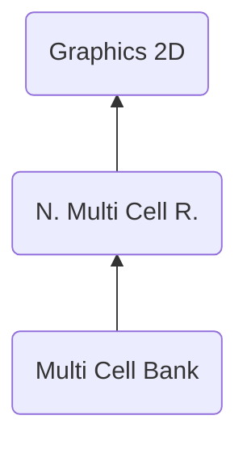

# MCBK ("KBCM") - Multi Cell Bank
> Author(s): [Gonhex](https://github.com/Gonhex) <br />
> Research: [Gonhex](https://github.com/Gonhex)


The multi cell bank combines multiple animated cells into cluster. This allows more complex animations by grouping related sequences into one unit. 

## Table of Contents
* [Data Structure](#data-structure)
  * [Section Container](#section-container)
  * [MCBK Container](#mcbk-container)
  * [Multi Cell](#multi-cell)
  * [Multi Cell Properties](#multi-cell-properties)
* [Specification](#specification)
  * [Frame Mode](#frame-mode)
  * [Files](#files)

---
## Data Structure

### Section Container
```c
struct ContainerSectionMCBK
{
    /* 0x0 */ struct NitroSectionHeader sectionHeader;
    /* 0x8 */ struct ContainerMCBK sectionData;
}; // entry size = sectionHeader.lengthSection
```
| Field Name     | Description                                                                             | Data Type    |
|----------------|-----------------------------------------------------------------------------------------|--------------|
| sectionHeader  | Header of this section. `sectionHeader.signature = "KBCM"`.   | [NitroSectionHeader](../nitro_overview.md#nitro-section-header) |
| sectionData    | Content of this section.                                                                | [ContainerMCBK](#mcbk-container) |

### MCBK Container
```c
struct ContainerMCBK
{
    // header
    /* 0x00 */ uint16_t numberMultiCells;
    /* 0x02 */ uint16_t unknown0;
    /* 0x04 */ uint32_t offsetDataMultiCell;
    /* 0x08 */ uint32_t offsetDataMultiCellProperties;
    /* 0x0C */ uint32_t unknown1;
    /* 0x10 */ uint32_t unknown2;
    
    // data
    /* offsetMultiCell           */ struct MultiCell dataMultiCell[numberMultiCells];
    /* offsetMultiCellProperties */ struct MultiCellProperties dataMultiCellProperties[?];
}; // entry size = sectionHeader.lengthSection - 0x8
```
| Field Name                    | Description                                                                             | Data Type |
|-------------------------------|-----------------------------------------------------------------------------------------|-----------|
| numberMultiCells              | Number of multi cell objects.                                                           | uint16_t  |
| unknown0                      | Always `0xBEEF`.                                                                        | uint16_t  |
| offsetDataMultiCell           | Offset to the multi cell data section relative to `ContainerMCBK`.                      | uint32_t  |
| offsetDataMultiCellProperties | Offset to the multi cell property data section relative to `ContainerMCBK`.             | uint32_t  |
| unknown1                      | Unused offset?                                                                          | uint32_t  |
| unknown2                      | Unused offset?                                                                          | uint32_t  |
| dataMultiCell                 | Multi cell configuration table.                                          | [MultiCell](#multi-cell) |
| dataMultiCellProperties       | Cell selection and placement data.                  | [MultiCellProperties](#multi-cell-properties) |

### Multi Cell
```c
struct MultiCell
{
    /* 0x0 */ uint16_t numberDisplayedCells;
    /* 0x2 */ uint16_t numberLoadedCells;
    /* 0x4 */ uint32_t offsetData;
}; // entry size = 0x8
```
| Field Name           | Description                                                                             | Data Type |
|----------------------|-----------------------------------------------------------------------------------------|-----------|
| numberDisplayedCells | Number of visible multi cells.                                                          | uint16_t  |
| numberLoadedCells    | Number of multi cells within the buffer.                                                | uint16_t  |
| offsetData           | Offset of the multi cell relative to [MultiCell](#multi-cell).                          | uint32_t  |

### Multi Cell Properties
```c
struct MultiCellProperties
{
    /* 0x0 */ uint16_t indexSequence;
    /* 0x2 */ int16_t translateX;
    /* 0x4 */ int16_t translateY;
    /* 0x6 */ uint8_t frameMode;
    /* 0x7 */ uint8_t uniqueID;
}; // entry size = 0x8
```
| Field Name        | Description                                                                                  | Data Type |
|-------------------|----------------------------------------------------------------------------------------------|-----------|
| indexSequence     | Selects a sequence from the animation runtime.                                               | uint16_t  |
| translateX        | X translation of the animated base.                                                          | int16_t   |
| translateY        | Y translation of the animated base.                                                          | int16_t   |
| frameMode         | Behavior of the frame counter, if cell is temporary unloaded, see [Frame Mode](#frame-mode). | uint8_t   |
| uniqueID          | Local multi cell index starting by `0`. No duplicates allowed.                               | uint8_t   |

---
## Specification

### Frame Mode
Defines the behavior of a sequence if the displayed multicell changes.
* `0x20`: Reset the frame counter. The sequence will start from the beginning after the multicell regains focus.
* `0x21`: Continue counting. The sequence will continue counting frames even if the multicell lost focus, no restart after regaining it.

This value is probably a bitfield. This would explain the leading `2` which implies an always enabled flag.

### Files
* [Nitro Multi Cell Runtime](file_nmcr.md)
