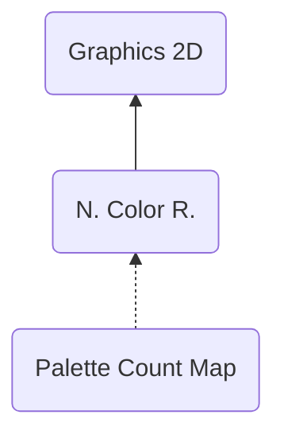

# PCMP ("PMCP") - Palette Compression
> Author(s): [Gonhex](https://github.com/Gonhex) <br />
> Research: [NOCASH](https://problemkaputt.de)

The palette compression is an optional component for the color runtime. It reduces the number of palettes, if the palette section allows 16 of them. Useful to save memory but not often used.

## Table of Contents
* [Data Structure](#data-structure)
  * [Section Container](#section-container)
  * [PCMP Container](#pcmp-container)
* [Specification](#specification)
  * [Files](#files)
---

## Data Structure

### Section Container
```c
struct ContainerSectionPCMP
{
    /* 0x0 */ struct NitroSectionHeader sectionHeader;
    /* 0x8 */ struct ContainerPCMP sectionData;
}; // entry size = sectionHeader.lengthSection
```
| Field Name     | Description                                                                             | Data Type    |
|----------------|-----------------------------------------------------------------------------------------|--------------|
| sectionHeader  | Header of this section. `sectionHeader.signature = "PMCP"`.   | [NitroSectionHeader](../nitro_overview.md#nitro-section-header) |
| sectionData    | Content of this section.                                                                | [ContainerPCMP](#pcmp-container) |

### PCMP Container
```c
struct ContainerPCMP
{
    // header
    /* 0x0 */ uint16_t numberPalettes;
    /* 0x2 */ uint16_t unknown0;
    /* 0x4 */ uint32_t offsetDataIndices;
    
    // data
    /* offsetDataIndices */ uint16_t dataIndices[numberPalettes];
}; // entry size = numberPalettes * 2 + offsetDataIndices
```
| Field Name        | Description                                                                             | Data Type  |
|-------------------|-----------------------------------------------------------------------------------------|------------|
| numberPalettes    | Limits the number of palettes used in the [PLTT section](section_pltt.md).              | uint16_t   |
| unknown0          | Always `0xBEEF`.                                                                        | uint16_t   |
| offsetDataIndices | Offset to the index table relative to `ContainerPCMP`.                                  | uint32_t   |
| dataIndices       | Index table, incrementing from `0`. The data may have no effect on the palettes.        | uint16_t[] |

---
## Specification

### Files
* [Nitro Color Runtime](file_nclr.md)
