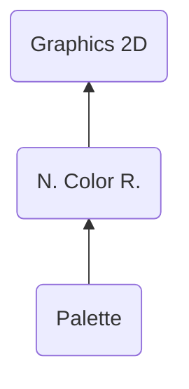

# PLTT ("TTLP") - Palette
> Author(s): [Gonhex](https://github.com/Gonhex) <br />
> Research: [NOCASH](https://problemkaputt.de), [Gonhex](https://github.com/Gonhex)


The palette section holds a table with all colors used in the sprite(s). The color information is squeezed into one WORD resulting in five bits per component (r, g, b) and one unused bit.

## Table of Contents
* [Data Structure](#data-structure)
  * [Section Container](#section-container)
  * [PLTT Container](#pltt-container)
  * [Palette](#palette)
  * [Color RGB5](#color-rgb5)
* [Specification](#specification)
  * [Palette Dimension Configuration](#palette-dimension-configuration)
  * [Files](#files)

---
## Data Structure

### Section Container
```c
struct ContainerSectionPLTT
{
    /* 0x0 */ struct NitroSectionHeader sectionHeader;
    /* 0x8 */ struct ContainerPLTT sectionData;
}; // entry size = sectionHeader.lengthSection
```
| Field Name     | Description                                                                             | Data Type    |
|----------------|-----------------------------------------------------------------------------------------|--------------|
| sectionHeader  | Header of this section. `sectionHeader.signature = "TTLP"`.   | [NitroSectionHeader](../nitro_overview.md#nitro-section-header) |
| sectionData    | Content of this section.                                                                | [ContainerPLTT](#pltt-container) |


### PLTT Container
```c
struct ContainerPLTT
{
    // header
    /* 0x0 */ uint64_t dimensions;
    /* 0x8 */ uint32_t lengthDataColor;
    /* 0xC */ uint32_t offsetDataColor;
    
    // data
    /* offsetDataColor */ struct Palette dataPalette[numberPalettes];
}; // entry size = lengthDataColor + offsetDataColor
```
| Field Name      | Description                                                                             | Data Type |
|-----------------|-----------------------------------------------------------------------------------------|-----------|
| dimensions      | Palette configuration. Defines the max number of palettes and colors per palette.       | [uint64_t](#palette-dimension-configuration) |
| lengthDataColor | Length of the color data section in bytes.                                              | uint32_t  |
| offsetDataColor | Offset to the color data section relative to `ContainerPLTT`.                           | uint32_t  |
| dataPalette     | Array of palettes holding the colors. `numberPalettes` can be everything from `1` to `16`. | [Palette[]](#palette) |

### Palette
```c
struct Palette
{
    /* 0x0 */ struct ColorRGB5 color[numberColors];
}; // entry size = numberColors * 2
```
| Field Name     | Description                                                                             | Data Type    |
|----------------|-----------------------------------------------------------------------------------------|--------------|
| color          | Array of compressed RGB colors. `numberColors` is either `0x10 = 16`, or `0x100 = 256`. | [ColorRGB5[]](#color-rgb5) |

### Color RGB5
```c
struct ColorRGB5
{
    /* 0x00 */ uint16_t red : 5;   // 0b00000000'00011111
               uint16_t green : 5; // 0b00000011'11100000
               uint16_t blue : 5;  // 0b01111100'00000000
}; // entry size = 0x2
```
| Field Name     | Description                                                                             | Data Type    |
|----------------|-----------------------------------------------------------------------------------------|--------------|
| red            | Red color component, `uint8_t displayRed = red << 3;`.                                  | uint16_t : 5 |
| green          | Green color component, `uint8_t displayGreen = green << 3;`.                            | uint16_t : 5 |
| blue           | Blue color component, `uint8_t displayBlue = blue << 3;`.                               | uint16_t : 5 |

---
## Specification

### Palette Dimension Configuration

The first eight bytes in [ContainerPLTT](#pltt-container) are marked as `dimensions`. This is related to the number and size of the palettes within this PLTT section. Since the result of reading the raw value is not clear, an enumeration type has been defined:
```c
enum DimensionPalette : uint64_t
{
    PALETTE1_COLOR16 = 0x00000000'000A0004ULL,  // 1 palette, 16 colors
    PALETTE1_COLOR256 = 0x00000000'00000004ULL, // 1 palette, 256 colors
    PALETTE16_COLOR16 = 0x00000000'00000003ULL, // max. 16 palettes, 16 colors
    PALETTE16_COLOR256 = 0x00000001'00000004ULL // max. 16 palettes, 256 colors
};
```
This serves as a lookup table with four possible values. The number of colors per palette is set to either 16 or 256. The number of palettes can be limited to a lower value by the [count map](section_pcmp.md), if it is set to 16.

### Files
* [Nitro Color Runtime](file_nclr.md)