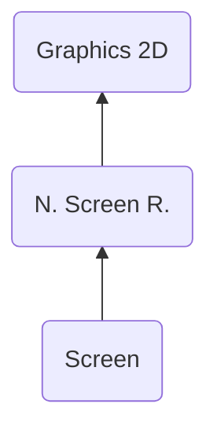

# SCRN ("NRCS") - Screen
> Author(s): [Gonhex](https://github.com/Gonhex) <br />
> Research: [NOCASH](https://problemkaputt.de)


The screen section, also known as tile map, is used to create an image by rearranging and flipping tiles. Each position on the raster gets one. This can save a lot of memory since duplicated tiles can be avoided.

## Table of Contents
* [Data Structure](#data-structure)
  * [Section Container](#section-container)
  * [SCRN Container](#scrn-container)
  * [Tile Properties](#tile-properties)
* [Specification](#specification)
  * [Files](#files)

---
## Data Structure

### Section Container
```c
struct ContainerSectionSCRN
{
    /* 0x0 */ struct NitroSectionHeader sectionHeader;
    /* 0x8 */ struct ContainerSCRN sectionData;
}; // entry size = sectionHeader.lengthSection
```
| Field Name     | Description                                                                             | Data Type    |
|----------------|-----------------------------------------------------------------------------------------|--------------|
| sectionHeader  | Header of this section. `sectionHeader.signature = "NRCS"`.   | [NitroSectionHeader](../nitro_overview.md#nitro-section-header) |
| sectionData    | Content of this section.                                                                | [ContainerSCRN](#scrn-container) |

### SCRN Container
```c
struct ContainerSCRN
{
    // header
    /* 0x0 */ uint16_t widthInPixel;
    /* 0x2 */ uint16_t heightInPixel;
    /* 0x4 */ uint16_t unknown0;
    /* 0x6 */ uint16_t unknown1;
    /* 0x8 */ uint32_t lengthDataScreen;
    
    // data
    /* 0xC */ struct TileProperties dataScreen[widthInPixel >> 3][heightInPixel >> 3];
}; // entry size = 0xC + lengthDataScreen
```
| Field Name       | Description                                                                             | Data Type |
|------------------|-----------------------------------------------------------------------------------------|-----------|
| widthInPixel     | Width of the image in pixel.                                                            | uint16_t  |
| heightInPixel    | Height of the image in pixel.                                                           | uint16_t  |
| unknown0         | Unused mode?                                                                            | uint16_t  |
| unknown1         | Unused mode?                                                                            | uint16_t  |
| lengthDataScreen | Length of the screen data section in bytes.                                             | uint32_t  |
| dataScreen       | Two-dimensional tile map to create an image by indexing and flipping tiles.   | [TileProperties[][]](#tile-properties) |

### Tile Properties
```c
struct TileProperties
{
    /* 0x0 */ uint16_t tileIndex : 10;     // 0b00000011'11111111
              uint16_t horizontalFlip : 1; // 0b00000100'00000000
              uint16_t verticalFlip : 1;   // 0b00001000'00000000
              uint16_t paletteIndex : 4;   // 0b11110000'00000000
}; // entry size = 0x2
```
| Field Name     | Description                                                                             | Data Type |
|----------------|-----------------------------------------------------------------------------------------|-----------|
| tileIndex      | Index of the tile (8x8 pixel image) within the [character graphic](file_ncgr.md).       | uint16_t  |
| horizontalFlip | Flip/mirror tile horizontally.                                                          | uint16_t  |
| verticalFlip   | Flip/mirror tile vertically.                                                            | uint16_t  |
| paletteIndex   | Index of the palette used for this tile.                                                | uint16_t  |

---
## Specification

### Files
* [Nitro Screen Runtime](file_nscr.md)
