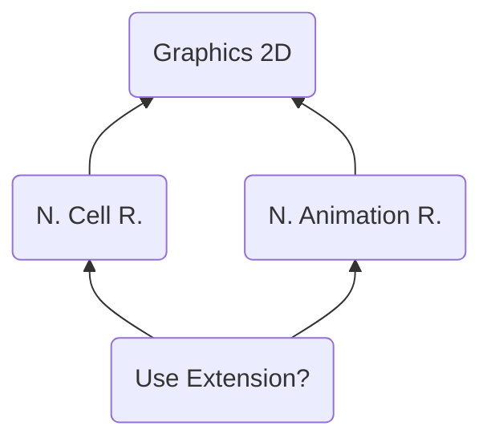

# UEXT ("TXEU") - (Use Extension?)
> Author(s): [Gonhex](https://github.com/Gonhex) <br />
> Research: [NOCASH](https://problemkaputt.de)


Holds a value which tells, if a "multi-version" of the cell or animation runtime will be applied.

## Table of Contents
* [Data Structure](#data-structure)
  * [Section Container](#section-container)
  * [UEXT Container](#uext-container)
* [Specification](#specification)
  * [Files](#files)

---
## Data Structure

### Section Container
```c
struct ContainerSectionUEXT
{
    /* 0x0 */ struct NitroSectionHeader sectionHeader;
    /* 0x8 */ struct ContainerUEXT sectionData;
}; // entry size = sectionHeader.lengthSection
```
| Field Name     | Description                                                                             | Data Type    |
|----------------|-----------------------------------------------------------------------------------------|--------------|
| sectionHeader  | Header of this section. `sectionHeader.signature = "TXEU"`.   | [NitroSectionHeader](../nitro_overview.md#nitro-section-header) |
| sectionData    | Content of this section.                                                                | [ContainerUEXT](#uext-container) |

### UEXT Container
```c
struct ContainerUEXT
{
    // header
    // ...empty
    
    // data
    /* 0x0 */ uint32_t extended; // or is it one byte + padding?
}; // entry size = 0x4
```
| Field Name      | Description                                                                             | Data Type |
|-----------------|-----------------------------------------------------------------------------------------|-----------|
| extended        | Enable multicell?                                                                       | uint32_t  |

---
## Specification

### Files
* [Nitro Cell Runtime](file_ncer.md)
* [Nitro Animation Runtime](file_nanr.md)