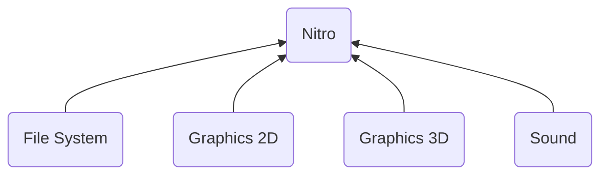
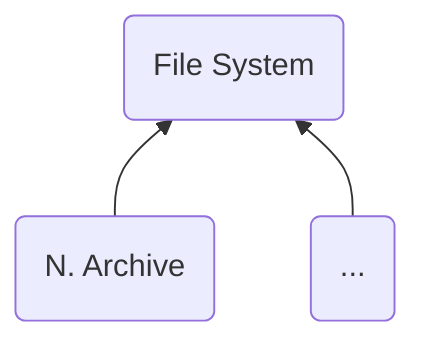
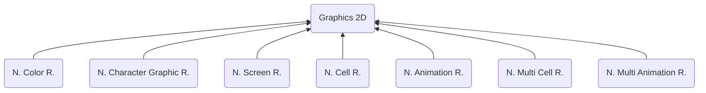
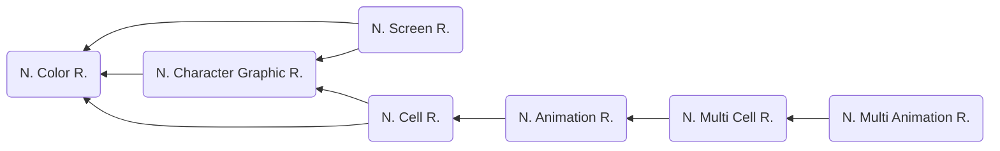
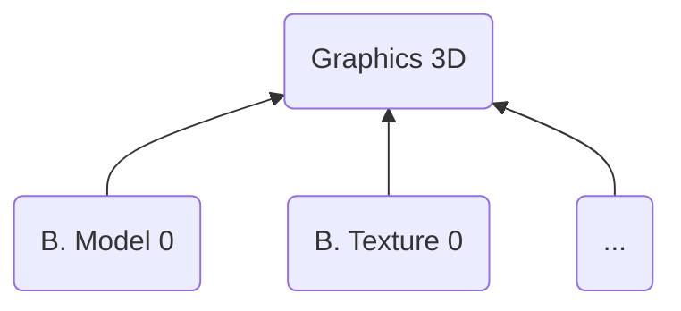
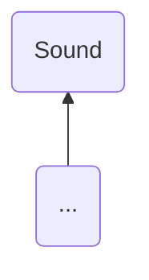

# Nintendo Nitro Binary - Overview
> Author(s): [Gonhex](https://github.com/Gonhex) <br />
> Research: [NOCASH](https://problemkaputt.de), various


The Nintendo DS provides a set of data structures for fast memory access. These are used by the Pokemon main line games among others and can be grouped into different categories, see flowchart above. This documentation aims to provide information about the nitro system in an easily accessible way. Please note that the data is based on reverse engineering by various people and therefore mistakes can not be ruled out.

## Table of Contents
* [Data Structure](#data-structure)
  * [Nitro File Header](#nitro-file-header)
  * [Nitro Section Header](#nitro-section-header)
* [Specification](#specification)
  * [File System](#file-system)
  * [Graphics 2D](#graphics-2d)
  * [Graphics 3D](#graphics-3d)
  * [Sound](#sound)
* [TODO](#todo)
---

## Data Structure
All nitro binaries follow a specific pattern and can be divided into two groups: files and sections. The data is defined in sections while files represent a collection of sections. This way the same type of data can be used by different files. All formats of one group share the same header.

### Nitro File Header
```c
struct NitroFileHeader
{
    /* 0x0 */ uint8_t signature[4];
    /* 0x4 */ uint16_t byteOrderMark;
    /* 0x6 */ uint8_t versionMinor;
    /* 0x7 */ uint8_t versionMajor;
    /* 0x8 */ uint32_t lengthFile;
    /* 0xC */ uint16_t lengthHeader;
    /* 0xE */ uint16_t numberSections;
}; // entry size = 0x10
```
| Field Name     | Description                                                                             | Data Type |
|----------------|-----------------------------------------------------------------------------------------|-----------|
| signature      | Identify type of data content.                                                          | uint8_t[] |
| byteOrderMark  | Defines the byte order as UTF-16 character.                                             | uint16_t  |
| versionMinor   | Minor nitro version number (fraction of the number). `Major.Minor`                      | uint8_t   |
| versionMajor   | Major nitro version number (integer of the number). `Major.Minor`                       | uint8_t   |
| lengthFile     | Length of the nitro file, including all sections.                                       | uint32_t  |
| lengthHeader   | Length of this header, always `0x10`.                                                   | uint16_t  |
| numberSections | Number of sections within this file.                                                    | uint16_t  |

### Nitro Section Header
```c
struct NitroSectionHeader
{
    /* 0x0 */ uint8_t signature[4];
    /* 0x4 */ uint32_t lengthSection;
}; // entry size = 0x8
```
| Field Name     | Description                                                                             | Data Type |
|----------------|-----------------------------------------------------------------------------------------|-----------|
| signature      | Identify type of data content.                                                          | uint8_t[] |
| lengthSection  | Length of the nitro section.                                                            | uint32_t  |

---
## Specification

### File System

TODO: Some words about the file system.
* [NARC - Nitro Archive](file_system/file_narc.md)

### Graphics 2D

Two-dimensional graphics are processed as tiles. These are squared bitmaps with a side length of eight pixels. Depending on the required behavior of a sprite there are several files involved. One file alone is not enough to display a graphic. The dependencies are as follows:

Unlike in other nitro formats the signatures of the 2D files and sections are reversed. I.e. instead of `"NCLR"`, `"RLCN"` is used.
* [NCLR ("RLCN") - Nitro Color Runtime](graphics_2d/file_nclr.md)
* [NCGR ("RGCN") - Nitro Character Graphic Runtime](graphics_2d/file_ncgr.md)
* [NSCR ("RCSN") - Nitro Screen Runtime](graphics_2d/file_nscr.md)
* [NCER ("RECN") - Nitro Cell Runtime](graphics_2d/file_ncer.md)
* [NANR ("RNAN") - Nitro Animation Runtime](graphics_2d/file_nanr.md)
* [NMCR ("RCMN") - Nitro Multi Cell Runtime](graphics_2d/file_nmcr.md)
* [NMAR ("RAMN") - Nitro Multi Animation Runtime](graphics_2d/file_nmar.md)

### Graphics 3D

TODO: Some words about 3D graphics.
* [BMD0 - Binary Model 0](graphics_3d/file_bmd0.md)
* [BTX0 - Binary Texture 0](graphics_3d/file_btx0.md)
* [???? - TODO](graphics_3d/file_.md)

### Sound

TODO: Some words about the sound system.
* [???? - TODO](sound/file_.md)

---
## TODO
* Edit [File System](#file-system)
* Edit [Graphics 3D](#graphics-3d)
* Edit [Sound](#sound)
* Document other formats in the same or similar style as `Graphics 2D`
