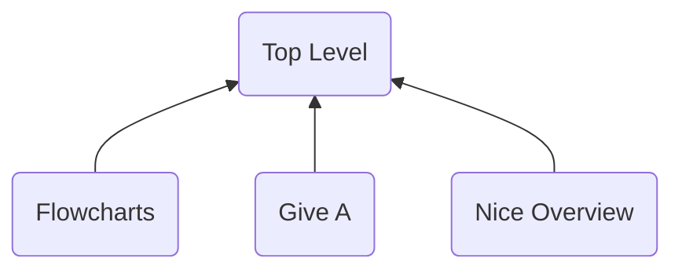

# Resource Name
> Author(s): [Gonhex](https://github.com/Gonhex) <- use your username <br />
> Research: [Someone](), [AnotherOne]()


This Text provides a brief introduction to the resource. What are we looking at? What should be said about this? Refer to the flowchart above if needed. A short summary can also be helpful.

## Table of Contents
* [Data Structure](#data-structure)
  * [Resource Format Container](#resource-format-container)
  * [SubFormat](#subformat)
* [Specification](#specification)
  * [Section](#section)
  * [Section 2](#section-2)
* [TODO](#todo)
---

## Data Structure
Optional: Some words about the following data structures, if needed. For nested types, it makes sense to begin with a container structure and go deeper in the following topics.

### Resource Format Container
```c
struct ContainerResourceFormat
{
    // header
    /* 0x0 */ uint8_t signature[4];
    /* 0x4 */ uint32_t lengthFile;
    /* 0x8 */ uint32_t offsetData;
    
    // data
    /* offsetData */ struct SubFormat dataSomething;
}; // entry size = lengthFile
```
| Field Name    | Description                                                                                           | Data Type |
|---------------|-------------------------------------------------------------------------------------------------------|-----------|
| signature     | The signature is typically encoded as UTF-8 string.                                                   | uint8_t[] |
| lengthFile    | <- Variable name under `Field Name`. Data type unter `Data Type`, arrays without dimensions.          | uint32_t  |
| offsetData    | `/* 0x8 */` is the local offset of the member variable. `// entry size =` hex-value or variable name. | uint32_t  |
| dataSomething | Custom types are linked under `Data Type`.                                                            | [SubFormat](#subformat) |

### SubFormat
```c
struct ContainerResourceFormat
{
    /* 0x0 */ uint16_t aboutFileNames;
    /* 0x2 */ uint8_t aboutStructNames;
    /* 0x3 */ int8_t aboutVariableNames;
    /* 0x4 */ uint16_t bitField0 : 6;    // 0b00000000'00111111
              uint16_t bitField1 : 3;    // 0b00000001'11000000
              uint16_t bitField2 : 5;    // 0b00111110'00000000
    /* 0x6 */ fx<1.19.12> fixedPointValue;
}; // entry size = 0xA
```
| Field Name         | Description                                                                                             | Data Type    |
|--------------------|---------------------------------------------------------------------------------------------------------|--------------|
| aboutFileNames     | Filenames are written in `snake_case`.                                                                  | uint16_t     |
| aboutStructNames   | Structs in `PascalCase`. Use non-typedef C syntax to call them: `struct SubFormat dataSomething;`.      | uint8_t      |
| aboutVariableNames | Variables in `camelCase`.                                                                               | int8_t       |
| bitField0          | Multiple values may be squashed into one variable. Use bit fields: `name : numberBits`.                 | uint16_t : 6 |
| bitField0          | No need to repeat `/*0xOffset*/` since it stays the same.                                               | uint16_t : 3 |
| bitField0          | A comment with the binary representation `0b00111110'00000000` reveals the bitmask.                     | uint16_t : 5 |
| fixedPointValue    | Since there is no default style for fixed point, we use `fx<sign.integer.fraction>`. Link it to here -> | [fx<1.19.12>](resources.md#subformat) |

---
## Specification
Here you can add more detailed information and/or provide data.

### Section
Sometimes, to understand a structure, more infos in form of code or data are required. Those also go under [Specification](#specification). Use the description-table under the struct in [Data Structure](#data-structure) to link to this section.

#### Subsection
Large amounts of data should be put into dropdowns to not spam the document.

<details>
 <summary>Example data section</summary>

  ```
  data, data, data, data, data
  data, data, data, data, data
  data, data, data, data, data
  data, data, data, data, data
  data, data, data, data, data
  data, data, data, data, data
  data, data, data, data, data
  data, data, data, data, data
  data, data, data, data, data
  data, data, data, data, data
  data, data, data, data, data
  data, data, data, data, data
  data, data, data, data, data
  data, data, data, data, data
  data, data, data, data, data
  ```
  
</details>

### Section 2
Use the tools of your choise to document the resource. Text, lists, code-blocks, flowcharts, ... are useful to explain something.

---
## TODO
* Write a todo list
* If the documentation is incomplete
* Or if there are other tasks in queue
* Have fun!
